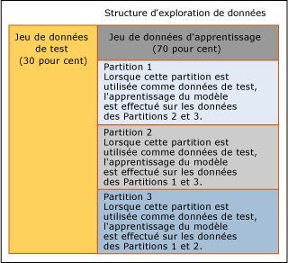

# Validation croisée (Analysis Services - Exploration de données)
[!INCLUDE[ssas-appliesto-sqlas](../../includes/ssas-appliesto-sqlas.md)]
  La*validation croisée* est un outil d’analyse standard et une fonctionnalité importante quand il s’agit de développer et d’optimiser des modèles d’exploration de données. Vous recourez à la validation croisée après avoir créé une structure d'exploration de données et des modèles d'exploration de données connexes dans le but d'établir la validité du modèle.  Les applications de la validation croisée sont les suivantes :  
  
-   Validation de la robustesse d'un modèle d'exploration de données particulier  
  
-   Évaluation de plusieurs modèles à partir d'une instruction unique  
  
-   Génération de plusieurs modèles et identification du meilleur modèle sur la base de statistiques  
  
 Cette section décrit l'utilisation des fonctionnalités de validation croisée fournies pour l'exploration de données et l'interprétation des résultats de la validation croisée pour un modèle unique ou pour plusieurs modèles basés sur un seul jeu de données.  
  
## Vue d'ensemble du processus de validation croisée  
 La validation croisée comprend deux phases, l'apprentissage et la génération des résultats, qui incluent les étapes suivantes :  
  
-   Sélectionnez une structure d'exploration de données cible.  
  
-   Spécifiez les modèles à tester. Cette étape est facultative ; vous pouvez aussi tester uniquement la structure d'exploration de données.  
  
-   Spécifiez des paramètres pour tester les modèles ayant fait l'objet d'un apprentissage.  
  
    -   L'attribut prédictible, la valeur prédite et le seuil de précision.  
  
    -   Le nombre de replis dans lesquels partitionner les données de structure ou de modèle.  
  
-   [!INCLUDE[ssASnoversion](../../includes/ssasnoversion-md.md)] crée autant de modèles qu'il y a de replis et effectue l'apprentissage de ces modèles.  
  
-   [!INCLUDE[ssASnoversion](../../includes/ssasnoversion-md.md)] retourne un jeu de mesures de précision pour chaque repli de chaque modèle ou pour le jeu de données dans son ensemble.  
  
## Configuration de la validation croisée  
 Vous pouvez personnaliser la façon dont la validation croisée fonctionne pour contrôler le nombre de sections croisées, les modèles testés et la barre de précision pour les prédictions. Si vous utilisez les procédures stockées de validation croisée, vous pouvez également spécifier le jeu de données utilisé pour valider les modèles. Grâce à cette multitude de choix, vous pouvez facilement produire de nombreux jeux de résultats différents qui devront ensuite être comparés et analysés.  
  
 Cette section fournit des informations pour vous aider à configurer la validation croisée de façon appropriée.  
  
### Définition du nombre de partitions  
 Lorsque vous spécifiez le nombre de partitions, vous déterminez le nombre de modèles temporaires qui seront créés. Pour chaque partition, une section croisée des données est marquée d'un indicateur pour une utilisation en tant que jeu de test, et un nouveau modèle est créé par apprentissage sur les données restantes qui ne figurent pas dans la partition. Ce processus est répété jusqu’à ce qu’ [!INCLUDE[ssASnoversion](../../includes/ssasnoversion-md.md)] ait créé et testé le nombre spécifié de modèles. Les données que vous avez spécifiées comme étant disponibles pour la validation croisée sont réparties uniformément entre toutes les partitions.  
  
 L'exemple dans le diagramme illustre l'utilisation des données si trois replis sont spécifiés.  
  
   
  
 Dans le scénario du diagramme, la structure d'exploration de données contient un jeu de données d'exclusion utilisé pour le test, mais le jeu de données de test n'a pas été inclus pour la validation croisée. En conséquence, toutes les données dans le jeu de données d'apprentissage, 70 pour cent des données dans la structure d'exploration de données, sont utilisées pour la validation croisée. Le rapport de validation croisée affiche le nombre total de cas utilisés dans chaque partition.  
  
 Vous pouvez également spécifier la quantité de données qui sont utilisées au cours de la validation croisée en spécifiant le nombre total de cas à utiliser. Les cas sont répartis uniformément entre tous les replis.  
  
 Pour stocker des structures d'exploration de données dans une instance de SQL Server [!INCLUDE[ssASnoversion](../../includes/ssasnoversion-md.md)], la valeur maximale que vous pouvez définir pour le nombre de replis est 256 ou le nombre de cas (la valeur la plus petite étant retenue). Si vous utilisez une structure d'exploration de données de session, le nombre maximal de replis est 10.  
  
> [!NOTE]  
>  Lorsque vous augmentez le nombre de replis, le temps nécessaire pour effectuer la validation croisée s'accroît en conséquence, car un modèle doit être généré et testé pour chaque repli. Vous risquez d'être confronté à des problèmes de performances si le nombre de replis est trop élevé.  
  
### Définition du seuil de précision  
 Le seuil d'état vous permet de définir la barre de précision pour les prédictions. Pour chaque cas, le modèle calcule une probabilité, appelée *probabilité de prédiction*, selon laquelle l’état prédit est correct. Si la probabilité de prédiction excède la barre de précision, la prédiction est comptabilisée comme étant correcte ; dans le cas contraire, la prédiction est comptabilisée comme étant incorrecte. Vous contrôlez cette valeur en attribuant au **Seuil d’état** une valeur comprise entre 0,0 et 1,0, sachant que les valeurs proches de 1 indiquent un niveau de confiance élevé dans les prédictions, et que les valeurs proches de 0 indiquent que les prédictions ont moins de chances de se réaliser. La valeur par défaut pour le seuil d'état est NULL, ce qui signifie que l'état prédit avec la probabilité la plus élevée est considéré comme la valeur cible.  
  
 Vous devez être conscient que le paramètre du seuil d'état affecte les mesures de précision de modèle. Par exemple, supposons que vous avez trois modèles à tester. Tous sont basés sur la même structure d'exploration de données et tous prédisent la colonne [Acheteur de vélo]. De plus, vous souhaitez prédire une seule valeur 1, ce qui signifie « oui, je vais acheter ». Les trois modèles retournent des prédictions avec les probabilités de prédiction 0,05, 0,15 et 0,8. Si vous attribuez au seuil d'état la valeur 0,10, deux prédictions sont alors comptabilisées comme étant correctes. Si vous attribuez au seuil d'état la valeur 0,5, un seul modèle est comptabilisé comme ayant retourné une prédiction correcte. Si vous utilisez la valeur par défaut (null), la prédiction la plus probable est comptabilisée comme étant correcte. Dans ce cas, les trois prédictions sont comptabilisées comme étant correctes.  
  
> [!NOTE]  
>  Vous pouvez définir une valeur de 0,0 pour le seuil, mais cette valeur n'a pas de sens car chaque prédiction sera comptabilisée comme étant correcte, même une prédiction avec une probabilité nulle. Faites attention de ne pas attribuer par erreur la valeur 0,0 au **Seuil d’état** .  
  
### Choix des modèles et colonnes à valider  
 Quand vous utilisez l’onglet **Validation croisée** dans le Concepteur d’exploration de données, vous devez en premier lieu sélectionner la colonne prédictible dans une liste. Une structure d'exploration de données peut généralement prendre en charge de nombreux modèles d'exploration de données, qui n'utilisent pas tous la même colonne prédictible. Lorsque vous exécutez la validation croisée, seuls les modèles qui utilisent la même colonne prédictible peuvent être inclus dans le rapport.  
  
 Pour choisir un attribut prédictible, cliquez sur **Attribut cible** et sélectionnez la colonne dans la liste. Si l’attribut cible est une colonne imbriquée ou une colonne dans une table imbriquée, vous devez taper le nom de la colonne imbriquée en utilisant le format \<nom de la Table imbriquée > (key).\< Imbriqués de colonne >. Si la seule colonne utilisée à partir de la table imbriquée est la colonne clé, vous pouvez utiliser \<nom de la Table imbriquée > (key).  
  
 Une fois que vous avez sélectionné l'attribut prédictible, [!INCLUDE[ssASnoversion](../../includes/ssasnoversion-md.md)] teste automatiquement tous les modèles qui utilisent le même attribut prédictible. Si l'attribut cible contient des valeurs discrètes, une fois que vous avez sélectionné la colonne prédictible, vous pouvez taper facultativement un état cible, si vous souhaitez prédire une valeur spécifique.  
  
 La sélection de l'état cible affecte les mesures retournées. Si vous spécifiez un attribut cible (c'est-à-dire un nom de colonne) et ne choisissez pas de valeur spécifique que le modèle doit prédire, le modèle sera évalué par défaut sur sa prédiction de l'état le plus probable.  
  
 Quand vous utilisez la validation croisée avec des modèles de clustering, il n’existe aucune colonne prédictible. Vous sélectionnez à la place **#Cluster** dans la liste de la zone de liste **Attribut cible** . Après avoir sélectionné cette option, d’autres options non applicables aux modèles de clustering, telles que **État cible**, sont désactivées. [!INCLUDE[ssASnoversion](../../includes/ssasnoversion-md.md)] testera tous les modèles de clustering associés à la structure d'exploration de données.  
  
## Outils pour la validation croisée  
 Vous pouvez utiliser la validation croisée du Concepteur d'exploration de données ou vous pouvez effectuer une validation croisée en exécutant des procédures stockées.  
  
 Si vous utilisez les outils du Concepteur d'exploration de données pour effectuer la validation croisée, vous pouvez configurer les paramètres d'apprentissage et de résultats de précision dans une seule boîte de dialogue. Cela simplifie la configuration et l'affichage des résultats. Vous pouvez mesurer la précision de tous les modèles d'exploration de données qui sont liés à une structure d'exploration de données unique et consulter aussitôt les résultats dans un rapport HTML. Toutefois, les procédures stockées offrent des avantages, tels que les personnalisations ajoutées et la capacité de créer un script à partir du processus.  
  
### Validation croisée dans le Concepteur d'exploration de données  
 Vous pouvez effectuer la validation croisée via l’onglet **Validation croisée** de la vue Graphique d’analyse de précision de l’exploration de données dans [!INCLUDE[ssManStudioFull](../../includes/ssmanstudiofull-md.md)] ou SQL Server Development Studio.  
  
 Pour afficher un exemple de création de rapport de validation croisée à partir de l’interface utilisateur, consultez [Créer un rapport de validation croisée](../../analysis-services/data-mining/create-a-cross-validation-report.md).  
  
### Procédures stockées de validation croisée  
 Pour les utilisateurs expérimentés, la validation croisée est également disponible sous forme de procédures stockées système entièrement paramétrables. Vous pouvez exécuter les procédures stockées en vous connectant à une instance de [!INCLUDE[ssManStudioFull](../../includes/ssmanstudiofull-md.md)], ou à partir d’une application de code managé.  
  
 Les procédures stockées sont regroupées par type de modèle d'exploration de données. Un jeu de procédures stockées fonctionne uniquement avec les modèle de clustering. Le second jeu de procédures stockées fonctionne avec les autres modèles d'exploration de données.  
  
 Pour chaque type de modèle d'exploration de données, cluster ou non-cluster, les procédures stockées exécutent la validation croisée en deux phases distinctes.  
  
 **Partitionner des données et générer des mesures pour des partitions**  
  
 Pour la première phase, vous appelez une procédure stockée système qui crée le nombre de partitions que vous spécifiez dans le jeu de données, et retourne des résultats de précision pour chaque partition. Pour chaque mesure, Analysis Services calcule alors la moyenne et l'écart type pour les partitions.  
  
-   [SystemGetCrossValidationResults & #40 ; Analysis Services - Exploration de données & #41 ;](../../analysis-services/data-mining/systemgetcrossvalidationresults-analysis-services-data-mining.md)  
  
-   [SystemGetClusterCrossValidationResults & #40 ; Analysis Services - Exploration de données & #41 ;](../../analysis-services/data-mining/systemgetclustercrossvalidationresults-analysis-services-data-mining.md)  
  
 **Générer des mesures pour un jeu de données entier**  
  
 Dans la seconde phase, vous appelez un autre jeu de procédures stockées. Ces procédures stockées ne partitionnent pas le jeu de données, mais génèrent des résultats de précision pour l'ensemble du jeu de données spécifié. Si vous avez déjà partitionnée et traité une structure d'exploration de données, vous pouvez appeler ce second jeu de procédures stockées pour obtenir uniquement les résultats.  
  
-   [SystemGetAccuracyResults & #40 ; Analysis Services - Exploration de données & #41 ;](../../analysis-services/data-mining/systemgetaccuracyresults-analysis-services-data-mining.md)  
  
-   [SystemGetClusterAccuracyResults & #40 ; Analysis Services - Exploration de données & #41 ;](../../analysis-services/data-mining/systemgetclusteraccuracyresults-analysis-services-data-mining.md)  
  
#### Définition des données de test  
 Lorsque vous exécutez les procédures stockées de validation qui calculent la précision, (SystemGetAccuracyResults ou SystemGetClusterAccuracyResults), vous pouvez spécifier la source des données utilisée pour le test au cours de la validation croisée. Cette option n'est pas disponible dans l'interface utilisateur.  
  
 Vous pouvez spécifier comme source de données de test l'une des options suivantes :  
  
-   Utiliser uniquement les données d'apprentissage  
  
-   Inclure un jeu de données de test existant  
  
-   Utiliser uniquement le jeu de données de test  
  
-   Appliquer des filtres existants à chaque modèle  
  
-   Toute combinaison du jeu d'apprentissage, du jeu de test et des filtres de modèle  
  
 Pour spécifier une source de données de test, fournissez une valeur entière pour le paramètre **DataSet** de la procédure stockée. Pour obtenir la liste des valeurs d'argument, consultez la section Notes de la rubrique de référence des procédures stockées correspondante.  
  
 Si vous effectuez une validation croisée à l’aide du rapport **Validation croisée** dans le Concepteur d’exploration de données, vous ne pouvez pas modifier le jeu de données utilisé. Par défaut, les cas d'apprentissage pour chaque modèle sont utilisés. Si un filtre est associé à un modèle, le filtre est appliqué.  
  
## Résultats de la validation croisée  
 Si vous utilisez le Concepteur d'exploration de données, ces résultats sont affichés dans une visionneuse Web sous forme de grille. Si vous utilisez les procédures stockées de validation croisée, ces mêmes résultats sont retournés sous forme de table.  
  
 Le rapport contient deux types de mesures : les agrégats qui indiquent la variabilité du jeu de données une fois divisé en replis, et les mesures de précision spécifiques au modèle pour chaque repli. Les rubriques ci-dessous fournissent des informations supplémentaires sur ces mesures :  
  
 [Formules de Validation croisée](../../analysis-services/data-mining/cross-validation-formulas.md)  
  
 Répertorie toutes les mesures par type de test. Décrit de manière générale les différentes interprétations des mesures.  
  
 [Mesures dans le rapport de Validation croisée](../../analysis-services/data-mining/measures-in-the-cross-validation-report.md)  
  
 Décrit les formules pour calculer chaque mesure et répertorie le type d'attribut auquel chaque mesure peut être appliquée.  
  
## Restrictions sur la validation croisée  
 Si vous effectuez une validation croisée à l'aide du rapport de validation croisée de SQL Server Development Studio, les modèles que vous pouvez tester et les paramètres que vous pouvez définir sont soumis à certaines limites.  
  
-   Par défaut, tous les modèles associés à la structure d'exploration de données sélectionnée font l'objet d'une validation croisée. Vous ne pouvez pas spécifier le modèle ou une liste de modèles.  
  
-   La validation croisée n'est pas prise en charge pour les modèles basés sur l'algorithme MTS (Microsoft Time Series) ou l'algorithme MSC (Microsoft Sequence Clustering).  
  
-   Le rapport ne peut pas être créé si votre structure d'exploration de données ne contient aucun modèle pouvant être testé par validation croisée.  
  
-   Si la structure d’exploration de données contient des modèles de clustering et des modèles qui n’en sont pas et que vous ne choisissez pas l’option **#Cluster** , les résultats des deux types de modèles sont affichés dans le même rapport, même si les paramètres d’attribut, d’état et de seuil ne sont pas appropriés aux modèles de clustering.  
  
-   Les valeurs de certains paramètres sont limitées. Par exemple, un avertissement s'affiche si le nombre de replis est supérieur à 10, car la génération d'autant de modèles peut engendrer un affichage lent du rapport.  
  
 Si vous testez plusieurs modèles d'exploration de données et que les modèles ont des filtres, chaque modèle est filtré séparément. Vous ne pouvez pas ajouter de filtre à un modèle ni modifier le filtre pour un modèle pendant la validation croisée.  
  
 Étant donné que la validation croisée teste par défaut tous les modèles d'exploration de données associés à une structure, vous pouvez recevoir des résultats incohérents si certains modèles ont un filtre et que d'autres n'en n'ont pas. Pour vous assurer que la comparaison porte uniquement sur les modèles ayant le même filtre, vous devez utiliser les procédures stockées et spécifier une liste de modèles d'exploration de données. Ou bien, utilisez uniquement le jeu de test de la structure d'exploration de données sans filtre pour faire en sorte qu'un jeu de données cohérent soit utilisé pour tous les modèles.  
  
 Si vous effectuez une validation croisée à l'aide de procédures stockées, vous avez la possibilité supplémentaire de choisir la source des données de test. Si vous effectuez une validation croisée à l'aide du Concepteur d'exploration de données, vous devez utiliser le jeu de données de test associé au modèle ou à la structure, le cas échéant. De manière générale, si vous souhaitez spécifier des paramètres avancés, vous devez utiliser les procédures stockées de validation croisée.  
  
 La validation croisée ne peut pas être utilisée avec des modèles de série chronologique ou des modèles Sequence Clustering. En particulier, aucun modèle contenant une colonne KEY TIME ou une colonne KEY SEQUENCE ne peut être inclus dans la validation croisée.  
  
## Contenu connexe  
 Consultez les rubriques suivantes pour plus d'informations sur la validation croisée, ou pour des informations sur les méthodes associées pour tester les modèles d'exploration de données, telles que les graphiques d'analyse de précision.  
  
|Rubriques|Liens|  
|------------|-----------|  
|Décrit la définition des paramètres de validation croisée dans SQL Server Development Studio.|[Onglet Validation croisée & #40 ; Vue graphique d’analyse de précision d’exploration de données & #41 ;](http://msdn.microsoft.com/library/bd215a68-1ad7-4046-9c44-ec8e2be13a64)|  
|Décrit les mesures fournies par la validation croisée|[Formules de Validation croisée](../../analysis-services/data-mining/cross-validation-formulas.md)|  
|Explique le format des rapports de validation croisée et définit les mesures statistiques fournies pour chaque type de modèle.|[Mesures dans le rapport de Validation croisée](../../analysis-services/data-mining/measures-in-the-cross-validation-report.md)|  
|Répertorie les procédures stockées pour calculer des statistiques de validation croisée.|[Exploration de données stockées procédures & #40 ; Analysis Services - Exploration de données & #41 ;](../../analysis-services/data-mining/data-mining-stored-procedures-analysis-services-data-mining.md)|  
|||  
|Décrit la création d'un jeu de données de test pour les structures d'exploration de données et les modèles associés.|[Apprentissage et jeux de données de test](../../analysis-services/data-mining/training-and-testing-data-sets.md)|  
|Consultez des exemples d'autres types de graphiques d'analyse de précision.|[Matrice de classification & #40 ; Analysis Services - Exploration de données & #41 ;](../../analysis-services/data-mining/classification-matrix-analysis-services-data-mining.md)   [Graphique de courbes d’élévation & #40 ; Analysis Services - Exploration de données & #41 ;](../../analysis-services/data-mining/lift-chart-analysis-services-data-mining.md)   [Graphique des bénéfices & #40 ; Analysis Services - Exploration de données & #41 ;](../../analysis-services/data-mining/profit-chart-analysis-services-data-mining.md)   [Nuage de points & #40 ; Analysis Services - Exploration de données & #41 ;](../../analysis-services/data-mining/scatter-plot-analysis-services-data-mining.md)|  
|Décrit les étapes de création de différents graphiques d'analyse de précision.|[Test et de tâches de Validation et de procédures & #40 ; exploration de données & #41 ;](../../analysis-services/data-mining/testing-and-validation-tasks-and-how-tos-data-mining.md)|  
  
## Voir aussi  
 [Test et Validation & #40 ; exploration de données & #41 ;](../../analysis-services/data-mining/testing-and-validation-data-mining.md)  
  
  
