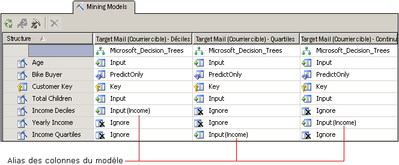

# Personnaliser les modèles et les structures d'exploration de données
[!INCLUDE[ssas-appliesto-sqlas](../../includes/ssas-appliesto-sqlas.md)]
  Après avoir sélectionné un algorithme qui répond aux besoins de votre entreprise, vous pouvez personnaliser le modèle d'exploration de données de plusieurs façons pour éventuellement améliorer les résultats.  
  
-   Utilisez des colonnes de données différentes dans le modèle ou modifiez l'utilisation, le type de contenu ou la méthode de discrétisation pour les colonnes.  
  
-   Créez des filtres sur le modèle d'exploration de données pour limiter les données utilisées dans l'apprentissage du modèle.  
  
-   Modifiez l'algorithme utilisé pour analyser les données.  
  
-   Définissez les paramètres d'algorithme pour contrôler les seuils, les fractionnements d'arborescence et d'autres conditions importantes.  
  
 Cette rubrique décrit ces options.  
  
## Modification des données utilisées par le modèle  
 Les décisions que vous prenez concernant les colonnes de données à utiliser dans le modèle et la façon d'utiliser et de traiter ces données affectent considérablement les résultats de l'analyse. Les rubriques suivantes fournissent des informations vous permettant de comprendre ces choix.  
  
### Utilisation de la sélection des fonctionnalités  
 La plupart des algorithmes d'exploration de données dans [!INCLUDE[ssASnoversion](../../includes/ssasnoversion-md.md)] utilise un processus appelé *sélection des fonctionnalités* pour sélectionner uniquement les attributs les plus utiles pour l'ajout à un modèle. Le fait de réduire le nombre de colonnes et d'attributs peut améliorer les performances et la qualité du modèle. Les méthodes de sélection de fonctionnalités qui sont disponibles diffèrent en fonction de l'algorithme que vous choisissez.  
  
 [Sélection des fonctionnalités &#40;exploration de données&#41;](../../analysis-services/data-mining/feature-selection-data-mining.md).  
  
### Modification de l'utilisation  
 Vous pouvez modifier les colonnes incluses dans un modèle d'exploration de données et la façon dont chaque colonne est utilisée. Si vous n'obtenez pas les résultats attendus, vous devez référencer les colonnes vous avez utilisées comme entrée et vous demander si les colonnes sont un choix adéquat et si vous pouvez faire quelque chose pour améliorer la gestion des données, notamment :  
  
-   Identifier des variables catégorielles étiquetées par erreur en tant que nombres.  
  
-   Ajouter des catégories pour réduire le nombre d'attributs et permettre de trouver des corrélations plus facilement.  
  
-   Modifier la façon dont les nombres sont placés dans un conteneur ou discrétisés.  
  
-   Supprimer des colonnes qui possèdent de nombreuses valeurs uniques ou qui sont des données de référence réelles inutiles pour l'analyse, telles qu'une adresse ou un deuxième prénom.  
  
 Il n'est pas nécessaire de supprimer physiquement les colonnes de la structure d'exploration de données ; vous pouvez simplement marquer la colonne comme **Ignorer**. La colonne est supprimée du modèle d'exploration de données, mais elle peut encore être utilisée par d'autres modèles d'exploration de données dans la structure, ou référencée dans une requête d'extraction.  
  
### Créer des alias pour des colonnes du modèle  
 Lorsque [!INCLUDE[ssASnoversion](../../includes/ssasnoversion-md.md)] crée le modèle d'exploration de données, il utilise les mêmes noms de colonnes que ceux de la structure d'exploration de données. Vous pouvez ajouter un alias à toute colonne du modèle d'exploration de données. Cela peut simplifier la compréhension du contenu ou de l'utilisation des colonnes, ou permettre de raccourcir les noms afin de simplifier la création de requêtes. Les alias sont également utiles lorsque vous souhaitez créer une copie d'une colonne et lui donner un nom descriptif.  
  
 Vous pouvez créer un alias en modifiant la propriété **Name** de la colonne du modèle d'exploration de données. [!INCLUDE[ssASnoversion](../../includes/ssasnoversion-md.md)] continue à utiliser le nom d'origine comme ID de la colonne et la nouvelle valeur que vous tapez pour **Nom** devient l'alias de colonne et apparaît dans la grille dans les parenthèses situées à côté de l'utilisation de colonne.  
  
   
  
 Le graphique illustre des modèles connexes qui ont plusieurs copies d'une colonne de structure d'exploration de données, tous en rapport avec le Revenu. Chaque copie de la colonne de structure a été discrétisée d'une manière différente. Les modèles du diagramme utilisent chacun une colonne différente de la structure d’exploration de données ; toutefois, pour simplifier la comparaison des colonnes des différents modèles, la colonne dans chaque modèle a été renommée [**Revenus**].  
  
### Ajout de filtres  
 Vous pouvez ajouter un filtre à un modèle d'exploration de données. Un filtre est un ensemble de conditions WHERE qui restreignent les données dans les cas de modèles à un certain sous-ensemble. Le filtre est utilisé lors de la formation du modèle et peut éventuellement être utilisé lorsque vous testez le modèle ou créez des graphiques d'analyse de précision.  
  
 En ajoutant des filtres, vous pouvez réutiliser des structures d'exploration de données mais aussi créer des modèles basés sur des sous-ensembles de données très différents. vous pouvez aussi simplement utiliser des filtres pour éliminer certaines lignes et améliorer la qualité de l'analyse.  
  
 Pour plus d’informations, consultez [Filtres pour les modèles d’exploration de données &#40;Analysis Services - Exploration de données&#41;](../../analysis-services/data-mining/filters-for-mining-models-analysis-services-data-mining.md).  
  
## Modifier l'algorithme  
 Bien que les nouveaux modèles ajoutés à une structure d'exploration de données partagent le même jeu de données, vous pouvez obtenir des résultats différents en utilisant un algorithme différent (si les données le prennent en charge), ou en modifiant les paramètres de l'algorithme. Vous pouvez également définir des indicateurs de modélisation.  
  
 Le choix de l'algorithme détermine le type de résultats que vous obtiendrez. Pour obtenir des informations générales sur le fonctionnement d’un algorithme spécifique, ou sur les scénarios professionnels où l’utilisation d’un algorithme particulier vous serait profitable, consultez [Algorithmes d’exploration de données &#40;Analysis Services – Exploration de données&#41;](../../analysis-services/data-mining/data-mining-algorithms-analysis-services-data-mining.md).  
  
 Consultez la rubrique de références techniques pour chaque algorithme pour obtenir une description des exigences et des restrictions, ainsi que des informations détaillées sur les personnalisations prises en charge par chaque algorithme.  
  
|||  
|-|-|  
|[Algorithme MDT (Microsoft Decision Trees)](../../analysis-services/data-mining/microsoft-decision-trees-algorithm.md)|[Algorithme MTS (Microsoft Time Series)](../../analysis-services/data-mining/microsoft-time-series-algorithm.md)|  
|[Algorithme de gestion de clusters Microsoft](../../analysis-services/data-mining/microsoft-clustering-algorithm.md)|[Algorithme MNN (Microsoft Neural Network)](../../analysis-services/data-mining/microsoft-neural-network-algorithm.md)|  
|[Algorithme Microsoft Naive Bayes](../../analysis-services/data-mining/microsoft-naive-bayes-algorithm.md)|[Algorithme MLR (Microsoft Logistic Regression)](../../analysis-services/data-mining/microsoft-logistic-regression-algorithm.md)|  
|[Algorithme Microsoft Association](../../analysis-services/data-mining/microsoft-association-algorithm.md)|[Algorithme MLR (Microsoft Linear Regression)](../../analysis-services/data-mining/microsoft-linear-regression-algorithm.md)|  
|[Algorithme MSC (Microsoft Sequence Clustering)](../../analysis-services/data-mining/microsoft-sequence-clustering-algorithm.md)||  
  
## Personnaliser les paramètres d'algorithme  
 Chaque algorithme prend en charge des paramètres que vous pouvez utiliser pour personnaliser le comportement de l'algorithme et optimiser les résultats de votre modèle. Pour obtenir une description de l'utilisation de chaque paramètre, consultez les rubriques suivantes :  
  
 La rubrique relative à chaque type d'algorithme répertorie également les fonctions de prédiction qui peuvent être utilisées avec les modèles basés sur cet algorithme.  
  
|Nom de la propriété|S'applique à|  
|-------------------|----------------|  
|AUTO_DETECT_PERIODICITY|[Références techniques relatives à l'algorithme MTS (Microsoft Time Series)](../../analysis-services/data-mining/microsoft-time-series-algorithm-technical-reference.md)|  
|CLUSTER_COUNT|[Informations techniques de référence sur l’algorithme Microsoft Clustering](../../analysis-services/data-mining/microsoft-clustering-algorithm-technical-reference.md)   [Références techniques relatives à l'algorithme MSC (Microsoft Sequence Clustering)](../../analysis-services/data-mining/microsoft-sequence-clustering-algorithm-technical-reference.md)|  
|CLUSTER_SEED|[Informations techniques de référence sur l’algorithme Microsoft Clustering](../../analysis-services/data-mining/microsoft-clustering-algorithm-technical-reference.md)|  
|CLUSTERING_METHOD|[Informations techniques de référence sur l’algorithme Microsoft Clustering](../../analysis-services/data-mining/microsoft-clustering-algorithm-technical-reference.md)|  
|COMPLEXITY_PENALTY|[Techniques de l’algorithme d’arbres de décision Microsoft](../../analysis-services/data-mining/microsoft-decision-trees-algorithm-technical-reference.md)   [Informations techniques de référence sur l’algorithme MTS (Microsoft Time Series)](../../analysis-services/data-mining/microsoft-time-series-algorithm-technical-reference.md)|  
|FORCE_REGRESSOR|[Techniques de l’algorithme d’arbres de décision Microsoft](../../analysis-services/data-mining/microsoft-decision-trees-algorithm-technical-reference.md)   [Informations techniques de référence sur l’algorithme Microsoft Linear Regression](../../analysis-services/data-mining/microsoft-linear-regression-algorithm-technical-reference.md)   [Modélisation des indicateurs & #40 ; exploration de données & #41 ;](../../analysis-services/data-mining/modeling-flags-data-mining.md)|  
|FORECAST_METHOD|[Informations techniques de référence sur l’algorithme MTS (Microsoft Time Series)](../../analysis-services/data-mining/microsoft-time-series-algorithm-technical-reference.md)|  
|HIDDEN_NODE_RATIO|[Référence technique de Microsoft Neural Network algorithme](../../analysis-services/data-mining/microsoft-neural-network-algorithm-technical-reference.md)|  
|HISTORIC_MODEL_COUNT|[Informations techniques de référence sur l’algorithme MTS (Microsoft Time Series)](../../analysis-services/data-mining/microsoft-time-series-algorithm-technical-reference.md)|  
|HISTORICAL_MODEL_GAP|[Informations techniques de référence sur l’algorithme MTS (Microsoft Time Series)](../../analysis-services/data-mining/microsoft-time-series-algorithm-technical-reference.md)|  
|HOLDOUT_PERCENTAGE|[Références techniques relatives à l'algorithme MLR (Microsoft Logistic Regression)](../../analysis-services/data-mining/microsoft-logistic-regression-algorithm-technical-reference.md)   [Référence technique de Microsoft Neural Network algorithme](../../analysis-services/data-mining/microsoft-neural-network-algorithm-technical-reference.md)   Remarque : ce paramètre est différent de la valeur du pourcentage de données d’exclusion qui s’applique à une structure d’exploration de données.|  
|HOLDOUT_SEED|[Référence technique de Microsoft Logistic Regression algorithme](../../analysis-services/data-mining/microsoft-logistic-regression-algorithm-technical-reference.md)   [Référence technique de Microsoft Neural Network algorithme](../../analysis-services/data-mining/microsoft-neural-network-algorithm-technical-reference.md)   Remarque : ce paramètre est différent de la valeur de départ de données d’exclusion qui s’applique à une structure d’exploration de données.|  
|INSTABILITY_SENSITIVITY|[Informations techniques de référence sur l’algorithme MTS (Microsoft Time Series)](../../analysis-services/data-mining/microsoft-time-series-algorithm-technical-reference.md)|  
|MAXIMUM_INPUT_ATTRIBUTES|[Informations techniques de référence sur l’algorithme Microsoft Clustering](../../analysis-services/data-mining/microsoft-clustering-algorithm-technical-reference.md)   [Techniques de l’algorithme d’arbres de décision Microsoft](../../analysis-services/data-mining/microsoft-decision-trees-algorithm-technical-reference.md)   [Informations techniques de référence sur l’algorithme Microsoft Linear Regression](../../analysis-services/data-mining/microsoft-linear-regression-algorithm-technical-reference.md)   [Références techniques relatives à l'algorithme MNB (Microsoft Naive Bayes)](../../analysis-services/data-mining/microsoft-naive-bayes-algorithm-technical-reference.md)   [Référence technique de Microsoft Neural Network algorithme](../../analysis-services/data-mining/microsoft-neural-network-algorithm-technical-reference.md)   [Référence technique de Microsoft Logistic Regression algorithme](../../analysis-services/data-mining/microsoft-logistic-regression-algorithm-technical-reference.md)|  
|MAXIMUM_ITEMSET_COUNT|[Informations techniques de référence sur l’algorithme Microsoft Association](../../analysis-services/data-mining/microsoft-association-algorithm-technical-reference.md)|  
|MAXIMUM_ITEMSET_SIZE|[Informations techniques de référence sur l’algorithme Microsoft Association](../../analysis-services/data-mining/microsoft-association-algorithm-technical-reference.md)|  
|MAXIMUM_OUTPUT_ATTRIBUTES|[Techniques de l’algorithme d’arbres de décision Microsoft](../../analysis-services/data-mining/microsoft-decision-trees-algorithm-technical-reference.md)   [Références techniques relatives à l'algorithme MLR (Microsoft Linear Regression)](../../analysis-services/data-mining/microsoft-linear-regression-algorithm-technical-reference.md)   [Référence technique de Microsoft Logistic Regression algorithme](../../analysis-services/data-mining/microsoft-logistic-regression-algorithm-technical-reference.md)   [Référence technique de Microsoft Naive Bayes algorithme](../../analysis-services/data-mining/microsoft-naive-bayes-algorithm-technical-reference.md)   [Microsoft Neural Network Algorithm Technical Reference](../../analysis-services/data-mining/microsoft-neural-network-algorithm-technical-reference.md)|  
|MAXIMUM_SEQUENCE_STATES|[Informations techniques de référence sur l’algorithme MSC (Microsoft Sequence Clustering)](../../analysis-services/data-mining/microsoft-sequence-clustering-algorithm-technical-reference.md)|  
|MAXIMUM_SERIES_VALUE|[Informations techniques de référence sur l’algorithme MTS (Microsoft Time Series)](../../analysis-services/data-mining/microsoft-time-series-algorithm-technical-reference.md)|  
|MAXIMUM_STATES|[Informations techniques de référence sur l’algorithme Microsoft Clustering](../../analysis-services/data-mining/microsoft-clustering-algorithm-technical-reference.md)   [Référence technique de Microsoft Neural Network algorithme](../../analysis-services/data-mining/microsoft-neural-network-algorithm-technical-reference.md)   [Informations techniques de référence sur l’algorithme MSC (Microsoft Sequence Clustering)](../../analysis-services/data-mining/microsoft-sequence-clustering-algorithm-technical-reference.md)|  
|MAXIMUM_SUPPORT|[Informations techniques de référence sur l’algorithme Microsoft Association](../../analysis-services/data-mining/microsoft-association-algorithm-technical-reference.md)|  
|MINIMUM_IMPORTANCE|[Informations techniques de référence sur l’algorithme Microsoft Association](../../analysis-services/data-mining/microsoft-association-algorithm-technical-reference.md)|  
|MINIMUM_ITEMSET_SIZE|[Références techniques relatives à l'algorithme Microsoft Association](../../analysis-services/data-mining/microsoft-association-algorithm-technical-reference.md)|  
|MINIMUM_DEPENDENCY_PROBABILITY|[Référence technique de Microsoft Naive Bayes algorithme](../../analysis-services/data-mining/microsoft-naive-bayes-algorithm-technical-reference.md)|  
|MINIMUM_PROBABILITY|[Informations techniques de référence sur l’algorithme Microsoft Association](../../analysis-services/data-mining/microsoft-association-algorithm-technical-reference.md)|  
|MINIMUM_SERIES_VALUE|[Informations techniques de référence sur l’algorithme MTS (Microsoft Time Series)](../../analysis-services/data-mining/microsoft-time-series-algorithm-technical-reference.md)|  
|MINIMUM_SUPPORT|[Informations techniques de référence sur l’algorithme Microsoft Association](../../analysis-services/data-mining/microsoft-association-algorithm-technical-reference.md)   [Références techniques relatives à l'algorithme de gestion de clusters Microsoft](../../analysis-services/data-mining/microsoft-clustering-algorithm-technical-reference.md)   [Techniques de l’algorithme d’arbres de décision Microsoft](../../analysis-services/data-mining/microsoft-decision-trees-algorithm-technical-reference.md)   [Informations techniques de référence sur l’algorithme MSC (Microsoft Sequence Clustering)](../../analysis-services/data-mining/microsoft-sequence-clustering-algorithm-technical-reference.md)   [Informations techniques de référence sur l’algorithme MTS (Microsoft Time Series)](../../analysis-services/data-mining/microsoft-time-series-algorithm-technical-reference.md)|  
|MISSING_VALUE_SUBSTITUTION|[Informations techniques de référence sur l’algorithme MTS (Microsoft Time Series)](../../analysis-services/data-mining/microsoft-time-series-algorithm-technical-reference.md)|  
|MODELLING_CARDINALITY|[Informations techniques de référence sur l’algorithme Microsoft Clustering](../../analysis-services/data-mining/microsoft-clustering-algorithm-technical-reference.md)|  
|PERIODICITY_HINT|[Informations techniques de référence sur l’algorithme MTS (Microsoft Time Series)](../../analysis-services/data-mining/microsoft-time-series-algorithm-technical-reference.md)|  
|PREDICTION_SMOOTHING|[Informations techniques de référence sur l’algorithme MTS (Microsoft Time Series)](../../analysis-services/data-mining/microsoft-time-series-algorithm-technical-reference.md)|  
|SAMPLE_SIZE|[Informations techniques de référence sur l’algorithme Microsoft Clustering](../../analysis-services/data-mining/microsoft-clustering-algorithm-technical-reference.md)   [Référence technique de Microsoft Logistic Regression algorithme](../../analysis-services/data-mining/microsoft-logistic-regression-algorithm-technical-reference.md)   [Référence technique de Microsoft Neural Network algorithme](../../analysis-services/data-mining/microsoft-neural-network-algorithm-technical-reference.md)|  
|SCORE_METHOD|[Références techniques relatives à l'algorithme MDT (Microsoft Decision Trees)](../../analysis-services/data-mining/microsoft-decision-trees-algorithm-technical-reference.md)|  
|SPLIT_METHOD|[Techniques de l’algorithme d’arbres de décision Microsoft](../../analysis-services/data-mining/microsoft-decision-trees-algorithm-technical-reference.md)|  
|STOPPING_TOLERANCE|[Informations techniques de référence sur l’algorithme Microsoft Clustering](../../analysis-services/data-mining/microsoft-clustering-algorithm-technical-reference.md)|  
  
## Voir aussi  
 [Algorithmes d’exploration de données &#40;Analysis Services – Exploration de données&#41;](../../analysis-services/data-mining/data-mining-algorithms-analysis-services-data-mining.md)   
 [Architecture physique & #40 ; Analysis Services - Exploration de données & #41 ;](../../analysis-services/data-mining/physical-architecture-analysis-services-data-mining.md)  
  
  
