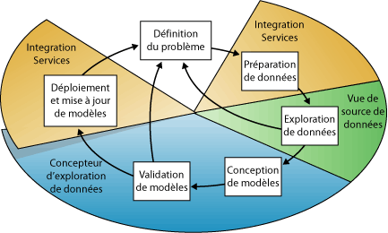
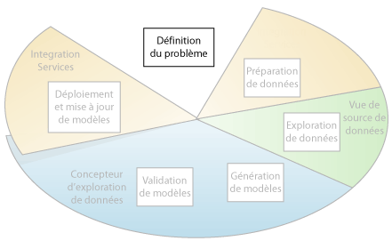
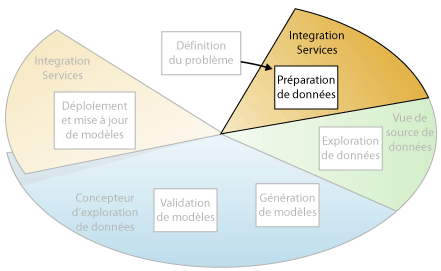
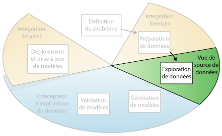
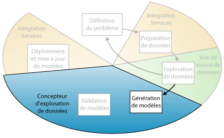
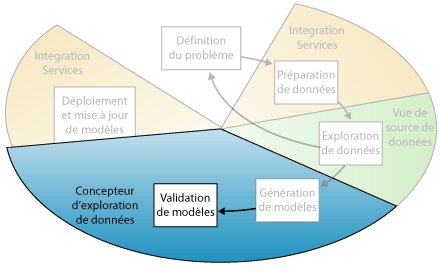
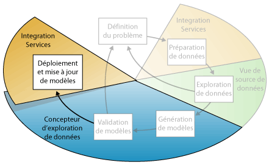

# Concepts d'exploration de données
[!INCLUDE[ssas-appliesto-sqlas](../../includes/ssas-appliesto-sqlas.md)]
  L'exploration de données est un processus de recherche d'informations utilisables à partir de jeux de données de grande taille. L'exploration de données utilise l’analyse mathématique pour dégager les motifs et les tendances existant dans les données. En général, ces motifs ne peuvent pas être trouvés par l’exploration de données traditionnelle parce que les relations sont trop complexes ou parce que la quantité de données est trop importante.  
  
 Ces motifs et tendances peuvent être collectés et définis en tant que *modèle d'exploration de données*. Les modèles d'exploration de données peuvent être appliqués à des scénarios spécifiques, tels que :  
  
-   **Prévisions**: estimation des ventes, prédiction des charges du serveur ou du temps mort de serveur  
  
-   **Risque et probabilité**: choix des meilleurs clients pour des publipostages ciblés, détermination du seuil de rentabilité probable pour les scénarios à risque, affectation de probabilités aux diagnostics ou à d’autres résultats  
  
-   **Recommandations**: identification des produits susceptibles d'être vendus ensemble, génération de recommandations  
  
-   **Recherche de séquences**: analyse de sélections de clients dans un panier, prédiction de probables événements à venir  
  
-   **Regroupement**: séparation des clients ou des événements dans un cluster d'éléments associés, analyse et prédiction d'affinités  
  
 La création d'un modèle d'exploration de données fait partie d'un processus plus vaste qui va de la pose de questions sur les données et la création d’un modèle afin de répondre à ces questions au déploiement du modèle dans un environnement de travail. Ce processus peut être défini à l'aide des six étapes de base suivantes :  
  
1.  [Définition du problème](#DefiningTheProblem)  
  
2.  [Préparation des données](#PreparingData)  
  
3.  [Exploration des données](#ExploringData)  
  
4.  [Création des modèles](#BuildingModels)  
  
5.  [Exploration et validation des modèles](#ValidatingModels)  
  
6.  [Déploiement et mise à jour des modèles](#DeployingandUpdatingModels)  
  
 Le diagramme suivant décrit les relations entre chacune des étapes du processus et les technologies [!INCLUDE[msCoName](../../includes/msconame-md.md)] [!INCLUDE[ssNoVersion](../../includes/ssnoversion-md.md)] que vous pouvez utiliser pour effectuer chaque étape.  
  
   
  
 Le processus illustré dans le diagramme est cyclique, ce qui signifie que la création d'un modèle d'exploration de données est un processus dynamique et itératif. En effet, après avoir exploré les données, vous pouvez juger que les données sont insuffisantes pour créer les modèles d'exploration de données appropriés et devoir, par conséquent, rechercher des données supplémentaires. Vous pouvez également générer plusieurs modèles, puis vous rendre compte qu'ils ne résolvent pas correctement le problème que vous avez défini et devoir par conséquent redéfinir le problème. Vous devrez peut-être également mettre à jour les modèles une fois qu'ils ont été déployés parce que vous disposez de données supplémentaires. Il est possible que chaque étape du processus doive être répétée de nombreuses fois pour créer un modèle correct.  
  
 L'exploration de données Microsoft SQL Server fournit un environnement intégré pour la création et l'utilisation des modèles d'exploration de données. Cet environnement inclut SQL Server Development Studio, qui contient des algorithmes d'exploration de données et des outils de requête qui facilitent l'établissement d'une solution globale pour divers projets, et [!INCLUDE[ssManStudioFull](../../includes/ssmanstudiofull-md.md)], qui contient des outils pour parcourir des modèles et gérer des objets d'exploration de données. Pour plus d’informations, consultez [Création de modèles MDX à l’aide des Outils de données SQL Server &#40;SSDT&#41;](../../analysis-services/multidimensional-models/creating-multidimensional-models-using-sql-server-data-tools-ssdt.md).  
  
 Pour obtenir un exemple montrant comment les outils [!INCLUDE[ssNoVersion](../../includes/ssnoversion-md.md)] peuvent être appliqués à un scénario d’entreprise, consultez le [Didacticiel sur l’exploration de données de base](http://msdn.microsoft.com/library/6602edb6-d160-43fb-83c8-9df5dddfeb9c).  
  
##   Définition du problème  
 La première étape du processus d'exploration de données, mise en évidence dans le diagramme suivant, consiste à définir clairement le problème et à envisager les moyens d'utilisation des données pour apporter une solution au problème.  
  
   
  
 Cette étape inclut l'analyse des besoins de l'entreprise, la définition de l'étendue du problème, la détermination des mesures d'évaluation du modèle et la définition des objectifs spécifiques du projet d'exploration de données. Ces tâches peuvent être traduites par des questions, telles que :  
  
-   Que recherchez-vous ? Quels types de relations essayez-vous de trouver ?  
  
-   Le problème que vous essayez de résoudre reflète-t-il les stratégies ou processus de l'entreprise ?  
  
-   Souhaitez-vous effectuer des prédictions à partir du modèle d'exploration de données ou seulement rechercher des associations et motifs intéressants ?  
  
-   Quel attribut ou résultat souhaitez-vous prédire ?  
  
-   De quel genre de données disposez-vous et quel type d'informations se trouve dans chaque colonne ? S'il y a plusieurs tables, comment sont-elles associées ? Avez -vous besoin effectuer un nettoyage, une agrégation ou un traitement pour rendre les données utilisables ?  
  
-   Comment sont distribuées les données ? Les données sont-elles saisonnières ? Les données représentent-elles précisément les processus de l’entreprise ?  
  
 Pour répondre à ces questions, il peut être nécessaire de procéder à une étude de disponibilité des données afin d'analyser les besoins des utilisateurs de l'entreprise en fonction des données disponibles. Si les données ne répondent pas aux besoins des utilisateurs, il vous faudra peut-être redéfinir le projet.  
  
 Vous devez également considérer les manières avec lesquelles les résultats du modèle peuvent être intégrés aux indicateurs de performance clés utilisés pour mesurer la progression de l'entreprise.  
  
##   Préparation des données  
 La deuxième étape du processus d'exploration de données, mise en évidence dans le diagramme suivant, consiste à consolider et à nettoyer les données identifiées à l'étape [Définition du problème](#DefiningTheProblem) .  
  
   
  
 Les données peuvent être dispersées dans une entreprise et stockées dans des formats différents ou bien contenir des incohérences, telles que des entrées incorrectes ou manquantes. Par exemple, les données peuvent indiquer qu'un client a acheté un produit avant sa mise sur le marché, ou qu'une cliente fait régulièrement des achats dans un magasin se trouvant à 3 000 kilomètres de chez elle.  
  
 Le nettoyage de données ne se limite pas à la suppression des données incorrectes ou à l'interpolation des valeurs manquantes, mais il inclut également la recherche des corrélations cachées dans les données, l'identification des sources des données les plus précises et la détermination des colonnes les plus appropriées à des fins d'analyse. Est-ce que vous devez utiliser par exemple, la date d'expédition ou la date d'ordre ? Est-ce que le meilleur facteur d’influence des ventes est la quantité, le prix total ou le prix escompté ? Des données incomplètes ou incorrectes et des entrées qui apparaissent séparées, mais qui sont en fait étroitement liées, peuvent influencer les résultats du modèle de manières inattendues.  
  
 Par conséquent, avant de générer des modèles d'exploration de données, vous devez identifier ces problèmes et déterminer comment les résoudre. Pour l'exploration de données en général, vous utilisez un dataset très volumineux et vous ne pouvez pas examiner chaque transaction pour vérifier la qualité des données ; par conséquent, vous devrez peut-être utiliser une forme de profilage des données et des outils de filtrage et de nettoyage de données automatisés, comme ceux fournis dans [!INCLUDE[ssISnoversion](../../includes/ssisnoversion-md.md)], [!INCLUDE[ssMDSlong](../../includes/ssmdslong-md.md)]ou [!INCLUDE[ssDQSnoversionLong](../../includes/ssdqsnoversionlong-md.md)] pour explorer les données et rechercher les incohérences. Pour plus d'informations, consultez ces ressources :  
  
-   [Integration Services dans Business Intelligence Development Studio](https://technet.microsoft.com/library/ms174181\(v=sql.110\).aspx)  
  
-   [Vue d’ensemble de Master Data Services &#40;MDS&#41;](../../master-data-services/master-data-services-overview-mds.md)  
  
-   [Data Quality Services](../../data-quality-services/data-quality-services.md)  
  
 Il est important de noter qu’il n’est pas nécessaire de stocker les données utilisées pour l'exploration de données dans un cube de traitement analytique en ligne (OLAP), ou même dans une base de données relationnelle, bien que vous puissiez utiliser ces deux supports comme sources de données. Vous pouvez effectuer l'exploration de données à l'aide de n’importe quelle source de données définie comme source de données [!INCLUDE[ssASnoversion](../../includes/ssasnoversion-md.md)] . Il peut s’agir de fichiers texte, de classeurs Excel ou de données provenant d'autres fournisseurs externes. Pour plus d’informations, consultez [Sources de données prises en charge &#40;SSAS - Multidimensionnel&#41;](../../analysis-services/multidimensional-models/supported-data-sources-ssas-multidimensional.md).  
  
##   Exploration des données  
 La troisième étape du processus d'exploration de données, mise en évidence dans le diagramme suivant, consiste à explorer les données préparées.  
  
   
  
 Vous devez vous familiariser avec les données afin de prendre les décisions appropriées lors de la création des modèles d’exploration. Les techniques d'exploration comprennent le calcul des valeurs minimales et maximales, le calcul des écarts moyens et types, et l'examen de la distribution des données. Par exemple, vous pouvez déterminer en examinant les valeurs maximales, minimales et moyennes que les données ne sont pas représentatives de vos clients ou de vos processus d’entreprise, et que vous devez par conséquent obtenir des données plus équilibrées ou examiner les hypothèses sur lesquelles reposent vos attentes. Les écarts types et autres valeurs de distribution peuvent fournir des informations utiles sur la stabilité et la précision des résultats. Un grand écart type peut indiquer que l'ajout de données supplémentaires est susceptible d’améliorer le modèle. Les données qui se différencient fortement d'une distribution standard peuvent être faussées ou représenter l’image exacte d'un problème vécu, mais elles permettent difficilement d’ajuster un modèle en fonction des données.  
  
 En explorant les données selon la manière dont vous abordez le problème d’entreprise, vous pouvez voir si le dataset contient des données défectueuses, puis élaborer une stratégie visant à résoudre les problèmes ou avoir une meilleure compréhension des comportements propres à votre entreprise.  
  
 Vous pouvez utiliser des outils tels que [!INCLUDE[ssMDSshort](../../includes/ssmdsshort-md.md)] pour prospecter des sources de données disponibles et déterminer leur disponibilité pour l'exploration de données. Vous pouvez utiliser des outils tels que [!INCLUDE[ssDQSnoversionLong](../../includes/ssdqsnoversionlong-md.md)], ou le profileur de données dans Integration Services, pour analyser la distribution de vos données et réparer les problèmes tels que des données incorrectes ou manquantes.  
  
 Après avoir défini vos sources, vous les combinez dans une vue de source de données à l'aide du concepteur de vue de source de données dans [!INCLUDE[ssBIDevStudio](../../includes/ssbidevstudio-md.md)]. Pour plus d’informations, consultez [Vues de sources de données dans les modèles multidimensionnels](../../analysis-services/multidimensional-models/data-source-views-in-multidimensional-models.md). Ce concepteur contient également plusieurs outils que vous pouvez utiliser pour explorer les données et vérifier qu'ils fonctionnent pour créer un modèle. Pour plus d’informations, consultez [Explorer des données dans une vue de source de données &#40;Analysis Services&#41;](../../analysis-services/multidimensional-models/explore-data-in-a-data-source-view-analysis-services.md).  
  
 Notez que lorsque vous créez un modèle, [!INCLUDE[ssASnoversion](../../includes/ssasnoversion-md.md)] crée automatiquement des résumés statistiques des données contenues dans le modèle, que vous pouvez interroger pour les utiliser dans des rapports ou une autre analyse. Pour plus d’informations, consultez [Requêtes d’exploration de données](../../analysis-services/data-mining/data-mining-queries.md).  
  
##   Création des modèles  
 La quatrième étape du processus d'exploration de données, mise en évidence dans le diagramme suivant, consiste à générer le ou les modèles d'exploration de données. Vous allez utiliser les connaissances acquises à l'étape [Exploration des données](#ExploringData) pour définir et créer les modèles.  
  
   
  
 Vous définissez les colonnes de données que vous souhaitez utiliser en créant une structure d'exploration de données. La structure d'exploration de données est liée à la source de données, mais ne contient pas de données tant qu’elle n'a pas fait l'objet d'un traitement. Lorsque vous traitez la structure d'exploration de données, [!INCLUDE[ssASnoversion](../../includes/ssasnoversion-md.md)] génère des agrégats et d'autres informations statistiques qui peuvent être utilisés pour l'analyse. Ces informations peuvent être utilisées par n'importe quel modèle d’exploration de données basé sur la structure. Pour plus d’informations sur l’association des structures d’exploration de données avec les modèles d’exploration de données, consultez [Architecture logique &#40;Analysis Services - Exploration de données&#41;](../../analysis-services/data-mining/logical-architecture-analysis-services-data-mining.md).  
  
 Avant de traiter la structure et le modèle, un modèle d'exploration de données n'est qu'un conteneur spécifiant les colonnes utilisées pour l'entrée, l'attribut prédit et les paramètres indiquant à l'algorithme comment traiter les données. Le traitement d'un modèle est souvent appelé *apprentissage*. L’apprentissage fait référence au processus visant à appliquer un algorithme mathématique spécifique aux données de la structure pour extraire des motifs. Les schémas trouvés dans le processus d’apprentissage dépendent de la sélection des données d'apprentissage, de l'algorithme choisi et de la manière dont vous avez configuré cet algorithme. [!INCLUDE[ssCurrent](../../includes/sscurrent-md.md)]contient de nombreux algorithmes différents, chacun étant adapté à un autre type de tâche et la création d’un autre type de modèle. Pour obtenir la liste des algorithmes fournis avec [!INCLUDE[ssCurrent](../../includes/sscurrent-md.md)], consultez [Algorithmes d’exploration de données &#40;Analysis Services – Exploration de données&#41;](../../analysis-services/data-mining/data-mining-algorithms-analysis-services-data-mining.md).  
  
 Vous pouvez également utiliser des paramètres pour ajuster chaque algorithme et appliquer des filtres aux données d'apprentissage pour utiliser uniquement un sous-ensemble des données, créant ainsi des résultats différents. Une fois les données transférées dans le modèle, l'objet du modèle d'exploration de données contient des résumés et des motifs qui peuvent être interrogés ou utilisés à des fins de prédiction.  
  
 Vous pouvez définir un nouveau modèle en utilisant l’Assistant Exploration de données de [!INCLUDE[ssBIDevStudio](../../includes/ssbidevstudio-md.md)] ou le langage DMX (Data Mining Extensions). Pour plus d’informations sur l’utilisation de l’Assistant Exploration de données, consultez [Assistant Exploration de données &#40;Analysis Services - Exploration de données&#41;](../../analysis-services/data-mining/data-mining-wizard-analysis-services-data-mining.md). Pour plus d’informations sur l’utilisation de DMX, consultez [Guide de référence du langage DMX & #40;Data Mining Extensions&#41;](../../dmx/data-mining-extensions-dmx-reference.md).  
  
 Il est important de se rappeler qu’à chaque modification des données, vous devez mettre à jour la structure et le modèle d'exploration de données. Lorsque vous mettez à jour une structure d'exploration de données en la retraitant, [!INCLUDE[ssASnoversion](../../includes/ssasnoversion-md.md)] extrait les données de la source, y compris toutes les nouvelles données si la source est mise à jour dynamiquement, et remplit à nouveau la structure d'exploration de données. Si certains de vos modèles sont basés sur la structure, vous pouvez choisir de les mettre à jour, ce qui signifie qu’ils seront reformés sur les nouvelles données, ou vous pouvez les conserver en l’état. Pour plus d’informations, consultez [Exigences et considérations concernant le traitement &#40;exploration de données&#41;](../../analysis-services/data-mining/processing-requirements-and-considerations-data-mining.md).  
  
##   Exploration et validation des modèles  
 La cinquième étape du processus d'exploration de données, mise en évidence dans le diagramme suivant, consiste à explorer les modèles d’exploration de données créés et à tester leur efficacité.  
  
   
  
 Avant de déployer un modèle dans un environnement de production, vous voudrez vérifier si ce modèle fonctionne bien. De plus, lorsque vous générez un modèle, vous créez généralement plusieurs modèles avec des configurations différentes et testez tous les modèles pour déterminer lequel produit les meilleurs résultats par rapport à votre problème et vos données.  
  
 [!INCLUDE[ssASnoversion](../../includes/ssasnoversion-md.md)]Fournit des outils qui vous aident à séparer vos données dans l’apprentissage et jeux de données de test qui vous pouvez d’évaluer avec précision les performances de tous les modèles sur les mêmes données. Le jeu de données d'apprentissage sert à générer le modèle tandis que le jeu de données de test sert à vérifier la précision du modèle en créant des requêtes de prédictions. Ce partitionnement peut être effectué automatiquement lors de la génération du modèle d’exploration de données. Pour plus d’informations, consultez [Test et validation &#40;exploration de données&#41;](../../analysis-services/data-mining/testing-and-validation-data-mining.md).  
  
 Vous pouvez explorer les tendances et les motifs trouvés par les algorithmes en utilisant les visionneuses du Concepteur d'exploration de données de [!INCLUDE[ssBIDevStudio](../../includes/ssbidevstudio-md.md)]. Pour plus d’informations, consultez [Visionneuses de modèle d’exploration de données](../../analysis-services/data-mining/data-mining-model-viewers.md). Vous pouvez également tester la qualité des prédictions créées par les modèles à l'aide des outils du Concepteur, tels que le graphique de courbes d'élévation et la matrice de classification. Pour vérifier si le modèle est spécifique à vos données ou s’il peut être utilisé pour faire des inférences générales, vous pouvez utiliser la technique statistique appelée *validation croisée* pour créer automatiquement des sous-ensembles de données et tester le modèle avec chaque sous-ensemble. Pour plus d’informations, consultez [Test et validation &#40;exploration de données&#41;](../../analysis-services/data-mining/testing-and-validation-data-mining.md).  
  
 Si aucun des modèles créés à l'étape [Création des modèles](#BuildingModels) ne fonctionne bien, vous devrez peut-être revenir à une étape antérieure du processus et redéfinir le problème ou analyser de nouveau les données du jeu de données d'origine.  
  
##   Déploiement et mise à jour des modèles  
 La dernière étape du processus d'exploration de données, mise en évidence dans le diagramme suivant, consiste à déployer les modèles les plus efficaces dans un environnement de production.  
  
   
  
 Une fois que les modèles d'exploration de données sont déployés dans un environnement de production, vous pouvez effectuer de nombreuses tâches selon vos besoins. Voici quelques-unes des tâches que vous pouvez effectuer :  
  
-   Utilisez les modèles pour créer des prédictions qui peuvent ensuite servir à prendre des décisions professionnelles. [!INCLUDE[ssNoVersion](../../includes/ssnoversion-md.md)]fournit le langage DMX que vous pouvez utiliser pour créer des requêtes de prédiction et Générateur de requête de prédiction pour vous aider à créer ces requêtes. Pour plus d’informations, consultez [Guide de référence du langage DMX &#40;Data Mining Extensions&#41;](../../dmx/data-mining-extensions-dmx-reference.md).  
  
-   Créer des requêtes de contenu pour extraire des statistiques, des règles ou des formules du modèle. Pour plus d’informations, consultez [Requêtes d’exploration de données](../../analysis-services/data-mining/data-mining-queries.md).  
  
-   Incorporer la fonctionnalité d'exploration de données directement dans une application. Vous pouvez inclure des objets AMO (Analysis Management Objects) contenant un jeu d'objets qui peuvent être utilisés par votre application pour créer, modifier, traiter et supprimer des structures et des modèles d'exploration de données. Vous pouvez aussi envoyer directement des messages XML for Analysis (XMLA) à une instance d' [!INCLUDE[ssASnoversion](../../includes/ssasnoversion-md.md)]. Pour plus d’informations, consultez [Développement (Analysis Services - Exploration de données)](https://technet.microsoft.com/library/bb522473\(v=sql.110\).aspx).  
  
-   Utiliser [!INCLUDE[ssISnoversion](../../includes/ssisnoversion-md.md)] pour créer un package dans lequel un modèle d'exploration de données est utilisé pour répartir intelligemment les données entrantes dans plusieurs tables. Par exemple, si une base de données est continuellement mise à jour avec des noms de clients potentiels, vous pouvez utiliser un modèle d'exploration de données avec [!INCLUDE[ssISnoversion](../../includes/ssisnoversion-md.md)] pour séparer les données entrantes en deux catégories : clients susceptibles d'acheter un produit et clients susceptibles de ne pas acheter un produit. Pour plus d’informations, consultez [Utilisations courantes d’Integration Services](http://msdn.microsoft.com/en-us/3b97897a-d418-4ef4-b5a4-5aabf4fa6bca).  
  
-   Créer un rapport permettant aux utilisateurs d'effectuer directement des requêtes sur un modèle d'exploration de données existant. Pour plus d’informations, consultez [Reporting Services dans les outils de données SQL Server &#40;SSDT&#41;](../../reporting-services/tools/reporting-services-in-sql-server-data-tools-ssdt.md).  
  
-   Mettre à jour les modèles après l'examen et l’analyse. Toute mise à jour requiert un retraitement des modèles. Pour plus d'informations, consultez [Processing Data Mining Objects](../../analysis-services/data-mining/processing-data-mining-objects.md).  
  
-   Mettre à jour les modèles dynamiquement lorsque des données supplémentaires entrent dans l'entreprise et apporter des modifications constantes pour améliorer l'efficacité de la solution doivent faire partie de la stratégie de déploiement. Pour plus d’informations, consultez [Gestion des solutions et des objets d’exploration de données](../../analysis-services/data-mining/management-of-data-mining-solutions-and-objects.md).  
  
## Voir aussi  
 [Solutions d’exploration de données](../../analysis-services/data-mining/data-mining-solutions.md)   
 [Outils d’exploration de données](../../analysis-services/data-mining/data-mining-tools.md)  
  
  
