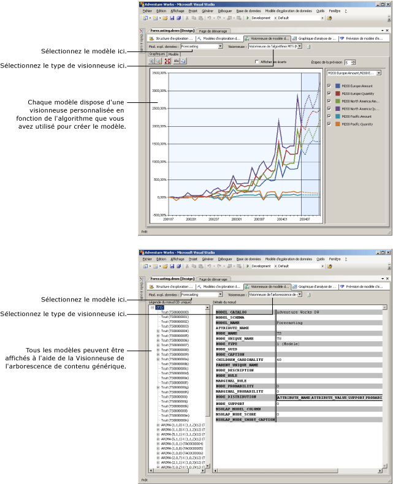

# Visionneuses de modèle d’exploration de données
[!INCLUDE[ssas-appliesto-sqlas](../../includes/ssas-appliesto-sqlas.md)]
  Après avoir effectué l’apprentissage d’un modèle d’exploration de données dans [!INCLUDE[msCoName](../../includes/msconame-md.md)] [!INCLUDE[ssNoVersion](../../includes/ssnoversion-md.md)] [!INCLUDE[ssASnoversion](../../includes/ssasnoversion-md.md)], vous pouvez explorer le modèle pour rechercher des tendances intéressantes. Étant donné que les résultats des modèles d'exploration de données sont complexes et peuvent être difficiles à comprendre dans un format brut, l'examen visuel des données constitue souvent le moyen le plus simple pour comprendre les règles et les relations que les algorithmes découvrent au sein des données.  
  
 Chacun des algorithmes que vous utilisez pour la construction d'un modèle renvoie un type différent de résultats. Par conséquent, [!INCLUDE[ssASnoversion](../../includes/ssasnoversion-md.md)] fournit une visionneuse spécifique pour chaque algorithme. Quand vous explorez un modèle d’exploration de données dans [!INCLUDE[ssBIDevStudioFull](../../includes/ssbidevstudiofull-md.md)], le modèle s’affiche sous l’onglet **Visionneuse de modèle d’exploration de données** du Concepteur d’exploration de données, à l’aide de la visionneuse appropriée pour ce modèle.  
  
## Utilisation des visionneuses de modèle  
 Vous devez sélectionner le modèle d'exploration de données, puis sélectionner une visionneuse. Chaque modèle comporte toujours deux visionneuses disponibles : une visionneuse personnalisée, qui peut inclure plusieurs onglets, et la visionneuse générique.  
  
 Selon le type du modèle sélectionné, vous verrez des options très différentes pour l'exploration du modèle. Les visionneuses personnalisées associées à chaque type de modèle sont adaptées à l'algorithme que vous avez utilisé pour créer le modèle d'exploration de données sélectionné. Chaque visionneuse personnalisée comporte divers outils et boîtes de dialogue qui vous permettent d'explorer les statistiques et modèles, de consulter les graphiques, d'utiliser en mode interactif des seuils de probabilité ou de filtrer des éléments par nom.  
  
 Le diagramme suivant illustre la différence entre une visionneuse personnalisée et la visionneuse générique pour le même modèle.  
  
1.  Tout d'abord, vous pouvez voir la visionneuse personnalisée qui apparaît lorsque vous sélectionnez un modèle d'exploration de données basé sur l'algorithme MTS (Microsoft Time Series).  
  
     Cette visionneuse personnalisée particulière crée automatiquement un graphique de la série chronologique et fournit cinq prédictions.  
  
2.  Ensuite, vous pouvez voir le même modèle, affiché à l’aide de la **Visionneuse de l’arborescence de contenu générique Microsoft**.  
  
     À gauche, la visionneuse générique affiche une liste des nœuds du modèle. Vous pouvez cliquer sur un nœud pour afficher son contenu dans le volet droit.  
  
   
  
## En savoir plus sur la visionneuse de l'arborescence de contenu générique Microsoft  
 Chaque modèle peut également être affiché à l’aide de la [Visionneuse de l’arborescence de contenu générique Microsoft &#40;exploration de données&#41;](http://msdn.microsoft.com/library/751b4393-f6fd-48c1-bcef-bdca589ce34c). Cette visionneuse affiche le contenu du modèle d'exploration de données en respectant un format de table HTML standard. Toutefois, la disposition des nœuds et le contenu de chaque nœud diffèrent considérablement selon l'algorithme utilisé pour générer les résultats.  
  
 Alors que les visionneuses personnalisées sont conçues pour explorer et comprendre le modèle, la visionneuse générique est plus adaptée lorsque vous comprenez déjà le modèle et souhaitez extraire d'un nœud spécifique des statistiques ou des règles. Par exemple, vous pouvez utiliser la visionneuse générique quand vous voulez afficher des informations détaillées sur les modèles et les statistiques capturés par [!INCLUDE[ssASnoversion](../../includes/ssasnoversion-md.md)] pendant l’analyse, notamment la probabilité d’un nœud, ou une formule de régression.  
  
 Vous pouvez également écrire des *requêtes de contenu* à l’aide de DMX pour obtenir toutes les informations présentées dans cette visionneuse. Pour plus d’informations, consultez [Requêtes de contenu &#40;Exploration de données&#41;](../../analysis-services/data-mining/content-queries-data-mining.md).  
  
## Dans cette section  
 Les rubriques suivantes décrivent plus en détail chacune des visionneuses, et expliquent comment interpréter les informations qu'elles contiennent.  
  
 [Parcourir un modèle à l’aide de la visionneuse d’arborescences Microsoft](../../analysis-services/data-mining/browse-a-model-using-the-microsoft-tree-viewer.md)  
 Décrit la Visionneuse d'arborescences [!INCLUDE[msCoName](../../includes/msconame-md.md)] . Cette visionneuse affiche les modèles d'exploration de données qui sont générés avec l'algorithme MDT ( [!INCLUDE[msCoName](../../includes/msconame-md.md)] Decision Trees) et l'algorithme MLR ( [!INCLUDE[msCoName](../../includes/msconame-md.md)] Linear Regression).  
  
 [Parcourir un modèle à l’aide de Microsoft Cluster Viewer](../../analysis-services/data-mining/browse-a-model-using-the-microsoft-cluster-viewer.md)  
 Décrit le composant [!INCLUDE[msCoName](../../includes/msconame-md.md)] Cluster Viewer. Cette visionneuse affiche les modèles d’exploration de données qui sont générés avec l’algorithme MC ( [!INCLUDE[msCoName](../../includes/msconame-md.md)] Clustering).  
  
 [Parcourir un modèle à l’aide de la visionneuse de série Microsoft Time](../../analysis-services/data-mining/browse-a-model-using-the-microsoft-time-series-viewer.md)  
 Décrit la Visionneuse de l’algorithme MTS ( [!INCLUDE[msCoName](../../includes/msconame-md.md)] Time Series). Cette visionneuse affiche les modèles d’exploration de données qui sont générés avec l’algorithme MTS ( [!INCLUDE[msCoName](../../includes/msconame-md.md)] Time Series).  
  
 [Parcourir un modèle à l’aide de l’Observateur de Microsoft Naive Bayes](../../analysis-services/data-mining/browse-a-model-using-the-microsoft-naive-bayes-viewer.md)  
 Décrit la Visionneuse de l’algorithme MNB ( [!INCLUDE[msCoName](../../includes/msconame-md.md)] Naive Bayes). Cette visionneuse affiche les modèles d'exploration de données qui sont générés avec l'algorithme MNB ( [!INCLUDE[msCoName](../../includes/msconame-md.md)] Naive Bayes).  
  
 [Parcourir un modèle à l’aide de la séquence de Microsoft Cluster Viewer](../../analysis-services/data-mining/browse-a-model-using-the-microsoft-sequence-cluster-viewer.md)  
 Décrit la Visionneuse de l'algorithme MSC ( [!INCLUDE[msCoName](../../includes/msconame-md.md)] Sequence Clustering). Cette visionneuse affiche les modèles d’exploration de données qui sont générés avec l’algorithme MSC ( [!INCLUDE[msCoName](../../includes/msconame-md.md)] Sequence Clustering).  
  
 [Parcourir un modèle à l’aide de la visionneuse de règles Microsoft Association](../../analysis-services/data-mining/browse-a-model-using-the-microsoft-association-rules-viewer.md)  
 Décrit la Visionneuse de l’algorithme MAR ( [!INCLUDE[msCoName](../../includes/msconame-md.md)] Association Rules). Cette visionneuse affiche les modèles d'exploration de données qui sont générés avec l'algorithme MAR ( [!INCLUDE[msCoName](../../includes/msconame-md.md)] Association Rules).  
  
 [Parcourir un modèle à l’aide de la visionneuse de réseau neuronal de Microsoft](../../analysis-services/data-mining/browse-a-model-using-the-microsoft-neural-network-viewer.md)  
 Décrit la Visionneuse de l'algorithme MNN ( [!INCLUDE[msCoName](../../includes/msconame-md.md)] Neural Network). Cette visionneuse affiche les modèles d'exploration de données qui sont générés avec l'algorithme MNN ( [!INCLUDE[msCoName](../../includes/msconame-md.md)] Neural Network), y compris les modèles qui utilisent l'algorithme MLR ( [!INCLUDE[msCoName](../../includes/msconame-md.md)] Logistic Regression).  
  
 [Parcourir un modèle à l’aide de la visionneuse d’arborescence de contenu générique Microsoft](../../analysis-services/data-mining/browse-a-model-using-the-microsoft-generic-content-tree-viewer.md)  
 Décrit les informations détaillées qui sont disponibles dans la visionneuse générique pour tous les modèles d'exploration de données et fournit des exemples sur l'interprétation des informations pour chaque algorithme.  
  
## Voir aussi  
 [Algorithmes d’exploration de données &#40; Analysis Services - Exploration de données &#41;](../../analysis-services/data-mining/data-mining-algorithms-analysis-services-data-mining.md)   
 [Concepteur d’exploration de données](../../analysis-services/data-mining/data-mining-designer.md)  
  
  
