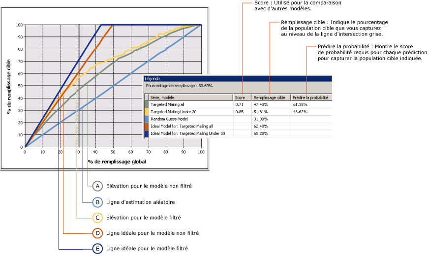
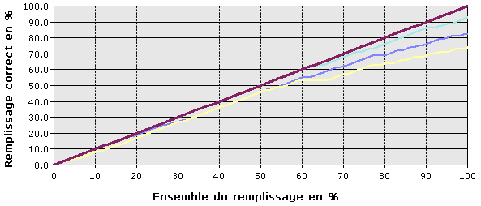

# Graphique de courbes d'élévation (Analysis Services - Exploration de données)
[!INCLUDE[ssas-appliesto-sqlas](../../includes/ssas-appliesto-sqlas.md)]
  Un *graphique de courbes d’élévation* représente graphiquement l’amélioration apportée par un modèle d’exploration de données par rapport à une estimation aléatoire, et mesure la modification en termes de score *d’élévation* . En comparant les scores de courbes d’élévation pour différents modèles, vous pouvez identifier le modèle le plus performant. Vous pouvez également déterminer le point auquel les prédictions du modèle deviennent moins utiles. Par exemple, en examinant le graphique de courbes d’élévation, vous pouvez réaliser qu’une campagne de promotion est susceptible d’être efficace auprès de seulement 30 % de vos clients et utiliser ce chiffre pour limiter l’étendue de la campagne.  
  
 Dans l’exploration de données [!INCLUDE[ssNoVersion](../../includes/ssnoversion-md.md)] , le graphique de courbes d’élévation peut comparer la précision de plusieurs modèles qui ont le même attribut prédictible. Vous pouvez également évaluer la précision de la prédiction de résultats uniques (une seule valeur de l'attribut prédictible) ou de tous les résultats (toutes les valeurs de l'attribut spécifié).  
  
 Un graphique des bénéfices est un type de graphique associé qui contient les mêmes informations qu'un graphique de courbes d'élévation, mais qui affiche également l'augmentation projetée des bénéfices associée à l'utilisation de chaque modèle.  
  
##   Fonctionnement du graphique de courbes d'élévation  
 Il peut être difficile de comprendre dans l'abstrait le fonctionnement de graphiques de courbes d'élévation. Par conséquent, pour illustrer l'utilisation des outils de graphique de courbes d'élévation et les informations du graphique, cette section présente un scénario dans lequel un graphique de courbes d'élévation est utilisé pour estimer la réponse à une campagne de publipostage ciblée.  
  
 Dans ce scénario, le service marketing sait qu’un taux de réponse de 10 % est plus ou moins classique des campagnes de publipostage. L'entreprise possède une liste de 10 000 clients potentiels stockés dans une table de la base de données. En fonction du taux de réponse habituel, l'entreprise s'attend normalement à ce qu'environ 1 000 clients potentiels seulement répondent. Toutefois, le budget prévu pour le projet n'est pas suffisant pour atteindre les 10 000 clients de la base de données et la société souhaite améliorer son taux de réponse. Supposons pour ce scénario que le budget permette de poster une annonce à 5 000 clients uniquement. Le service marketing a le choix entre deux options :  
  
-   sélectionner 5 000 clients cibles au hasard ;  
  
-   utiliser un modèle d’exploration de données pour cibler les 5 000 clients qui ont le plus de chance de répondre.  
  
 À l'aide d'un graphique de courbes d'élévation, vous pouvez comparer les résultats attendus des deux options. Par exemple, si l'entreprise a sélectionné au hasard 5 000 clients, elle peut s'attendre à recevoir seulement 500 réponses, conformément au taux de réponse habituel. Ce scénario est représenté par la ligne *aléatoire* dans le graphique de courbes d’élévation. Toutefois, si le service marketing a utilisé un modèle d'exploration de données pour cibler le publipostage, il est possible d'espérer un taux de réponse supérieur, car le modèle permet d'identifier les clients les plus susceptibles de répondre. Si le modèle était parfait, ce qui signifie qu'il pourrait créer des prédictions toujours exactes, la société pourrait s'attendre à recevoir les 1 000 réponses pour un publipostage aux 1 000 clients potentiels recommandés par le modèle. Ce scénario est représenté par la ligne *idéale* dans le graphique de courbes d’élévation.  
  
 En réalité, le modèle d'exploration de données se trouve probablement entre ces deux extrêmes, c'est-à-dire entre une estimation aléatoire et une prédiction parfaite. Toute amélioration par rapport à l'estimation aléatoire est considérée comme une élévation.  
  
 Lorsque vous créez un graphique de courbes d'élévation, vous pouvez cibler une valeur spécifique et la mesure d'élévation uniquement pour ces résultats, ou vous pouvez créer une estimation générale du modèle qui mesure des élévations pour tous les résultats possibles. Ces sélections affectent le graphique final, comme décrit dans les sections suivantes.  
  
 [Retour au début](#bkmk_Top)  
  
### Graphique de courbes d'élévation avec la valeur cible  
 Le graphique suivant correspond à un graphique de courbes d’élévation pour le modèle de **publipostage ciblé** que vous créez dans le [Didacticiel sur l’exploration de données de base](http://msdn.microsoft.com/library/6602edb6-d160-43fb-83c8-9df5dddfeb9c). Dans ce graphique, l'attribut cible est [Bike Buyer] et la valeur cible est 1, ce qui signifie que le client est censé acheter un vélo d'après les prédictions. Le graphique de courbes d'élévation indique ainsi l'amélioration que le modèle fournit lors de l'identification de ces clients potentiels.  
  
 Ce graphique contient plusieurs modèles basés sur les mêmes données. Un de ces modèles a été personnalisé pour cibler des clients spécifiques. Vous pouvez personnaliser un modèle en ajoutant des filtres sur les données utilisées pour l'apprentissage du mode. Ce filtre restreint les cas utilisés à la fois pour l'apprentissage et l'évaluation aux clients de moins de 30 ans. Notez qu'un effet de filtrage consiste en une utilisation par le modèle de base et le modèle filtré de jeux de données différents ; par conséquent, le nombre de cas utilisés pour l'évaluation dans le graphique de courbes d'élévation est différent également. Il est important de ne pas oublier ce point lorsque vous interprétez les résultats de prédiction et d'autres statistiques.  
  
   
  
 L'axe x du graphique représente le pourcentage du jeu de données de test utilisé pour comparer les prédictions. L'axe y du graphique représente le pourcentage de valeurs prévues.  
  
 La ligne droite diagonale, indiquée ici en bleu, apparaît dans chaque graphique. Elle correspond aux résultats d'estimation aléatoire et représente le niveau de référence par rapport auquel il convient d'évaluer l'élévation. Pour chaque modèle que vous ajoutez dans un graphique de courbes d'élévation, vous obtenez deux lignes supplémentaires : une ligne indique les résultats idéaux pour le jeu de données d'apprentissage si vous pouviez créer un modèle capable de prévoir toujours parfaitement, et la seconde ligne indique l'élévation réelle, ou l'amélioration des résultats, pour le modèle.  
  
 Dans cet exemple, la ligne idéale pour le modèle filtré est représentée en bleu foncé et la ligne correspondant à l'élévation réelle figure en jaune. Vous pouvez déduire du graphique que la ligne idéale atteint un maximum à près de 40 %, ce qui signifie que si vous aviez un modèle parfait, vous pourriez contacter 100 % de vos clients ciblés en effectuant un publipostage sur seulement 40 % de la population totale. L'élévation réelle pour le modèle filtré, lorsque vous ciblez 40 % de la population, est comprise entre 60 et 70 %, ce qui signifie que vous pourriez contacter 60 à 70 % de vos clients ciblés en effectuant un publipostage sur 40 % de la population totale des clients.  
  
 La **légende d’exploration de données** contient les valeurs réelles en tout point sur les courbes. Vous pouvez modifier l'emplacement mesuré en cliquant sur la barre grise verticale et en la déplaçant. Dans le graphique, la ligne grise a été placée sur 30 %, car il s'agit du point où les deux modèles filtré et non filtré semblent être les plus efficaces, et après ce point la valeur d'élévation décline.  
  
 La **légende d’exploration de données** contient également des scores et des statistiques qui vous aident à interpréter le graphique. Ces résultats représentent la précision du modèle au niveau de la ligne grise, qui est positionnée dans ce scénario de manière à inclure 30 % de l'ensemble des scénarios de test.  
  
|Série et modèle|Score|Remplissage cible|Probabilité de prédiction|  
|-----------------------|-----------|-----------------------|-------------------------|  
|Publipostage ciblé global|0.71|47.40%|61.38%|  
|Publipostage ciblé inférieur à 30|0.85|51.81%|46.62%|  
|Modèle d'estimation aléatoire||31.00%||  
|Modèle idéal pour : Publipostage ciblé global||62.48%||  
|Modèle idéal pour : Publipostage ciblé inférieur à 30||65.28%||  
  
 [Retour au début](#bkmk_Top)  
  
#### Interprétation des résultats  
 Vous pouvez déduire de ces résultats que, lorsqu'il est mesuré pour 30 % de tous les cas, le modèle général [Publipostage ciblé global] peut prédire le comportement d'achat de vélos de 47,40 % de la population cible. En d'autres termes, si vous effectuiez un publipostage ciblé sur uniquement 30 % des clients dans votre base de données, vous pourriez contacter légèrement moins de la moitié de votre public cible. Si vous utilisiez le modèle filtré, vous pourriez obtenir des résultats légèrement meilleurs et atteindre approximativement 51 % de vos clients ciblés.  
  
 La valeur de la **probabilité de prédiction** représente le seuil requis pour inclure un client parmi les cas « susceptibles d’acheter ». Pour chaque cas, le modèle estime la précision de chaque prédiction et stocke cette valeur, que vous pouvez utiliser pour éliminer par filtrage ou cibler des clients. Par exemple, pour identifier les acheteurs potentiels dans le modèle de base, vous pouvez utiliser une requête pour extraire les cas dont la probabilité de prédiction est d'au moins 61 %. Pour obtenir les clients ciblés par le modèle filtré, vous pouvez créer une requête pour extraire les cas qui satisfont tous les critères : l’âge et une valeur de **probabilité de prédiction** d’au moins 46 %.  
  
 Il est intéressant de comparer les modèles. Le modèle filtré semble capturer plus de clients potentiels, mais lorsque vous ciblez les clients avec un score de probabilité de prédiction de 46 %, vous avez également 53 % de chance d'envoyer un courrier de publipostage à quelqu'un qui n'achètera pas de vélo. Par conséquent, si vous décidiez quel modèle est le meilleur, vous souhaiteriez soupeser la précision supérieure et la taille de cible inférieure du modèle filtré par rapport à la capacité de sélection du modèle de base.  
  
 La valeur de **Score** vous aide à comparer des modèles en calculant l’efficacité du modèle sur une population normalisée. Un score plus élevé est meilleur, si bien que dans ce cas vous pouvez conclure que le ciblage des clients de moins de 30 ans est la stratégie la plus efficace, en dépit de la probabilité de prédiction inférieure.  
  
#### Comment le score est-il calculé ?  
 Le score correspond au score de la moyenne géométrique de tous les points constituant un nuage dont l’axe des abscisses contient les valeurs réelles, dont l’axe des ordonnées contient la valeur prédite et dont chaque point est associé à une probabilité.  
  
 La signification statistique du score d’un point donné est l’élévation prédictive pour le modèle à ce stade. La moyenne de tous les points constitue le score du modèle.  
  
 [Retour au début](#bkmk_Top)  
  
### Graphique de courbes d'élévation pour le modèle sans valeur cible  
 Si vous ne spécifiez pas l'état de la colonne prédictible, vous créez le type de graphique correspondant au diagramme ci-dessous. Ce graphique indique comment le modèle fonctionne pour tous les états de l'attribut prédictible. Par exemple, ce graphique vous indiquerait pour le modèle la qualité de prédiction des deux clients susceptibles d'acheter un vélo et de ceux qui ne sont pas susceptibles d'acheter un vélo.  
  
 L'axe x est identique à celui du graphique avec la colonne prédictible spécifiée, mais l'axe y représente à présent le pourcentage de prédictions correctes. Par conséquent, la ligne idéale est la ligne diagonale, qui indique qu'à 50 % des données le modèle prédit correctement 50 % des cas, le maximum qu'il est possible d'attendre.  
  
   
  
 Vous pouvez cliquer dans le graphique pour déplacer la barre grise verticale et la **légende d’exploration de données** indique le pourcentage total de cas et le pourcentage des cas prédits correctement. Par exemple, si vous positionnez la barre grise de curseur sur le repère 50 %, la **légende d’exploration de données** affiche les scores de précision ci-dessous. Ces illustrations sont basées sur le modèle TM_Decision_Tree créé dans le Didacticiel sur l'exploration de données de base.  
  
|Série, modèle|Score|Remplissage cible|Probabilité de prédiction|  
|-------------------|-----------|-----------------------|-------------------------|  
|TM_Decision_Tree|0.77|40.50%|72.91%|  
|Modèle idéal||50.00%||  
  
 Ce tableau vous indique que pour 50 % de la population, le modèle que vous avez créé prédit correctement 40 % des cas. Vous pouvez considérer ceci comme un modèle raisonnablement précis. Toutefois, souvenez-vous que ce modèle particulier prédit toutes les valeurs de l'attribut prédictible. Par conséquent, le modèle peut être précis pour prédire que 90 % des clients n'achèteront pas de vélo.  
  
 [Retour au début](#bkmk_Top)  
  
### Restrictions concernant les graphiques de courbes d'élévation  
 Les graphiques de courbes d'élévation nécessitent que l'attribut prédictible soit une valeur discrète. En d'autres termes, vous ne pouvez pas utiliser des graphiques de courbes d'élévation pour mesurer la précision des modèles qui prédisent des valeurs numériques continues.  
  
 La précision de prédiction pour toutes les valeurs discrètes de l'attribut prédictible est représentée au moyen d'une ligne unique. Si vous souhaitez voir les lignes de précision de prédiction pour toute valeur individuelle de l'attribut prédictible, vous devez créer un graphique de courbes d'élévation distinct pour chaque valeur ciblée.  
  
 Vous pouvez ajouter plusieurs modèles dans un graphique de courbes d'élévation, tant que les modèles ont tous le même attribut prédictible. Les modèles qui ne partagent pas l’attribut ne sont pas disponibles pour la sélection sous l’onglet **Entrée** .  
  
 Vous ne pouvez pas afficher les modèles de série chronologique dans un graphique de courbes d'élévation ou un graphique des bénéfices. L’habitude veut que, pour mesurer la précision des prédictions de série chronologique, il convient de réserver une partie des données d’historique et de comparer ces données aux prédictions. Pour plus d’informations, consultez [Algorithme MTS (Microsoft Time Series)](../../analysis-services/data-mining/microsoft-time-series-algorithm.md).  
  
### Contenu connexe  
 [Retour au début](#bkmk_Top)  
  
## Voir aussi  
 [Test et Validation & #40 ; exploration de données & #41 ;](../../analysis-services/data-mining/testing-and-validation-data-mining.md)  
  
  
