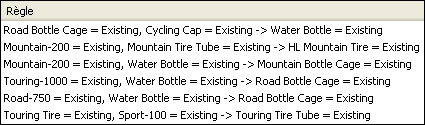

# Algorithme Microsoft Association
[!INCLUDE[ssas-appliesto-sqlas](../../includes/ssas-appliesto-sqlas.md)]
  L’algorithme [!INCLUDE[msCoName](../../includes/msconame-md.md)] Association est un algorithme qui est souvent utilisé pour les moteurs de recommandation. Un moteur de recommandation recommande des éléments aux clients en se basant sur ceux qu’ils ont déjà achetés ou pour lesquels ils ont manifesté un intérêt. L’algorithme [!INCLUDE[msCoName](../../includes/msconame-md.md)] Association est utile également pour l’analyse du panier d’achat.   
  
 Des modèles d'association sont générés sur les jeux de données qui contiennent des identificateurs pour les cas individuels et pour les éléments que les cas contiennent. Un groupe d’éléments dans un cas est appelé un *jeu d’éléments*. Un modèle d'association se compose d'une série de jeux d'éléments et de règles qui décrivent la manière dont ces éléments sont groupés au sein des cas. Les règles que l'algorithme identifie peuvent être utilisées pour prévoir les prochains achats d'un client, en fonction des éléments déjà présents dans le panier d'achat du client. Le diagramme ci-dessous montre une série de règles dans un jeu d'éléments.  
  
   
  
 Comme le diagramme l’illustre, l’algorithme [!INCLUDE[msCoName](../../includes/msconame-md.md)] Association peut trouver de nombreuses règles au sein d’un jeu de données. L'algorithme utilise deux paramètres, de prise en charge et de probabilité, pour décrire les jeux d'éléments et les règles qu'il génère. Par exemple, si X et Y représentent deux éléments éventuellement présents dans un panier d’achat, le paramètre de prise en charge correspond au nombre de cas dans le jeu de données qui contiennent la combinaison des éléments X et Y. En utilisant le paramètre de prise en charge en association avec les paramètres définis par l’utilisateur, *MINIMUM_SUPPORT* et *MAXIMUM_SUPPORT,* l’algorithme contrôle le nombre de jeux d’éléments générés. Le paramètre de probabilité, appelé aussi *confidence*, représente la fraction des cas du jeu de données contenant à la fois X et Y. En utilisant le paramètre de probabilité en association avec le paramètre *MINIMUM_PROBABILITY* , l’algorithme contrôle le nombre de règles générées.  
  
## Exemple  
 La société [!INCLUDE[ssSampleDBCoShort](../../includes/sssampledbcoshort-md.md)] Cycle revoit la fonctionnalité de son site Web. L'objectif de cette nouvelle conception est d'augmenter les ventes de produits. Comme la société enregistre chaque vente dans une base de données transactionnelle, elle peut utiliser l’algorithme [!INCLUDE[msCoName](../../includes/msconame-md.md)] Association pour identifier les produits qui ont tendance à être achetés ensemble. Il est alors possible de prédire les éléments supplémentaires susceptibles d'intéresser un client en fonction des éléments déjà présents dans le panier d'achat de ce client.  
  
## Fonctionnement de l'algorithme  
 L'algorithme [!INCLUDE[msCoName](../../includes/msconame-md.md)] Association parcourt un jeu de données pour trouver les éléments qui apparaissent ensemble dans un cas. L’algorithme groupe alors en jeux d’éléments tous les éléments associés qui apparaissent un nombre de fois au moins égal au nombre de cas spécifiés par le paramètre *MINIMUM_SUPPORT* . Par exemple, un jeu d'éléments peut être « Mountain 200=Existing, Sport 100=Existing » et peut avoir une prise en charge de 710. L'algorithme génère alors des règles à partir des jeux d'éléments. Ces règles sont utilisées pour prévoir la présence d'un élément dans la base de données, en fonction de la présence d'autres éléments spécifiques que l'algorithme identifie comme importants. Par exemple, une règle peut être « if Touring 1000=existing and Road bottle cage=existing, then Water bottle=existing » et peut avoir une probabilité de 0,812. Dans cet exemple, l'algorithme identifie le fait que la présence dans le panier d'un pneu Touring 1000 et d'un porte-bidon indique qu'un bidon d'eau pourrait également probablement se trouver dans le panier.  
  
 Pour obtenir des détails sur l’algorithme, ainsi que la liste des paramètres permettant de personnaliser le comportement de l’algorithme et de contrôler les résultats dans le modèle d’exploration de données, consultez [Références techniques relatives à l’algorithme Microsoft Association](../../analysis-services/data-mining/microsoft-association-algorithm-technical-reference.md).  
  
## Données requises pour les modèles d'association  
 Lorsque vous préparez des données à utiliser dans un modèle de règles d'association, vous devez comprendre les spécifications liées à l'algorithme, y compris la quantité de données requise et le mode d'utilisation des données.  
  
 Les spécifications pour un modèle de règles d'association sont les suivantes :  
  
-   **Colonne à index unique** Chaque modèle doit contenir une colonne numérique ou une colonne de texte qui identifie de façon unique chaque enregistrement. Les clés composées ne sont pas autorisées.  
  
-   **Une seule colonne prédictible** Un modèle d’association peut avoir une seule colonne prédictible. Il s'agit en général de la colonne clé de la table imbriquée, par exemple le champ qui répertorie les produits achetés. Les valeurs doivent être discrètes ou discrétisées.  
  
-   **Colonnes d’entrée** . Les colonnes d'entrée doivent être discrètes. Les données d'entrée pour un modèle d'association sont souvent contenues dans deux tables. Par exemple, une table peut contenir des informations sur le client et une autre les achats du client. Vous pouvez entrer ces données dans le modèle en utilisant une table imbriquée. Pour plus d’informations sur les tables imbriquées, consultez [Tables imbriquées &#40;Analysis Services - Exploration de données &#41;](../../analysis-services/data-mining/nested-tables-analysis-services-data-mining.md).  
  
 Pour de plus amples informations sur les types de contenu et les types de données pris en charge pour les modèles d’association, consultez la section relative aux spécifications dans [Références techniques relatives à l’algorithme Microsoft Association](../../analysis-services/data-mining/microsoft-association-algorithm-technical-reference.md).  
  
## Affichage d'un modèle d'association  
 Pour explorer le modèle, vous pouvez utiliser la **Visionneuse d’associations Microsoft**. Quand vous affichez un modèle d’association, [!INCLUDE[ssASnoversion](../../includes/ssasnoversion-md.md)] présente les corrélations sous différents angles afin que vous puissiez mieux comprendre les relations et les règles qui ont été identifiées dans les données. Le volet **Jeu d’éléments** dans la visionneuse fournit une répartition détaillée des combinaisons les plus communes, ou jeux d’éléments. Le volet **Règles** présente une liste des règles qui ont été généralisées à partir des données, ajoute des calculs de probabilité et classe les règles par importance relative. La visionneuse du réseau de dépendance vous permet d'explorer visuellement les connexions entre les différents éléments individuels. Pour plus d’informations, consultez [Explorer un modèle à l’aide de Microsoft Cluster Viewer](../../analysis-services/data-mining/browse-a-model-using-the-microsoft-cluster-viewer.md).  
  
 Si vous voulez en savoir plus sur les jeux d’éléments et les règles, vous pouvez parcourir le modèle dans la [Visionneuse de l’arborescence de contenu générique Microsoft](../../analysis-services/data-mining/browse-a-model-using-the-microsoft-generic-content-tree-viewer.md). Le contenu stocké pour le modèle inclut la prise en charge de chaque jeu d'éléments, un score pour chaque règle et d'autres statistiques. Pour plus d’informations, consultez [Mining Model Content for Association Models &#40;Analysis Services - Data Mining&#41;](../../analysis-services/data-mining/mining-model-content-for-association-models-analysis-services-data-mining.md).  
  
## Création de prédictions  
 Une fois le modèle traité, vous pouvez utiliser les règles et les jeux d'éléments pour faire des prédictions. Dans un modèle d'association, une prédiction indique quel élément est susceptible de se produire en fonction de la présence de l'élément spécifié. La prédiction peut inclure des informations telles que la probabilité, la prise en charge ou l'importance. Pour obtenir des exemples de création de requêtes sur un modèle d’association, consultez [Exemples de requêtes de modèle d’association](../../analysis-services/data-mining/association-model-query-examples.md).  
  
 Pour des informations générales sur la création d’une requête sur un modèle d’exploration de données, consultez [Requêtes d’exploration de données](../../analysis-services/data-mining/data-mining-queries.md).  
  
## Performance  
 Le processus de création de jeux d'éléments et de comptage des corrélations peut être fastidieux. Bien que l’algorithme MAR ( [!INCLUDE[msCoName](../../includes/msconame-md.md)] Association Rules) utilise des techniques d’optimisation pour économiser de l’espace et accélérer le traitement, vous devez savoir que des problèmes de performances peuvent survenir dans des conditions semblables à celles-ci :  
  
-   Le jeu de données est important et comprend de nombreux éléments individuels.  
  
-   La valeur de la taille minimale du jeu d'éléments est trop petite.  
  
 Pour minimiser le temps de traitement et réduire la complexité des jeux d'éléments, vous pouvez essayer de regrouper les éléments liés par catégories avant d'analyser les données.  
  
## Notes  
  
-   Ne prend pas en charge l’utilisation du langage PMML (Predictive Model Markup Language) pour créer des modèles d’exploration de données.  
  
-   Prend en charge l’extraction.  
  
-   Prend en charge l'utilisation de modèles d'exploration de données OLAP.  
  
-   Prend en charge la création de dimensions d'exploration de données.  
  
## Voir aussi  
 [Algorithmes d’exploration de données &#40; Analysis Services - Exploration de données &#41;](../../analysis-services/data-mining/data-mining-algorithms-analysis-services-data-mining.md)   
 [Parcourir un modèle à l’aide de la visionneuse de règles Microsoft Association](../../analysis-services/data-mining/browse-a-model-using-the-microsoft-association-rules-viewer.md)   
 [Contenu du modèle d’exploration de données pour les modèles d’Association & #40 ; Analysis Services - Exploration de données & #41 ;](../../analysis-services/data-mining/mining-model-content-for-association-models-analysis-services-data-mining.md)   
 [Référence technique d’algorithme Microsoft Association](../../analysis-services/data-mining/microsoft-association-algorithm-technical-reference.md)   
 [Exemples de requêtes de modèle association](../../analysis-services/data-mining/association-model-query-examples.md)  
  
  
