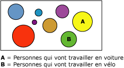

# Algorithme de gestion de clusters Microsoft
[!INCLUDE[ssas-appliesto-sqlas](../../includes/ssas-appliesto-sqlas.md)]
  L’Algorithme MSC ( [!INCLUDE[msCoName](../../includes/msconame-md.md)] Clustering) est un algorithme de *segmentation* ou *clustering* qui effectue une itération sur les cas dans un dataset pour les regrouper en clusters contenant des caractéristiques similaires. Ces regroupements sont utiles pour l'exploration des données, l'identification d'anomalies dans les données et la création de prédictions.  
  
 Les modèles de clusters identifient des relations dans un jeu de données que vous ne pourriez peut-être pas déduire d'une observation informelle. Par exemple, vous pouvez facilement deviner que les personnes qui se rendent à leur travail à vélo n’habitent généralement pas très loin de leur travail. Toutefois, l'algorithme peut trouver d'autres caractéristiques moins évidentes sur les personnes qui se rendent à leur travail en vélo. Dans le diagramme ci-dessous, le cluster A représente des données sur les personnes qui se rendent généralement en voiture à leur travail, tandis que le cluster B représente des données sur les personnes qui vont généralement à vélo à leur travail.  
  
   
  
 L'algorithme de clusters diffère des autres algorithmes d'exploration de données, tels que l'algorithme MDT ( [!INCLUDE[msCoName](../../includes/msconame-md.md)] Decision Trees), par le fait que vous n'avez pas à désigner de colonne prédictible pour être en mesure de générer un modèle de clusters. L'algorithme de clusters effectue l'apprentissage du modèle strictement à partir des relations qui existent dans les données et à partir des clusters que l'algorithme identifie.  
  
## Exemple  
 Prenons l'exemple d'un groupe de personnes qui partagent des informations démographiques similaires et qui achètent des produits similaires de la société [!INCLUDE[ssSampleDBCoShort](../../includes/sssampledbcoshort-md.md)] . Ce groupe de personnes représente un cluster de données. Plusieurs clusters de ce type peuvent exister dans une base de données. En observant les colonnes qui composent un cluster, vous pouvez voir plus clairement comment les enregistrements d'un jeu de données sont liés les uns aux autres.  
  
## Fonctionnement de l'algorithme  
 L'algorithme Clusters [!INCLUDE[msCoName](../../includes/msconame-md.md)] commence par identifier les relations qui existent dans un jeu de données et génère une série de clusters en fonction de ces relations. Un nuage de points représente une méthode utile pour représenter graphiquement la manière dont l'algorithme groupe les données, comme l'illustre le diagramme suivant. Le nuage de points représente tous les cas du jeu de données, chaque cas correspondant à un point sur le graphique. Les clusters groupent les points sur le graphique et illustrent les relations que l'algorithme identifie.  
  
   
  
 Une fois les clusters définis, l'algorithme calcule comment les clusters représentent les groupements des points, puis tente de redéfinir les groupements pour créer des clusters qui représentent mieux les données. L'algorithme effectue des itérations sur ce processus jusqu'à ce qu'il ne puisse plus améliorer les résultats en redéfinissant les clusters.  
  
 Vous pouvez personnaliser la façon dont l'algorithme fonctionne en spécifiant une technique de clustering, en limitant le nombre maximal de clusters ou en modifiant le niveau de prise en charge requis pour créer un cluster. Pour plus d’informations, consultez [Références techniques relatives à l’algorithme de gestion de clusters Microsoft](../../analysis-services/data-mining/microsoft-clustering-algorithm-technical-reference.md). Cet algorithme comprend deux méthodes de clustering courantes : le clustering K-means et la méthode EM (Expectation Maximization).  
  
## Données requises pour les modèles de clustering  
 Lorsque vous préparez des données à utiliser pour l'apprentissage d'un modèle de clustering, vous devez comprendre les spécifications liées à l'algorithme, y compris la quantité de données requises et le mode d'utilisation des données.  
  
 Les spécifications pour un modèle de clustering sont les suivantes :  
  
-   **Colonne à index unique** Chaque modèle doit contenir une colonne numérique ou une colonne de texte qui identifie de façon unique chaque enregistrement. Les clés composées ne sont pas autorisées.  
  
-   **Des colonnes d’entrée** Chaque modèle doit posséder au moins une colonne d’entrée qui contient les valeurs utilisées pour générer les clusters. Vous pouvez avoir autant de colonnes d'entrée que vous le souhaitez. Toutefois, en fonction du nombre de valeurs dans chaque colonne, l'ajout de colonnes supplémentaires peut accroître le temps nécessaire à l'apprentissage du modèle.  
  
-   **Une colonne prédictible facultative** L’algorithme n’a pas besoin de colonne prédictible pour générer le modèle, mais vous pouvez ajouter une colonne prédictible de n’importe quel type de données ou presque. Les valeurs de la colonne prédictible peuvent être traitées en tant qu'entrée du modèle de clustering, ou vous pouvez spécifier qu'elles soit uniquement utilisées à des fins de prédiction. Par exemple, si vous souhaitez prédire les revenus de vos clients en mettant en cluster les données démographiques telles que la région ou l’âge, vous spécifiez le revenu en tant que **PredictOnly** et vous ajoutez toutes les autres colonnes, telles que la région ou l’âge, en tant qu’entrées.  
  
 Pour des informations plus détaillées sur les types de contenu et les types de données pris en charge pour les modèles de clustering, consultez la section relative aux spécifications dans [Références techniques relatives à l’algorithme de gestion de clusters Microsoft](../../analysis-services/data-mining/microsoft-clustering-algorithm-technical-reference.md).  
  
## Affichage d'un modèle de clustering  
 Pour explorer le modèle, vous pouvez utiliser **Microsoft Cluster Viewer**. Quand vous examinez un modèle de clustering, [!INCLUDE[ssASnoversion](../../includes/ssasnoversion-md.md)] affiche les clusters dans un diagramme qui représente les relations entre les clusters, ainsi qu’un profil détaillé de chaque cluster, une liste des attributs qui distinguent chaque cluster des autres et les caractéristiques du jeu de données d’apprentissage en entier. Pour plus d’informations, consultez [Explorer un modèle à l’aide de Microsoft Cluster Viewer](../../analysis-services/data-mining/browse-a-model-using-the-microsoft-cluster-viewer.md).  
  
 Si vous voulez en savoir plus, vous pouvez parcourir le modèle dans la [Visionneuse de l’arborescence de contenu générique Microsoft](../../analysis-services/data-mining/browse-a-model-using-the-microsoft-generic-content-tree-viewer.md). Le contenu stocké pour le modèle inclut la distribution de toutes les valeurs dans chaque nœud, la probabilité de chaque cluster et d'autres informations. Pour plus d’informations, consultez [Mining Model Content for Clustering Models &#40;Analysis Services - Data Mining&#41;](../../analysis-services/data-mining/mining-model-content-for-clustering-models-analysis-services-data-mining.md).  
  
## Création de prédictions  
 Après l'apprentissage d'un modèle, les résultats sont stockés sous la forme d'un jeu de modèles que vous pouvez explorer ou utiliser pour effectuer des prédictions.  
  
 Vous pouvez créer des requêtes pour retourner des prédictions sur la capacité des clusters qui ont été découverts à stocker les nouvelles données ou pour obtenir des statistiques descriptives à propos des clusters.  
  
 Pour plus d’informations sur la façon de créer des requêtes sur un modèle d’exploration de données, consultez [Requêtes d’exploration de données](../../analysis-services/data-mining/data-mining-queries.md). Pour obtenir des exemples d’utilisation de requêtes avec un modèle de clustering, consultez [Exemples de requêtes de modèle de clustering](../../analysis-services/data-mining/clustering-model-query-examples.md).  
  
## Notes  
  
-   Prend en charge l'utilisation du langage PMML (Predictive Model Markup Language) pour créer des modèles d'exploration de données.  
  
-   Prend en charge l’extraction.  
  
-   Prend en charge l'utilisation de modèles d'exploration de données OLAP et la création de dimensions d'exploration de données.  
  
## Voir aussi  
 [Algorithmes d’exploration de données &#40; Analysis Services - Exploration de données &#41;](../../analysis-services/data-mining/data-mining-algorithms-analysis-services-data-mining.md)   
 [Microsoft Clustering algorithme informations techniques de référence](../../analysis-services/data-mining/microsoft-clustering-algorithm-technical-reference.md)   
 [Contenu du modèle d’exploration de données pour le Clustering des modèles & #40 ; Analysis Services - Exploration de données & #41 ;](../../analysis-services/data-mining/mining-model-content-for-clustering-models-analysis-services-data-mining.md)   
 [Exemples de requêtes modèle de clustering](../../analysis-services/data-mining/clustering-model-query-examples.md)  
  
  
