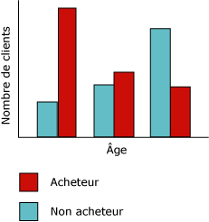
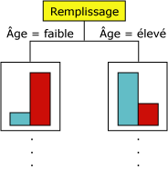
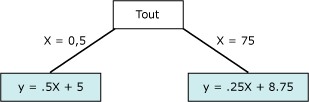

# Algorithme MDT (Microsoft Decision Trees)
[!INCLUDE[ssas-appliesto-sqlas](../../includes/ssas-appliesto-sqlas.md)]
  L’algorithme MDT ( [!INCLUDE[msCoName](../../includes/msconame-md.md)] Decision Trees) est un algorithme de classification et de régression destiné à la modélisation prédictive d’attributs discrets et continus.  
  
 Pour les attributs discrets, l'algorithme effectue des prévisions en fonction des relations entre les colonnes d'entrée d'un dataset. Il utilise les valeurs, également appelées « états », de ces colonnes pour prédire les états d'une colonne désignée comme prévisibles. En particulier, l'algorithme identifie les colonnes d'entrée en corrélation avec la colonne prédictible. Par exemple, dans un scénario conçu pour prévoir quels clients sont susceptibles d'acheter un vélo, si neuf jeunes clients sur dix achètent un vélo, alors que seulement deux clients plus âgés sur dix le font, l'algorithme déduit que l'âge est un bon facteur de prévision d'achat de vélo. L'arbre de décision effectue des prévisions en fonction de cette tendance vers une issue particulière.  
  
 Pour les attributs continus, l'algorithme utilise la régression linéaire pour déterminer où un arbre de décision se divise.  
  
 Si plusieurs colonnes sont définies comme prévisibles ou si les données d'entrée contiennent une table imbriquée définie comme prévisible, l'algorithme génère un arbre de décision distinct pour chaque colonne prédictible.  
  
## Exemple  
 Le service marketing de la société [!INCLUDE[ssSampleDBCoFull](../../includes/sssampledbcofull-md.md)] veut identifier les caractéristiques d’anciens clients qui pourraient indiquer s’ils sont susceptibles d’acheter un produit dans l’avenir. La base de données [!INCLUDE[ssSampleDBnormal](../../includes/sssampledbnormal-md.md)] stocke des informations démographiques sur les clients antérieurs. En utilisant l’algorithme MDT ( [!INCLUDE[msCoName](../../includes/msconame-md.md)] Decision Trees) pour analyser ces informations, le service marketing peut créer un modèle pour prévoir si un client particulier achètera des produits, en fonction de l’état de colonnes connues sur ce client, telles que les caractéristiques démographiques ou les critères d’achat passés.  
  
## Fonctionnement de l'algorithme  
 L’algorithme MDT ( [!INCLUDE[msCoName](../../includes/msconame-md.md)] Decision Trees) crée un modèle d’exploration de données en créant une série de divisions dans l’arbre. Ces divisions sont représentées sous forme de *nœuds*. L'algorithme ajoute un nœud au modèle chaque fois qu'une colonne d'entrée en corrélation significative avec la colonne prédictible est détectée. La manière dont l'algorithme détermine une division diffère selon qu'il prévoit une colonne continue ou une colonne discrète.  
  
 L’algorithme MDT ( [!INCLUDE[msCoName](../../includes/msconame-md.md)] Decision Trees) utilise la *sélection de fonctionnalités* pour guider la sélection des attributs les plus utiles. La sélection de fonctionnalités est utilisée par tous les algorithmes d’exploration de données [!INCLUDE[ssNoVersion](../../includes/ssnoversion-md.md)] pour améliorer les performances et la qualité d’analyse. Elle est importante pour empêcher que des attributs sans importance utilisent du temps processeur. Si vous utilisez trop d'attributs d'entrée ou d'attributs prédictibles lorsque vous concevez un modèle d'exploration de données, le traitement du modèle peut nécessiter beaucoup de temps, voire même manquer de mémoire. Parmi les méthodes utilisées pour déterminer si l’arbre doit être divisé figurent des métriques standard pour l’*entropie* et les réseaux bayésiens *.* Pour plus d’informations sur les méthodes utilisées pour sélectionner, évaluer et classer des attributs significatifs, consultez [Sélection des fonctionnalités &#40;exploration de données&#41;](../../analysis-services/data-mining/feature-selection-data-mining.md).  
  
 L’un des problèmes courants dans les modèles d’exploration de données est que le modèle devient trop sensible aux petites différences dans les données d’apprentissage, auquel cas il est dit *surajusté* ou *surentraîné*. Un modèle surajusté ne peut pas être généralisé à d'autres jeux de données. Pour éviter le surajustement sur tout jeu particulier de données, l'algorithme MDT ( [!INCLUDE[msCoName](../../includes/msconame-md.md)] Decision Trees) utilise des techniques qui permettent de contrôler la croissance de l'arbre. Pour obtenir une explication plus détaillée du fonctionnement de l’algorithme MDT ( [!INCLUDE[msCoName](../../includes/msconame-md.md)] Decision Trees), consultez [Références techniques relatives à l’algorithme MDT (Microsoft Decision Trees)](../../analysis-services/data-mining/microsoft-decision-trees-algorithm-technical-reference.md).  
  
### Prévision de colonnes discrètes  
 La manière dont l’algorithme MDT ( [!INCLUDE[msCoName](../../includes/msconame-md.md)] Decision Trees) génère un arbre pour une colonne prédictible discrète peut être illustrée à l’aide d’un histogramme. Le diagramme ci-dessous montre un histogramme qui représente une colonne prédictible, Acheteurs de vélos, par rapport à une colonne d'entrée, Âge. L'histogramme montre que l'âge d'une personne aide à distinguer si cette personne achètera un vélo.  
  
   
  
 La corrélation qui apparaît dans ce diagramme entraîne la création d’un nouveau nœud dans le modèle par l’algorithme MDT ( [!INCLUDE[msCoName](../../includes/msconame-md.md)] Decision Trees).  
  
   
  
 Au fur et à mesure que l'algorithme ajoute de nouveaux nœuds dans un modèle, une structure arborescente est formée. Le nœud supérieur de l'arbre décrit le détail de la colonne prédictible pour la population globale des clients. Le modèle continue de croître et l'algorithme prend en compte toutes les colonnes.  
  
### Prévision de colonnes continues  
 Quand l’algorithme MDT ( [!INCLUDE[msCoName](../../includes/msconame-md.md)] Decision Trees) génère un arbre en fonction d’une colonne prédictible continue, chaque nœud contient une formule de régression. Une division apparaît à un point de non-linéarité dans la formule de régression. Par exemple, considérons le diagramme ci-dessous.  
  
   
  
 Dans un modèle de régression standard, vous essaieriez de trouver une formule unique qui représente la tendance et les relations pour les données dans leur ensemble.  Or, une seule formule ne permettrait pas de prendre en compte la discontinuité de données complexes. De son côté, l’algorithme MDT ( [!INCLUDE[msCoName](../../includes/msconame-md.md)] ) recherche les segments de l’arbre qui sont largement linéaires et crée des formules distinctes pour ces segments. En décomposant les données en différents segments, le modèle peut mieux faire que les reproduire approximativement.  
  
 Le diagramme suivant représente le diagramme de l’arbre du modèle illustré dans le nuage de points précédent.  Pour prédire le résultat, le modèle fournit deux formules différentes : une pour la branche de gauche, avec la formule y = .5x x 5, et une pour la branche de droite, avec la formule y = .25x + 8.75. Le point d’intersection des deux lignes dans le nuage de points correspond au point de non-linéarité et au point où un nœud se divise dans un modèle d’arbre de décision.  
  
   
  
 Il s’agit d’un modèle simple constitué de seulement deux équations linéaires ; par conséquent, le fractionnement au niveau de l’arbre intervient de suite après le nœud **All** . Cependant, un fractionnement peut se produire à n’importe quel niveau de l’arbre. Cela signifie que dans un arbre à plusieurs niveaux et plusieurs nœuds, où chaque nœud est caractérisé par une collection d’attributs différente, une formule peut être partagée entre plusieurs nœuds ou s’appliquer uniquement à un seul nœud. Par exemple, vous pouvez obtenir une formule pour un nœud défini pour les « clients au-dessus d’un certain âge et niveau de revenu » et l’autre dans un nœud qui représente les « clients qui effectuent de longs trajets domicile-travail ». Pour afficher la formule associée à un nœud ou un segment individuel, il suffit de cliquer sur le nœud.  
  
## Données requises pour les modèles d'arbre de décision  
 Lorsque vous préparez des données à utiliser dans un modèle d'arbre de décision, vous devez comprendre les spécifications liées à l'algorithme, y compris la quantité de données requise et le mode d'utilisation de ces données.  
  
 Les spécifications liées à un modèle d’arbre de décision sont les suivantes :  
  
-   **Colonne à index unique** : chaque modèle doit contenir une colonne numérique ou une colonne de texte qui identifie de façon unique chaque enregistrement. Les clés composées ne sont pas autorisées.  
  
-   **Colonne prédictible** : nécessite au moins une colonne prédictible. Vous pouvez inclure dans un modèle plusieurs attributs prédictibles, lesquels peuvent être de types différents, numériques ou discrets. Toutefois, l'augmentation du nombre d'attributs prédictibles peut augmenter le temps de traitement.  
  
-   **Colonnes d’entrée** : nécessitent des colonnes d’entrée, qui peuvent être discrètes ou continues. L'augmentation du nombre d'attributs d'entrée affecte le temps de traitement.  
  
 Pour plus d’informations sur les types de contenu et les types de données pris en charge pour les modèles d’arbre de décision, consultez la section relative aux spécifications dans [Références techniques relatives à l’algorithme MDT (Microsoft Decision Trees)](../../analysis-services/data-mining/microsoft-decision-trees-algorithm-technical-reference.md).  
  
## Affichage d'un modèle d'arbre de décision  
 Pour explorer le modèle, vous pouvez utiliser la **Visionneuse d’arborescences Microsoft**. Si votre modèle génère plusieurs arbres, vous pouvez sélectionner un arbre. La visionneuse vous montre alors le détail de la façon dont les cas sont organisés pour chaque attribut prédictible. Vous pouvez également afficher l'interaction des arbres en utilisant la visionneuse du réseau de dépendance. Pour plus d’informations, consultez [Explorer un modèle à l’aide de la visionneuse d’arborescences Microsoft](../../analysis-services/data-mining/browse-a-model-using-the-microsoft-tree-viewer.md).  
  
 Si vous voulez en savoir plus sur une branche ou un nœud de l’arbre, vous pouvez aussi parcourir le modèle en utilisant la [Visionneuse de l’arborescence de contenu générique Microsoft](../../analysis-services/data-mining/browse-a-model-using-the-microsoft-generic-content-tree-viewer.md). Le contenu stocké pour le modèle inclut la distribution de toutes les valeurs pour chaque nœud, des probabilités à chaque niveau de l'arbre et des formules de régression pour les attributs continus. Pour plus d’informations, consultez [Mining Model Content for Decision Tree Models &#40;Analysis Services - Data Mining&#41;](../../analysis-services/data-mining/mining-model-content-for-decision-tree-models-analysis-services-data-mining.md).  
  
## Création de prédictions  
 Une fois le modèle traité, les résultats sont stockés sous la forme d'un jeu de modèles et de statistiques, que vous pouvez utiliser pour explorer les relations ou élaborer des prédictions.  
  
 Pour obtenir des exemples de requêtes à utiliser avec un modèle d’arbre de décision, consultez [Exemples de requêtes de modèle d’arbre de décision](../../analysis-services/data-mining/decision-trees-model-query-examples.md).  
  
 Pour obtenir des informations générales sur la création de requêtes sur des modèles d’exploration de données, consultez [Requêtes d’exploration de données](../../analysis-services/data-mining/data-mining-queries.md).  
  
## Notes  
  
-   Prend en charge l'utilisation du langage PMML (Predictive Model Markup Language) pour créer des modèles d'exploration de données.  
  
-   Prend en charge l’extraction.  
  
-   Prend en charge l'utilisation de modèles d'exploration de données OLAP et la création de dimensions d'exploration de données.  
  
## Voir aussi  
 [Algorithmes d’exploration de données &#40; Analysis Services - Exploration de données &#41;](../../analysis-services/data-mining/data-mining-algorithms-analysis-services-data-mining.md)   
 [Techniques de l’algorithme d’arbres de décision Microsoft](../../analysis-services/data-mining/microsoft-decision-trees-algorithm-technical-reference.md)   
 [Exemples de requête de modèle d’arborescences de décision](../../analysis-services/data-mining/decision-trees-model-query-examples.md)   
 [Contenu du modèle d’exploration de données pour les modèles d’arbre de décision & #40 ; Analysis Services - Exploration de données & #41 ;](../../analysis-services/data-mining/mining-model-content-for-decision-tree-models-analysis-services-data-mining.md)  
  
  
