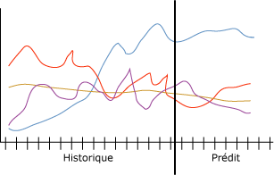

# Algorithme MTS (Microsoft Time Series)
[!INCLUDE[ssas-appliesto-sqlas](../../includes/ssas-appliesto-sqlas.md)]
  L’algorithme MTS ( [!INCLUDE[msCoName](../../includes/msconame-md.md)] Time Series) fournit plusieurs algorithmes qui sont optimisés pour prévoir des valeurs continues, telles que les ventes de produits, dans le temps. Contrairement à d'autres algorithmes [!INCLUDE[msCoName](../../includes/msconame-md.md)] , tels que les arbres de décision, un modèle de série chronologique ne nécessite pas de colonnes supplémentaires avec de nouvelles informations comme entrée pour prédire une tendance. Un modèle de série chronologique peut prédire des tendances en fonction uniquement du jeu de données d'origine utilisé pour créer le modèle. Vous pouvez également ajouter de nouvelles données au modèle lorsque vous effectuez une prédiction et les incorporer automatiquement à l'analyse de tendances.  
  
 Le diagramme suivant représente un modèle standard pour prévoir les ventes d'un produit dans quatre régions de ventes différentes dans le temps. Le modèle affiché dans le diagramme affiche des ventes pour chaque région représentée sous la forme de traits de couleur rouge, jaune, violette et bleue. Le trait de chaque région est constitué de deux parties :  
  
-   Les informations sur l'historique apparaissent à gauche du trait vertical et représentent les données que l'algorithme utilise pour créer le modèle.  
  
-   Les informations sur les prédictions apparaissent à droite du trait vertical et représentent les prévisions effectuées par le modèle.  
  
 La combinaison des données sources et des données de prédiction est appelée une *série*.  
  
   
  
 Les prédictions croisées sont une fonctionnalité importante de l'algorithme MTS ( [!INCLUDE[msCoName](../../includes/msconame-md.md)] Time Series). Si vous effectuez l'apprentissage de l'algorithme avec deux séries distinctes mais connexes, vous pouvez utiliser le modèle résultant pour prédire le résultat d'une série en fonction du comportement de l'autre série. Par exemple, les ventes constatées d'un produit peuvent influencer les prévisions de ventes d'un autre produit.  La prédiction croisée est également utile pour créer un modèle global qui peut s'appliquer à plusieurs séries. Par exemple, les prédictions pour une région particulière sont instables, car la série n'a pas de données de bonne qualité.  Vous pouvez instruire un modèle global sur une moyenne de l'ensemble des quatre régions, puis appliquer le modèle aux différentes séries pour créer des prédictions plus stables pour chaque région.  
  
## Exemple  
 L'équipe dirigeante de la société [!INCLUDE[ssSampleDBCoFull](../../includes/sssampledbcofull-md.md)] souhaite prédire les ventes mensuelles de vélos pour l'année à venir. La société veut tout particulièrement savoir si la vente d'un modèle de vélo peut être utilisée pour prédire la vente d'un autre modèle. En appliquant l'algorithme MTS ( [!INCLUDE[msCoName](../../includes/msconame-md.md)] Time Series) aux données historiques des trois dernières années, la société peut créer un modèle d'exploration de données pour prévoir les futures ventes de vélos. De plus, la société peut effectuer des prédictions croisées afin de déterminer si les tendances des ventes de différents modèles de vélos sont liées entre elles.  
  
 Chaque trimestre, la société projette de mettre à jour le modèle avec les données de ventes récentes ainsi que leurs prédictions pour modeler des tendances récentes. Pour corriger les magasins qui n'effectuent pas une mise à jour correcte ou régulière des données de ventes, elle créera un modèle de prédiction global et l'utilisera pour créer des prédictions pour toutes les régions.  
  
## Fonctionnement de l'algorithme  
 Dans [!INCLUDE[ssVersion2005](../../includes/ssversion2005-md.md)], l’algorithme [!INCLUDE[msCoName](../../includes/msconame-md.md)] Time Series a utilisé une méthode Time Series autorégressive unique, ARTXP. L’algorithme ARTXP a été optimisé pour les prédictions à court terme et, par conséquent, prédit de façon fiable la valeur probable suivante dans une série. À compter de [!INCLUDE[ssKatmai](../../includes/sskatmai-md.md)], l’algorithme [!INCLUDE[msCoName](../../includes/msconame-md.md)] Time Series a ajouté un second algorithme, ARIMA, qui a été optimisé pour les prédictions à long terme. Pour obtenir une explication détaillée sur l’implémentation des algorithmes ARTXP et ARIMA, consultez [Références techniques relatives à l’algorithme MTS (Microsoft Time Series)](../../analysis-services/data-mining/microsoft-time-series-algorithm-technical-reference.md).  
  
 Par défaut, l’algorithme [!INCLUDE[msCoName](../../includes/msconame-md.md)] Time Series utilise une combinaison des algorithmes quand il analyse des schémas et effectue des prédictions. L’algorithme effectue l’apprentissage de deux modèles séparés sur les mêmes données : un modèle utilise l’algorithme ARTXP et l’autre l’algorithme ARIMA. L'algorithme fusionne ensuite les résultats des deux modèles pour produire la meilleure prédiction sur un nombre variable de tranches de temps. L'algorithme ARTXP étant idéal pour les prédictions à court terme, il pèse plus lourdement au début d'une série de prédictions. Toutefois, à mesure que les tranches de temps que vous prédisez sont éloignées dans le temps, l'algorithme ARIMA pèse plus lourdement.  
  
 Vous pouvez également contrôler la combinaison des algorithmes pour favoriser les prédictions à court ou long terme dans la série chronologique. À compter de [!INCLUDE[ssKatmai](../../includes/sskatmai-md.md)] Standard, vous pouvez spécifier l’algorithme à utiliser :  
  
-   Utiliser uniquement ARTXP pour les prédictions à court terme.  
  
-   Utiliser uniquement ARIMA pour les prédictions à long terme.  
  
-   Utiliser la fusion par défaut des deux algorithmes.  
  
 À compter de [!INCLUDE[ssEnterpriseEd10](../../includes/ssenterpriseed10-md.md)], vous pouvez également personnaliser la façon dont l’algorithme [!INCLUDE[msCoName](../../includes/msconame-md.md)] Time Series fusionne les modèles pour la prédiction. Quand vous utilisez un modèle mixte, l’algorithme [!INCLUDE[msCoName](../../includes/msconame-md.md)] Time Series fusionne les deux algorithmes comme suit :  
  
-   Seul ARTXP est toujours utilisé pour effectuer les deux premières prédictions.  
  
-   Après les deux premières prédictions, une combinaison des algorithmes ARIMA et ARTXP est utilisée.  
  
-   À mesure que le nombre d'étapes de prédiction augmente, les prédictions reposent de plus en plus sur ARIMA jusqu'à ce que l'algorithme ARTXP ne soit plus utilisé.  
  
-   Vous contrôlez le point de combinaison ainsi que les taux de diminution du poids d’ARTXP et d’augmentation du poids d’ARIMA en définissant le paramètre PREDICTION_SMOOTHING.  
  
 Les deux algorithmes peuvent détecter le caractère saisonnier des données à plusieurs niveaux. Par exemple, vos données peuvent contenir des cycles mensuels imbriqués dans des cycles annuels. Pour détecter ces cycles saisonniers, vous pouvez fournir un indice de périodicité ou spécifier que l'algorithme doit détecter automatiquement la périodicité.  
  
 Outre la périodicité, il existe plusieurs autres paramètres qui contrôlent le comportement de l'algorithme [!INCLUDE[msCoName](../../includes/msconame-md.md)] Time Series lorsqu'il détecte la périodicité, effectue des prédictions ou analyse des cas. Pour plus d’informations sur la définition des paramètres des algorithmes, consultez [Références techniques relatives à l’algorithme MTS (Microsoft Time Series)](../../analysis-services/data-mining/microsoft-time-series-algorithm-technical-reference.md).  
  
## Données requises pour les modèles de séries chronologiques  
 Lorsque vous préparez des données à utiliser dans l'apprentissage d'un modèle d'exploration de données, assurez-vous que vous comprenez les spécifications pour le modèle spécifié et le mode d'utilisation des données.  
  
 Chaque modèle de prévision doit contenir une série de cas, qui correspond à la colonne qui spécifie les tranches horaires ou d'autres séries sur lesquelles la modification se produit. Par exemple, les données du diagramme précédent représentent la série des ventes de vélos historiques et prévues sur une période de plusieurs mois. Pour ce modèle, chaque région représente une série et la colonne de date contient la série chronologique, qui est également la série de cas. Dans d'autres modèles, la série de cas peut être un champ de texte ou un identificateur, tel qu'un ID de client ou de transaction. Toutefois, un modèle de série chronologique doit toujours utiliser une date, une heure ou une autre valeur numérique unique pour sa série de cas.  
  
 Les spécifications pour un modèle de série chronologique se présentent comme suit :  
  
-   **Colonne Key Time unique** Chaque modèle doit contenir une colonne numérique ou de date utilisée comme série de cas, qui définit les tranches de temps que le modèle utilisera. Le type de données pour la colonne Key Time peut être un type de données datetime ou un type de données numérique. Toutefois, la colonne doit contenir des valeurs continues, et les valeurs doivent être uniques pour chaque série. La série de cas pour un modèle de série chronologique ne peut pas être stockée dans deux colonnes, telles qu'une colonne d'année et une colonne de mois.  
  
-   **Colonne prédictible** Chaque modèle doit contenir au moins une colonne prédictible autour de laquelle l’algorithme générera le modèle de série chronologique. Le type de données de la colonne prédictible doit avoir des valeurs continues. Par exemple, vous pouvez prédire la façon dont les attributs numériques, tels que le revenu, les ventes ou la température, changent avec le temps. Toutefois, vous ne pouvez pas utiliser une colonne qui contient des valeurs discrètes, telles que l'état des achats ou le niveau d'éducation, comme colonne prédictible.  
  
-   **Colonne clé de série facultative** Chaque modèle peut avoir une colonne clé supplémentaire qui contient des valeurs uniques qui identifient une série. La colonne clé de série facultative doit contenir des valeurs uniques. Par exemple, un modèle unique peut contenir des ventes pour de nombreux modèles de produits, tant qu'il n'existe qu'un seul enregistrement pour chaque nom de produit pour chaque tranche horaire.  
  
 Vous pouvez définir les données d’entrée du modèle [!INCLUDE[msCoName](../../includes/msconame-md.md)] Time Series de plusieurs façons différentes. Toutefois, dans la mesure où le format des cas d'entrée affecte la définition du modèle d'exploration de données, vous devez considérer vos exigences opérationnelles et préparer vos données en conséquence. Les deux exemples suivants illustrent la façon dont les données d'entrée affectent le modèle. Dans les deux exemples, le modèle d'exploration de données complété contient des modèles pour quatre séries distinctes :  
  
-   Ventes pour le produit A  
  
-   Ventes pour le produit B  
  
-   Volume pour le produit A  
  
-   Volume pour le produit B  
  
 Dans les deux exemples, vous pouvez prédire les nouvelles ventes à venir et le volume pour chaque produit. Vous ne pouvez pas prédire les nouvelles valeurs pour le produit ou pour la chronologie.  
  
### Exemple 1 : jeu de données de série chronologique avec la série représentée comme valeurs de colonne  
 Cet exemple utilise la table de cas d'entrée suivante :  
  
|TimeID|Product|Ventes|Volume|  
|------------|-------------|-----------|------------|  
|1/2001|Objet|1000|600|  
|2/2001|Objet|1100|500|  
|1/2001|B|500|900|  
|2/2001|B|300|890|  
  
 La colonne TimeID du tableau contient un identificateur de temps et possède deux entrées par jour. La colonne TimeID devient la série de cas. Par conséquent, vous désigneriez cette colonne comme colonne Key Time pour le modèle de série chronologique.  
  
 La colonne Product définit un produit dans la base de données. Cette colonne contient la série de produits. Par conséquent, vous désigneriez cette colonne comme deuxième colonne pour le modèle de série chronologique.  
  
 La colonne Sales décrit les bénéfices bruts du produit spécifié pour un jour et la colonne Volume décrit la quantité du produit spécifié en stock. Ces deux colonnes contiennent les données utilisées pour effectuer l'apprentissage du modèle. Sales et Volume peuvent être des attributs prédictibles pour chaque série dans la colonne Product.  
  
### Exemple 2 : jeu de données de série chronologique avec chaque série dans une colonne distincte  
 Bien que cet exemple utilise fondamentalement les mêmes données d'entrée que le premier exemple, elles sont structurées différemment, comme illustré dans le tableau suivant :  
  
|TimeID|A_Sales|A_Volume|B_Sales|B_Volume|  
|------------|--------------|---------------|--------------|---------------|  
|1/2001|1000|600|500|900|  
|2/2001|1100|500|300|890|  
  
 Dans cette table, la colonne TimeID contient encore la série de cas pour le modèle de série chronologique, que vous désignez comme colonne Key Time. Toutefois, les colonnes Sales et Volume précédentes sont à présent divisées en deux colonnes, et chacune de ces colonnes est précédée du nom du produit. En conséquence, la colonne TimeID ne contient qu'une seule entrée par jour. Un modèle de série chronologique est ainsi créé, qui contient quatre colonnes prédictibles : A_Sales, A_Volume, B_Sales et B_Volume.  
  
 En outre, puisque vous avez réparti les produits dans des colonnes différentes, vous n'avez pas à spécifier une colonne clé de série supplémentaire. Toutes les colonnes du modèle sont une colonne de série de cas ou une colonne prédictible.  
  
## Affichage d'un modèle de série chronologique  
 Après l'apprentissage d'un modèle, les résultats sont stockés sous la forme d'un jeu de modèles que vous pouvez explorer ou utiliser pour effectuer des prédictions.  
  
 Pour explorer le modèle, vous pouvez utiliser la [visionneuse de l’algorithme MTS (Microsoft Time Series)](../../analysis-services/data-mining/browse-a-model-using-the-microsoft-time-series-viewer.md). La visionneuse inclut un graphique qui affiche de futures prédictions et une arborescence des structures périodiques dans les données.  
  
 Si vous voulez en savoir plus sur le mode de calcul des prédictions, vous pouvez parcourir le modèle dans la [visionneuse de l’arborescence de contenu générique Microsoft](../../analysis-services/data-mining/browse-a-model-using-the-microsoft-generic-content-tree-viewer.md). Le contenu stocké pour le modèle inclut des détails, tels que les structures périodiques détectées par les algorithmes ARIMA et ARTXP, l'équation utilisée pour fusionner les algorithmes et d'autres statistiques.  
  
## Création de prédictions de séries chronologiques  
 Par défaut, quand vous consultez un modèle de série chronologique, [!INCLUDE[ssASnoversion](../../includes/ssasnoversion-md.md)] vous montre cinq prédictions pour la série. Toutefois, vous pouvez créer des requêtes pour retourner un nombre variable de prédictions et ajouter des colonnes supplémentaires aux prédictions pour retourner des statistiques descriptives. Pour plus d’informations sur la création de requêtes sur un modèle de série chronologique, consultez [Exemples de requêtes de modèle de série chronologique](../../analysis-services/data-mining/time-series-model-query-examples.md). Pour obtenir des exemples d’utilisation de DMX (Data Mining Extensions) pour effectuer des prédictions de séries chronologiques, consultez [PredictTimeSeries &#40;DMX&#41;](../../dmx/predicttimeseries-dmx.md).  
  
 Lorsque vous utilisez l'algorithme MTS ([!INCLUDE[msCoName](../../includes/msconame-md.md)] Time Series) pour faire des prédictions, vous devez tenir compte des restrictions et spécifications supplémentaires suivantes :  
  
-   La prédiction croisée n’est disponible que quand vous utilisez un modèle mixte ou un modèle basé uniquement sur l’algorithme ARTXP. Si vous utilisez un modèle basé uniquement sur l'algorithme ARIMA, la prédiction croisée n'est pas possible.  
  
-   Un modèle de série chronologique peut effectuer des prédictions qui diffèrent, quelquefois considérablement, selon le système d'exploitation 64 bits que le serveur utilise. Ces différences se produisent car un système [!INCLUDE[vcpritanium](../../includes/vcpritanium-md.md)]représente et gère des nombres pour l'arithmétique à virgule flottante différemment d'un système [!INCLUDE[vcprx64](../../includes/vcprx64-md.md)]. Dans la mesure où les résultats de prédiction peuvent être spécifiques au système d'exploitation, nous vous recommandons d'évaluer les modèles sur le système d'exploitation que vous utiliserez en production.  
  
## Notes  
  
-   Ne prend pas en charge l'utilisation du langage PMML (Predictive Model Markup Language) pour créer des modèles d'exploration de données.  
  
-   Prend en charge l'utilisation de modèles d'exploration de données OLAP.  
  
-   Ne prend pas en charge la création de dimensions d’exploration de données.  
  
-   Prend en charge l’extraction.  
  
## Voir aussi  
 [Algorithmes d’exploration de données &#40; Analysis Services - Exploration de données &#41;](../../analysis-services/data-mining/data-mining-algorithms-analysis-services-data-mining.md)   
 [Parcourir un modèle à l’aide de la visionneuse de série Microsoft Time](../../analysis-services/data-mining/browse-a-model-using-the-microsoft-time-series-viewer.md)   
 [Référence technique de Microsoft Time Series algorithme](../../analysis-services/data-mining/microsoft-time-series-algorithm-technical-reference.md)   
 [Exemples de requête de modèle de série de temps](../../analysis-services/data-mining/time-series-model-query-examples.md)   
 [Contenu du modèle d’exploration de données pour les modèles de série chronologique & #40 ; Analysis Services - Exploration de données & #41 ;](../../analysis-services/data-mining/mining-model-content-for-time-series-models-analysis-services-data-mining.md)  
  
  
