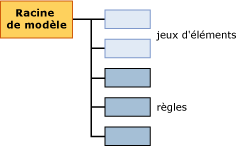

# Contenu du mod&#232;le d&#39;exploration de donn&#233;es pour les mod&#232;les d&#39;association (Analysis Services - Exploration de donn&#233;es)
  Cette rubrique décrit le contenu du modèle d’exploration qui est spécifique aux modèles utilisant l’algorithme MAR ([!INCLUDE[msCoName](../../includes/msconame-md.md)] Association Rules). Pour une explication de la terminologie générale et statistique en rapport avec le contenu du modèle d’exploration de données pour tous les types de modèles, consultez [Contenu du modèle d’exploration &#40;Analysis Services – Exploration des données&#41;](../../analysis-services/data-mining/mining-model-content-analysis-services-data-mining.md).  
  
## Fonctionnement de la structure d'un modèle d'association  
 La structure d'un modèle d'association est simple. Chaque modèle possède un nœud parent unique qui représente le modèle et ses métadonnées, et chaque nœud parent possède une liste plate de jeux d'éléments et de règles. Les jeux d'éléments et les règles ne sont pas organisés dans des arbres. Comme le montre le diagramme suivant, les jeux d'éléments précèdent les règles.  
  
   
  
 Chaque jeu d'éléments est contenu dans son propre nœud (NODE_TYPE = 7). Le *nœud* : inclut la définition du jeu d’éléments, le nombre de cas contenant ce jeu d’éléments, ainsi que d’autres informations.  
  
 Chaque règle est également contenue dans son propre nœud (NODE_TYPE = 8). Une *règle* : décrit une séquence générale indiquant comment les éléments sont associés. Une règle s'apparente à une instruction IF-THEN. La partie gauche de la règle indique une condition existante ou un jeu de conditions. Quant à la partie droite de la règle, elle indique l'élément de votre jeu de données qui est généralement associé aux conditions de la partie gauche.  
  
 **Remarque :** Si vous voulez extraire les règles ou les jeux d’éléments, vous pouvez utiliser une requête pour retourner uniquement les types de nœuds souhaités. Pour plus d’informations, consultez [Exemples de requête de modèle d’association](../../analysis-services/data-mining/association-model-query-examples.md).  
  
## Contenu du modèle pour un modèle d'association  
 Cette section fournit des informations et des exemples pour les colonnes du contenu du modèle d'exploration de données qui s'appliquent aux modèles d'association.  
  
 Pour plus d’informations sur les colonnes à caractère général dans l’ensemble de lignes du schéma, comme MODEL_CATALOG et MODEL_NAME, consultez [Contenu du modèle d’exploration de données &#40;Analysis Services – Exploration de données&#41;](../../analysis-services/data-mining/mining-model-content-analysis-services-data-mining.md).  
  
 MODEL_CATALOG  
 Nom de la base de données où le modèle est stocké.  
  
 MODEL_NAME  
 Nom du modèle.  
  
 ATTRIBUTE_NAME  
 Noms des attributs qui correspondent à ce nœud.  
  
 NODE_NAME  
 Nom du nœud. Pour un modèle d'association, cette colonne contient la même valeur que NODE_UNIQUE_NAME.  
  
 NODE_UNIQUE_NAME  
 Nom unique du nœud.  
  
 NODE_TYPE  
 Un modèle d'association génère uniquement en sortie les types de nœuds suivants :  
  
|ID du type de nœud|Type|  
|------------------|----------|  
|1 (Modèle)|Nœud racine ou parent.|  
|7 (Jeu d'éléments)|Jeu d'éléments ou collection de paires attribut/valeur. Exemples :   `Product 1 = Existing, Product 2 = Existing`   ou   `Gender = Male`.|  
|8 (Règle)|Règle définissant la façon dont les éléments sont liés les uns aux autres.   Exemple :   `Product 1 = Existing, Product 2 = Existing -> Product 3 = Existing`.|  
  
 NODE_CAPTION  
 Étiquette ou légende associée au nœud.  
  
 **Nœud de jeu d’éléments** : liste d’éléments séparés par des virgules.  
  
 **Nœud de règle** : contient les parties gauche et droite de la règle.  
  
 CHILDREN_CARDINALITY  
 Indique le nombre d'enfants du nœud actuel.  
  
 **Nœud parent** : indique le nombre total de jeux d’éléments et de règles.  
  
> [!NOTE]  
>  Pour obtenir la répartition du nombre de jeux d'éléments et de règles, consultez NODE_DESCRIPTION pour le nœud racine du modèle.  
  
 **Nœud de jeu d’éléments ou de règle** : toujours 0.  
  
 PARENT_UNIQUE_NAME  
 Nom unique du parent du nœud.  
  
 **Nœud parent** : toujours NULL.  
  
 **Nœud de jeu d’éléments ou de règle** : toujours 0.  
  
 NODE_DESCRIPTION  
 Description conviviale du contenu du nœud.  
  
 **Nœud parent** : inclut une liste des informations suivantes à propos du modèle, séparées par des virgules :  
  
|Élément|Description|  
|----------|-----------------|  
|ITEMSET_COUNT|Nombre de jeux d'éléments dans le modèle.|  
|RULE_COUNT|Nombre de règles dans le modèle.|  
|MIN_SUPPORT|Prise en charge minimale trouvée pour un jeu d'éléments unique.   **Remarque** : Cette valeur peut différer de celle à laquelle vous avez défini le paramètre *MINIMUM _SUPPORT*.|  
|MAX_SUPPORT|Prise en charge maximale trouvée pour un jeu d'éléments unique.   **Remarque** : Cette valeur peut différer de celle à laquelle vous avez défini le paramètre *MAXIMUM_SUPPORT*.|  
|MIN_ITEMSET_SIZE|Taille du plus petit jeu d'éléments, représentée par un nombre d'éléments.   La valeur 0 indique que l’état **Manquant** a été traité en tant qu’élément indépendant.   **Remarque** : La valeur par défaut du paramètre *MINIMUM_ITEMSET_SIZE* est 1.|  
|MAX_ITEMSET_SIZE|Indique la taille du plus grand jeu d'éléments trouvé.   **Remarque** : Cette valeur est conditionnée par la valeur que vous avez attribuée au paramètre *MAX_ITEMSET_SIZE* quand vous avez créé le modèle. Cette valeur ne peut jamais dépasser cette valeur ; toutefois, elle peut être inférieure à celle-ci. La valeur par défaut est 3.|  
|MIN_PROBABILITY|Probabilité minimale détectée pour un jeu d'éléments ou une règle unique dans le modèle.   Exemple : 0.400390625   **Remarque** : Pour les jeux d’éléments, cette valeur est toujours supérieure à celle que vous avez attribuée au paramètre *MINIMUM_PROBABILITY* lors de la création du modèle.|  
|MAX_PROBABILITY|Probabilité maximale détectée pour un jeu d'éléments ou une règle unique dans le modèle.   Exemple : 1   **Remarque** : Il n’existe pas de paramètre pour conditionner la probabilité maximale des jeux d’éléments. Si vous voulez éliminer des éléments qui sont trop fréquents, utilisez à la place le paramètre *MAXIMUM_SUPPORT*.|  
|MIN_LIFT|Quantité minimale de finesse fournie par le modèle pour un jeu d'éléments.   Exemple : 0,14309369632511   Remarque : le fait de connaître la finesse minimale peut vous aider à déterminer si la finesse est significative pour un jeu d’éléments.|  
|MAX_LIFT|Quantité maximale de finesse fournie par le modèle pour un jeu d'éléments.   Exemple: 1,95758227647523 **Remarque** : Le fait de connaître la finesse maximale peut vous aider à déterminer si la finesse est significative pour un jeu d’éléments.|  
  
 **Nœud de jeu d’éléments** : les nœuds de jeu d’éléments contiennent une liste des éléments qui est affichée sous forme d’une chaîne de texte avec une virgule comme séparateur.  
  
 Exemple :  
  
 `Touring Tire = Existing, Water Bottle = Existing`  
  
 Cela signifie que les pneus pour vélo de tourisme et les bidons d'eau ont été achetés ensemble.  
  
 **Nœud de règle** : les nœuds de règle contiennent une partie gauche et une partie droite de la règle, séparées par une flèche.  
  
 Exemple : `Touring Tire = Existing, Water Bottle = Existing -> Cycling cap = Existing`  
  
 Cela signifie que si quelqu'un a acheté un pneu pour vélo de tourisme et un bidon d'eau, il était aussi susceptible d'acheter une casquette de cyclisme.  
  
 NODE_RULE  
 Fragment XML qui décrit la règle ou le jeu d'éléments incorporé dans le nœud.  
  
 **Nœud parent** : vide.  
  
 **Nœud de jeu d’éléments** : vide.  
  
 **Nœud de règle** : le fragment XML inclut d’autres informations utiles sur la règle, comme la prise en charge, la confiance et le nombre d’éléments, ainsi que l’ID du nœud qui représente la partie gauche de la règle.  
  
 MARGINAL_RULE  
 Vide.  
  
 NODE_PROBABILITY  
 Une probabilité ou un score de confiance associé au jeu d'éléments ou à la règle.  
  
 **Nœud parent** : toujours 0.  
  
 **Nœud de jeu d’éléments** : probabilité du jeu d’éléments.  
  
 **Nœud de règle** : valeur de la confiance pour la règle.  
  
 MARGINAL_PROBABILITY  
 Identique à NODE_PROBABILITY.  
  
 NODE_DISTRIBUTION  
 La table contient des informations très différentes, selon que le nœud est un jeu d'éléments ou une règle.  
  
 **Nœud parent** : vide.  
  
 **Nœud de jeu d’éléments** : répertorie chaque élément dans le jeu d’éléments avec une probabilité et une valeur de prise en charge. Par exemple, si le jeu d'éléments contient deux produits, le nom de chaque produit est répertorié avec le nombre des cas qui incluent chaque produit.  
  
 **Nœud de règle** : contient deux lignes. La première ligne montre l'attribut de la partie droite de la règle, c'est-à-dire l'élément prédit, avec un score de confiance.  
  
 La deuxième ligne est unique aux modèles d'association ; elle contient un pointeur vers le jeu d'éléments dans la partie droite de la règle. Le pointeur est représenté dans la colonne ATTRIBUTE_VALUE comme l'ID du jeu d'éléments qui contient uniquement l'élément de la partie droite.  
  
 Par exemple, si la règle est `If {A,B} Then {C}`, la table contient le nom de l'élément `{C}` et l'ID du nœud qui contient le jeu d'éléments pour l'élément C.  
  
 Ce pointeur est utile car vous pouvez déterminer à partir du nœud de jeu d'éléments combien de cas en tout incluent le produit de la partie droite. Les cas soumis à la règle `If {A,B} Then {C}` sont un sous-ensemble des cas répertoriés dans le jeu d'éléments de `{C}`.  
  
 NODE_SUPPORT  
 Nombre de cas qui prennent en charge ce nœud.  
  
 **Nœud parent** : nombre de cas dans le modèle.  
  
 **Nœud de jeu d’éléments** : nombre de cas contenant tous les éléments dans le jeu d’éléments.  
  
 **Nœud de règle** : nombre de cas contenant tous les éléments inclus dans la règle.  
  
 MSOLAP_MODEL_COLUMN  
 Contient des informations différentes selon que le nœud est un jeu d'éléments ou une règle.  
  
 **Nœud parent** : vide.  
  
 **Nœud de jeu d’éléments** : vide.  
  
 **Nœud de règle** : ID du jeu d’éléments contenant les éléments dans la partie gauche de la règle. Par exemple, si la règle est `If {A,B} Then {C}`, cette colonne contient l’ID du jeu d’éléments contenant seulement `{A,B}`.  
  
 MSOLAP_NODE_SCORE  
 **Nœud parent** : vide.  
  
 **Nœud de jeu d’éléments** : score d’importance pour le jeu d’éléments.  
  
 **Nœud de règle** : score d’importance pour la règle.  
  
> [!NOTE]  
>  L'importance est calculée différemment pour les jeux d'éléments et les règles. Pour plus d’informations, consultez [Références techniques relatives à l’algorithme Microsoft Association](../../analysis-services/data-mining/microsoft-association-algorithm-technical-reference.md).  
  
 MSOLAP_NODE_SHORT_CAPTION  
 Vide.  
  
## Voir aussi  
 [Contenu du modèle d’exploration &#40;Analysis Services – Exploration de données&#41;](../../analysis-services/data-mining/mining-model-content-analysis-services-data-mining.md)   
 [Algorithme Microsoft Association](../../analysis-services/data-mining/microsoft-association-algorithm.md)   
 [Exemples de requêtes de modèle d'association](../../analysis-services/data-mining/association-model-query-examples.md)  
  
  