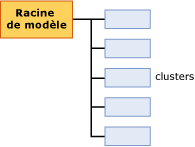

# Contenu du modèle d'exploration de données pour les modèles de clustering (Analysis Services - Exploration de données)
[!INCLUDE[ssas-appliesto-sqlas](../../includes/ssas-appliesto-sqlas.md)]
  Cette rubrique décrit le contenu du modèle d'exploration de données qui est spécifique aux modèles qui utilisent l'algorithme de gestion de clusters Microsoft. Pour obtenir une explication générale du contenu du modèle d’exploration de données pour tous les types de modèles, consultez [Contenu du modèle d’exploration &#40;Analysis Services – Exploration de données&#41;](../../analysis-services/data-mining/mining-model-content-analysis-services-data-mining.md).  
  
## Présentation de la structure d'un modèle de clustering  
 Un modèle de clustering a une structure simple. Chaque modèle a un nœud parent unique qui représente le modèle et ses métadonnées, et chaque nœud parent possède une liste plate de clusters (NODE_TYPE = 5). Cette organisation est illustrée dans l'image suivante.  
  
   
  
 Chaque nœud enfant représente un cluster unique et contient des statistiques détaillées sur les attributs des cas dans ce cluster, notamment le nombre de cas dans le cluster et la distribution des valeurs qui distinguent le cluster d'autres clusters.  
  
> [!NOTE]  
>  Il est inutile de parcourir les nœuds pour obtenir le nombre ou une description des clusters ; le nœud parent du modèle compte et répertorie aussi les clusters.  
  
 Le nœud parent contient des statistiques utiles qui décrivent la distribution réelle de tous les cas d'apprentissage. Ces statistiques se trouvent dans la colonne de table imbriquée NODE_DISTRIBUTION. Par exemple, la table suivante contient plusieurs lignes de la table NODE_DISTRIBUTION qui décrivent la distribution des données démographiques pour le modèle de clustering, `TM_Clustering`, que vous créez dans le [Didacticiel sur l’exploration de données de base](http://msdn.microsoft.com/library/6602edb6-d160-43fb-83c8-9df5dddfeb9c):  
  
|ATTRIBUTE_NAME|ATTRIBUTE_VALUE|Support|PROBABILITY|VARIANCE|VALUE_TYPE|  
|---------------------|---------------------|-------------|-----------------|--------------|-----------------|  
|Age|Manquant|0|0|0|1 (Manquante)|  
|Age|44.9016152716593|12939|1|125.663453102554|3 (Continue)|  
|Gender|Manquant|0|0|0|1 (Manquante)|  
|Gender|F|6350|0.490764355823479|0|4 (Discrète)|  
|Gender|M|6589|0.509235644176521|0|4 (Discrète)|  
  
 D'après ces résultats, vous pouvez voir que 12939 cas ont été utilisés pour générer le modèle, que le rapport entre les hommes et les femmes est d'environ 50/50 et que l'âge moyen est 44 ans. Les statistiques descriptives varient selon que le type de l'attribut signalé est un type de données numériques continues, tel que l'âge, ou un type de valeur discrète, tel que le sexe. Les mesures statistiques *moyenne* et *variance* sont calculées pour les types de données continues, tandis que *probabilité* et *prise en charge* sont calculées pour les types de données discrètes.  
  
> [!NOTE]  
>  La variance représente la variance totale pour le cluster. Lorsque la valeur de la variance est faible, cela signifie que la plupart des valeurs dans la colonne sont assez proches de la moyenne. Pour obtenir l'écart type, calculez la racine carrée de la variance.  
  
 Notez que pour chacun des attributs, il existe un type de valeur **Manquant** qui vous indique combien de cas n’ont pas de données pour cet attribut. Les données manquantes peuvent être importantes et affecter les calculs de différentes manières en fonction du type de données. Pour plus d’informations, consultez [Valeurs manquantes &#40;Analysis Services – Exploration de données&#41;](../../analysis-services/data-mining/missing-values-analysis-services-data-mining.md).  
  
## Contenu du modèle pour un modèle de clustering  
 Cette section fournit des informations et des exemples pour les colonnes du contenu du modèle d'exploration de données qui s'appliquent aux modèles de clustering.  
  
 Pour plus d’informations sur les colonnes à caractère général dans l’ensemble de lignes du schéma, comme MODEL_CATALOG et MODEL_NAME, consultez [Mining Model Content &#40;Analysis Services - Data Mining&#41;](../../analysis-services/data-mining/mining-model-content-analysis-services-data-mining.md).  
  
 MODEL_CATALOG  
 Nom de la base de données où le modèle est stocké.  
  
 MODEL_NAME  
 Nom du modèle.  
  
 ATTRIBUTE_NAME  
 Toujours vide dans les modèles de clustering car il n’existe aucun attribut prédictible dans le mode.  
  
 NODE_NAME  
 Toujours identique à NODE_UNIQUE_NAME.  
  
 NODE_UNIQUE_NAME  
 Identificateur unique pour le nœud dans le modèle. Cette valeur ne peut pas être modifiée.  
  
 NODE_TYPE  
 Un modèle de clustering génère en sortie les types de nœuds suivants :  
  
|ID et nom du nœud| Description|  
|----------------------|-----------------|  
|1 (Modèle)|Nœud racine pour le modèle.|  
|5 (cluster)|Contient le nombre de cas dans le cluster, les caractéristiques des cas dans le cluster et des statistiques qui décrivent les valeurs dans le cluster.|  
  
 NODE_CAPTION  
 Nom convivial utilisé à des fins d'affichage. Lorsque vous créez un modèle, la valeur de NODE_UNIQUE_NAME est utilisée automatiquement comme légende. Toutefois, vous pouvez modifier la valeur de NODE_CAPTION pour mettre à jour le nom d'affichage du cluster, par programmation ou à l'aide la visionneuse.  
  
> [!NOTE]  
>  Lorsque vous retraitez le modèle, toutes les modifications de nom sont remplacées par les nouvelles valeurs. Vous ne pouvez pas rendre des noms persistants dans le modèle, ni faire le suivi des modifications dans l'appartenance au cluster entre différentes versions d'un modèle.  
  
 CHILDREN_CARDINALITY  
 Estimation du nombre d'enfants du nœud.  
  
 **Nœud parent** : indique le nombre de clusters dans le modèle.  
  
 **Nœuds terminaux** : toujours 0.  
  
 PARENT_UNIQUE_NAME  
 Nom unique du parent du nœud.  
  
 **Nœud parent** : toujours NULL.  
  
 **Nœuds du cluster** : généralement 000.  
  
 NODE_DESCRIPTION  
 Description du nœud.  
  
 **Nœud parent** : toujours **Tout**.  
  
 **Nœuds du cluster** : liste séparée par des virgules des attributs principaux qui distinguent le cluster des autres clusters.  
  
 NODE_RULE  
 Non utilisé pour les modèles de clustering.  
  
 MARGINAL_RULE  
 Non utilisé pour les modèles de clustering.  
  
 NODE_PROBABILITY  
 Probabilité associée à ce nœud. **Nœud parent** : toujours 1.  
  
 **Nœuds du cluster** : la probabilité représente la probabilité composée des attributs, avec certains ajustements selon l’algorithme utilisé pour créer le modèle de clustering.  
  
 MARGINAL_PROBABILITY  
 Probabilité d'accès au nœud à partir du nœud parent. Dans un modèle de clustering, la probabilité marginale est toujours la même que la probabilité du nœud.  
  
 NODE_DISTRIBUTION  
 Table qui contient l'histogramme de probabilité du nœud.  
  
 **Nœud parent** : consultez l’introduction de cette rubrique.  
  
 **Nœuds du cluster** : représente la distribution des attributs et des valeurs pour les cas inclus dans ce cluster.  
  
 NODE_SUPPORT  
 Nombre de cas qui prennent en charge ce nœud. **Nœud parent** : indique le nombre de cas d’apprentissage pour tout le modèle.  
  
 **Nœuds du cluster** : indique la taille du cluster sous la forme d’un nombre de cas.  
  
 **Remarque** : Si le modèle utilise le clustering K-Means, chaque cas ne peut appartenir qu’à un seul cluster. Toutefois, si le modèle utilise le clustering EM, chaque cas peut appartenir à un cluster différent, et une distance pondérée est attribuée au cas pour chaque cluster auquel il appartient. Par conséquent, pour les modèles EM, la somme de la prise en charge pour un cluster individuel est supérieure à la prise en charge pour le modèle global.  
  
 MSOLAP_MODEL_COLUMN  
 Non utilisé pour les modèles de clustering.  
  
 MSOLAP_NODE_SCORE  
 Affiche un score associé au nœud.  
  
 **Nœud parent** : score BIC (Bayesian Information Criterion) du modèle de clustering.  
  
 **Nœuds terminaux** : toujours 0.  
  
 MSOLAP_NODE_SHORT_CAPTION  
 Étiquette utilisée à des fins d'affichage. Vous ne pouvez pas modifier cette légende.  
  
 **Nœud parent** : type de modèle : modèle de cluster.  
  
 **Nœuds du cluster** : nom du cluster. Par exemple : Cluster 1.  
  
## Notes  
 [!INCLUDE[ssASnoversion](../../includes/ssasnoversion-md.md)] fournit plusieurs méthodes pour créer un modèle de clustering. Si vous ne savez pas quelle méthode a été utilisée pour créer le modèle avec lequel vous travaillez, vous pouvez récupérer les métadonnées du modèle par programmation en utilisant un client ADOMD ou un objet AMO, ou encore en interrogeant l'ensemble de lignes de schéma d'exploration de données. Pour plus d’informations, consultez [Interroger les paramètres utilisés pour créer un modèle d’exploration de données](../../analysis-services/data-mining/query-the-parameters-used-to-create-a-mining-model.md).  
  
> [!NOTE]  
>  La structure et le contenu du modèle restent les même, indépendamment de la méthode de clustering ou des paramètres que vous utilisez.  
  
## Voir aussi  
 [Contenu du modèle d’exploration de données & #40 ; Analysis Services - Exploration de données & #41 ;](../../analysis-services/data-mining/mining-model-content-analysis-services-data-mining.md)   
 [Visionneuses de modèle d’exploration de données](../../analysis-services/data-mining/data-mining-model-viewers.md)   
 [Algorithme Microsoft Clustering](../../analysis-services/data-mining/microsoft-clustering-algorithm.md)   
 [Requêtes d’exploration de données](../../analysis-services/data-mining/data-mining-queries.md)  
  
  
