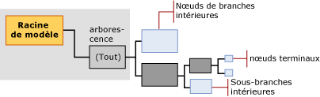

# Mining Model Content for Decision Tree Models (Analysis Services - Data Mining)
[!INCLUDE[ssas-appliesto-sqlas](../../includes/ssas-appliesto-sqlas.md)]
  Cette rubrique décrit le contenu du modèle d'exploration de données spécifique aux modèles utilisant l'algorithme MDT ( [!INCLUDE[msCoName](../../includes/msconame-md.md)] Decision Trees). Pour obtenir une explication générale du contenu du modèle d’exploration de données pour tous les types de modèles, consultez [Contenu du modèle d’exploration &#40;Analysis Services - Exploration de données&#41;](../../analysis-services/data-mining/mining-model-content-analysis-services-data-mining.md). Il est important de se rappeler que l'algorithme MDT (Microsoft Decision Trees) est un algorithme hybride qui peut créer des modèles avec des fonctions très différentes : un arbre de décision peut représenter des associations, des règles ou même une régression linéaire. La structure de l'arbre est essentiellement la même, mais le mode d’interprétation des informations dépendra de l'objectif visé par la création du modèle.  
  
##   Présentation de la structure d'un modèle d’arbre de décision  
 Un modèle d’arbre de décision comprend un nœud parent unique qui représente le modèle et ses métadonnées. Sous le nœud parent se trouvent des arbres indépendants qui représentent les attributs prédictibles sélectionnés. Par exemple, si vous installez votre modèle d'arbre de décision pour prédire si les clients achèteront un produit et pour fournir des entrées correspondant au genre et au revenu, le modèle créera une arborescence unique pour l'attribut d'achat, avec de nombreuses branches en fonction des conditions liées au genre et au revenu.  
  
 Toutefois, si vous ajoutez par la suite un attribut prédictible distinct pour la participation dans un programme de récompense de la clientèle, l'algorithme créera deux arborescences séparées sous le nœud parent. Une arborescence contient l'analyse d’achat, et l’autre l'analyse du programme de récompense de la clientèle.  Si vous utilisez l'algorithme MDT pour créer un modèle d'association, cet algorithme crée une arborescence distincte pour chaque produit prédit, et l'arborescence contient toutes les autres combinaisons de produit qui permettent la sélection de l'attribut cible.  
  
> [!NOTE]  
>  Si votre modèle inclut plusieurs arborescences, vous ne pouvez en consulter qu’une seule à la fois dans la **Visionneuse d'arborescences Microsoft**. Toutefois, toutes les arborescences du même modèle sont affichées en même temps dans la **Visionneuse de l'arborescence de contenu générique** .  
  
   
  
 L'arborescence de chaque attribut prédictible contient des informations qui décrivent la manière dont les colonnes d'entrée choisies affectent le résultat de l'attribut prédictible concerné. Chaque arborescence est menée par un nœud (NODE_TYPE = 9) qui contient l'attribut prédictible, suivi d'une série de nœuds (NODE_TYPE = 10) qui représentent les attributs d'entrée. Un attribut correspond à une colonne de niveau de cas ou aux valeurs des colonnes de table imbriquée, qui représentent généralement les valeurs de la colonne **Key** de la table imbriquée.  
  
 Les nœuds intérieurs et les nœuds terminaux représentent les conditions de fractionnement. Une arborescence peut se fractionner plusieurs fois sur le même attribut. Par exemple, le modèle **TM_DecisionTree** peut se fractionner sur [Yearly Income] et sur [Number of Children], puis se refractionner sur [Yearly Income] plus bas dans l’arborescence.  
  
 L'algorithme MDT (Microsoft Decision Trees) peut également contenir des régressions linéaires dans tout ou partie de l'arborescence. Si l'attribut modélisé est un type de données numériques continues, le modèle peut créer un nœud d’arbre de régression (NODE_TYPE = 25) où la relation entre les attributs peut être modélisée linéairement. Dans ce cas, le nœud contient une formule de régression.  
  
 Toutefois, si l'attribut prédictible a des valeurs discrètes, ou si les valeurs numériques ont été placées dans un compartiment ou discrétisées, le modèle crée toujours un arbre de classification (NODE_TYPE = 2). Un arbre de classification peut avoir plusieurs branches ou nœuds d'arbre intérieurs (NODE_TYPE = 3) pour chaque valeur de l'attribut. Toutefois, le fractionnement n'est pas nécessaire sur chaque valeur de l'attribut.  
  
 L'algorithme MDT (Microsoft Decision Trees) ne permet pas d’avoir des types de données continues en tant qu’entrées ; par conséquent, si les colonnes ont un type de données numériques continues, les valeurs sont discrétisées. L'algorithme effectue sa propre discrétisation à l’endroit du fractionnement pour tous les attributs continus.  
  
> [!NOTE]  
>  [!INCLUDE[ssASnoversion](../../includes/ssasnoversion-md.md)] choisit automatiquement une méthode de création de compartiments des attributs continus ; Toutefois, vous pouvez contrôler comment les valeurs continues dans les entrées en définissant le type de contenu de la colonne de structure d’exploration de données à **Discretized** , puis en définissant le <xref:Microsoft.AnalysisServices.ScalarMiningStructureColumn.DiscretizationBucketCount%2A> ou <xref:Microsoft.AnalysisServices.ScalarMiningStructureColumn.DiscretizationMethod%2A> propriété.  
  
 [Top](#bkmk_Top)  
  
##   Contenu d’un modèle d'arbre de décision  
 Cette section fournit des informations et des exemples liés uniquement aux colonnes du contenu du modèle d'exploration de données se rapportant aux modèles d’arbre de décision. Pour plus d’informations sur les colonnes à caractère général de l’ensemble de lignes de schéma et pour obtenir des explications sur la terminologie relative aux modèles d’exploration de données, consultez [Contenu du modèle d’exploration &#40;Analysis Services - Exploration de données&#41;](../../analysis-services/data-mining/mining-model-content-analysis-services-data-mining.md).  
  
 MODEL_CATALOG  
 Nom de la base de données où le modèle est stocké.  
  
 MODEL_NAME  
 Nom du modèle.  
  
 ATTRIBUTE_NAME  
 Nom de l'attribut qui correspond à ce nœud.  
  
 NODE_NAME  
 Toujours identique à NODE_UNIQUE_NAME.  
  
 NODE_UNIQUE_NAME  
 Identificateur unique pour le nœud dans le modèle. Cette valeur ne peut pas être modifiée.  
  
 Pour les modèles d'arbre de décision, les noms uniques suivent la convention suivante, qui ne s'applique pas à tous les algorithmes :  
  
 Les nœuds enfants d’un nœud donné auront le même préfixe hexadécimal, suivi d’un autre nombre hexadécimal qui représente la séquence du nœud enfant au sein du parent. Vous pouvez utiliser les préfixes pour déduire un chemin d'accès.  
  
 NODE_TYPE  
 Dans les modèles d'arbre de décision, les types de nœud suivants sont créés :  
  
|Type de nœud| Description|  
|---------------|-----------------|  
|1 (Modèle)|Nœud racine pour le modèle.|  
|2 (Arbre)|Nœud parent pour les arbres de classification dans le modèle. Étiqueté **Tout**.|  
|3 (Intérieur)|En-tête de branche intérieure, trouvé au sein d’un arbre de classification ou de régression.|  
|4 (Distribution)|Nœud terminal, trouvé au sein d’un arbre de classification ou de régression.|  
|25 (Arbre de régression)|Nœud parent pour l'arbre de régression dans le modèle. Étiqueté comme **Tout**.|  
  
 NODE_CAPTION  
 Nom convivial utilisé à des fins d'affichage.  
  
 Lorsque vous créez un modèle, la valeur de NODE_UNIQUE_NAME est utilisée automatiquement comme légende. Toutefois, vous pouvez modifier la valeur de NODE_CAPTION pour mettre à jour le nom d'affichage du cluster, par programmation ou à l'aide la visionneuse. La légende est générée automatiquement par le modèle. Le contenu de la légende dépend du type de modèle et du type de nœud.  
  
 Dans un modèle d'arbre de décision, NODE_CAPTION et NODE_DESCRIPTION présentent des informations différentes, selon le niveau dans l'arborescence. Pour plus d’informations et pour voir des exemples, consultez [Légende et description du nœud](#NodeCaption).  
  
 CHILDREN_CARDINALITY  
 Estimation du nombre d'enfants du nœud.  
  
 **Nœud parent** Indique le nombre d’attributs prédictibles qui ont été modélisés. Une arborescence est créée pour chaque attribut prédictible.  
  
 **Nœud d'arbre** Le nœud **Tout** de chaque arborescence indique le nombre de valeurs utilisées pour l'attribut cible.  
  
-   Si l’attribut cible est discret, la valeur est égale au nombre de valeurs distinctes plus 1 pour l’état **Missing** .  
  
-   Si l'attribut prédictible est continu, la valeur indique le nombre de compartiments utilisés pour modéliser l'attribut continu.  
  
 **Nœuds terminaux** Toujours 0.  
  
 PARENT_UNIQUE_NAME  
 Nom unique du parent du nœud. La valeur NULL est retournée pour tous les nœuds situés au niveau de la racine.  
  
 NODE_DESCRIPTION  
 Description du nœud.  
  
 Dans un modèle d'arbre de décision, NODE_CAPTION et NODE_DESCRIPTION présentent des informations différentes, selon le niveau dans l'arborescence.  
  
 Pour plus d’informations et pour voir des exemples, consultez [Légende et description du nœud](#NodeCaption).  
  
 NODE_RULE  
 Description XML de la règle décrivant le chemin d’accès au nœud actuel à partir de son nœud parent immédiat.  
  
 Pour plus d’informations et pour voir des exemples, consultez [Règle du nœud et règle marginale](#NodeRule).  
  
 MARGINAL_RULE  
 Description XML de la règle décrivant le chemin d’accès depuis le nœud parent du modèle vers le nœud actuel.  
  
 Pour plus d’informations, consultez [Règle du nœud et règle marginale](#NodeRule).  
  
 NODE_PROBABILITY  
 Probabilité associée à ce nœud.  
  
 Pour plus d'informations, consultez [Probabilité](#bkmk_NodeDist_Discrete).  
  
 MARGINAL_PROBABILITY  
 Probabilité d'accès au nœud à partir du nœud parent.  
  
 Pour plus d'informations, consultez [Probabilité](#bkmk_NodeDist_Discrete).  
  
 NODE_DISTRIBUTION  
 Table qui contient l'histogramme de probabilité du nœud. Les informations de cette table diffèrent selon que l'attribut prédictible est une variable continue ou discrète.  
  
 **Nœud racine du modèle** Cette table est vide.  
  
 **Nœud (Tout)** Contient un résumé de l’ensemble du modèle.  
  
 **Nœud intérieur** Contient des statistiques de synthèse pour ses nœuds terminaux.  
  
 **Nœud terminal** Contient la prise en charge et la probabilité pour les résultats prédits au vu de toutes les conditions figurant dans le chemin d'accès qui mène au nœud terminal actuel.  
  
 **Nœud de régression** Contient la formule de régression qui représente la relation entre les entrées et l'attribut prédictible.  
  
 Pour plus d'informations, consultez [Distribution du nœud pour les attributs discrets](#bkmk_NodeDist_Discrete) et [Distribution du nœud pour les attributs continus](#bkmk_RegressionNodes).  
  
 NODE_SUPPORT  
 Nombre de cas qui prennent en charge ce nœud.  
  
 MSOLAP_MODEL_COLUMN  
 Indique la colonne qui contient la valeur prévisible.  
  
 MSOLAP_NODE_SCORE  
 Affiche un score associé au nœud. Pour plus d'informations, consultez [Score du nœud](#NodeScore).  
  
 MSOLAP_NODE_SHORT_CAPTION  
 Étiquette utilisée à des fins d'affichage.  
  
## Notes  
 Un modèle d'arbre de décision n'a pas de nœud distinct qui stocke les statistiques pour l’ensemble du modèle, contrairement au nœud de statistiques marginales figurant dans un modèle Naive Bayes ou un modèle de réseau neuronal. En lieu et place, le modèle crée une arborescence séparée pour chaque attribut prédictible, avec un nœud (Tout) en haut de l’arborescence. Les arborescence sont indépendantes les unes des autres. Si votre modèle ne contient qu'un seul attribut prédictible, il n'y a qu'une seule arborescence et de ce fait un seul nœud (Tout).  
  
 Chaque arborescence représentant un attribut de sortie est en outre subdivisée en branches intérieures (NODE_TYPE = 3) qui représentent des fractionnements. Chacune de ces arborescences contient des statistiques sur la distribution de l'attribut cible. De plus, chaque nœud terminal (NODE_TYPE = 4) contient des statistiques qui décrivent les attributs d'entrée et leurs valeurs, ainsi que le nombre de cas prenant en charge chaque paire attribut/valeur. Par conséquent, vous pouvez consulter facilement les probabilités ou la distribution de données sans devoir interroger les données sources, quelle que soit la branche d'un arbre de décision. Chaque niveau de l'arborescence représente forcément la somme de ses nœuds enfants immédiats.  
  
 Consultez [Exemples de requêtes de modèle d’arbre de décision](../../analysis-services/data-mining/decision-trees-model-query-examples.md)pour obtenir des exemples d’extraction de ces statistiques.  
  
 [Top](#bkmk_Top)  
  
## Exemple de structure d’arbre de décision  
 Pour comprendre le mode de fonctionnement d’un arbre de décision, prenons comme exemple un scénario d'acheteur de vélo AdventureWorks. En supposant que l'attribut prédictible est représenté par les achats des clients, l'algorithme d'arbres de décision essaie de trouver une colonne de données, parmi toutes les entrées fournies, qui détecte le plus efficacement les clients qui risquent d'acheter un vélo et ceux pour qui cet achat est improbable. Par exemple, le modèle peut trouver que l’âge est le meilleur indicateur du comportement d'achat. Plus particulièrement que les clients de plus de 30 ans ont de fortes chances d’acheter un vélo, et qu'il est improbable que les autres clients fassent un achat. Dans ce scénario, le modèle crée un *fractionnement* sur l'attribut Age. Cela signifie que l'arborescence se divise en deux branches : une contenant les clients de plus de 30 ans, et l’autre les clients plus jeunes. Les nouvelles branches sont représentées dans la structure du modèle sous la forme de deux nouvelles arborescences intérieures (NODE_TYPE = 3).  
  
 Pour chaque branche, le modèle continue de rechercher des attributs supplémentaires à utiliser pour différencier les clients. S'il s’avère inutile que les données continuent de créer des sous-groupes de clients, le modèle cesse de générer l'arborescence. Le modèle cesse également de générer l'arborescence lorsque le nombre de cas dans le nœud est trop petit pour continuer, indépendamment de la qualité du fractionnement, ou si la valeur est nulle ou manquante. En arrêtant la croissance de l'arborescence de manière anticipée, vous empêchez le modèle d’effectuer l’apprentissage trop près d’un jeu de données particulier.  
  
 Chaque nœud d'arbre intérieur contient des nœuds terminaux qui fournissent les détails des résultats au vu des résultats de classification actuels. Par exemple, vous pouvez avoir un nœud intérieur qui représente Âge >= 30 et Genre = Homme. Le nœud de ce groupe indique combien de clients de cette catégorie ont acheté ou non un produit. Par exemple, la classification peut contenir les fractionnements d'arborescence suivants :  
  
|Arbre intérieur|fractionnement|  
|-------------------|-----------|  
|Âge >= 30|Âge >= 30 et Genre = Homme|  
||Âge >= 30 et Genre = Femme|  
|Âge < 30|Âge < 30 et Genre = Homme|  
||Âge < 30 et Genre = Femme|  
  
 Lorsque vous utilisez un modèle d'arbre de décision à des fins de prédiction, le modèle prend les attributs que vous lui conférez comme arguments et suit le chemin d'accès aux attributs jusqu’en bas de l'arborescence. En règle générale, toutes les prédictions mènent à un nœud terminal, et les nœuds intérieurs sont utilisés uniquement pour la classification.  
  
 Un nœud terminal a toujours un NODE_TYPE de 4 (Distribution) et contient un histogramme indiquant la probabilité de chaque résultat (achat ou non achat) au vu des attributs fournis. Par exemple, si vous demandez une prédiction pour un nouveau client qui est un homme de plus de 60 ans, le modèle recherchera le nœud correspondant (Âge > 30 et Genre = Homme), puis affichera la probabilité pour le résultat spécifié. Ces probabilités sont stockées dans la table [NODE_DISTRIBUTION](#bkmk_NodeDist_Discrete) du nœud.  
  
 Si l'attribut prédictible est un nombre continu, l'algorithme essaie de créer une formule de régression qui modélise la relation entre l'attribut prédictible et les entrées.  
  
 [Top](#bkmk_Top)  
  
###   Légende et description du nœud  
 Dans un modèle d'arbre de décision, la légende et la description du nœud contiennent des informations similaires. Toutefois, la description du nœud est plus complète et contient plus d'informations à mesure que vous vous rapprochez des nœuds terminaux. La légende et la description du nœud sont des chaînes localisées.  
  
|||  
|-|-|  
|**NODE_CAPTION**|Affiche l'attribut qui distingue ce nœud par rapport au nœud parent. La légende du nœud définit un sous-segment de remplissage basé sur la condition de fractionnement. Par exemple, si le fractionnement portait sur [Age] et s’il s’agissait d’un fractionnement tripartite, les légendes des trois nœuds enfants pourraient être [Age] < 40, 40 <= [Age] < 50, [Age] >= 50.|  
|**NODE_DESCRIPTION**|Contient la liste complète des attributs qui distinguent ce nœud des autres, en commençant par le nœud parent du modèle. Par exemple, Nom de produit = Pomme et Couleur = Rouge.|  
  
 [Haut](#bkmk_Top)  
  
###   Règle du nœud et règle marginale  
 Les colonnes NODE_RULE et MARGINAL_RULE contiennent les mêmes informations que les colonnes NODE_CAPTION et NODE_DESCRIPTION, mais représentent les informations sous forme de fragments XML. La règle du nœud est une version XML du chemin d'accès complet, alors que la règle marginale indique le fractionnement le plus récent.  
  
 L'attribut représenté par le fragment XML peut être simple ou complexe. Un attribut simple contient le nom de la colonne du modèle, ainsi que la valeur de l’attribut. Si la colonne du modèle contient une table imbriquée, l'attribut de table imbriquée est représenté sous la forme d’une concaténation du nom de la table, de la valeur de clé et de l'attribut.  
  
> [!NOTE]  
>  [!INCLUDE[ssNoVersion](../../includes/ssnoversion-md.md)][!INCLUDE[ssASnoversion](../../includes/ssasnoversion-md.md)] prend en charge la version 2.0 du PMML standard, ainsi que les extensions permettant l'utilisation de la table imbriquée. Si vos données contiennent des tables imbriquées et si vous générez une version PMML du modèle, tous les éléments du modèle qui incluent les prédicats sont marqués comme extensions.  
  
 [Top](#bkmk_Top)  
  
###   Distribution du nœud pour les attributs discrets  
 Dans un modèle d'arbre de décision, la table NODE_DISTRIBUTION contient des statistiques utiles. Toutefois, le type de statistiques varie selon que l'arborescence prédit un attribut discret ou continu. Cette section explique la signification des statistiques de distribution du nœud pour les attributs discrets.  
  
#### Nom et valeur de l’attribut  
 Dans un arbre de classification, le nom de l’attribut contient toujours le nom de la colonne prédictible. Cette valeur indique la prédiction de l'arborescence. Comme une arborescence unique représente toujours un attribut prédictible unique, cette valeur est répétée dans toute l'arborescence.  
  
 Pour un type de données discrètes, le champ de valeur de l’attribut répertorie les valeurs possibles de la colonne prédictible, plus la valeur **Missing** .  
  
#### Support technique  
 La valeur de prise en charge pour chaque nœud indique le nombre de cas inclus dans ce nœud. Au niveau (Tout), vous devez voir le nombre total de cas utilisés pour l’apprentissage du modèle. Pour chaque fractionnement dans l'arborescence, la valeur de prise en charge correspond au nombre de cas regroupés dans ce nœud de l'arborescence. La somme des cas dans les nœuds terminaux est forcément égale au nombre de cas dans le nœud parent de l'arborescence.  
  
 Pour les nœuds qui représentent des attributs continus, la présence de la valeur NULL dans les données peut mener à des résultats non intuitifs. Par exemple, en présence de m cas, une valeur moyenne sera calculée comme somme(tous les cas)/n, où n est un nombre inférieur à m, et où m-n indique le nombre de cas avec les valeurs manquantes. La prise en charge est également représentée comme n.  
  
#### Probabilité  
 La probabilité associée à chaque nœud indique la probabilité de tout cas figurant dans le jeu de données complet de ce nœud particulier. Les scores de probabilité sont calculés pour toute l'arborescence et pour le fractionnement immédiat.  
  
 Par exemple, la table suivante présente un modèle très simple de 100 cas.  
  
|Arbre intérieur|Cas|Nœud terminal|Cas|Probabilité relative au nœud parent|Probabilité relative au nœud supérieur|  
|-------------------|-----------|---------------|-----------|-----------------------------------------|--------------------------------------|  
|Âge >= 30|60|Âge >= 30 et Genre = Homme|50|50/60 = .83|50/100 = .5|  
|||Âge >= 30 et Genre = Femme|10|10/60 = .16|10/100 = .10|  
|Âge < 30|40|Âge < 30 et Genre = Homme|30|30/40 = .75|30/100 = .30|  
|||Âge < 30 et Genre = Femme|10|10/40 = .25|10/100 = .10|  
  
 Un petit ajustement est effectué dans tous les modèles afin de compenser pour les valeurs manquantes éventuelles. Pour les attributs continus, chaque valeur ou plage de valeurs est représentée comme un état (par exemple, âge \<30, âge = 30 et l’âge > 30) et les probabilités sont calculées comme suit : état existe (valeur = 1), un autre état existe (valeur = 0), l’état est **manquant**. Pour plus d’informations sur l’ajustement des probabilités afin de représenter les valeurs manquantes, consultez [Valeurs manquantes &#40;Analysis Services - Exploration de données&#41;](../../analysis-services/data-mining/missing-values-analysis-services-data-mining.md).  
  
 Les probabilités pour chaque nœud sont calculées presque directement à partir de la distribution, comme suit :  
  
 Probabilité = (prise en charge pour l'état + prise en charge pour l’état antérieur) / (prise en charge du nœud plus prise en charge du nœud antérieur)  
  
 [!INCLUDE[ssASnoversion](../../includes/ssasnoversion-md.md)] utilise les probabilités de chaque nœud pour comparer la probabilité stockée avec la probabilité antérieure afin de déterminer si le chemin d'accès du nœud parent au nœud enfant indique une inférence forte.  
  
 Lors de l’élaboration de prédictions, la probabilité de la distribution doit être équilibrée avec la probabilité du nœud pour lisser les probabilités. Par exemple, si un fractionnement dans l'arborescence sépare des cas par un quotient de 9000/1000, l'arborescence est très déséquilibrée. Par conséquent, une prédiction issue de la petite branche ne doit pas avoir le même poids qu'une prédiction provenant d'une branche comportant de nombreux cas.  
  
#### Variance  
 L’écart est une mesure du mode de dispersion des valeurs dans un exemple, au vu d’une distribution attendue. Pour les valeurs discrètes, l’écart est de 0 par définition.  
  
 Pour plus d’informations sur le calcul de l’écart pour les valeurs continues, consultez [Contenu du modèle d’exploration de données pour les modèles de régression linéaire &#40;Analysis Services - Exploration de données&#41;](../../analysis-services/data-mining/mining-model-content-for-linear-regression-models-analysis-services-data-mining.md).  
  
#### Type de valeur  
 La colonne de type de valeur fournit des informations sur la signification de la valeur numérique indiquée dans les autres colonnes de la table NODE_DISTRIBUTION. Vous pouvez utiliser le type de valeur dans les requêtes pour extraire des lignes spécifiques dans les tables imbriquées. Pour obtenir des exemples, consultez [Exemples de requêtes de modèle d’arbre de décision](../../analysis-services/data-mining/decision-trees-model-query-examples.md).  
  
 Parmi les types de l’énumération <xref:Microsoft.AnalysisServices.AdomdClient.MiningValueType> , les types suivants sont utilisés dans les arbres de classification.  
  
|Type de valeur| Description|  
|----------------|-----------------|  
|1 (Manquante)|Indique un nombre, une probabilité ou d’autres statistiques en rapport avec les valeurs manquantes.|  
|4 (Discrète)|Indique un nombre, une probabilité ou d’autres statistiques en rapport avec une valeur discrète ou discrétisée.|  
  
 Si le modèle inclut un attribut prédictible continu, l'arborescence peut également contenir des types de valeur uniques pour les formules de régression. Pour obtenir la liste des types de valeur utilisés dans les arbres de régression, consultez [Contenu du modèle d’exploration de données pour les modèles de régression linéaire &#40;Analysis Services - Exploration de données&#41;](../../analysis-services/data-mining/mining-model-content-for-linear-regression-models-analysis-services-data-mining.md).  
  
###   Score du nœud  
 Le score du nœud représente des informations légèrement différentes à chaque niveau de l'arbre. En règle générale, le score est une valeur numérique qui indique la qualité du fractionnement résultant de la division de la condition. La valeur est représentée comme un double, où plus la valeur est élevée, meilleur est le résultat.  
  
 Par définition, le nœud du modèle et tous les nœuds terminaux ont un score de nœud de 0.  
  
 Pour le nœud (Tout) qui représente le haut de chaque arborescence, la colonne MSOLAP_NODE_SCORE contient le meilleur score de fractionnement dans toute l'arborescence.  
  
 Pour tous les autres nœuds de l'arborescence (excepté les nœuds terminaux), le score de chaque nœud représente le meilleur score de fractionnement du nœud actuel, moins le score de fractionnement du nœud parent. En règle générale, le score de fractionnement d’un nœud parent doit toujours être meilleur que celui de ses nœuds enfants. Cela est dû au fait qu'un modèle d'arbre de décision se fractionne normalement en premier sur les attributs les plus importants.  
  
 Il existe de nombreuses façons de calculer un score pour un fractionnement, selon le paramètre d'algorithme choisi. La manière dont les scores sont calculés pour chacune des méthodes de calcul de score dépasse le cadre de cette rubrique. Pour plus d'informations, consultez «[Learning Bayesian Networks: The Combination of Knowledge and Statistical Data](http://research.microsoft.com/en-us/um/people/heckerman/hgc94uai.pdf)» (en anglais) sur le site Web [!INCLUDE[msCoName](../../includes/msconame-md.md)] Research.  
  
> [!NOTE]  
>  Si vous créez un modèle d'arbre de décision ayant des attributs prédictibles continus et discrets, vous verrez des scores complètement différents dans les nœuds (Tout) qui représentent chaque type d'arborescence. Chaque modèle doit être considéré indépendamment, et les méthodes utilisées pour calculer le score de la régression sont complètement différentes de celles utilisées pour calculer le score de la classification. Les valeurs de score de nœud ne peuvent pas être comparées.  
  
 [Top](#bkmk_Top)  
  
##   Nœuds de régression dans un modèle d'arbre de décision  
 Si un modèle d'arbre de décision contient un attribut prédictible avec des données numériques continues, l'algorithme MDT (Microsoft Decision Trees) s'efforce de trouver des zones dans les données où la relation entre l'état prédit et les variables d'entrée est linéaire. Si l'algorithme parvient à trouver une relation linéaire, il crée une arborescence spéciale (NODE_TYPE = 25) qui représente une régression linéaire. Ces nœuds d’arbre de régression sont plus complexes que les nœuds qui représentent des valeurs discrètes.  
  
 En règle générale, une régression mappe les modifications dans la variable prévisible dépendante continue comme fonction des modifications dans les entrées. Si la variable dépendante possède des entrées continues et si la relation entre l'entrée et la valeur prédite est suffisamment stable pour être calculée sous forme de graphique, le nœud de la régression contient une formule.  
  
 Toutefois, si la relation entre l'entrée et la valeur prédite est *non linéaire*, un fractionnement est créé à la place, tout comme un arbre de décision standard. Par exemple, supposez qu'A est l'attribut prédictible, et B et C sont les entrées, où C est un type de valeur continue. Si la relation entre A et C est relativement stable dans certaines parties des données mais instable dans d’autres, l'algorithme créera des fractionnements pour représenter les différentes zones des données.  
  
|Condition de fractionnement|Résultat dans le nœud|  
|---------------------|--------------------|  
|si n < 5|La relation peut être exprimée comme équation 1|  
|si n est compris entre 5 et 10|Aucune équation|  
|si n > 10|La relation peut être exprimée comme équation 2|  
  
 Pour plus d’informations sur les nœuds de régression, consultez [Contenu du modèle d’exploration de données pour les modèles de régression linéaire &#40;Analysis Services - Exploration de données&#41;](../../analysis-services/data-mining/mining-model-content-for-linear-regression-models-analysis-services-data-mining.md).  
  
## Voir aussi  
 [Contenu du modèle d’exploration de données & #40 ; Analysis Services - Exploration de données & #41 ;](../../analysis-services/data-mining/mining-model-content-analysis-services-data-mining.md)   
 [Visionneuses de modèle d’exploration de données](../../analysis-services/data-mining/data-mining-model-viewers.md)   
 [Requêtes d’exploration de données](../../analysis-services/data-mining/data-mining-queries.md)   
 [Algorithme MDT (Microsoft Decision Trees)](../../analysis-services/data-mining/microsoft-decision-trees-algorithm.md)  
  
  
