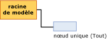

# Contenu du modèle d'exploration de données pour les modèles de régression linéaire (Analysis Services - Exploration de données)
[!INCLUDE[ssas-appliesto-sqlas](../../includes/ssas-appliesto-sqlas.md)]
  Cette rubrique décrit le contenu du modèle d'exploration de données spécifique aux modèles qui utilisent l'algorithme MLR ( [!INCLUDE[msCoName](../../includes/msconame-md.md)] Linear Regression). Pour obtenir une explication générale du contenu du modèle d’exploration de données pour tous les types de modèles, consultez [Contenu du modèle d’exploration &#40;Analysis Services – Exploration de données&#41;](../../analysis-services/data-mining/mining-model-content-analysis-services-data-mining.md).  
  
## Présentation de la structure d'un modèle de régression linéaire  
 Un modèle de régression linéaire a une structure extrêmement simple. Chaque modèle possède un nœud parent unique qui représente le modèle et ses métadonnées, ainsi qu'un nœud d'arbre de régression (NODE_TYPE = 25) contenant la formule de régression pour chaque attribut prédictible.  
  
   
  
 Les modèles de régression linéaire font appel au même algorithme que l’algorithme MDT ( [!INCLUDE[msCoName](../../includes/msconame-md.md)] Decision Trees), mais différents paramètres sont utilisés pour limiter l’arborescence, et seuls les attributs continus sont acceptés comme entrées. Toutefois, comme les modèles de régression linéaire se basent sur l’algorithme MDT ( [!INCLUDE[msCoName](../../includes/msconame-md.md)] Decision Trees), ceux-ci sont affichés à l’aide de la Visionneuse d’arbre de décision [!INCLUDE[msCoName](../../includes/msconame-md.md)] . Pour plus d’informations, consultez [Explorer un modèle à l’aide de la visionneuse d’arborescences Microsoft](../../analysis-services/data-mining/browse-a-model-using-the-microsoft-tree-viewer.md).  
  
 La section suivante explique comment interpréter les informations du nœud de la formule de régression. Ces informations s'appliquent non seulement aux modèles de régression linéaire, mais également aux modèles d'arbre de décision qui contiennent des régressions dans une partie de l'arborescence.  
  
## Contenu d’un modèle de régression linéaire  
 Cette section fournit des informations et des exemples ayant trait uniquement aux colonnes du contenu du modèle d'exploration de données se rapportant à la régression linéaire.  
  
 Pour plus d’informations sur les colonnes à caractère général dans l’ensemble de lignes du schéma, consultez [Contenu du modèle d’exploration &#40;Analysis Services - Exploration de données&#41;](../../analysis-services/data-mining/mining-model-content-analysis-services-data-mining.md).  
  
 MODEL_CATALOG  
 Nom de la base de données où le modèle est stocké.  
  
 MODEL_NAME  
 Nom du modèle.  
  
 ATTRIBUTE_NAME  
 **Nœud racine :** Vide  
  
 **Nœud de régression :** Nom de l’attribut prédictible.  
  
 NODE_NAME  
 Toujours identique à NODE_UNIQUE_NAME.  
  
 NODE_UNIQUE_NAME  
 Identificateur unique pour le nœud dans le modèle. Cette valeur ne peut pas être modifiée.  
  
 NODE_TYPE  
 Un modèle de régression linéaire génère les types de nœuds suivants :  
  
|ID du type de nœud|Type| Description|  
|------------------|----------|-----------------|  
|25|Racine de l'arbre de régression|Contient la formule qui décrit la relation entre la variable d’entrée et la variable de sortie.|  
  
 NODE_CAPTION  
 Étiquette ou légende associée au nœud. Cette propriété est principalement utilisée à des fins d'affichage.  
  
 **Nœud racine :** Vide  
  
 **Nœud de régression :** Tout.  
  
 CHILDREN_CARDINALITY  
 Estimation du nombre d'enfants du nœud.  
  
 **Nœud racine :** Indique le nombre de nœuds de régression. Un nœud de régression est créé pour chaque attribut prédictible du modèle.  
  
 **Nœud de régression :** Toujours 0.  
  
 PARENT_UNIQUE_NAME  
 Nom unique du parent du nœud. La valeur NULL est retournée pour tous les nœuds situés au niveau de la racine.  
  
 NODE_DESCRIPTION  
 Description du nœud.  
  
 **Nœud racine :** Vide  
  
 **Nœud de régression :** Tout.  
  
 NODE_RULE  
 Non utilisé pour les modèles de régression linéaire.  
  
 MARGINAL_RULE  
 Non utilisé pour les modèles de régression linéaire.  
  
 NODE_PROBABILITY  
 Probabilité associée à ce nœud.  
  
 **Nœud racine :** 0  
  
 **Nœud de régression :** 1  
  
 MARGINAL_PROBABILITY  
 Probabilité d'accès au nœud à partir du nœud parent.  
  
 **Nœud racine :** 0  
  
 **Nœud de régression :** 1  
  
 NODE_DISTRIBUTION  
 Table imbriquée fournissant des statistiques sur les valeurs du nœud.  
  
 **Nœud racine :** 0  
  
 **Nœud de régression :** Table contenant les éléments utilisés pour générer la formule de régression. Un nœud de régression contient les types de valeur suivants :  
  
|VALUETYPE|  
|---------------|  
|1 (Manquante)|  
|3 (Continue)|  
|7 (Coefficient)|  
|8 (Gain du score)|  
|9 (Statistiques)|  
|11 (Ordonnée à l'origine)|  
  
 NODE_SUPPORT  
 Nombre de cas qui prennent en charge ce nœud.  
  
 **Nœud racine :** 0  
  
 **Nœud de régression :** Nombre de cas d’apprentissage.  
  
 MSOLAP_MODEL_COLUMN  
 Nom de l'attribut prédictible.  
  
 MSOLAP_NODE_SCORE  
 Identique à NODE_PROBABILITY  
  
 MSOLAP_NODE_SHORT_CAPTION  
 Étiquette utilisée à des fins d'affichage.  
  
## Notes  
 Quand vous créez un modèle avec l’algorithme MLR ( [!INCLUDE[msCoName](../../includes/msconame-md.md)] Linear Regression), le moteur d’exploration de données crée une instance spéciale d’un modèle d’arbre de décision et fournit des paramètres qui limitent l’arborescence pour contenir toutes les données d’apprentissage dans un nœud unique. Toutes les entrées continues sont signalées et évaluées comme régresseurs potentiels, mais seuls les régresseurs qui correspondent aux données sont conservés comme régresseurs dans le modèle final. L'analyse produit soit une formule de régression unique pour chaque régresseur, soit aucune formule de régression.  
  
 Vous pouvez consulter la formule de régression complète dans la **Légende d’exploration de données**en cliquant sur le nœud **(Tout)** dans la [Visionneuse d’arborescences Microsoft](../../analysis-services/data-mining/browse-a-model-using-the-microsoft-tree-viewer.md).  
  
 Ainsi, lorsque vous créez un modèle d'arbre de décision qui inclut un attribut prédictible continu, il arrive que l'arborescence possède des nœuds de régression qui partagent les propriétés des nœuds d'arbres de régression.  
  
##   Distribution du nœud pour les attributs continus  
 La plupart des informations importantes d’un nœud de régression sont contenues dans la table NODE_DISTRIBUTION. L'exemple suivant illustre la structure de la table NODE_DISTRIBUTION. Dans cet exemple, la structure d'exploration de données de publipostage ciblé a été utilisée pour créer un modèle de régression linéaire qui prédit le revenu du client selon son âge. Ce modèle sert uniquement à l’illustration, car il peut être créé facilement à l’aide des exemples de données et de la structure d’exploration de données [!INCLUDE[ssSampleDBnormal](../../includes/sssampledbnormal-md.md)] existants.  
  
|ATTRIBUTE_NAME|ATTRIBUTE_VALUE|SUPPORT|PROBABILITY|VARIANCE|VALUETYPE|  
|---------------------|----------------------|-------------|-----------------|--------------|---------------|  
|Yearly Income|Manquant|0|0.000457142857142857|0|1|  
|Yearly Income|57220.8876687257|17484|0.999542857142857|1041275619.52776|3|  
|Age|471.687717702463|0|0|126.969442359327|7|  
|Age|234.680904692439|0|0|0|8|  
|Age|45.4269617936399|0|0|126.969442359327|9|  
||35793.5477381267|0|0|1012968919.28372|11|  
  
 La table NODE_DISTRIBUTION contient plusieurs lignes, chacune étant groupée par une variable. Les deux premières lignes correspondent toujours aux types de valeur 1 et 3, et elles décrivent l'attribut cible. Les lignes suivantes comportent des informations sur la formule d’un *régresseur*donné. Un régresseur est une variable d'entrée ayant une relation linéaire avec la variable de sortie. Vous pouvez avoir plusieurs régresseurs, et chaque régresseur aura une ligne séparée pour le coefficient (VALUETYPE = 7), le gain du score (VALUETYPE = 8) et les statistiques (VALUETYPE = 9). La table a également une ligne contenant l’interception de l'équation (VALUETYPE = 11).  
  
### Éléments de la formule de régression  
 La table imbriquée NODE_DISTRIBUTION contient chaque élément de la formule de régression dans une ligne distincte. Les deux premières lignes de données dans les résultats d’exemple contiennent des informations sur l’attribut prédictible, **Revenu annuel**, qui modélise la variable dépendante. La colonne SUPPORT affiche le nombre de cas prenant en charge les deux états de cet attribut : soit une valeur **Revenu annuel** était disponible, soit la valeur **Revenu annuel** était manquante.  
  
 La colonne VARIANCE indique l'écart calculé de l'attribut prédictible. *L’écart* est une mesure du mode de dispersion des valeurs dans un exemple au vu d’une distribution attendue. L’écart est calculé en prenant le carré de la déviation standard par rapport à la moyenne. La racine carrée de l’écart est également appelée écart type. [!INCLUDE[ssASnoversion](../../includes/ssasnoversion-md.md)] ne fournit pas l’écart type, mais il peut être calculé facilement.  
  
 Pour chaque régresseur, trois lignes sont générées. Elles contiennent le coefficient, le gain du score et les statistiques de régresseur.  
  
 La table contient également une ligne qui fournit l’interception de l'équation.  
  
#### Coefficient  
 Pour chaque régresseur, un coefficient (VALUETYPE = 7) est calculé. Ce coefficient apparaît dans la colonne ATTRIBUTE_VALUE, alors que la colonne VARIANCE indique l’écart pour le coefficient. Les coefficients sont calculés de manière à optimiser la linéarité.  
  
#### Gain du score  
 Le gain du score (VALUETYPE = 8) pour chaque régresseur représente le score d’intérêt et de pertinence de l’attribut. Vous pouvez utiliser cette valeur pour évaluer l'utilité de plusieurs régresseurs.  
  
#### Statistiques  
 Les statistiques de régresseur (VALUETYPE = 9) correspondent à la moyenne de l'attribut pour les cas ayant une valeur. La colonne ATTRIBUTE_VALUE contient la moyenne, alors que la colonne VARIANCE contient la somme des écarts par rapport à la moyenne.  
  
#### Intercepter  
 Normalement, *l’interception* (VALUETYPE = 11) ou le *résiduel* d’une équation de régression indique la valeur de l’attribut prédictible à l’endroit où l’attribut d’entrée est 0. Dans de nombreux cas, cela ne se produit pas, ce qui peut mener à des résultats non intuitifs.  
  
 Par exemple, il est inutile de connaître le revenu à l’âge 0 dans un modèle qui prédit le revenu selon l’âge. Dans la pratique, il est généralement plus utile de connaître le comportement de la ligne par rapport aux valeurs moyennes. Ainsi, [!INCLUDE[ssNoVersion](../../includes/ssnoversion-md.md)] [!INCLUDE[ssASnoversion](../../includes/ssasnoversion-md.md)] modifie l’interception pour exprimer chaque régresseur dans une relation avec la moyenne.  
  
 Cet ajustement est difficilement visible dans le contenu du modèle d’exploration de données, mais il apparaît si vous affichez l’équation complète dans la **Légende d’exploration de données** de la **Visionneuse d’arborescences Microsoft**. La formule de régression passe du point 0 au point représentant la moyenne. Cela présente une vue qui est plus intuitive en considérant les données actuelles.  
  
 Par conséquent, en supposant que l'âge moyen se situe autour de 45 ans, l'interception (VALUETYPE = 11) pour la formule de régression indique le revenu moyen.  
  
## Voir aussi  
 [Contenu du modèle d’exploration de données & #40 ; Analysis Services - Exploration de données & #41 ;](../../analysis-services/data-mining/mining-model-content-analysis-services-data-mining.md)   
 [Algorithme de régression linéaire Microsoft](../../analysis-services/data-mining/microsoft-linear-regression-algorithm.md)   
 [Référence technique de Microsoft Linear Regression algorithme](../../analysis-services/data-mining/microsoft-linear-regression-algorithm-technical-reference.md)   
 [Exemples de requête de modèle de régression linéaire](../../analysis-services/data-mining/linear-regression-model-query-examples.md)  
  
  
