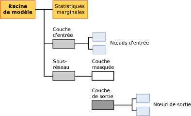

# Mining Model Content for Logistic Regression Models
[!INCLUDE[ssas-appliesto-sqlas](../../includes/ssas-appliesto-sqlas.md)]
  Cette rubrique décrit le contenu du modèle d'exploration de données spécifique aux modèles qui utilisent l'algorithme MLR (Microsoft Logistic Regression). Pour obtenir une explication sur la procédure d’interprétation des statistiques et de la structure partagées par tous les types de modèles et pour obtenir des définitions générales de termes en rapport avec le contenu du modèle d’exploration de données, consultez [Contenu du modèle d’exploration &#40;Analysis Services - Exploration de données&#41;](../../analysis-services/data-mining/mining-model-content-analysis-services-data-mining.md).  
  
## Présentation de la structure d'un modèle de régression logistique  
 Un modèle de régression logistique est créé en utilisant l'algorithme MNN (Microsoft Neural Network) avec les paramètres qui contraignent le modèle à éliminer le nœud masqué. Par conséquent, la structure globale d'un modèle de régression logistique est presque identique à celle d'un réseau neuronal : chaque modèle a un nœud parent unique qui représente le modèle et ses métadonnées, et un nœud de statistiques marginales spécial (NODE_TYPE = 24) qui fournit des statistiques descriptives sur les entrées utilisées dans le modèle.  
  
 En outre, le modèle contient un sous-réseau (NODE_TYPE = 17) pour chaque attribut prédictible. Tout comme dans un modèle de réseau neuronal, chaque sous-réseau comporte toujours deux branches : une pour la couche d'entrée, et une autre branche qui contient la couche masquée (NODE_TYPE = 19) et la couche de sortie (NODE_TYPE = 20) du réseau. Le même sous-réseau peut être utilisé pour plusieurs attributs s’ils sont spécifiés comme prédits uniquement. Les attributs prédictibles qui sont également des entrées ne peuvent pas apparaître dans le même sous-réseau.  
  
 Toutefois, le nœud qui représente la couche masquée est vide dans un modèle de régression logistique, et n'a pas d'enfants. Par conséquent, le modèle contient des nœuds qui représentent des sorties individuelles (NODE_TYPE = 23) et des entrées individuelles (NODE_TYPE = 21), mais aucun nœud masqué individuel.  
  
   
  
 Par défaut, un modèle de régression logistique est affiché dans la **Visionneuse de l'algorithme MNN (Microsoft Neural Network)**. Avec cette visionneuse personnalisée, vous pouvez filtrer les attributs d'entrée et leurs valeurs, et consulter des graphiques qui illustrent comment ils affectent les sorties. Les info-bulles de la visionneuse montrent la probabilité et la finesse associées à chaque paire de valeurs d'entrée et de sortie. Pour plus d’informations, consultez [Explorer un modèle à l’aide de la visionneuse de l’algorithme MNN (Microsoft Neural Network)](../../analysis-services/data-mining/browse-a-model-using-the-microsoft-neural-network-viewer.md).  
  
 Pour explorer la structure des entrées et des sous-réseaux, et pour consulter des statistiques détaillées, vous pouvez utiliser la Visionneuse de l'arborescence de contenu générique Microsoft. Vous pouvez cliquer sur n'importe quel nœud pour le développer et voir les nœuds enfants, ou consulter les poids et autres statistiques contenues dans le nœud.  
  
## Contenu d’un modèle de régression logistique  
 Cette section fournit des informations et des exemples ayant trait uniquement aux colonnes du contenu du modèle d'exploration de données se rapportant à la régression logistique. Le contenu du modèle est presque identique à celui d'un modèle de réseau neuronal, mais les descriptions qui s'appliquent aux modèles de réseau neuronal peuvent être répétées dans cette table pour des questions de commodité.  
  
 Pour plus d’informations sur les colonnes à caractère général de l’ensemble de lignes de schéma, telles que MODEL_CATALOG et MODEL_NAME, non décrites ici, ou pour obtenir des explications sur la terminologie relative aux modèles d’exploration de données, consultez [Contenu du modèle d’exploration &#40;Analysis Services - Exploration de données&#41;](../../analysis-services/data-mining/mining-model-content-analysis-services-data-mining.md).  
  
 MODEL_CATALOG  
 Nom de la base de données où le modèle est stocké.  
  
 MODEL_NAME  
 Nom du modèle.  
  
 ATTRIBUTE_NAME  
 Noms de l’attribut correspondant à ce nœud.  
  
|Nœud|Contenu|  
|----------|-------------|  
|Racine du modèle|Vide|  
|Statistiques marginales|Vide|  
|Couche d'entrée|Vide|  
|Nœud d'entrée|Nom d'attribut d'entrée|  
|hidden layer|Vide|  
|Couche de sortie|Vide|  
|Nœud de sortie|Nom d'attribut de sortie|  
  
 NODE_NAME  
 Nom du nœud. Actuellement, cette colonne contient la même valeur que NODE_UNIQUE_NAME, bien que cela puisse changer dans les versions ultérieures.  
  
 NODE_UNIQUE_NAME  
 Nom unique du nœud.  
  
 Pour plus d'informations sur la façon dont les noms et ID fournissent des informations structurelles à propos du modèle, consultez la section, [Utilisation de noms des nœuds et ID](#bkmk_NodeIDs).  
  
 NODE_TYPE  
 Un modèle de régression logistique génère les types de nœuds suivants :  
  
|ID du type de nœud|Description|  
|------------------|-----------------|  
|1|Modèle.|  
|17|Nœud organisateur pour le sous-réseau.|  
|18|Nœud organisateur pour la couche d'entrée.|  
|19|Nœud organisateur pour la couche masquée. La couche masquée est vide.|  
|20|Nœud organisateur pour la couche de sortie.|  
|21|Nœud d'attribut d'entrée.|  
|23|Nœud d'attribut de sortie.|  
|24|Nœud de statistiques marginales.|  
  
 NODE_CAPTION  
 Étiquette ou légende associée au nœud. Dans les modèles de régression logistique, toujours vide.  
  
 CHILDREN_CARDINALITY  
 Estimation du nombre d'enfants du nœud.  
  
|Nœud|Contenu|  
|----------|-------------|  
|Racine du modèle|Indique le nombre de nœuds enfants, qui inclut au moins un réseau, un nœud marginal requis et une couche d'entrée requise. Par exemple, si la valeur est égale à 5, il y a trois sous-réseaux.|  
|Statistiques marginales|Toujours 0.|  
|Couche d'entrée|Indique le nombre de paires de valeurs d'attribut d'entrée utilisées par le modèle.|  
|Nœud d'entrée|Toujours 0.|  
|hidden layer|Dans un modèle de régression logistique, toujours 0.|  
|Couche de sortie|Indique le nombre de valeurs de sortie.|  
|Nœud de sortie|Toujours 0.|  
  
 PARENT_UNIQUE_NAME  
 Nom unique du parent du nœud. La valeur NULL est retournée pour tous les nœuds situés au niveau de la racine.  
  
 Pour plus d'informations sur la façon dont les noms et ID fournissent des informations structurelles à propos du modèle, consultez la section, [Utilisation de noms des nœuds et ID](#bkmk_NodeIDs).  
  
 NODE_DESCRIPTION  
 Description conviviale du nœud.  
  
|Nœud|Contenu|  
|----------|-------------|  
|Racine du modèle|Vide|  
|Statistiques marginales|Vide|  
|Couche d'entrée|Vide|  
|Nœud d'entrée|Nom d'attribut d'entrée|  
|hidden layer|Vide|  
|Couche de sortie|Vide|  
|Nœud de sortie|Si l'attribut de sortie est continu, contient le nom de l'attribut de sortie.   Si l'attribut de sortie est discret ou discrétisé, contient le nom de l'attribut et la valeur.|  
  
 NODE_RULE  
 Description XML de la règle incorporée dans le nœud.  
  
|Nœud|Contenu|  
|----------|-------------|  
|Racine du modèle|Vide|  
|Statistiques marginales|Vide|  
|Couche d'entrée|Vide|  
|Nœud d'entrée|Fragment XML qui contient les mêmes informations que la colonne NODE_DESCRIPTION.|  
|hidden layer|Vide|  
|Couche de sortie|Vide|  
|Nœud de sortie|Fragment XML qui contient les mêmes informations que la colonne NODE_DESCRIPTION.|  
  
 MARGINAL_RULE  
 Dans les modèles de régression logistique, toujours vide.  
  
 NODE_PROBABILITY  
 Probabilité associée à ce nœud. Dans les modèles de régression logistique, toujours 0.  
  
 MARGINAL_PROBABILITY  
 Probabilité d'accès au nœud à partir du nœud parent. Dans les modèles de régression logistique, toujours 0.  
  
 NODE_DISTRIBUTION  
 Table imbriquée qui contient des informations statistiques pour le nœud. Pour plus d’informations sur le contenu de cette table pour chaque type de nœud, consultez la section Présentation de la table NODE_DISTRIBUTION de [Contenu du modèle d’exploration de données pour les modèles de réseau neuronal &#40;Analysis Services - Exploration de données&#41;](../../analysis-services/data-mining/mining-model-content-for-neural-network-models-analysis-services-data-mining.md).  
  
 NODE_SUPPORT  
 Dans les modèles de régression logistique, toujours 0.  
  
> [!NOTE]  
>  Les probabilités de prise en charge sont toujours égales à 0 parce que la sortie de ce type de modèle n'est pas probabiliste. Seuls les poids sont pertinents pour l'algorithme ; par conséquent, l'algorithme ne calcule pas la probabilité, la prise en charge ou l’écart.  
  
 Pour recevoir des informations sur la prise en charge dans les cas d'apprentissage pour des valeurs spécifiques, consultez le nœud des statistiques marginales.  
  
 MSOLAP_MODEL_COLUMN  
 |Nœud|Contenu|  
|----------|-------------|  
|Racine du modèle|Vide|  
|Statistiques marginales|Vide|  
|Couche d'entrée|Vide|  
|Nœud d'entrée|Nom d'attribut d'entrée.|  
|hidden layer|Vide|  
|Couche de sortie|Vide|  
|Nœud de sortie|Nom d'attribut d'entrée.|  
  
 MSOLAP_NODE_SCORE  
 Dans les modèles de régression logistique, toujours 0.  
  
 MSOLAP_NODE_SHORT_CAPTION  
 Dans les modèles de régression logistique, toujours vide.  
  
##   Utilisation de noms des nœuds et ID  
 La désignation des nœuds dans un modèle de régression logistique fournit des informations supplémentaires à propos des relations entre les nœuds du modèle. La table suivante présente les conventions pour les ID attribués aux nœuds dans chaque couche.  
  
|Type de nœud|Convention pour l'ID du nœud|  
|---------------|----------------------------|  
|Racine du modèle (1)|00000000000000000.|  
|Nœud de statistiques marginales (24)|10000000000000000|  
|Couche d'entrée (18)|30000000000000000|  
|Nœud d'entrée (21)|Démarre à 60000000000000000|  
|Sous-réseau (17)|20000000000000000|  
|Couche masquée (19)|40000000000000000|  
|Couche de sortie (20)|50000000000000000|  
|Nœud de sortie (23)|Démarre à 80000000000000000|  
  
 Vous pouvez utiliser ces ID pour déterminer comment les attributs de sortie sont liés aux attributs spécifiques de la couche d'entrée, en consultant la table NODE_DISTRIBUTION du nœud de sortie. Chaque ligne de cette table contient un ID qui renvoie à un nœud d'attribut d'entrée spécifique. La table NODE_DISTRIBUTION contient également le coefficient correspondant à cette paire entrée/sortie.  
  
## Voir aussi  
 [Algorithme MLR (Microsoft Logistic Regression)](../../analysis-services/data-mining/microsoft-logistic-regression-algorithm.md)   
 [Contenu du modèle d’exploration de données pour les modèles de réseau neuronal & #40 ; Analysis Services - Exploration de données & #41 ;](../../analysis-services/data-mining/mining-model-content-for-neural-network-models-analysis-services-data-mining.md)   
 [Exemples de requêtes de modèle de régression logistique](../../analysis-services/data-mining/logistic-regression-model-query-examples.md)   
 [Référence technique de Microsoft Logistic Regression algorithme](../../analysis-services/data-mining/microsoft-logistic-regression-algorithm-technical-reference.md)  
  
  
