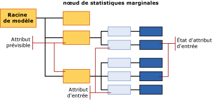

# <a name="mining-model-content-for-naive-bayes-models-analysis-services---data-mining"></a>Contenu du modèle d'exploration de données pour les modèles Naive Bayes (Analysis Services - Exploration de données)
[!INCLUDE[ssas-appliesto-sqlas](../../includes/ssas-appliesto-sqlas.md)]
  Cette rubrique décrit le contenu du modèle d'exploration de données spécifique aux modèles utilisant l'algorithme Naive Bayes [!INCLUDE[msCoName](../../includes/msconame-md.md)] . Pour obtenir une explication sur la procédure d’interprétation des statistiques et de la structure partagées par tous les types de modèles et pour obtenir des définitions générales de termes en rapport avec le contenu du modèle d’exploration de données, consultez [Mining Model Content &#40;Analysis Services - Data Mining&#41;](../../analysis-services/data-mining/mining-model-content-analysis-services-data-mining.md).  
  
## <a name="understanding-the-structure-of-a-naive-bayes-model"></a>Présentation de la structure d'un modèle Naive Bayes  
 Un modèle Naive Bayes possède un nœud parent unique qui représente le modèle et ses métadonnées, et sous ce nœud parent, un nombre donné d’arborescences indépendantes représentant les attributs prédictibles que vous avez sélectionnés. Outre les arborescences des attributs, chaque modèle contient un nœud de statistiques marginales (NODE_TYPE = 26) qui fournit des statistiques descriptives sur le jeu de cas d'apprentissage. Pour plus d’informations, consultez [Informations du nœud de statistiques marginales](#bkmk_margstats).  
  
 Pour chaque attribut et valeur prédictibles, le modèle génère une arborescence contenant des informations qui décrivent comment les différentes colonnes d'entrée ont affecté le résultat de l’élément prédictible concerné. Chaque arborescence contient l'attribut prédictible et sa valeur (NODE_TYPE = 9), puis une série de nœuds qui représentent les attributs d'entrée (NODE_TYPE = 10). Comme les attributs d'entrée ont généralement plusieurs valeurs, chaque attribut d'entrée (NODE_TYPE = 10) peut avoir plusieurs nœuds enfants (NODE_TYPE = 11), chacun correspondant à un état spécifique de l'attribut.  
  
> [!NOTE]  
>  Comme un modèle Naive Bayes n'autorise pas les types de données continues, toutes les valeurs des colonnes d'entrée sont traitées comme discrètes ou discrétisées. Vous pouvez spécifier comment une valeur est discrétisée. Pour plus d’informations, consultez [Modifier la discrétisation d’une colonne dans un modèle d’exploration de données](../../analysis-services/data-mining/change-the-discretization-of-a-column-in-a-mining-model.md).  
  
   
  
## <a name="model-content-for-a-naive-bayes-model"></a>Contenu d’un modèle Naive Bayes  
 Cette section fournit des informations et des exemples liés uniquement aux colonnes du contenu du modèle d'exploration de données se rapportant aux modèles Naive Bayes.  
  
 Pour plus d’informations sur les colonnes à caractère général de l’ensemble de lignes de schéma, telles que MODEL_CATALOG et MODEL_NAME, non décrites ici, ou pour obtenir des explications sur la terminologie relative aux modèles d’exploration de données, consultez [Mining Model Content &#40;Analysis Services - Data Mining&#41;](../../analysis-services/data-mining/mining-model-content-analysis-services-data-mining.md).  
  
 MODEL_CATALOG  
 Nom de la base de données où le modèle est stocké.  
  
 MODEL_NAME  
 Nom du modèle.  
  
 ATTRIBUTE_NAME  
 Noms des attributs qui correspondent à ce nœud.  
  
 **Racine du modèle** Nom de l'attribut prédictible.  
  
 **Statistiques marginales** Non applicable  
  
 **Attribut prédictible** Nom de l'attribut prédictible.  
  
 **Attribut d’entrée** Nom de l’attribut d’entrée.  
  
 **État d’attribut d’entrée** Nom de l’attribut d'entrée uniquement. Pour obtenir l'état, utilisez MSOLAP_NODE_SHORT_CAPTION.  
  
 NODE_NAME  
 Nom du nœud.  
  
 Cette colonne contient la même valeur que NODE_UNIQUE_NAME.  
  
 Pour plus d'informations sur les conventions d'affectation des noms de nœud, consultez [Utilisation de noms de nœud et ID](#bkmk_nodenames).  
  
 NODE_UNIQUE_NAME  
 Nom unique du nœud. Les noms uniques sont affectés selon une convention qui fournit des informations sur les relations entre les nœuds. Pour plus d'informations sur les conventions d'affectation des noms de nœud, consultez [Utilisation de noms de nœud et ID](#bkmk_nodenames).  
  
 NODE_TYPE  
 Un modèle Naive Bayes génère les types de nœud suivants :  
  
|ID du type de nœud|Description|  
|------------------|-----------------|  
|26 (NaiveBayesMarginalStatNode)|Contient des statistiques qui décrivent le jeu complet de cas d'apprentissage pour le modèle.|  
|9 (attribut prédictible)|Contient le nom de l'attribut prédictible.|  
|10 (Attribut d'entrée)|Contient le nom d’une colonne d’attribut d’entrée ainsi que les nœuds enfants comportant les valeurs de l’attribut.|  
|11 (État d'attribut d'entrée)|Contient les valeurs ou les valeurs discrétisées de tous les attributs d'entrée associés à un attribut de sortie donné.|  
  
 NODE_CAPTION  
 Étiquette ou légende associée au nœud. Cette propriété est principalement utilisée à des fins d'affichage.  
  
 **Racine du modèle** vide  
  
 **Statistiques marginales** vide  
  
 **Attribut prédictible** Nom de l'attribut prédictible.  
  
 **Attribut d'entrée** Nom de l'attribut prédictible et de l'attribut d'entrée actuel. Ex :  
  
 Bike Buyer -> Age  
  
 **État de l'attribut d'entrée** Nom de l'attribut prédictible et de l'attribut d'entrée actuel, ainsi que la valeur de l'entrée. Ex :  
  
 Bike Buyer -> Age = Missing  
  
 CHILDREN_CARDINALITY  
 Nombre d'enfants de ce nœud.  
  
 **Racine du modèle** Nombre d'attributs prédictibles du modèle plus 1 pour le nœud de statistiques marginales.  
  
 **Statistiques marginales** Par définition n’ont pas d’enfants.  
  
 **Attribut prédictible**  Nombre d'attributs d'entrée liés à l'attribut prédictible actuel.  
  
 **Attribut d’entrée** Nombre de valeurs discrètes ou discrétisées pour l’attribut d’entrée actuel.  
  
 **État d’attribut d'entrée** Toujours 0.  
  
 PARENT_UNIQUE_NAME  
 Nom unique du nœud parent. Pour plus d'informations sur la liaison entres nœuds parents et nœuds enfants, consultez [Utilisation de noms de nœud et ID](#bkmk_nodenames).  
  
 NODE_DESCRIPTION  
 Identique à la légende du nœud.  
  
 NODE_RULE  
 Représentation XML de la légende du nœud.  
  
 MARGINAL_RULE  
 Identique à la règle du nœud.  
  
 NODE_PROBABILITY  
 Probabilité associée à ce nœud.  
  
 **Racine du modèle** Toujours 0.  
  
 **Statistiques marginales** Toujours 0.  
  
 **Attribut prédictible**  Toujours 1.  
  
 **Attribut d'entrée** Toujours 1.  
  
 **État d'attribut d'entrée** Nombre décimal qui représente la probabilité de la valeur actuelle. Valeurs pour tous les états d'attribut d'entrée sous le nœud d'attribut d'entrée parent s’élevant à 1.  
  
 MARGINAL_PROBABILITY  
 Identique à la probabilité du nœud.  
  
 NODE_DISTRIBUTION  
 Table qui contient l'histogramme de probabilité du nœud. Pour plus d’informations, consultez [Table NODE_DISTRIBUTION](#bkmk_nodedist).  
  
 NODE_SUPPORT  
 Nombre de cas qui prennent en charge ce nœud.  
  
 **Racine du modèle** Nombre de tous les cas figurant dans les données d'apprentissage.  
  
 **Statistiques marginales** Toujours 0.  
  
 **attribut prédictible** Nombre de tous les cas figurant dans les données d’apprentissage.  
  
 **Attribut d'entrée** Nombre de tous les cas figurant dans les données d’apprentissage.  
  
 **État d’attribut d’entrée** Nombre de cas figurant dans les données d’apprentissage qui contiennent uniquement la valeur en question.  
  
 MSOLAP_MODEL_COLUMN  
 Étiquette utilisée à des fins d'affichage. Généralement identique à ATTRIBUTE_NAME.  
  
 MSOLAP_NODE_SCORE  
 Représente l’importance de l’attribut ou de la valeur au sein du modèle.  
  
 **Racine du modèle** Toujours 0.  
  
 **Statistiques marginales** Toujours 0.  
  
 **attribut prédictible**  Toujours 0.  
  
 **Attribut d'entrée** Score d'intérêt et de pertinence pour l'attribut d'entrée actuel par rapport à l'attribut prédictible actuel.  
  
 **État d’attribut d'entrée** Toujours 0.  
  
 MSOLAP_NODE_SHORT_CAPTION  
 Chaîne de texte qui représente le nom ou la valeur d’une colonne.  
  
 **Racine du modèle** Vide  
  
 **Statistiques marginales** Vide  
  
 **Attribut prédictible**  Nom de l'attribut prédictible.  
  
 **Attribut d’entrée** Nom de l’attribut d’entrée.  
  
 **État d'attribut d'entrée** Valeur ou valeur discrétisée de l'attribut d'entrée.  
  
##  <a name="bkmk_nodenames"></a> Utilisation de noms de nœud et ID  
 La dénomination des nœuds d’un modèle Naive Bayes fournit des informations supplémentaires sur le type de nœud afin de pouvoir appréhender plus facilement les relations entre les informations du modèle. La table suivante présente la convention relative aux ID assignés aux différents types de nœuds.  
  
|Type de nœud|Convention pour l'ID du nœud|  
|---------------|----------------------------|  
|Racine du modèle (1)|Toujours 0.|  
|Nœud de statistiques marginales (26)|Valeur d'ID arbitraire.|  
|attribut prédictible (9)|Nombre hexadécimal commençant par 10000000<br /><br /> Exemple : 100000001, 10000000b|  
|Attribut d'entrée (10)|Nombre hexadécimal bipartite où la première partie est toujours 20000000 et où la deuxième partie commence par l'identificateur hexadécimal de l'attribut prédictible connexe.<br /><br /> Exemple : 20000000b00000000<br /><br /> Dans ce cas, l'attribut prédictible connexe est 10000000b.|  
|État d'attribut d'entrée (11)|Nombre hexadécimal tripartite où la première partie est toujours 30000000, où la deuxième partie commence par l'identificateur hexadécimal de l'attribut prédictible connexe et où la troisième partie représente l'identificateur de la valeur.<br /><br /> Exemple : 30000000b00000000200000000<br /><br /> Dans ce cas, l'attribut prédictible connexe est 10000000b.|  
  
 Vous pouvez utiliser les ID pour associer les états et les attributs d'entrée à un attribut prédictible. Par exemple, la requête suivante renvoie les noms et les légendes des nœuds qui représentent les combinaisons possibles des attributs d’entrée et des attributs prédictibles pour le modèle, `TM_NaiveBayes`.  
  
```  
SELECT NODE_NAME, NODE_CAPTION  
FROM TM_NaiveBayes.CONTENT  
WHERE NODE_TYPE = 10  
```  
  
 Résultats attendus :  
  
|NODE_NAME|NODE_CAPTION|  
|----------------|-------------------|  
|20000000000000001|Bike Buyer -> Commute Distance|  
|20000000000000002|Bike Buyer -> English Education|  
|20000000000000003|Bike Buyer -> English Occupation|  
|20000000000000009|Bike Buyer -> Marital Status|  
|2000000000000000a|Bike Buyer -> Number Children At Home|  
|2000000000000000b|Bike Buyer -> Region|  
|2000000000000000c|Bike Buyer -> Total Children|  
  
 Les ID de nœuds parents permettent d’extraire les nœuds enfants. La requête suivante extrait les nœuds qui contiennent les valeurs de l'attribut `Marital Status` , ainsi que la probabilité correspondant à chaque nœud.  
  
```  
SELECT NODE_NAME, NODE_CAPTION, NODE_PROBABILITY  
FROM TM_NaiveBayes.CONTENT  
WHERE NODE_TYPE = 11  
AND [PARENT_UNIQUE_NAME] = '20000000000000009'  
```  
  
> [!NOTE]  
>  Le nom de colonne PARENT_UNIQUE_NAME doit être mis entre parenthèses afin de le distinguer du mot clé réservé du même nom.  
  
 Résultats attendus :  
  
|NODE_NAME|NODE_CAPTION|NODE_PROBABILITY|  
|----------------|-------------------|-----------------------|  
|3000000000000000900000000|Bike Buyer -> Marital Status = Missing|0|  
|3000000000000000900000001|Bike Buyer -> Marital Status = S|0.457504004|  
|3000000000000000900000002|Bike Buyer -> Marital Status = M|0.542495996|  
  
##  <a name="bkmk_nodedist"></a> Table NODE_DISTRIBUTION  
 La colonne de table imbriquée NODE_DISTRIBUTION contient généralement des statistiques relatives à la distribution des valeurs dans le nœud. Dans un modèle Naive Bayes, cette table est remplie uniquement pour les nœuds suivants :  
  
|Type de nœud|Contenu de table imbriquée|  
|---------------|-----------------------------|  
|Racine du modèle (1)|Vide.|  
|Nœud de statistiques marginales (24)|Contient des informations de résumé pour tous les attributs prédictibles et les attributs d'entrée, et ce pour le jeu complet de données d'apprentissage.|  
|attribut prédictible (9)|Vide.|  
|Attribut d'entrée (10)|Vide.|  
|État d'attribut d'entrée (11)|Contient des statistiques qui décrivent la distribution des valeurs dans les données d'apprentissage pour cette combinaison donnée d'une valeur prédictible et d’une valeur d'attribut d'entrée.|  
  
 Vous pouvez utiliser les ID ou légendes de nœud pour extraire des niveaux de détails accrus. Par exemple, la requête suivante récupère des colonnes spécifiques de la table NODE_DISTRIBUTION uniquement pour les nœuds d’attribut d’entrée liés à la valeur `'Marital Status = S'`.  
  
```  
SELECT FLATTENED NODE_CAPTION,  
(SELECT ATTRIBUTE_NAME, ATTRIBUTE_VALUE, [SUPPORT], [PROBABILITY], VALUETYPE  
FROM NODE_DISTRIBUTION) as t  
FROM TM_NaiveBayes.content  
WHERE NODE_TYPE = 11  
AND NODE_CAPTION = 'Bike Buyer -> Marital Status = S'  
```  
  
 Résultats attendus :  
  
|NODE_CAPTION|t.ATTRIBUTE_NAME|t.ATTRIBUTE_VALUE|t.SUPPORT|t.PROBABILITY|t.VALUETYPE|  
|-------------------|-----------------------|------------------------|---------------|-------------------|-----------------|  
|Bike Buyer -> Marital Status = S|Bike Buyer|Manquant|0|0|1|  
|Bike Buyer -> Marital Status = S|Bike Buyer|0|3783|0.472934117|4|  
|Bike Buyer -> Marital Status = S|Bike Buyer|1|4216|0.527065883|4|  
  
 Dans ces résultats, la valeur de la colonne SUPPORT indique le nombre de clients ayant la situation de famille spécifiée qui ont acheté un vélo. La colonne PROBABILITY contient la probabilité de chaque valeur d'attribut, telle que calculée pour ce nœud uniquement. Pour obtenir des définitions générales des termes utilisés dans la table NODE_DISTRIBUTION, consultez [Mining Model Content &#40;Analysis Services - Data Mining&#41;](../../analysis-services/data-mining/mining-model-content-analysis-services-data-mining.md).  
  
###  <a name="bkmk_margstats"></a> Informations du nœud de statistiques marginales  
 Dans un modèle Naive Bayes, la table imbriquée du nœud de statistiques marginales contient la distribution des valeurs pour le jeu complet de données d'apprentissage. Par exemple, la table suivante contient une liste partielle des statistiques figurant dans la table NODE_DISTRIBUTION imbriquée pour le modèle, `TM_NaiveBayes`:  
  
|ATTRIBUTE_NAME|ATTRIBUTE_VALUE|SUPPORT|PROBABILITY|VARIANCE|VALUETYPE|  
|---------------------|----------------------|-------------|-----------------|--------------|---------------|  
|Bike Buyer|Manquant|0|0|0|1|  
|Bike Buyer|0|8869|0.507263784|0|4|  
|Bike Buyer|1|8615|0.492736216|0|4|  
|Marital Status|Manquant|0|0|0|1|  
|Marital Status|S|7999|0.457504004|0|4|  
|Marital Status|M|9485|0.542495996|0|4|  
|Total Children|Manquant|0|0|0|1|  
|Total Children|0|4865|0.278254404|0|4|  
|Total Children|3|2093|0.119709449|0|4|  
|Total Children|1|3406|0.19480668|0|4|  
  
 La colonne [Bike Buyer] est incluse parce que le nœud de statistiques marginales contient toujours une description de l’attribut prédictible et de ses valeurs possibles. Toutes les autres colonnes répertoriées représentent des attributs d'entrée, avec les valeurs utilisées dans le modèle. Les valeurs peuvent être uniquement manquantes, discrètes ou discrétisées.  
  
 Dans un modèle Naive Bayes, il ne peut pas y avoir d'attributs continus ; par conséquent, toutes les données numériques sont représentées comme discrètes (VALUE_TYPE = 4) ou discrétisées (VALUE_TYPE = 5).  
  
 Une valeur **manquante** (VALUE_TYPE = 1) est ajoutée à chaque attribut d’entrée et de sortie pour représenter les valeurs potentielles qui ne figuraient pas dans les données d’apprentissage. Vous devez faire la distinction entre « manquant » en tant que chaîne et la valeur **Missing** par défaut. Pour plus d’informations, consultez [Valeurs manquantes &#40;Analysis Services - Exploration de données&#41;](../../analysis-services/data-mining/missing-values-analysis-services-data-mining.md).  
  
## <a name="see-also"></a>Voir aussi  
 [Contenu du modèle d’exploration de données & #40 ; Analysis Services - Exploration de données & #41 ;](../../analysis-services/data-mining/mining-model-content-analysis-services-data-mining.md)   
 [Visionneuses de modèle d’exploration de données](../../analysis-services/data-mining/data-mining-model-viewers.md)   
 [Requêtes d’exploration de données](../../analysis-services/data-mining/data-mining-queries.md)   
 [Algorithme Microsoft Naive Bayes](../../analysis-services/data-mining/microsoft-naive-bayes-algorithm.md)  
  
  
