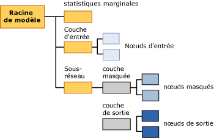

# Contenu du modèle d'exploration de données pour les modèles de réseau neuronal (Analysis Services - Exploration de données)
[!INCLUDE[ssas-appliesto-sqlas](../../includes/ssas-appliesto-sqlas.md)]
  Cette rubrique décrit le contenu du modèle d'exploration de données qui est spécifique aux modèles qui utilisent l'algorithme MNN (Microsoft Neural Network). Pour obtenir une explication sur la procédure d’interprétation des statistiques et de la structure partagées par tous les types de modèles et pour obtenir des définitions générales de termes en rapport avec le contenu du modèle d’exploration de données, consultez [Contenu du modèle d’exploration &#40;Analysis Services - Exploration de données&#41;](../../analysis-services/data-mining/mining-model-content-analysis-services-data-mining.md).  
  
## Fonctionnement de la structure d'un modèle Neural Network  
 Chaque modèle de réseau neuronal a un nœud parent unique, qui représente le modèle et ses métadonnées, et un nœud de statistiques marginales (NODE_TYPE = 24), qui apporte des statistiques descriptives sur les attributs d'entrée. Le nœud des statistiques marginales est utile parce qu'il résume les informations sur les entrées, afin que vous n'ayez pas besoin d'interroger les données des nœuds individuels.  
  
 Sous ces deux nœuds, il y a au moins deux nœuds supplémentaires, voire beaucoup plus, selon le nombre d'attributs prédictibles du modèle.  
  
-   Le premier nœud (NODE_TYPE = 18) représente toujours le nœud supérieur de la couche d'entrée. Sous ce nœud supérieur, vous pouvez rechercher des nœuds d'entrée (NODE_TYPE = 21) qui contiennent les attributs d'entrée réels et leurs valeurs.  
  
-   Les nœuds consécutifs contiennent chacun un *sous-réseau* différent (NODE_TYPE = 17). Chaque sous-réseau contient toujours une couche masquée (NODE_TYPE = 19) et une couche de sortie (NODE_TYPE = 20) pour ce sous-réseau.  
  
   
  
 Les informations dans la couche d'entrée sont simples : le nœud supérieur pour chaque couche d'entrée (NODE_TYPE = 18) sert d'organisateur pour une collection de nœuds d'entrée (NODE_TYPE = 21). Le contenu des nœuds d'entrée est décrit dans la table ci-dessous.  
  
 Chaque sous-réseau (NODE_TYPE = 17) représente l’analyse de l’influence de la couche d’entrée sur un attribut prédictible particulier. S'il existe plusieurs sorties prévisibles, il y a plusieurs sous-réseaux. La couche masquée de chaque sous-réseau contient plusieurs nœuds masqués (NODE_TYPE = 22) qui contiennent des détails à propos des poids pour chaque transition qui se termine dans ce nœud masqué spécifique.  
  
 La couche de sortie (NODE_TYPE = 20) contient des nœuds de sortie (NODE_TYPE = 23) qui contiennent chacun des valeurs distinctes de l'attribut prédictible. Si l'attribut prédictible est un type de données numériques continues, il y a un seul nœud de sortie pour l'attribut.  
  
> [!NOTE]  
>  L'algorithme de régression logistique utilise un cas spécial d'un réseau neuronal avec un seul résultat prévisible et potentiellement de nombreuses entrées. La régression logistique n'utilise pas de couche masquée.  
  
 La manière la plus simple d’explorer la structure des entrées et des sous-réseaux est d'utiliser la **visionneuse de l'arborescence de contenu générique Microsoft**. Vous pouvez cliquer sur n'importe quel nœud pour le développer et consulter les nœuds enfants ou consultez les poids et d'autres statistiques contenues dans le nœud.  
  
 Pour utiliser les données et voir comment le modèle corrèle les entrées avec les sorties, utilisez la **visionneuse de l'algorithme MNN (Microsoft Neural Network)**. Avec cette visionneuse personnalisée, vous pouvez filtrer les attributs d'entrée et leurs valeurs, et consulter des graphiques qui illustrent comment ils affectent les sorties. Les info-bulles de la visionneuse montrent la probabilité et la finesse associées à chaque paire de valeurs d'entrée et de sortie. Pour plus d’informations, consultez [Explorer un modèle à l’aide de la visionneuse de l’algorithme MNN (Microsoft Neural Network)](../../analysis-services/data-mining/browse-a-model-using-the-microsoft-neural-network-viewer.md).  
  
## Contenu du modèle pour un modèle de réseau neuronal  
 Cette section fournit des informations et des exemples uniquement pour les colonnes du contenu du modèle d'exploration de données qui sont particulièrement pertinentes pour les réseaux neuronaux. Pour plus d’informations sur les colonnes à caractère général de l’ensemble de lignes de schéma, telles que MODEL_CATALOG et MODEL_NAME, non décrites ici, ou pour obtenir des explications sur la terminologie relative aux modèles d’exploration de données, consultez [Contenu du modèle d’exploration &#40;Analysis Services - Exploration de données&#41;](../../analysis-services/data-mining/mining-model-content-analysis-services-data-mining.md).  
  
 MODEL_CATALOG  
 Nom de la base de données où le modèle est stocké.  
  
 MODEL_NAME  
 Nom du modèle.  
  
 ATTRIBUTE_NAME  
 Noms des attributs qui correspondent à ce nœud.  
  
|Nœud|Contenu|  
|----------|-------------|  
|Racine du modèle|Vide|  
|Statistiques marginales|Vide|  
|Couche d'entrée|Vide|  
|Nœud d'entrée|Nom d'attribut d'entrée|  
|hidden layer|Vide|  
|Nœud masqué|Vide|  
|Couche de sortie|Vide|  
|Nœud de sortie|Nom d'attribut de sortie|  
  
 NODE_NAME  
 Nom du nœud. Cette colonne contient la même valeur que NODE_UNIQUE_NAME.  
  
 NODE_UNIQUE_NAME  
 Nom unique du nœud.  
  
 Pour plus d'informations sur la façon dont les noms et ID fournissent des informations structurelles à propos du modèle, consultez la section, [Utilisation de noms des nœuds et ID](#bkmk_NodeIDs).  
  
 NODE_TYPE  
 Un modèle de réseau neuronal génère en sortie les types de nœuds suivants :  
  
|ID du type de nœud|Description|  
|------------------|-----------------|  
|1|Modèle.|  
|17|Nœud organisateur pour le sous-réseau.|  
|18|Nœud organisateur pour la couche d'entrée.|  
|19|Nœud organisateur pour la couche masquée.|  
|20|Nœud organisateur pour la couche de sortie.|  
|21|Nœud d'attribut d'entrée.|  
|22|Nœud de couche masquée|  
|23|Nœud d'attribut de sortie.|  
|24|Nœud de statistiques marginales.|  
  
 NODE_CAPTION  
 Étiquette ou légende associée au nœud. Dans les modèles de réseau neuronal, toujours vide.  
  
 CHILDREN_CARDINALITY  
 Estimation du nombre d'enfants du nœud.  
  
|Nœud|Contenu|  
|----------|-------------|  
|Racine du modèle|Indique le nombre de nœuds enfants, qui inclut au moins un réseau, un nœud marginal requis et une couche d'entrée requise. Par exemple, si la valeur est égale à 5, il y a trois sous-réseaux.|  
|Statistiques marginales|Toujours 0.|  
|Couche d'entrée|Indique le nombre de paires de valeurs d'attribut d'entrée utilisées par le modèle.|  
|Nœud d'entrée|Toujours 0.|  
|hidden layer|Indique le nombre de nœuds masqués créés par le modèle.|  
|Nœud masqué|Toujours 0.|  
|Couche de sortie|Indique le nombre de valeurs de sortie.|  
|Nœud de sortie|Toujours 0.|  
  
 PARENT_UNIQUE_NAME  
 Nom unique du parent du nœud. La valeur NULL est retournée pour tous les nœuds situés au niveau de la racine.  
  
 Pour plus d'informations sur la façon dont les noms et ID fournissent des informations structurelles à propos du modèle, consultez la section, [Utilisation de noms des nœuds et ID](#bkmk_NodeIDs).  
  
 NODE_DESCRIPTION  
 Description conviviale du nœud.  
  
|Nœud|Contenu|  
|----------|-------------|  
|Racine du modèle|Vide|  
|Statistiques marginales|Vide|  
|Couche d'entrée|Vide|  
|Nœud d'entrée|Nom d'attribut d'entrée|  
|hidden layer|Vide|  
|Nœud masqué|Entier qui indique la séquence du nœud masqué dans la liste de nœuds masqués.|  
|Couche de sortie|Vide|  
|Nœud de sortie|Si l'attribut de sortie est continu, contient le nom de l'attribut de sortie.   Si l'attribut de sortie est discret ou discrétisé, contient le nom de l'attribut et la valeur.|  
  
 NODE_RULE  
 Description XML de la règle incorporée dans le nœud.  
  
|Nœud|Contenu|  
|----------|-------------|  
|Racine du modèle|Vide|  
|Statistiques marginales|Vide|  
|Couche d'entrée|Vide|  
|Nœud d'entrée|Fragment XML qui contient les mêmes informations que la colonne NODE_DESCRIPTION.|  
|hidden layer|Vide|  
|Nœud masqué|Entier qui indique la séquence du nœud masqué dans la liste de nœuds masqués.|  
|Couche de sortie|Vide|  
|Nœud de sortie|Fragment XML qui contient les mêmes informations que la colonne NODE_DESCRIPTION.|  
  
 MARGINAL_RULE  
 Dans les modèles de réseau neuronal, toujours vide.  
  
 NODE_PROBABILITY  
 Probabilité associée à ce nœud. Dans les modèles de réseau neuronal, toujours 0.  
  
 MARGINAL_PROBABILITY  
 Probabilité d'accès au nœud à partir du nœud parent. Dans les modèles de réseau neuronal, toujours 0.  
  
 NODE_DISTRIBUTION  
 Table imbriquée qui contient des informations statistiques pour le nœud. Pour plus d’informations à propos du contenu de cette table pour chaque type de nœud, consultez la section [Présentation de la table NODE_DISTRIBUTION](#bkmk_NodeDistTable).  
  
 NODE_SUPPORT  
 Dans les modèles de réseau neuronal, toujours 0.  
  
> [!NOTE]  
>  Les probabilités de prise en charge sont toujours égales à 0 parce que la sortie de ce type de modèle n'est pas probabiliste. Seuls les poids sont pertinents pour l'algorithme ; par conséquent, l'algorithme ne calcule pas la probabilité, la prise en charge ou la variance.  
  
 Pour recevoir des informations sur la prise en charge dans les cas d'apprentissage pour des valeurs spécifiques, consultez le nœud des statistiques marginales.  
  
 MSOLAP_MODEL_COLUMN  
 |Nœud|Contenu|  
|----------|-------------|  
|Racine du modèle|Vide|  
|Statistiques marginales|Vide|  
|Couche d'entrée|Vide|  
|Nœud d'entrée|Nom d'attribut d'entrée.|  
|hidden layer|Vide|  
|Nœud masqué|Vide|  
|Couche de sortie|Vide|  
|Nœud de sortie|Nom d'attribut d'entrée.|  
  
 MSOLAP_NODE_SCORE  
 Pour un modèle de réseau neuronal, toujours 0.  
  
 MSOLAP_NODE_SHORT_CAPTION  
 Dans les modèles de réseau neuronal, toujours vide.  
  
## Notes  
 Le but de la formation d'un modèle de réseau neuronal est de déterminer les poids associés à chaque transition d'une entrée à un point milieu et d'un point milieu à un point de terminaison. Par conséquent, la couche d'entrée du modèle existe principalement pour stocker les valeurs réelles utilisées pour générer le modèle. La couche masquée stocke les poids calculés et fournit des pointeurs aux attributs d'entrée. La couche de sortie stocke les valeurs prévisibles et fournit également des pointeurs aux points milieu dans la couche masquée.  
  
##   Utilisation de noms des nœuds et ID  
 La désignation des nœuds dans un modèle de réseau neuronal fournit des informations supplémentaires à propos du type de nœud en vue de simplifier la mise en relation de la couche masquée avec la couche d'entrée et de la couche de sortie avec la couche masquée. La table suivante affiche la convention pour les ID attribués aux nœuds dans chaque couche.  
  
|Type de nœud|Convention pour l'ID du nœud|  
|---------------|----------------------------|  
|Racine du modèle (1)|00000000000000000.|  
|Nœud de statistiques marginales (24)|10000000000000000|  
|Couche d'entrée (18)|30000000000000000|  
|Nœud d'entrée (21)|Démarre à 60000000000000000|  
|Sous-réseau (17)|20000000000000000|  
|Couche masquée (19)|40000000000000000|  
|Nœud masqué (22)|Démarre à 70000000000000000|  
|Couche de sortie (20)|50000000000000000|  
|Nœud de sortie (23)|Démarre à 80000000000000000|  
  
 Vous pouvez déterminer quels attributs d'entrée sont mis en rapport avec un nœud de couche masquée spécifique en consultant la table NODE_DISTRIBUTION dans le nœud masqué (NODE_TYPE = 22). Chaque ligne de la table NODE_DISTRIBUTION contient l'ID d'un nœud d'attribut d'entrée.  
  
 De la même façon, vous pouvez déterminer quelles couches masquées sont mises en rapport avec un attribut de sortie en consultant la table NODE_DISTRIBUTION dans le nœud de sortie (NODE_TYPE = 23). Chaque ligne de la table NODE_DISTRIBUTION contient l'ID d'un nœud de couche masquée, avec le coefficient connexe.  
  
##   Interprétation des informations dans la table NODE_DISTRIBUTION  
 La table NODE_DISTRIBUTION peut être vide dans certains nœuds. Toutefois, la table NODE_DISTRIBUTION stocke des informations importantes et intéressantes à propos du modèle pour les nœuds d'entrée, les nœuds de couche masquée et les nœuds de sortie. Pour vous aider à interpréter cette information, la table NODE_DISTRIBUTION contient une colonne VALUETYPE pour chaque ligne, qui indique si la valeur dans la colonne ATTRIBUTE_VALUE est discrète (4), discrétisée (5) ou continue (3).  
  
### Nœuds d'entrée  
 La couche d'entrée contient un nœud pour chaque valeur de l'attribut utilisé dans le modèle.  
  
 **Attribut discret :** le nœud d’entrée stocke uniquement le nom de l’attribut et sa valeur dans les colonnes ATTRIBUTE_NAME et ATTRIBUTE_VALUE. Par exemple, s'il s'agit de la colonne [Poste de travail], un nœud distinct est créé pour chaque valeur de cette colonne utilisée dans le modèle, tel que Matin et Après-midi. La table NODE_DISTRIBUTION pour chaque nœud liste uniquement la valeur actuelle de l'attribut.  
  
 **Attribut numérique discrétisé :** le nœud d'entrée stocke le nom de l'attribut et la valeur, qui peut être une plage ou une valeur spécifique. Toutes les valeurs sont représentées par des expressions telles que "77,4 - 87,4" ou "< 64,0" pour la valeur de [Temps par problème]. La table NODE_DISTRIBUTION pour chaque nœud liste uniquement la valeur actuelle de l'attribut.  
  
 **Attribut continu :** le nœud d'entrée stocke la valeur moyenne de l'attribut. La table NODE_DISTRIBUTION pour chaque nœud liste uniquement la valeur actuelle de l'attribut.  
  
### Nœuds de couche masquée  
 La couche masquée contient un nombre variable de nœuds. Dans chaque nœud, la table NODE_DISTRIBUTION contient des mappages de la couche masquée aux nœuds dans la couche d'entrée. La colonne ATTRIBUTE_NAME contient un ID de nœud qui correspond à un nœud dans la couche d'entrée. La colonne ATTRIBUTE_VALUE contient le poids associé à cette combinaison de nœud d'entrée et nœud de couche masquée. La dernière ligne de la table contient un coefficient qui représente le poids de ce nœud masqué dans la couche masquée.  
  
### Nœuds de sortie  
 La couche de sortie contient un nœud de sortie pour chaque valeur de sortie utilisée dans le modèle. Dans chaque nœud, la table NODE_DISTRIBUTION contient des mappages de la couche de sortie aux nœuds dans la couche masquée. La colonne ATTRIBUTE_NAME contient un ID de nœud qui correspond à un nœud dans la couche masquée. La colonne ATTRIBUTE_VALUE contient le poids associé à cette combinaison de nœud de sortie et nœud de couche masquée.  
  
 La table NODE_DISTRIBUTION présente les informations supplémentaires suivantes, selon le type de l'attribut :  
  
 **Attribut discret :** les deux lignes finales de la table NODE_DISTRIBUTION contiennent un coefficient pour le nœud dans son ensemble et la valeur actuelle de l’attribut.  
  
 **Attribut numérique discrétisé :** identique aux attributs discrets, mais la valeur de l'attribut est une plage de valeurs.  
  
 **Attribut continu :** les deux lignes finales de la table NODE_DISTRIBUTION contiennent la moyenne de l’attribut, le coefficient pour le nœud dans son ensemble et la variance du coefficient.  
  
## Voir aussi  
 [MNN (Microsoft Neural Network)](../../analysis-services/data-mining/microsoft-neural-network-algorithm.md)   
 [Référence technique de Microsoft Neural Network algorithme](../../analysis-services/data-mining/microsoft-neural-network-algorithm-technical-reference.md)   
 [Exemples de requête de modèle de réseau neuronal](../../analysis-services/data-mining/neural-network-model-query-examples.md)  
  
  
