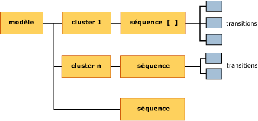

# <a name="mining-model-content-for-sequence-clustering-models"></a>Contenu du modèle d'exploration de données pour les modèles Sequence Clustering
[!INCLUDE[ssas-appliesto-sqlas](../../includes/ssas-appliesto-sqlas.md)]
  Cette rubrique décrit le contenu du modèle d'exploration de données spécifique aux modèles utilisant l'algorithme MSC (Microsoft Sequence Clustering). Pour une explication de la terminologie générale et statistique en rapport avec le contenu du modèle d’exploration de données pour tous les types de modèles, consultez [Contenu du modèle d’exploration &#40;Analysis Services - Exploration de données&#41;](../../analysis-services/data-mining/mining-model-content-analysis-services-data-mining.md).  
  
## <a name="understanding-the-structure-of-a-sequence-clustering-model"></a>Présentation de la structure d'un modèle Sequence Clustering  
 Un modèle Sequence Clustering comprend un nœud parent unique (NODE_TYPE = 1) qui représente le modèle et ses métadonnées. Le nœud parent, étiqueté **(Tout)**, a un nœud de séquence connexe (NODE_TYPE = 13) qui répertorie toutes les transitions détectées dans les données d’apprentissage.  
  
   
  
 L'algorithme crée également plusieurs clusters, selon les transitions trouvées dans les données et tous les autres attributs d'entrée inclus lors de la création du modèle, comme par exemple les données démographiques de la clientèle, etc. Chaque cluster (NODE_TYPE = 5) contient son propre nœud de séquence (NODE_TYPE = 13) qui répertorie uniquement les transitions utilisées pour générer ce cluster spécifique. Dans le nœud de séquence, vous pouvez descendre pour consulter les détails des transitions d'état individuelles (NODE_TYPE = 14).  
  
 Pour obtenir une explication sur les transitions d’état et de séquence, avec des exemples, consultez [Algorithme MSC (Microsoft Sequence Clustering)](../../analysis-services/data-mining/microsoft-sequence-clustering-algorithm.md).  
  
## <a name="model-content-for-a-sequence-clustering-model"></a>Contenu d'un modèle Sequence Clustering  
 Cette section fournit des informations supplémentaires sur les colonnes du contenu du modèle d'exploration de données qui sont particulièrement pertinentes pour les modèles Sequence Clustering.  
  
 MODEL_CATALOG  
 Nom de la base de données où le modèle est stocké.  
  
 MODEL_NAME  
 Nom du modèle.  
  
 ATTRIBUTE_NAME  
 Toujours vide.  
  
 NODE_NAME  
 Nom du nœud. Actuellement la même valeur que NODE_UNIQUE_NAME.  
  
 NODE_UNIQUE_NAME  
 Nom unique du nœud.  
  
 NODE_TYPE  
 Un modèle Sequence Clustering génère les types de nœuds suivants :  
  
|ID du type de nœud| Description|  
|------------------|-----------------|  
|1 (Modèle)|Nœud racine pour le modèle|  
|5 (cluster)|Contient le nombre de transitions dans le cluster, une liste des attributs et des statistiques qui décrivent les valeurs dans le cluster.|  
|13 (Séquence)|Contient une liste de transitions incluses dans le cluster.|  
|14 (Transition)|Décrit une séquence d'événements sous forme de table dans laquelle la première ligne contient l'état initial, et toutes les autres lignes contiennent les états successifs, ainsi que les statistiques de prise en charge et de probabilité.|  
  
 NODE_GUID  
 Vide.  
  
 NODE_CAPTION  
 Étiquette ou légende associée au nœud à des fins d'affichage.  
  
 Vous pouvez renommer les légendes du cluster pendant que vous utilisez le modèle ; toutefois, le nouveau nom n'est pas conservé si vous fermez le modèle.  
  
 CHILDREN_CARDINALITY  
 Estimation du nombre d'enfants du nœud.  
  
 **Racine du modèle** La valeur Cardinalité est égale au nombre de clusters plus un. Pour plus d’informations, consultez [Cardinalité](#bkmk_cardinality).  
  
 **Nœuds du cluster** La cardinalité est toujours de 1, parce que chaque cluster a un nœud enfant unique, qui contient la liste de séquences du cluster.  
  
 **Nœuds de séquence** La cardinalité indique le nombre de transitions incluses dans ce cluster. Par exemple, la cardinalité du nœud de séquence pour la racine du modèle indique le nombre de transitions qui ont été trouvées dans tout le modèle.  
  
 PARENT_UNIQUE_NAME  
 Nom unique du parent du nœud.  
  
 La valeur NULL est retournée pour tous les nœuds situés au niveau de la racine.  
  
 NODE_DESCRIPTION  
 Identique à la légende du nœud.  
  
 NODE_RULE  
 Toujours vide.  
  
 MARGINAL_RULE  
 Toujours vide.  
  
 NODE_PROBABILITY  
 **Racine du modèle** Toujours 0.  
  
 **Nœuds du cluster** Probabilité ajustée du cluster dans le modèle. La somme des probabilités ajustées n'est pas égale à 1, parce que la méthode de clustering utilisée dans Sequence Clustering permet une appartenance partielle dans plusieurs clusters.  
  
 **Nœuds de séquence** Toujours 0.  
  
 **Nœuds de transition** Toujours 0.  
  
 MARGINAL_PROBABILITY  
 **Racine du modèle** Toujours 0.  
  
 **Nœuds du cluster** Même valeur que NODE_PROBABILITY.  
  
 **Nœuds de séquence** Toujours 0.  
  
 **Nœuds de transition** Toujours 0.  
  
 NODE_DISTRIBUTION  
 Table contenant des probabilités et d'autres informations. Pour plus d’informations, consultez [Table NODE_DISTRIBUTION](#bkmk_NODEDIST).  
  
 NODE_SUPPORT  
 Nombre de transitions qui prennent en charge ce nœud. Par conséquent, s'il y a 30 exemples de séquence « Produit A suivi du Produit B » dans les données d'apprentissage, la prise en charge totale est de 30.  
  
 **Racine du modèle** Nombre total de transitions dans le modèle.  
  
 **Nœuds du cluster** Prise en charge brute du cluster, soit le nombre de cas d’apprentissage qui apportent des cas à ce cluster.  
  
 **Nœuds de séquence** Toujours 0.  
  
 **Nœuds de transition** Pourcentage de cas dans le cluster qui représentent une transition spécifique. Peut être égal à 0 ou avoir une valeur positive. Calculé en prenant la prise en charge brute du nœud de cluster et en la multipliant par la probabilité du cluster.  
  
 À partir de cette valeur, vous pouvez indiquer combien de cas d'apprentissage ont servi à la transition.  
  
 MSOLAP_MODEL_COLUMN  
 Non applicable.  
  
 MSOLAP_NODE_SCORE  
 Non applicable.  
  
 MSOLAP_NODE_SHORT_CAPTION  
 Identique à NODE_DESCRIPTION.  
  
## <a name="understanding-sequences-states-and-transitions"></a>Structure des séquences, des états et des transitions  
 Un modèle Sequence Clustering possède une structure unique qui associe deux types d'objets avec des types d'informations très différents : les premiers sont des clusters, et les seconds des transitions d'état.  
  
 Les clusters créés par Sequence Clustering sont similaires à ceux créés par l'algorithme de gestion de clusters Microsoft. Chaque cluster possède un profil et des caractéristiques. Toutefois, dans Sequence Clustering, chaque cluster contient en outre un nœud enfant unique qui répertorie les séquences de ce cluster. Chaque nœud de séquence contient plusieurs nœuds enfants qui décrivent les transitions d'état en détail, ainsi que les probabilités.  
  
 Il y a presque toujours plus de séquences dans le modèle que vous ne pouvez en trouver dans un cas unique, parce que les séquences peuvent être enchaînées les unes aux autres. Microsoft Analysis Services stocke des pointeurs d'un état à l'autre de manière à pouvoir compter le nombre de fois où chaque transition se produit. Vous pouvez également trouver des informations sur le nombre de fois où la séquence s'est produite et mesurer sa probabilité d'apparition par rapport au jeu complet d'états observés.  
  
 La table suivante présente la manière dont les informations sont stockées dans le modèle ainsi que le mode de liaison des nœuds.  
  
|Nœud|Possède un nœud enfant|Table NODE_DISTRIBUTION|  
|----------|--------------------|------------------------------|  
|Racine du modèle|Nœuds de cluster multiples<br /><br /> Nœud comportant les séquences pour tout le modèle|Répertorie tous les produits du modèle, ainsi que la prise en charge et la probabilité.<br /><br /> Comme la méthode de clustering autorise l'appartenance partielle à plusieurs clusters, la prise en charge et la probabilité peuvent avoir des valeurs fractionnaires. Autrement dit, au lieu de ne compter qu'un cas unique une seule fois, chaque cas peut potentiellement appartenir à plusieurs clusters. Par conséquent, lorsque l'appartenance au cluster final est déterminée, la valeur est ajustée par la probabilité de ce cluster.|  
|Nœud de séquence pour le modèle|Nœuds de transition multiples|Répertorie tous les produits du modèle, ainsi que la prise en charge et la probabilité.<br /><br /> Comme le nombre de séquences est connu pour le modèle, à ce niveau, les calculs de prise en charge et de probabilité sont simples :<br /><br /> <br /><br /> Prise en charge = nombre de cas<br /><br /> Probabilité = probabilité brute de chaque séquence du modèle. La somme de toutes les probabilités doit être égale à 1.|  
|Nœuds de cluster individuels|Nœud comportant les séquences pour ce cluster uniquement|Répertorie tous les produits d'un cluster, mais ne fournit les valeurs de prise en charge et de probabilité que pour les produits caractéristiques du cluster.<br /><br /> La prise en charge représente la valeur de prise en charge ajustée pour chaque cas de ce cluster. Les valeurs de probabilité correspondent à la probabilité ajustée.|  
|Nœuds de séquence pour les clusters individuels|Plusieurs nœuds comportant les transitions pour les séquences de ce cluster uniquement|Exactement les mêmes informations que dans les nœuds de cluster individuels.|  
|Transitions|Pas d'enfants|Répertorie les transitions pour le premier état connexe.<br /><br /> La prise en charge est une valeur de prise en charge ajustée, indiquant les cas qui participent à chaque transition. La probabilité correspond à la probabilité ajustée, représentée sous forme de pourcentage.|  
  
###  <a name="bkmk_NODEDIST"></a> Table NODE_DISTRIBUTION  
 La table NODE_DISTRIBUTION fournit des informations détaillées sur la probabilité et la prise en charge pour les transitions et les séquences d'un cluster spécifique.  
  
 Une ligne est toujours ajoutée à la table de transitions pour représenter les valeurs **manquantes** possibles. Pour plus d’informations sur la signification de la valeur **manquante** et sur la manière dont elle affecte les calculs, consultez [Valeurs manquantes &#40;Analysis Services - Exploration de données&#41;](../../analysis-services/data-mining/missing-values-analysis-services-data-mining.md).  
  
 Les calculs de prise en charge et de probabilité diffèrent selon que le calcul s'applique aux cas d'apprentissage ou au modèle fini. Cela est dû au fait que la méthode de clustering par défaut EM (Expectation Maximization) suppose que tout cas peut appartenir à plusieurs clusters. Lors du calcul de prise en charge pour les cas du modèle, il est possible d'utiliser des probabilités et des nombres bruts. Toutefois, les probabilités d'une séquence donnée d'un cluster doivent être pondérées par la somme de toutes les combinaisons de séquence et de cluster possibles.  
  
###  <a name="bkmk_cardinality"></a> Cardinalité  
 Dans un modèle de clustering, la cardinalité du nœud parent indique généralement le nombre de clusters se trouvant dans le modèle. Toutefois, un modèle Sequence Clustering possède deux types de nœud au niveau du cluster : un type de nœud contient des clusters, et l'autre type une liste de séquences pour tout le modèle.  
  
 Par conséquent, pour connaître le nombre de clusters dans le modèle, vous pouvez prendre la valeur de NODE_CARDINALITY pour le nœud (Tout) et soustraire un. Par exemple, si le modèle a créé 9 clusters, la cardinalité de la racine du modèle est 10. Cela est dû au fait que le modèle contient 9 nœuds de cluster, chacun ayant son propre nœud de séquence, plus un nœud de séquence supplémentaire étiqueté cluster 10, qui représente les séquences pour le modèle.  
  
## <a name="walkthrough-of-structure"></a>Procédure pas à pas de structure  
 Un exemple permettra de mieux comprendre comment les informations sont stockées et comment vous pouvez les interpréter. Par exemple, vous pouvez rechercher la plus grande commande, soit la plus longue chaîne observée dans les données [!INCLUDE[ssSampleDBDWobject](../../includes/sssampledbdwobject-md.md)] sous-jacentes, en utilisant la requête suivante :  
  
```  
USE AdventureWorksDW2012  
SELECT DISTINCT OrderNumber, Count(*)  
FROM vAssocSeqLineItems  
GROUP BY OrderNumber  
ORDER BY Count(*) DESC  
```  
  
 À partir de ces résultats, vous constatez que les numéros de commande « SO72656 », « SO58845 » et « SO70714 » contiennent les plus grandes séquences, avec huit articles chacune. Au moyen des références de commande, vous pouvez afficher les détails d'une commande donnée pour voir quels articles ont été achetés, et dans quel ordre.  
  
|OrderNumber|LineNumber|Modèle|  
|-----------------|----------------|-----------|  
|SO58845|1|Mountain-500|  
|SO58845|2|LL Mountain Tire|  
|SO58845|3|Mountain Tire Tube|  
|SO58845|4|Fender Set - Mountain|  
|SO58845|5|Mountain Bottle Cage|  
|SO58845|6|Water Bottle|  
|SO58845|7|Sport-100|  
|SO58845|8|Long-Sleeve Logo Jersey (Pull-over à manches longues)|  
  
 Toutefois, certains clients qui achètent le produit Mountain-500 peuvent se procurer des produits différents. Vous pouvez consulter tous les produits qui suivent le produit Mountain-500 en consultant la liste de séquences dans le modèle. Les procédures suivantes vous guident lors de la consultation de ces séquences à l’aide des deux visionneuses fournies dans [!INCLUDE[ssASnoversion](../../includes/ssasnoversion-md.md)]:  
  
#### <a name="to-view-related-sequences-by-using-the-sequence-clustering-viewer"></a>Pour consulter des séquences connexes à l'aide de la visionneuse Sequence Clustering  
  
1.  Dans l'Explorateur d'objets, cliquez sur le modèle [Sequence Clustering] avec le bouton droit de la souris, puis sélectionnez Parcourir.  
  
2.  Dans la visionneuse Sequence Clustering, cliquez sur l’onglet **Transitions d’état** .  
  
3.  Dans la liste déroulante **Cluster** , vérifiez que **Remplissage (tout)** est sélectionné.  
  
4.  Déplacez tout en haut la barre du curseur située à gauche du volet pour afficher tous les liens.  
  
5.  Dans le diagramme, repérez **Mountain-500**et cliquez sur le nœud du diagramme.  
  
6.  Les lignes en surbrillance renvoient aux états suivants (produits achetés après Mountain-500) et les nombres indiquent la probabilité. Comparez-les aux résultats de la visionneuse du contenu de modèle générique.  
  
#### <a name="to-view-related-sequences-by-using-the-generic-model-content-viewer"></a>Pour consulter les séquences connexes à l'aide de la visionneuse du contenu de modèle générique  
  
1.  Dans l'Explorateur d'objets, cliquez sur le modèle [Sequence Clustering] avec le bouton droit de la souris, puis sélectionnez Parcourir.  
  
2.  Dans la liste déroulante Visionneuse, sélectionnez la **visionneuse de l’arborescence de contenu générique Microsoft**.  
  
3.  Dans le volet **Légende du nœud** , cliquez sur le nœud nommé **Niveau de séquence pour cluster 16**.  
  
4.  Dans le volet d'informations Nœud, recherchez la ligne NODE_DISTRIBUTION et cliquez n'importe où dans la table imbriquée.  
  
     La ligne du haut correspond toujours à la valeur manquante. Cette ligne est l’état de séquence 0.  
  
5.  Appuyez sur la touche Bas ou utilisez les barres de défilement pour descendre dans la table imbriquée jusqu'à ce que la ligne Mountain-500 apparaisse.  
  
     Cette ligne est l'état de séquence 20.  
  
    > [!NOTE]  
    >  Vous pouvez obtenir par programmation le numéro de ligne pour un état de séquence donné, mais si vous ne faites que naviguer, il peut être plus simple de copier la table imbriquée dans un classeur Excel.  
  
6.  Retournez au volet Légende du nœud et développez le nœud **Niveau de séquence pour cluster 16**le cas échéant.  
  
7.  Recherchez **Ligne de transition pour état de séquence 20**parmi ses nœuds enfants. Cliquez sur le nœud de transition.  
  
8.  La table NODE_DISTRIBUTION imbriquée contient les produits et probabilités ci-dessous. Comparez-les aux résultats de l’onglet **Transitions d’état** de la visionneuse Sequence Clustering.  
  
 La table suivante affiche les résultats de la table NODE_DISTRIBUTION, ainsi que les valeurs de probabilité arrondies présentées dans la visionneuse graphique.  
  
|Product|Prise en charge (table NODE_DISTRIBUTION)|Probabilité (table NODE_DISTRIBUTION)|Probabilité (du graphique)|  
|-------------|------------------------------------------|------------------------------------------------|--------------------------------|  
|manquantes|48.447887|0.138028169|(non affiché)|  
|Cycling Cap|10.876056|0.030985915|0.03|  
|Fender Set - Mountain|80.087324|0.228169014|0.23|  
|Half-Finger Gloves|0.9887324|0.002816901|0.00|  
|Hydration Pack|0.9887324|0.002816901|0.00|  
|LL Mountain Tire|51.414085|0.146478873|(0.15%)|  
|Long-Sleeve Logo Jersey (Pull-over à manches longues)|2.9661972|0.008450704|0.01|  
|Mountain Bottle Cage|87.997183|0.250704225|0.25%|  
|Mountain Tire Tube|16.808451|0.047887324|0.05|  
|Short-Sleeve Classic Jersey|10.876056|0.030985915|0.03|  
|Sport-100|20.76338|0.05915493|0.06|  
|Water Bottle|18.785915|0.053521127|0.25%|  
  
 Bien que le cas sélectionné initialement dans les données d'apprentissage contenait le produit « Mountain-500 » suivi de « LL Mountain Tire », vous pouvez constater qu'il existe de nombreuses autres séquences possibles. Pour rechercher des informations détaillées sur un cluster donné, vous devez de nouveau parcourir vers le bas la liste de séquences dans le cluster jusqu'à atteindre les transitions réelles pour chaque état ou produit.  
  
 Vous pouvez passer de la séquence répertoriée dans un cluster donné à la ligne de transition. À partir de cette ligne de transition, vous pouvez déterminer quel produit est le suivant et revenir à ce produit dans la liste de séquences. En répétant ce processus pour chaque premier et deuxième état, vous pouvez parcourir de longues chaînes d'états.  
  
## <a name="using-sequence-information"></a>Utilisation des informations de séquence  
 Un des scénarios courants pour Sequence Clustering consiste à suivre les clics d'utilisateur sur un site Web. Par exemple, si les données étaient issues d'enregistrements d'achats clients sur le site Web d'e-commerce Adventure Works, le modèle Sequence Clustering en résultant pourrait être utilisé pour comprendre le comportement des utilisateurs, changer la conception du site d'e-commerce afin de résoudre les problèmes de navigation ou pour promouvoir les ventes.  
  
 Par exemple, l'analyse peut indiquer que les utilisateurs suivent toujours une chaîne de produits donnée, indépendamment des caractéristiques démographiques. De plus, vous pouvez constater que les utilisateurs quittent fréquemment le site après avoir cliqué sur un produit donné. Au vu de ces résultats, vous pouvez vous demander quels chemins d'accès supplémentaires vous pourriez fournir aux utilisateurs afin de les inciter à rester sur le site Web.  
  
 Si vous n'avez pas d'informations supplémentaires à utiliser pour classifier vos utilisateurs, vous pouvez utiliser les informations de séquence pour recueillir des données à propos de la navigation afin de mieux comprendre le comportement général. Toutefois, si vous pouvez recueillir des informations sur les clients et les faire correspondre à votre base de données de clients, vous pouvez associer la puissance de mise en cluster à la prédiction sur les séquences pour fournir des recommandations sur mesure à l'utilisateur, voire même en fonction du chemin d'accès à la page actuelle.  
  
 Une autre utilisation des informations complètes sur les états et les transitions compilées par un modèle Sequence Clustering vise à déterminer les chemins d'accès possibles qui ne sont jamais utilisés. Par exemple, si vous avez de nombreux visiteurs sur les pages 1-4, mais qu'ils ne se rendent jamais sur la page 5, vous pouvez contrôler la page 5 pour y déceler les éventuels problèmes qui empêcheraient la navigation. Pour ce faire, interrogez le contenu du modèle, et comparez-le à une liste de chemins d'accès possibles.  Les graphiques qui indiquent tous les chemins de navigation dans un site Web peuvent être créés par programmation ou en utilisant divers outils d'analyse du site.  
  
 Pour savoir comment obtenir la liste des chemins d’accès observés en interrogeant le contenu du modèle et pour voir d’autres exemples de requêtes sur un modèle Sequence Clustering, consultez [Exemples de requêtes de modèle MSC (Sequence Clustering)](../../analysis-services/data-mining/sequence-clustering-model-query-examples.md).  
  
## <a name="see-also"></a>Voir aussi  
 [Contenu du modèle d’exploration de données & #40 ; Analysis Services - Exploration de données & #41 ;](../../analysis-services/data-mining/mining-model-content-analysis-services-data-mining.md)   
 [Algorithme de Microsoft Sequence Clustering](../../analysis-services/data-mining/microsoft-sequence-clustering-algorithm.md)   
 [Exemples de requêtes de modèle Sequence Clustering](../../analysis-services/data-mining/sequence-clustering-model-query-examples.md)  
  
  
