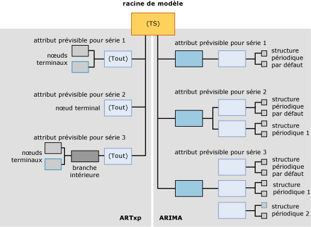

# <a name="mining-model-content-for-time-series-models-analysis-services---data-mining"></a>Contenu du modèle d'exploration de données pour les modèles de séries chronologiques (Analysis Services - Exploration de données)
[!INCLUDE[ssas-appliesto-sqlas](../../includes/ssas-appliesto-sqlas.md)]
  Tous les modèles d'exploration de données utilisent la même structure pour stocker leur contenu. Cette structure est définie d'après l'ensemble de lignes de schéma du contenu de l'exploration de données. Toutefois, dans cette structure standard, les nœuds qui contiennent des informations sont organisés de différentes façons pour représenter différents types d'arbres. Cette rubrique décrit l'organisation des nœuds, ainsi que la signification de chacun, pour les modèles d'exploration de données qui sont basés sur l'algorithme MTS ( [!INCLUDE[msCoName](../../includes/msconame-md.md)] Time Series).  
  
 Pour une explication du contenu général du modèle d’exploration de données qui s’applique à tous les types de modèles, consultez [Contenu du modèle d’exploration &#40;Analysis Services - Exploration de données&#41;](../../analysis-services/data-mining/mining-model-content-analysis-services-data-mining.md).  
  
 Lorsque vous consultez cette rubrique, il peut s'avérer utile de parcourir le contenu d'un modèle de série chronologique. Vous pouvez créer un modèle de série chronologique en complétant le didacticiel sur l'exploration de données de base. Le modèle que vous créez dans le didacticiel est un modèle mixte qui effectue l'apprentissage des données en utilisant à la fois les algorithmes ARIMA et ARTXP. Pour plus d’informations sur l’affichage du contenu d’un modèle d’exploration de données, consultez [Visionneuses de modèle d’exploration de données](../../analysis-services/data-mining/data-mining-model-viewers.md).  
  
## <a name="understanding-the-structure-of-a-time-series-model"></a>Fonctionnement de la structure d'un modèle de série chronologique  
 Un modèle de série chronologique comprend un nœud parent unique qui représente le modèle et ses métadonnées. Sous ce nœud parent se trouvent un ou deux arbres de série chronologique, en fonction de l'algorithme que vous avez utilisé pour créer le modèle.  
  
 Si vous créez un modèle mixte, deux arbres distincts sont ajoutés au modèle : un pour ARIMA et un pour ARTXP. Si vous choisissez d'utiliser uniquement l'algorithme ARTXP ou uniquement l'algorithme ARIMA, vous disposerez d'un seul arbre correspondant à cet algorithme. Vous spécifiez l'algorithme à utiliser en définissant le paramètre FORECAST_METHOD. Pour plus d’informations sur la possibilité d’utiliser ARTXP, ARIMA ou un modèle mixte, consultez [Algorithme MTS (Microsoft Time Series)](../../analysis-services/data-mining/microsoft-time-series-algorithm.md).  
  
 Le diagramme suivant présente un exemple de modèle d'exploration de données de série chronologique qui a été créé avec les paramètres par défaut pour créer un modèle mixte. Afin que vous puissiez comparer plus aisément les différences entre les deux modèles, le modèle ARTXP est affiché ici sur le côté gauche du diagramme et le modèle ARIMA est affiché du côté droit.  Alors qu'ARTXP est une structure en forme d'arbre qui se divise en branches de plus en plus petites, la structure créée par l'algorithme ARIMA ressemble plus à une pyramide construite vers le haut à partir de composants plus petits.  
  
   
  
 Le point important à retenir est que les informations sont organisées de façons complètement différentes dans les arbres ARIMA et ARTXP, et vous devez considérer les deux arbres comme liés uniquement au niveau du nœud racine. Bien que les deux représentations soient présentées dans un seul modèle pour des raisons de commodité, elles doivent être considérées comme deux modèles indépendants. ARTXP représente un arbre réel, mais pas ARIMA.  
  
 Lorsque vous utilisez la visionneuse de l'arborescence de contenu de modèle générique Microsoft pour afficher un modèle qui fait appel à la fois à ARIMA et à ARTXP, les nœuds des modèles ARTXP et ARIMA sont tous présentés comme des nœuds enfants du modèle de série chronologique parent. Toutefois, vous pouvez les distinguer facilement grâce aux étiquettes appliquées aux nœuds.  
  
-   Le premier ensemble de nœuds est intitulé (Tout) et représente les résultats de l'analyse par l'algorithme ARTXP.  
  
-   Le second ensemble de nœuds est intitulé ARIMA et représente les résultats de l'analyse par l'algorithme ARIMA.  
  
> [!WARNING]  
>  Le nom (Tout) sur l'arbre ARTXP est conservé uniquement à des fins de compatibilité descendante. Avant SQL Server 2008, l'algorithme MTS (Microsoft Time Series) utilisait un seul algorithme pour l'analyse : l'algorithme ARTXP.  
  
 Les sections suivantes expliquent comment les nœuds sont réorganisés dans chacun de ces types de modèle.  
  
### <a name="structure-of-an-artxp-model"></a>Structure d'un modèle ARTXP  
 L'algorithme ARTXP crée un modèle semblable à un modèle d'arbre de décision. Il regroupe les attributs prédictibles et les divisent chaque fois que des différences significatives sont trouvées. Par conséquent, chaque modèle ARTXP contient une branche distincte pour chaque attribut prédictible. Par exemple, le didacticiel sur l'exploration de données de base crée un modèle qui prédit la quantité des ventes pour plusieurs régions. Dans le cas présent, **[Amount]** est l’attribut prédictible et une branche distincte est créée pour chaque région. Si vous aviez deux attributs prédictibles, **[Amount]** et **[Quantity]**, une branche distincte serait créée pour chaque association d’un attribut et d’une région.  
  
 Le nœud supérieur de la branche ARTXP contient les mêmes informations que celles présentes dans un nœud racine de l'arbre de décision. Cela inclut le nombre d'enfants de ce nœud (CHILDREN_CARDINALITY), le nombre de cas qui remplissent les conditions de ce nœud (NODE_SUPPORT) et différentes statistiques descriptives (NODE_DISTRIBUTION).  
  
 Si le nœud n'a pas d'enfant, cela signifie qu'aucune condition significative que justifierait de diviser les cas en sous-groupes supplémentaires n'a été trouvée. La branche se termine à cette position et le nœud est appelé *nœud terminal*. Le nœud terminal contient les attributs, les coefficients et les valeurs qui sont les blocs de construction de la formule ARTXP.  
  
 Certaines branches peuvent avoir des divisions supplémentaires, comme dans un modèle d'arbre de décision. Par exemple, la branche de l'arbre qui représente des ventes de la région Europe se divise en deux branches. Une division se produit lorsqu'une condition qui provoque une différence significative entre les deux groupes est détectée. Le nœud parent vous indique le nom de l'attribut qui a provoqué la division, tel que [Amount], et le nombre de cas qui se trouvent dans le nœud parent. Les nœuds terminaux fournissent plus de détails : la valeur de l’attribut, telle que [Sales]>10,000 par rapport à [Sales]<10,000), le nombre des cas qui prennent en charge chaque condition, ainsi que la formule ARTXP.  
  
> [!NOTE]  
>  Si vous voulez afficher les formules, vous pouvez rechercher la formule de régression complète au niveau du nœud terminal, mais pas dans un nœud intermédiaire ou racine.  
  
### <a name="structure-of-an-arima-model"></a>Structure d'un modèle ARIMA  
 L’algorithme ARIMA crée une seule information pour chaque combinaison d’une série de données (telle que **[Region]**) et d’un attribut prédictible (tel que **[Sales Amount]**) : l’équation qui décrit la modification de l’attribut prédictible dans le temps.  
  
 L'équation de chaque série est dérivée de plusieurs composants, un pour chaque structure périodique trouvée dans les données. Par exemple, si vous avez des données de ventes qui sont collectées tous les mois, l'algorithme peut détecter des structures périodiques mensuelles, trimestrielles ou annuelles.  
  
 L'algorithme produit un ensemble de nœuds parents et enfants distinct pour chaque périodicité qu'il trouve. La périodicité par défaut est 1, pour une tranche de temps unique, et est automatiquement ajoutée dans tous les modèles. Vous pouvez spécifier les structures périodiques possibles en entrant plusieurs valeurs dans le paramètre PERIODICITY_HINT. Toutefois, si l'algorithme ne détecte pas une structure périodique, il ne produira pas de résultats pour cet indicateur.  
  
 Chaque structure périodique qui est produite dans le contenu du modèle contient les nœuds de composants suivants :  
  
-   un nœud pour l’ *ordre autorégressif* (AR) ;  
  
-   un nœud pour la *moyenne mobile* (MA).  
  
 Pour plus d’informations sur la signification de ces termes, consultez [Algorithme MTS (Microsoft Time Series)](../../analysis-services/data-mining/microsoft-time-series-algorithm.md).  
  
 L' *ordre des différences* représente une partie importante de la formule, et il est représenté dans l'équation. Pour plus d’informations sur la façon dont l’ordre des différences est utilisé, consultez [Informations techniques de référence sur l’algorithme MTS (Microsoft Time Series)](../../analysis-services/data-mining/microsoft-time-series-algorithm-technical-reference.md).  
  
## <a name="model-content-for-time-series"></a>Contenu du modèle pour la série chronologique  
 Cette section fournit des informations et des exemples pour les colonnes du contenu du modèle d'exploration de données qui sont particulièrement pertinentes pour les modèles de séries chronologiques.  
  
 Pour plus d’informations sur les colonnes à caractère général de l’ensemble de lignes de schéma, telles que MODEL_CATALOG et MODEL_NAME, ou pour obtenir des explications sur la terminologie relative aux modèles d’exploration de données, consultez [Contenu du modèle d’exploration &#40;Analysis Services - Exploration de données&#41;](../../analysis-services/data-mining/mining-model-content-analysis-services-data-mining.md).  
  
 MODEL_CATALOG  
 Nom de la base de données où le modèle est stocké.  
  
 MODEL_NAME  
 Nom du modèle.  
  
 ATTRIBUTE_NAME  
 Attribut prédictible pour la série de données représentée dans le nœud. (Même valeur que pour MSOLAP_MODEL_COLUMN.)  
  
 NODE_NAME  
 Nom du nœud.  
  
 Actuellement, cette colonne contient la même valeur que NODE_UNIQUE_NAME, bien que cela puisse changer dans les versions ultérieures.  
  
 NODE_UNIQUE_NAME  
 Nom unique du nœud. Le nœud parent du modèle est toujours nommé **TS**.  
  
 **ARTXP :** chaque nœud est représenté par TS suivi d'une valeur numérique hexadécimale. L'ordre des nœuds est sans importance.  
  
 Par exemple, les nœuds ARTXP situés directement sous l'arbre TS peuvent être numérotés TS00000001-TS0000000b.  
  
 **ARIMA :** chaque nœud d'un arbre ARIMA est représenté par TA suivi d'une valeur numérique hexadécimale. Les nœuds enfants contiennent le nom unique du nœud parent suivi d'un autre nombre hexadécimal indiquant la séquence dans le nœud.  
  
 Tous les arbres ARIMA sont exactement la même structure. Chaque racine contient les nœuds et la convention d'affectation des noms illustrés par un exemple dans le tableau suivant :  
  
|ID et type du nœud ARIMA|Exemple de nom de nœud|  
|----------------------------|--------------------------|  
|Racine ARIMA (27)|TA0000000b|  
|Structure périodique ARIMA (28)|TA0000000b00000000|  
|ARIMA autorégressif (29)|TA0000000b000000000|  
|Moyenne mobile ARIMA (30)|TA0000000b000000001|  
  
 NODE_TYPE  
 Un modèle de série chronologique produit les types de nœuds suivants, en fonction de l'algorithme.  
  
 **ARTXP :**  
  
|ID du type de nœud| Description|  
|------------------|-----------------|  
|1 (Modèle)|Série chronologique|  
|3 (Intérieur)|Représente une branche intérieure d'un arbre de série chronologique ARTXP.|  
|16 (Arbre de série chronologique)|Racine d'arbre ARTXP qui correspond à un attribut prédictible et une série.|  
|15 (Série chronologique)|Nœud terminal de l'arbre ARTXP.|  
  
 **ARIMA :**  
  
|ID du type de nœud| Description|  
|------------------|-----------------|  
|27 (Racine ARIMA)|Nœud supérieur d'un arbre ARIMA.|  
|28 (Structure périodique ARIMA)|Composant d'un arbre ARIMA qui décrit une structure périodique unique.|  
|29 (ARIMA autorégressif)|Contient un coefficient pour une structure périodique unique.|  
|30 (Moyenne mobile ARIMA)|Contient un coefficient pour une structure périodique unique.|  
  
 NODE_CAPTION  
 Étiquette ou légende qui est associée au nœud.  
  
 Cette propriété est principalement utilisée à des fins d'affichage.  
  
 **ARTXP :** contient la condition de division pour le nœud, affichée sous la forme d'une association d'attribut et de plage de valeurs.  
  
 **ARIMA :** Contient la forme abrégée de l'équation ARIMA.  
  
 Pour plus d'informations sur le format de l'équation ARIMA, consultez [Légende d'exploration de données pour la formule ARIMA](#bkmk_ARIMA_2).  
  
 CHILDREN_CARDINALITY  
 Nombre d'enfants directs de ce nœud.  
  
 PARENT_UNIQUE_NAME  
 Nom unique du parent du nœud. La valeur NULL est retournée pour tous les nœuds situés au niveau de la racine.  
  
 NODE_DESCRIPTION  
 Description, sous forme de texte, des règles, divisions ou formules dans le nœud actuel.  
  
 **ARTXP :** pour plus d'informations, consultez [Fonctionnement de l'arbre ARTXP](#bkmk_ARTXP_1).  
  
 **ARIMA :** pour plus d'informations, consultez [Fonctionnement de l'arbre ARIMA](#bkmk_ARIMA_1).  
  
 NODE_RULE  
 Description XML des règles, divisions ou formules dans le nœud actuel.  
  
 **ARTXP :** la valeur NODE_RULE correspond généralement à la valeur NODE_CAPTION.  
  
 **ARIMA :** pour plus d'informations, consultez [Fonctionnement de l'arbre ARIMA](#bkmk_ARIMA_1).  
  
 MARGINAL_RULE  
 Description XML de la division ou du contenu qui est spécifique à ce nœud.  
  
 **ARTXP :** la valeur MARGINAL_RULE correspond généralement à la valeur NODE_DESCRIPTION.  
  
 **ARIMA :** toujours vide ; utilisez NODE_RULE à la place.  
  
 NODE_PROBABILITY  
 **ARTXP :** pour les nœuds d’arbre, toujours 1. Pour les nœuds terminaux, probabilité d'atteindre le nœud à partir du nœud racine du modèle.  
  
 **ARIMA :** toujours 0.  
  
 MARGINAL_PROBABILITY  
 **ARTXP :** pour les nœuds d’arbre, toujours 1. Pour les nœuds terminaux, probabilité d'atteindre le nœud à partir du nœud parent immédiat.  
  
 **ARIMA :** toujours 0.  
  
 NODE_DISTRIBUTION  
 Table qui contient l'histogramme de probabilité du nœud. Dans un modèle de série chronologique, cette table imbriquée contient tous les composants requis pour assembler la formule de régression réelle.  
  
 Pour plus d'informations sur la table de distribution du nœud dans un arbre ARTXP, consultez [Fonctionnement de l'arbre ARTXP](#bkmk_ARTXP_1).  
  
 Pour plus d'informations sur la table de distribution du nœud dans un arbre ARIMA, consultez [Fonctionnement de l'arbre ARIMA](#bkmk_ARIMA_1).  
  
 Si vous voulez afficher toutes les constantes et d'autres composants composés dans un format lisible, utilisez la [Visionneuse de l'algorithme MTS (Microsoft Time Series)](../../analysis-services/data-mining/browse-a-model-using-the-microsoft-time-series-viewer.md), cliquez sur le nœud, puis ouvrez **Légende d'exploration de données**.  
  
 NODE_SUPPORT  
 Nombre de cas qui prennent en charge ce nœud.  
  
 **ARTXP :** pour le nœud **(Tout)** , indique le nombre total de tranches de temps incluses dans la branche.  
  
 Pour les nœuds de terminaison, indique le nombre des tranches de temps incluses dans la plage décrite par NODE_CAPTION. Le nombre de tranches de temps dans les nœuds de terminaison s’additionne toujours à la valeur NODE_SUPPORT du nœud **(Tout)** de la branche.  
  
 **ARIMA :** Nombre de cas qui prennent en charge la structure périodique actuelle. La valeur de prise en charge est répétée dans tous les nœuds de la structure périodique actuelle.  
  
 MSOLAP_MODEL_COLUMN  
 Attribut prédictible pour la série de données représentée dans le nœud. (Même valeur que pour ATTRIBUTE_NAME.)  
  
 MSOLAP_NODE_SCORE  
 Valeur numérique qui caractérise la valeur d'information de l'arbre ou de la division.  
  
 **ARTXP :** la valeur est toujours 0.0 pour les nœuds sans division. Pour les nœuds avec division, cette valeur représente le score d'intérêt et pertinence de la division.  
  
 Pour plus d’informations sur ces méthodes de calcul de score, consultez [Sélection des fonctionnalités &#40;exploration de données&#41;](../../analysis-services/data-mining/feature-selection-data-mining.md).  
  
 **ARIMA :** score BIC (Bayesian Information Criterion) du modèle ARIMA. Le même score est défini sur tous les nœuds ARIMA en rapport avec l'équation.  
  
 MSOLAP_NODE_SHORT_CAPTION  
 **ARTXP :**  mêmes informations que pour NODE_DESCRIPTION.  
  
 **ARIMA :** mêmes informations que pour NODE_CAPTION, à savoir forme abrégée de l’équation ARIMA.  
  
##  <a name="bkmk_ARTXP_1"></a> Fonctionnement de l'arbre ARTXP  
 Le modèle ARTXP sépare clairement les zones des données qui sont linéaires des zones des données qui se divisent sur un autre facteur. Chaque fois que les modifications de l'attribut prédictible peuvent être représentées directement sous la forme d'une fonction des variables indépendantes, une formule de régression est calculée pour représenter cette relation  
  
 Par exemple, s'il existe une corrélation directe entre le temps et les ventes pour la plupart des séries de données, chaque série serait contenue dans un arbre de série chronologique (NODE_TYPE = 16) qui n'a pas de nœuds enfants, mais uniquement une équation de régression, pour chaque série de données. Toutefois, si la relation n'est pas linéaire, un arbre de série chronologique ARTXP peut se diviser sur les conditions dans les nœuds enfants, de la même manière qu'un modèle d'arbre de décision. En affichant le contenu du modèle dans la **Visionneuse de l'arborescence de contenu générique Microsoft** , vous pouvez voir où les divisions se produisent, et comment il affecte la courbe de tendance.  
  
 Pour mieux comprendre ce comportement, vous pouvez examiner le modèle de série chronologique créé dans le [Didacticiel sur l'exploration de données de base](http://msdn.microsoft.com/library/6602edb6-d160-43fb-83c8-9df5dddfeb9c). Ce modèle, basé sur l'entrepôt de données AdventureWorks, n'utilise pas de données particulièrement complexes. Par conséquent, l'arbre ARTXP comprend peu de divisions. Toutefois, ce modèle relativement simple illustre tout de même trois types de divisions différents :  
  
-   La courbe de tendance [Amount] pour la région Pacific se divise sur la clé de temps. Une division sur la clé de temps signifie qu'il y a une modification de la tendance à un moment donné. La courbe de tendance était linéaire uniquement jusqu'à un certain point, puis la courbe a adopté une forme différente. Par exemple, une série chronologique peut continuer jusqu'au 6 août 2002, et une autre série chronologique démarre après cette date.  
  
-   La courbe de tendance [Amount] pour la région North America se divise sur une autre variable. Dans le cas présent, la tendance pour North America se divise en fonction de la valeur du même modèle dans la région Europe. En d'autres termes, l'algorithme a détecté que lorsque la valeur pour Europe change, la valeur pour North America A change également.  
  
-   La courbe de tendance pour la région Europe se divise sur elle-même.  
  
 Que signifie chaque division ? L'interprétation des informations fournies par le contenu du modèle est une illustration qui requiert une compréhension approfondie des données et de leur sa signification dans le contexte d'entreprise.  
  
-   Le lien apparent entre les tendances pour les régions North America et Europe peut signifier uniquement que la série de données pour Europe a plus d'entropie, ce qui implique que la tendance pour North America apparaît plus faible. Il peut également n'y avoir aucune différence significative dans le calcul du score pour les deux, et la corrélation pourrait être accidentelle, basée simplement sur le fait que le calcul pour Europe est effectué avant le calcul pour North America. Toutefois, vous pouvez examiner les données et vérifier si la corrélation est fausse, ou effectuer une analyse pour voir si un autre facteur est impliqué.  
  
-   La division sur la clé de temps signifie qu'il y a une modification significative d'un point de vue statistique dans le gradient de la ligne. Cela a pu être dû à des facteurs mathématiques tels que la prise en charge de chaque plage, ou aux calculs de l'entropie requise pour la division. Par conséquent, cette division peut ne pas être intéressante en termes de signification du modèle en situation réelle. Toutefois, lorsque vous examinez la période indiquée dans la division, vous pouvez trouver des corrélations intéressantes qui ne sont pas représentées dans les données, telles qu'une vente promotionnelle ou un autre événement qui a commencé à ce moment-là et qui a peut-être affecté les données.  
  
 Si les données contenaient d'autres attributs, vous voudrez très probablement voir d'autres exemples intéressants de création de branche dans l'arbre. Par exemple, si vous avez suivi des informations météorologiques et que vous les avez utilisées comme un attribut pour l'analyse, vous pouvez voir, dans l'arbre, plusieurs divisions qui représentent l'interaction complexe des ventes et de la météo.  
  
 En résumé, l'exploration de données est utile pour fournir des indications sur l'endroit où des phénomènes potentiellement intéressants se produisent, mais une analyse approfondie et la compétence des utilisateurs professionnels sont nécessaires pour interpréter correctement la valeur des informations en contexte.  
  
### <a name="elements-of-the-artxp-time-series-formula"></a>Éléments de la formule de série chronologique ARTXP  
 Pour afficher la formule complète pour un arbre ou une branche ARTXP, nous vous recommandons d'utiliser la **légende d'exploration de données** de la [Visionneuse de l'algorithme MTS (Microsoft Time Series)](../../analysis-services/data-mining/browse-a-model-using-the-microsoft-time-series-viewer.md), laquelle présente toutes les constantes dans un format lisible.  
  
-   [Afficher la formule d’un modèle de série chronologique &#40;exploration de données&#41;](../../analysis-services/data-mining/view-the-formula-for-a-time-series-model-data-mining.md)  
  
 La section suivante présente un exemple d'équation et explique la terminologie de base.  
  
#### <a name="mining-legend-for-an-artxp-formula"></a>Légende d'exploration de données pour une formule ARTXP  
 L'exemple suivant présente la formule ARTXP pour une partie du modèle, telle qu'elle est affichée dans la **légende d'exploration de données**. Pour afficher cette formule, ouvrez le modèle [Prévision] que vous avez créé dans le didacticiel sur l’exploration de données de base dans la Visionneuse de l’algorithme MTS (Microsoft Time Series), cliquez sur l’onglet **Modèle** , sélectionnez l’arbre correspondant à la série de données R250 : Europe.  
  
 Pour afficher l'équation utilisée pour cet exemple, cliquez sur le nœud qui représente la série des dates commençant le 5/7/2003  
  
 Exemple d'équation de nœud d'arbre :  
  
 `Quantity = 21.322 -0.293 * Quantity(R250 North America,-7) + 0.069 * Quantity(R250 Europe,-1) + 0.023 * Quantity(R250 Europe,-3) -0.142 * Quantity(R750 Europe,-8)`  
  
 Dans le cas présent, la valeur 21.322 représente la valeur qui est prédite pour Quantity sous la forme d’une fonction des éléments suivants de l’équation.  
  
 Par exemple, l'un des éléments est `Quantity(R250 North America,-7)`. Cette notation correspond à la quantité pour la région North America à `t-7`, soit sept tranches de temps avant la tranche de temps actuelle. La valeur de cette série de données est multipliée par le coefficient -0,293. Le coefficient de chaque élément est dérivé pendant le processus d'apprentissage ; il est basé sur les tendances des données.  
  
 Il y a plusieurs éléments dans cette équation, car le modèle a calculé que la quantité du modèle R250 dans la région Europe est dépendante des valeurs de plusieurs autres séries de données.  
  
#### <a name="model-content-for-an-artxp-formula"></a>Contenu du modèle pour une formule ARTXP  
 Le tableau suivant affiche les mêmes informations pour la formule, en utilisant le contenu du nœud approprié comme présenté dans la [Visionneuse de l’arborescence de contenu générique Microsoft &#40;exploration de données&#41;](http://msdn.microsoft.com/library/751b4393-f6fd-48c1-bcef-bdca589ce34c).  
  
|ATTRIBUTE_NAME|ATTRIBUTE_VALUE|SUPPORT|PROBABILITY|VARIANCE|VALUETYPE|  
|---------------------|----------------------|-------------|-----------------|--------------|---------------|  
|Quantity(R250 Europe,y-intercept)|21.3223433563772|11|0|1.65508795539661|11 (Ordonnée à l'origine)|  
|Quantity(R250 Europe,-1)|0.0691694140876526|0|0|0|7 (Coefficient)|  
|Quantity(R250 Europe,-1)|20.6363635858123|0|0|182.380682874818|9 (Statistiques)|  
|Quantity(R750 Europe,-8)|-0.1421203048299|0|0|0|7 (Coefficient)|  
|Quantity(R750 Europe,-8)|22.5454545333019|0|0|104.362130048408|9 (Statistiques)|  
|Quantity(R250 Europe,-3)|0.0234095979448281|0|0|0|7 (Coefficient)|  
|Quantity(R250 Europe,-3)|24.8181818883176|0|0|176.475304989169|9 (Statistiques)|  
|Quantity(R250 North America,-7)|-0.292914186039869|0|0|0|7 (Coefficient)|  
|Quantity(R250 North America,-7)|10.36363640433|0|0|701.882534898676|9 (Statistiques)|  
  
 Comme vous pouvez le constater en comparant ces exemples, le contenu du modèle d'exploration de données contient les mêmes informations que celles disponibles dans la **légende d'exploration de données**, mais avec des colonnes supplémentaires pour la *variance* et la *prise en charge*. La valeur de prise en charge indique le nombre de cas qui prennent en charge la tendance décrite par cette équation.  
  
### <a name="using-the-artxp-time-series-formula"></a>Utilisation de la formule de série chronologique ARTXP  
 Pour la plupart des utilisateurs professionnels, la valeur du contenu du modèle ARTXP réside dans le fait qu'elle combine à la fois un arbre et une représentation linéaire des données.  
  
-   Si les modifications de l'attribut prédictible peuvent être représentées sous la forme d'une fonction linéaire des variables indépendantes, l'algorithme calculera automatiquement l'équation de régression et générera cette série dans un nœud distinct.  
  
-   Chaque fois que la relation ne peut pas être exprimée sous forme d'une corrélation linéaire, la série chronologique fonctionne comme un arbre de décision.  
  
 En parcourant le contenu du modèle dans la [Visionneuse de l'algorithme MTS (Microsoft Time Series)](../../analysis-services/data-mining/browse-a-model-using-the-microsoft-time-series-viewer.md) , vous pouvez voir où la division se produit, et comment il affecte la courbe de tendance.  
  
 S'il existe une corrélation directe entre le temps et les ventes pour une partie de la série de données, la façon la plus simple d'obtenir la formule consiste à copier la formule à partir de la **légende d'exploration de données**, puis à la coller dans un document ou une présentation afin d'expliquer le modèle. Vous pouvez également extraire la moyenne, le coefficient et d'autres informations à partir de la table NODE_DISTRIBUTION pour cet arbre et les utiliser pour calculer des extensions de la tendance. Si la totalité de la série montre une relation linéaire cohérente, l'équation est contenue dans le nœud (Tout). Si l'arbre comprend une branche, l'équation est contenue dans le nœud terminal.  
  
 La requête suivante retourne tous les nœuds terminaux ARTXP d'un modèle d'exploration de données, ainsi que la table imbriquée, NODE_DISTRIBUTION, qui contient l'équation.  
  
```  
SELECT MODEL_NAME, ATTRIBUTE_NAME, NODE_NAME,  
NODE_CAPTION,   
(SELECT ATTRIBUTE_NAME, ATTRIBUTE_VALUE, [VARIANCE], VALUETYPE  
FROM NODE_DISTRIBUTION) as t  
FROM Forecasting.CONTENT  
WHERE NODE_TYPE = 15  
```  
  
##  <a name="bkmk_ARIMA_1"></a> Fonctionnement de l'arbre ARIMA  
 Chaque structure d'un modèle ARIMA correspond à une *périodicité* ou *structure périodique*. Une structure périodique est un modèle de données qui se répète dans l'ensemble de la série de données. Une variation mineure dans le modèle est autorisée, dans les limites statistiques. La périodicité est mesurée en fonction des unités de temps par défaut qui ont été utilisées dans les données d'apprentissage. Par exemple, si les données d'apprentissage fournissent les données de ventes pour chaque jour, l'unité de temps par défaut est un jour, et toutes les structures périodiques sont définies sous la forme d'un nombre de jours spécifié.  
  
 Chaque période détectée par l'algorithme obtient son propre nœud de structure. Par exemple, si vous analysez les données de ventes quotidiennes, le modèle peut détecter des structures périodiques qui représentent les semaines. Dans le cas présent, l'algorithme créera deux structures périodiques dans le modèle fini : une pour la période quotidienne par défaut, notée {1}, et une pour les semaines, signalée par {7}.  
  
 Par exemple, la requête suivante retourne toutes les structures ARIMA d'un modèle d'exploration de données.  
  
```  
SELECT MODEL_NAME, ATTRIBUTE_NAME, NODE_NAME, NODE_CAPTION  
FROM Forecasting.CONTENT  
WHERE NODE_TYPE = 27  
```  
  
 Résultats de l'exemple :  
  
|MODEL_NAME|ATTRIBUTE_NAME|NODE_NAME|NODE_TYPE|NODE_CAPTION|  
|-----------------|---------------------|----------------|----------------|-------------------|  
|Prévision|M200 Europe:Quantity|TA00000000|27|ARIMA (1,0,1)|  
|Prévision|M200 North America:Quantity|TA00000001|27|ARIMA (1,0,4) X (1,1,4)(6)|  
|Prévision|M200 Pacific:Quantity|TA00000002|27|ARIMA (2,0,8) X (1,0,0)(4)|  
|Prévision|M200 Pacific:Quantity|TA00000002|27|ARIMA (2,0,8) X (1,0,0)(4)|  
|Prévision|R250 Europe:Quantity|TA00000003|27|ARIMA (1,0,7)|  
|Prévision|R250 North America:Quantity|TA00000004|27|ARIMA (1,0,2)|  
|Prévision|R250 Pacific:Quantity|TA00000005|27|ARIMA (2,0,2) X (1,1,2)(12)|  
|Prévision|R750 Europe:Quantity|TA00000006|27|ARIMA (2,1,1) X (1,1,5)(6)|  
|Prévision|T1000 Europe:Quantity|TA00000009|27|ARIMA (1,0,1)|  
|Prévision|T1000 North America:Quantity|TA0000000a|27|ARIMA (1,1,1)|  
|Prévision|T1`000 Pacific:Quantity|TA0000000b|27|ARIMA (1,0,3)|  
  
 À partir de ces résultats, que vous pouvez également parcourir à l’aide de la [Visionneuse de l’arborescence de contenu générique Microsoft &#40;exploration de données&#41;](http://msdn.microsoft.com/library/751b4393-f6fd-48c1-bcef-bdca589ce34c), vous pouvez indiquer, d’un seul coup d’œil, les séries qui sont complètement linéaires, celles qui ont plusieurs structures périodiques et les périodicités qui ont été découvertes.  
  
 Par exemple, la forme abrégée de l'équation ARIMA pour la série M200 Europe vous indique que seul le cycle par défaut, ou quotidien, a été détecté. La forme abrégée de l'équation est fournie dans la colonne NODE_CAPTION.  
  
 Toutefois, pour la série M200 North America, une structure périodique supplémentaire a été trouvée. Le nœud TA00000001 a deux nœuds enfants, un avec l’équation (1,0,4) et l’autre avec l’équation (1,1,4)(6). Ces équations sont concaténées et présentées dans le nœud parent.  
  
 Pour chaque structure périodique, le contenu du modèle fournit également l' *ordre* et la *moyenne mobile* comme nœuds enfants. Par exemple, la requête suivante extrait les nœuds enfants de l'un des nœuds répertoriés dans l'exemple précédent. Notez que le nom de colonne PARENT_UNIQUE_NAME doit être placé entre parenthèses afin de le distinguer du mot clé réservé du même nom.  
  
```  
SELECT *   
FROM Forecasting.CONTENT  
WHERE [PARENT_UNIQUE_NAME] = ' TA00000001'  
```  
  
 Étant donné qu’il s’agit d’un arbre ARIMA, et non d’un arbre ARTXP, vous ne pouvez pas utiliser la fonction [IsDescendant &#40;DMX&#41;](../../dmx/isdescendant-dmx.md) pour retourner les nœuds enfants de cette structure périodique. Vous pouvez, à la place, utiliser l'attribut et les types de nœuds pour filtrer les résultats et retourner les nœuds enfants qui fournissent plus de détail sur la façon dont l'équation a été crée, y compris les moyennes mobiles et l'ordre des différences.  
  
```  
SELECT MODEL_NAME, ATTRIBUTE_NAME, NODE_UNIQUE_NAME,  
NODE_TYPE,  NODE_CAPTION  
FROM Forecasting.CONTENT  
WHERE [MSOLAP_MODEL_COLUMN] ='M200 North America:Quantity'  
AND (NODE_TYPE = 29 or NODE_TYPE = 30)  
```  
  
 Résultats de l'exemple :  
  
|MODEL_NAME|ATTRIBUTE_NAME|NODE_UNIQUE_NAME|NODE_TYPE|NODE_CAPTION|  
|-----------------|---------------------|------------------------|----------------|-------------------|  
|Prévision|M200 North America:Quantity|TA00000001000000010|29|ARIMA {1,0.961832044807041}|  
|Prévision|M200 North America:Quantity|TA00000001000000011|30|ARIMA {1,-3.51073103693271E-02,2.15731642954099,-0.220314343327742,-1.33151478258758}|  
|Prévision|M200 North America:Quantity|TA00000001000000000|29|ARIMA {1,0.643565911081657}|  
|Prévision|M200 North America:Quantity|TA00000001000000001|30|ARIMA {1,1.45035399809581E-02,-4.40489283927752E-02,-0.19203901352577,0.242202497643993}|  
  
 Ces exemples illustrent le fait que plus vous descendez dans la hiérarchie de l'arbre ARIMA, plus les informations obtenues sont détaillées, mais les informations importantes sont combinées et présentées également dans le nœud parent.  
  
### <a name="time-series-formula-for-arima"></a>Formule de série chronologique pour ARIMA  
 Pour afficher la formule complète pour n'importe quel nœud ARIMA, nous vous recommandons d'utiliser la **légende d'exploration de données** de la [Visionneuse de l'algorithme MTS (Microsoft Time Series)](../../analysis-services/data-mining/browse-a-model-using-the-microsoft-time-series-viewer.md), laquelle présente l'ordre autorégressif, les moyennes mobiles et d'autres éléments de l'équation déjà composés dans un format cohérent.  
  
-   [Afficher la formule d’une série chronologique en mode & #40 ; exploration de données & #41 ;](../../analysis-services/data-mining/view-the-formula-for-a-time-series-model-data-mining.md)  
  
 Cette section présente un exemple d'équation et explique la terminologie de base.  
  
####  <a name="bkmk_ARIMA_2"></a> Légende d'exploration de données pour la formule ARIMA  
 L'exemple suivant présente la formule ARIMA pour une partie du modèle, telle qu'elle est affichée dans la légende d'exploration de données. Pour afficher cette formule, ouvrez le modèle **Prévision** à l’aide de la **Visionneuse de l’algorithme MTS (Microsoft Time Series)**, cliquez sur l’onglet **Modèle** , sélectionnez l’arbre correspondant à la série de données **R250 : Europe** , puis cliquez sur le nœud qui représente la série de dates commençant le 7/5/2003. La légende d'exploration de données compose toutes les constantes dans un format lisible, présenté dans l'exemple suivant :  
  
 Équation ARIMA :  
  
`ARIMA ({1,1},0,{1,1.49791920964142,1.10640053499397,0.888873034670339,-5.05429403071953E-02,-0.905265316720334,-0.961908900643379,-0.649991020901922}) Intercept:56.8888888888889`  
  
 Cette équation est le format ARIMA long, qui inclut les valeurs des coefficients et l'ordonnée à l'origine. La forme abrégée de cette équation serait {1,0,7}, où 1 indique la période sous la forme d’un nombre de tranches de temps, 0 indique l’ordre de différence de terme et 7 indique le nombre de coefficients.  
  
> [!NOTE]  
>  Une constante est calculée par Analysis Services pour calculer la variance, mais la constante elle-même n'est pas affichée n'importe où dans l'interface utilisateur. Toutefois, vous pouvez afficher la variance de n'importe quel point de la série sous la forme d'une fonction de cette constante si vous sélectionnez **Afficher les écarts** dans la vue **Graphique** . L'info-bulle de chaque série de données affiche la variance d'un point prédit spécifique.  
  
#### <a name="model-content-for-arima-formula"></a>Contenu du modèle pour la formule ARIMA  
 Un modèle ARIMA suit une structure standard, avec des informations différentes contenues dans des nœuds de types différents. Pour afficher le contenu du modèle pour le modèle ARIMA, remplacez la visionneuse par la **Visionneuse de l'arborescence de contenu générique Microsoft**, puis développez le nœud qui a le nom d'attribut **R250 Europe: Quantity**.  
  
 Un modèle ARIMA pour une série de données contient l'équation périodique de base dans quatre formats différents, que vous pouvez choisir en fonction de l'application.  
  
 **NODE_CAPTION :** affiche la forme abrégée de l’équation. La forme abrégée vous indique le nombre de structures périodiques qui sont représentées, ainsi que le nombre de coefficients qu'elles ont. Par exemple, si la forme abrégée de l'équation est `{4,0,6}`, le nœud représente une structure périodique avec 6 coefficients. Si la forme abrégée ressemble à `{2,0,8} x {1,0,0}(4)`, le nœud contient deux structures périodiques.  
  
 **NODE DESCRIPTION :** affiche le long format de l'équation, qui est également la forme de l'équation qui apparaît dans la **légende d'exploration de données**. La forme longue de l'équation est semblable à la forme abrégée, mais les valeurs réelles des coefficients sont affichées au lieu d'être dénombrées.  
  
 **NODE_RULE :** affiche une représentation XML de l’équation. En fonction du type de nœud, la représentation XML peut inclure une seule ou plusieurs structures périodiques. Le tableau suivant illustre la façon dont les nœuds XML sont reportés jusqu'aux niveaux supérieurs du modèle ARIMA.  
  
|Type de nœud|Contenu XML|  
|---------------|-----------------|  
|27 (Racine ARIMA)|Inclut toutes les structures périodiques de la série de données, ainsi que le contenu de tous les nœuds enfants de chaque structure périodique.|  
|28 (Structure périodique ARIMA)|Définit une structure périodique unique, y compris son nœud de termes autorégressifs et ses coefficients de moyennes mobiles.|  
|29 (ARIMA autorégressif)|Répertorie les termes d'une structure périodique unique.|  
|30 (Moyenne mobile ARIMA)|Répertorie les coefficients d'une structure périodique unique.|  
  
 **NODE_DISTRIBUTION :** affiche les termes de l’équation dans une table imbriquée, que vous pouvez interroger pour obtenir des termes spécifiques. La table de distribution du nœud suit la même structure hiérarchique que les règles XML. En d'autres termes, le nœud racine de la série ARIMA (NODE_TYPE = 27) contient la valeur de l'ordonnée à l'origine et les périodicités de l'équation complète, laquelle peut inclure plusieurs périodicités, alors que les nœuds enfants contiennent uniquement des informations spécifiques à une certaine structure périodique ou aux nœuds enfants de cette structure périodique.  
  
|Type de nœud|Attribut|Type de valeur|  
|---------------|---------------|----------------|  
|27 (Racine ARIMA)|Intercepter<br /><br /> Périodicité|11|  
|28 (Structure périodique ARIMA)|périodicité<br /><br /> Ordre autorégressif<br /><br /> ordre des différences<br /><br /> Ordre des moyennes mobiles|12<br /><br /> 13<br /><br /> 15<br /><br /> 14|  
|29 (ARIMA autorégressif)|Coefficient<br /><br /> (complément de coefficient)|7|  
|30 (Moyenne mobile ARIMA)|Valeur à t<br /><br /> Valeur à t-1<br /><br /> …<br /><br /> Valeur à t-n|7|  
  
 La valeur de l' *ordre des moyennes mobiles* indique le nombre de moyennes mobiles dans une série. En général, la moyenne mobile est calculée `n-1` fois s'il y a `n` termes dans une série, mais le nombre peut être réduit afin de faciliter le calcul.  
  
 La valeur de l' *ordre autorégressif* indique le nombre de séries autorégressives.  
  
 La valeur de l' *ordre des différences* indique le nombre de fois où la série fait l'objet d'une comparaison ou d'une différenciation.  
  
 Pour obtenir une énumération des types de valeurs possibles, consultez <xref:Microsoft.AnalysisServices.AdomdServer.MiningValueType>.  
  
### <a name="using-the-arima-tree-information"></a>Utilisation des informations d'arbre ARIMA  
 Si vous utilisez des prédictions basées sur l'algorithme ARIMA dans une solution d'entreprise, vous pouvez coller l'équation dans un rapport pour illustrer la méthode qui a été utilisée pour créer la prédiction. Vous pouvez utiliser la légende pour présenter les formules sous une forme abrégée, ou la description pour présenter les formules sous une forme longue.  
  
 Si vous développez une application qui utilise des prédictions de série chronologique, il peut s'avérer utile d'obtenir l'équation ARIMA à partir du contenu du modèle, puis de faire vos propres prédictions. Pour obtenir l'équation ARIMA pour toute sortie particulière, vous pouvez interroger directement la racine ARIMA de cet attribut particulier, comme indiqué dans les exemples précédents.  
  
 Si vous connaissez l'ID du nœud qui contient la série souhaitée, deux options s'offrent à vous pour extraire les composants de l'équation :  
  
-   Format de table imbriquée : utilisez une requête DMX ou une requête via le client OLEDB.  
  
-   Représentation XML : utilisez une requête XML.  
  
## <a name="remarks"></a>Notes  
 Il peut être difficile de récupérer des informations d'un arbre ARTXP, car les informations relatives à chaque division se trouvent dans un emplacement différent dans l'arbre. Par conséquent, avec un modèle ARTXP, vous devez obtenir toutes les informations, puis procéder à un traitement pour reconstituer la formule complète. L'extraction d'une équation à partir d'un modèle ARIMA est plus simple car la formule est disponible dans l'ensemble de l'arbre. Pour plus d’informations sur la création d’une requête pour récupérer ces informations, consultez [Exemples de requêtes de modèle de série chronologique](../../analysis-services/data-mining/time-series-model-query-examples.md).  
  
## <a name="see-also"></a>Voir aussi  
 [Contenu du modèle d’exploration de données & #40 ; Analysis Services - Exploration de données & #41 ;](../../analysis-services/data-mining/mining-model-content-analysis-services-data-mining.md)   
 [Algorithme de série chronologique de Microsoft](../../analysis-services/data-mining/microsoft-time-series-algorithm.md)   
 [Exemples de requête de modèle de série de temps](../../analysis-services/data-mining/time-series-model-query-examples.md)   
 [Informations techniques de référence sur l’algorithme MTS (Microsoft Time Series)](../../analysis-services/data-mining/microsoft-time-series-algorithm-technical-reference.md)  
  
  
