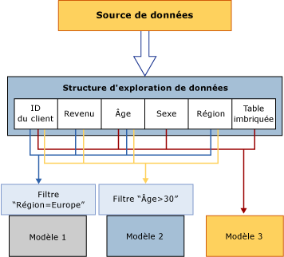

# Structures d'exploration de données (Analysis Services – exploration de données)
[!INCLUDE[ssas-appliesto-sqlas](../../includes/ssas-appliesto-sqlas.md)]
  La structure d'exploration de données définit les données à partir desquelles les modèles d'exploration de données sont construits : elle spécifie la vue de source de données, le nombre et le type de colonnes, ainsi qu'une partition facultative en jeux d'apprentissage et en jeux de test. Une structure d'exploration de données individuelle peut prendre en charge plusieurs modèles d'exploration de données qui partagent le même domaine. Le diagramme suivant illustre la relation de la structure d'exploration de données par rapport à la source de données et à ses modèles d'exploration de données constitutifs.  
  
   
  
 La structure d'exploration de données dans le diagramme repose sur une source de données qui contient plusieurs tables ou vues, jointes dans le champ CustomerID. Une table contient des informations sur les clients, telles que la région géographique, l’âge, le revenu et le genre, alors que la table imbriquée connexe contient plusieurs lignes d'informations supplémentaires sur chaque client, telles que les produits achetés par le client. Le diagramme montre que plusieurs modèles peuvent être construits sur une même structure d'exploration de données, et que ces modèles peuvent utiliser des colonnes différentes de la structure.  
  
 **Modèle 1** Utilise CustomerID, Income, Age, Region, et filtre les données sur Region.  
  
 **Modèle 2** Utilise CustomerID, Income, Age, Region, et filtre les données sur Age.  
  
 **Modèle 3** Utilise CustomerID, Age, Gender et la table imbriquée, sans filtre.  
  
 Comme les modèles utilisent des colonnes différentes pour l'entrée et comme deux des modèles limitent également les données utilisées dans le modèle en appliquant un filtre, les modèles peuvent avoir des résultats très différents bien qu'ils soient basés sur les mêmes données. Notez que la colonne CustomerID est requise dans tous les modèles parce que c'est la seule colonne disponible qui peut être utilisée comme clé de cas.  
  
 Cette section explique l'architecture de base des structures d'exploration de données : procédure pour définir une structure d'exploration de données, pour la remplir avec des données et pour l'utiliser afin de créer des modèles. Pour plus d’informations sur la façon de gérer ou d’exporter des structures d’exploration de données existantes, consultez [Gestion des solutions et des objets d’exploration de données](../../analysis-services/data-mining/management-of-data-mining-solutions-and-objects.md).  
  
## Définition d'une structure d'exploration de données  
 La configuration d'une structure d'exploration de données inclut les étapes suivantes :  
  
-   Définissez une source de données.  
  
-   Sélectionnez les colonnes de données à inclure dans la structure (toutes les colonnes ne doivent pas être ajoutées au modèle) et en définissant une clé.  
  
-   Définissez une clé pour la structure, notamment la clé pour la table imbriquée, le cas échéant.  
  
-   Spécifiez si les données sources doivent être séparées dans un jeu d'apprentissage et un jeu de test. Cette étape est facultative.  
  
-   Traitez la structure.  
  
 Ces étapes sont décrites de manière plus détaillée dans les sections suivantes.  
  
### Sources de données des structures d'exploration de données  
 Lorsque vous définissez une structure d'exploration de données, vous utilisez des colonnes qui sont disponibles dans une vue de source de données existante. Une vue de source de données est un objet partagé qui vous permet de combiner plusieurs sources de données et de les utiliser comme source unique. Les sources de données d'origine ne sont pas visibles par les applications clientes, et vous pouvez utiliser les propriétés de la vue de source de données pour modifier les types de données, créer des agrégations ou définir des alias de colonne.  
  
 Si vous construisez plusieurs modèles d'exploration de données à partir de la même structure d'exploration de données, les modèles peuvent utiliser des colonnes différentes de la structure. Par exemple, vous pouvez créer une structure unique, puis construire à partir d'elle des modèles d'arbre de décision et de clustering distincts, chaque modèle utilisant des colonnes différentes et prévoyant des attributs différents.  
  
 De plus, chaque modèle peut utiliser les colonnes de la structure de différentes façons. Par exemple, votre vue de source de données peut contenir une colonne Revenus que vous pouvez lier de différentes façons pour différents modèles.  
  
 La structure d’exploration de données stocke la définition de la source de données et des colonnes qu’elle contient sous forme de *liaisons* aux données sources. Pour plus d’informations sur les liaisons de sources de données, consultez [Sources de données et liaisons &#40;SSAS Multidimensionnel&#41;](../../analysis-services/multidimensional-models/data-sources-and-bindings-ssas-multidimensional.md). Notez toutefois que vous pouvez également créer une structure d’exploration de données sans la lier à une source de données spécifique en utilisant l’instruction DMX [CREATE MINING STRUCTURE &#40;DMX&#41;](../../dmx/create-mining-structure-dmx.md).  
  
### Colonnes de structure d'exploration de données  
 Les composants constituant la structure d'exploration de données sont les colonnes de structure d'exploration de données qui décrivent les données inscrites dans la source de données. Ces colonnes contiennent des informations, telles que le type de données, le type de contenu et le mode de distribution des données. La structure d'exploration de données ne contient pas d'informations sur la façon dont les colonnes sont utilisées pour un modèle d'exploration de données spécifique, ni sur le type d'algorithme utilisé pour générer un modèle ; ces informations sont définies dans le modèle d'exploration de données lui-même.  
  
 Une structure d'exploration de données peut également contenir des tables imbriquées. Une table imbriquée représente une relation un-à-plusieurs entre l'entité d'un cas et les attributs qui lui sont associés. Par exemple, si les informations décrivant le client se trouvent dans une table et que les achats du client se trouvent dans une autre table, vous pouvez utiliser des tables imbriquées pour combiner les informations dans un seul cas. L'identificateur du client est alors l'entité tandis que les achats sont les attributs associés. Pour plus d’informations sur l’utilisation des tables imbriquées, consultez [Tables imbriquées &#40;Analysis Services - Exploration de données &#41;](../../analysis-services/data-mining/nested-tables-analysis-services-data-mining.md).  
  
 Pour créer un modèle d'exploration de données dans [!INCLUDE[ssBIDevStudioFull](../../includes/ssbidevstudiofull-md.md)], vous devez d'abord créer une structure d'exploration de données. L'Assistant Exploration de données vous guide tout au long du processus de création d’une structure d'exploration de données, de choix des données et d’ajout d’un modèle d’exploration de données.  
  
 Si vous créez un modèle d’exploration de données avec les extensions DMX (Data Mining Extensions), vous pouvez spécifier le modèle et les colonnes qu’il contient pour que DMX crée automatiquement la structure d’exploration de données requise. Pour plus d’informations, consultez [CREATE MINING MODEL &#40;DMX&#41;](../../dmx/create-mining-model-dmx.md).  
  
 Pour plus d’informations, consultez [Colonnes de structure d’exploration de données](../../analysis-services/data-mining/mining-structure-columns.md).  
  
### Division des données dans des jeux d'apprentissage et de test  
 Lorsque vous définissez les données d'une structure d'exploration de données, vous pouvez également spécifier que certaines données soient utilisées pour l'apprentissage et d'autres pour les tests. Par conséquent, il n'est plus nécessaire de séparer vos données avant de créer une structure d'exploration de données. À la place, tandis que vous créez votre modèle, vous pouvez spécifier qu'un certain pourcentage des données soit réservé pour les tests et le reste utilisé pour l'apprentissage, ou vous pouvez spécifier un certain nombre de cas à utiliser comme jeu de données de test. Les informations sur les jeux de données d'apprentissage et de test sont mises en cache avec la structure d'exploration de données ; par conséquent, le même jeu de test peut être utilisé avec tous les modèles basés sur cette structure.  
  
 Pour plus d'informations, voir [Training and Testing Data Sets](../../analysis-services/data-mining/training-and-testing-data-sets.md).  
  
### Activation de l'extraction  
 Vous pouvez ajouter des colonnes à la structure d'exploration de données même si vous n'envisagez pas d'utiliser la colonne dans un modèle d'exploration de données spécifique. Cela est utile si, par exemple, vous souhaitez récupérer les adresses de messagerie des clients dans un modèle de clustering, sans utiliser l'adresse de messagerie pendant le processus d'analyse. Pour ignorer une colonne pendant l'analyse et la phase de prédiction, vous devez l'ajouter à la structure, mais ne spécifiez pas d'utilisation pour la colonne, ou définissez l'indicateur d'utilisation sur Ignorer. Des données marquées de cette façon peuvent toujours être utilisées dans des requêtes si l'extraction a été activée sur le modèle d'exploration de données et si vous disposez des autorisations appropriées. Par exemple, vous pouvez examiner les clusters qui résultent de l'analyse de tous les clients, puis utiliser une requête d'extraction pour obtenir les noms et les adresses de messagerie des clients dans un cluster particulier, même si ces colonnes de données n'ont pas été utilisées pour générer le modèle.  
  
 Pour plus d’informations, consultez [Requêtes d’extraction &#40;exploration de données&#41;](../../analysis-services/data-mining/drillthrough-queries-data-mining.md).  
  
### Traitement des structures d'exploration de données  
 Une structure d'exploration de données est un simple conteneur de métadonnées tant qu'elle n'est pas traitée. Quand vous traitez une structure d’exploration de données, [!INCLUDE[ssASnoversion](../../includes/ssasnoversion-md.md)] crée un cache qui stocke des statistiques sur les données, ainsi que des informations sur la manière dont les attributs continus sont discrétisés et toute autre information qui sera utilisée ultérieurement par les modèles d’exploration de données. Le modèle d'exploration de données lui-même ne stocke pas ces informations de synthèse, mais référence à la place des informations qui ont été mises en cache lorsque la structure d'exploration de données a été traitée. Par conséquent, vous n'avez pas à retraiter la structure chaque fois que vous ajoutez un nouveau modèle à une structure existante ; vous pouvez simplement traiter le modèle.  
  
 Vous pouvez choisir d'ignorer ce cache après le traitement, s'il est très volumineux ou si vous souhaitez supprimer des données détaillées. Si vous ne voulez pas mettre ces données en cache, vous pouvez affecter à la propriété **CacheMode** de la structure d’exploration de données la valeur **ClearAfterProcessing**. Cela détruira le cache lorsque tous les modèles auront été traités. L’affectation de la valeur **ClearAfterProcessing** à la propriété **CacheMode** désactive l’extraction dans le modèle d’exploration de données.  
  
 Toutefois, après avoir détruit le cache, vous ne pouvez pas ajouter de nouveaux modèles à la structure d'exploration de données. Si vous ajoutez un nouveau modèle d'exploration de données à la structure, ou modifiez les propriétés de modèles existants, vous devez d'abord retraiter la structure d'exploration de données. Pour plus d’informations, consultez [Exigences et considérations concernant le traitement &#40;exploration de données&#41;](../../analysis-services/data-mining/processing-requirements-and-considerations-data-mining.md).  
  
### Affichage des structures d'exploration de données  
 Vous ne pouvez pas utiliser de visionneuses pour parcourir les données dans une structure d'exploration de données. Toutefois, dans [!INCLUDE[ssBIDevStudioFull](../../includes/ssbidevstudiofull-md.md)], vous pouvez utiliser l’onglet **Structure d’exploration de données** du Concepteur de modèle d’exploration de données pour afficher les colonnes de structure et leurs définitions. Pour plus d’informations, consultez [Concepteur d’exploration de données](../../analysis-services/data-mining/data-mining-designer.md).  
  
 Si vous souhaitez consulter les données de la structure d'exploration de données, vous pouvez créer des requêtes à l'aide des extensions DMX. Par exemple, l'instruction `SELECT * FROM <structure>.CASES` renvoie toutes les données incluses dans la structure d'exploration de données. Pour extraire ces informations, la structure d'exploration de données doit avoir été traitée, et les résultats du traitement doivent être mis en cache.  
  
 L'instruction `SELECT * FROM <model>.CASES` renvoie les mêmes colonnes, mais uniquement pour les cas inclus dans le modèle en question. Pour plus d’informations, consultez [SELECT FROM &#60;structure&#62;.CASES](../../dmx/select-from-structure-cases.md) et [SELECT FROM &#60;modèle&#62;.CASES &#40;DMX&#41;](../../dmx/select-from-model-cases-dmx.md).  
  
## Utilisation des modèles d'exploration de données avec les structures d'exploration de données  
 Un modèle d'exploration de données applique un algorithme de modèle d'exploration de données aux données qui sont représentées par une structure d'exploration de données. Un modèle d'exploration de données est un objet appartenant à une certaine structure d'exploration de données, et il hérite de toutes les valeurs des propriétés définies par la structure d'exploration de données. Le modèle peut utiliser toutes les colonnes que contient la structure d'exploration de données ou un sous-ensemble de ces colonnes. Vous pouvez ajouter plusieurs copies d'une colonne de structure à une structure. Vous pouvez également ajouter plusieurs copies d’une colonne de structure à un modèle, puis assigner des noms différents, ou *alias*, à chaque colonne de structure dans le modèle. Pour plus d’informations sur l’affectation d’alias aux colonnes de structure, consultez [Créer un alias pour une colonne du modèle](../../analysis-services/data-mining/create-an-alias-for-a-model-column.md) et [Propriétés du modèle d’exploration de données](../../analysis-services/data-mining/mining-model-properties.md).  
  
 Pour plus d’informations sur l’architecture des modèles d’exploration de données, consultez [Modèles d’exploration de données &#40;Analysis Services - Exploration de données&#41;](../../analysis-services/data-mining/mining-models-analysis-services-data-mining.md).  
  
## Tâches associées  
 Utilisez les liens fournis ici pour en savoir plus sur la manière de définir, gérer et utiliser les structures d'exploration de données.  
  
|Tâches|Liens|  
|-----------|-----------|  
|Utiliser des structures d'exploration de données relationnelles|[créer une structure d'exploration de données relationnelle](../../analysis-services/data-mining/create-a-new-relational-mining-structure.md)   [Ajouter une Table imbriquée à une Structure d’exploration de données](../../analysis-services/data-mining/add-a-nested-table-to-a-mining-structure.md)|  
|Utiliser des structures d'exploration de données basées sur des cubes OLAP|[Créer une structure d’exploration de données OLAP](../../analysis-services/data-mining/create-a-new-olap-mining-structure.md)|  
|Utiliser des colonnes dans une structure d'exploration de données|[Ajouter des colonnes à une Structure d’exploration de données](../../analysis-services/data-mining/add-columns-to-a-mining-structure.md)   [Supprimer des colonnes d'une structure d'exploration de données](../../analysis-services/data-mining/remove-columns-from-a-mining-structure.md)|  
|Modifier ou interroger les propriétés et les données de structure d'exploration de données|[Modifier les propriétés d'une structure d'exploration de données](../../analysis-services/data-mining/change-the-properties-of-a-mining-structure.md)|  
|Utiliser des sources de données sous-jacentes et mettre à jour des données sources|[Modifier la vue de Source de données utilisée pour une Structure d’exploration de données](../../analysis-services/data-mining/edit-the-data-source-view-used-for-a-mining-structure.md)   [traiter une structure d'exploration de données](../../analysis-services/data-mining/process-a-mining-structure.md)|  
  
## Voir aussi  
 [Objets de bases de données &#40;Analysis Services - Données multidimensionnelles &#41;](../../analysis-services/multidimensional-models/olap-logical/database-objects-analysis-services-multidimensional-data.md)   
 [Les modèles d’exploration de données & #40 ; Analysis Services - Exploration de données & #41 ;](../../analysis-services/data-mining/mining-models-analysis-services-data-mining.md)  
  
  
