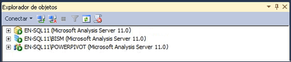

# Déterminer le mode serveur d'une instance Analysis Services
[!INCLUDE[ssas-appliesto-sqlas](../../includes/ssas-appliesto-sqlas.md)]
  Analysis Services peut être installé dans l’un des trois modes serveur suivants : Multidimensionnel et exploration de données (par défaut), [!INCLUDE[ssGemini](../../includes/ssgemini-md.md)] pour SharePoint et Tabulaire. Le mode serveur d'une instance Analysis Services est déterminé au moment de l'installation lorsque vous choisissez les options d'installation du serveur.  
  
 Le mode serveur détermine le type de solution que vous créez et déployez. Si vous n'avez pas installé le logiciel serveur et que vous souhaitez savoir dans quel mode le serveur a été installé, vous pouvez utiliser les informations de cette rubrique pour déterminer le mode. Pour plus d’informations sur la disponibilité des fonctionnalités dans un mode spécifique, consultez [comparaison sous forme de tableau et les Solutions multidimensionnelles ](../../analysis-services/comparing-tabular-and-multidimensional-solutions-ssas.md).  
  
 Si vous ne souhaitez pas utiliser le mode serveur que vous avez installé, vous devez désinstaller puis réinstaller le logiciel en choisissant le mode de votre choix. Vous pouvez également installer une autre instance d'Analysis Services sur le même ordinateur afin que les différentes instances s'exécutent dans différents modes.  
  
## Icônes de serveur dans l'Explorateur d'objets  
 La méthode la plus simple pour déterminer le mode serveur consiste à se connecter au serveur dans SQL Server Management Studio et à repérer l'icône située à côté du nom du serveur dans l'Explorateur d'objets. L’illustration suivante montre trois instances d’Analysis Services déployées en mode MDX, Tabulaire, et [!INCLUDE[ssGemini](../../includes/ssgemini-md.md)] :  
  
   
  
## Affichage de la propriété DeploymentMode dans le fichier MSMDSRV.INI  
 Vous pouvez également vérifier la propriété **DeploymentMode** dans le fichier msmdsrv.ini inclus dans chaque instance Analysis Services. La valeur de cette propriété identifie le mode serveur. Les valeurs valides sont 0 (multidimensionnel), 1 (SharePoint) ou 2 (tabulaire). Vous devez être un administrateur d’ [!INCLUDE[ssASnoversion](../../includes/ssasnoversion-md.md)] (autrement dit, un membre du rôle Serveur) pour pouvoir ouvrir le fichier msmdsrv.ini. Ce fichier contient du code XML structuré. Vous pouvez utiliser le Bloc-notes ou un autre éditeur de texte pour afficher le fichier.  
  
> [!CAUTION]  
>  Ne modifiez pas la valeur de la propriété **DeploymentMode** . La modification manuelle de la propriété après l'installation du serveur n'est pas prise en charge.  
  
## À propos de la propriété DeploymentMode  
 La propriété**DeploymentMode** détermine le contexte opérationnel d'une instance de serveur Analysis Services. Cette propriété constitue le « mode serveur » dans les boîtes de dialogue, les messages et la documentation. Cette propriété est initialisée par le programme d'installation selon l'installation d'Analysis Services. Cette propriété doit être considérée uniquement comme une propriété interne, toujours à l'aide de la valeur spécifiée par le programme d'installation.  
  
 Les valeurs valides pour cette propriété sont les suivantes :  
  
|Value|Description|  
|-----------|-----------------|  
|0|Ceci est la valeur par défaut. Elle spécifie le mode multidimensionnel, utilisé pour servir les bases de données multidimensionnelles qui utilisent le stockage MOLAP, HOLAP et ROLAP, ainsi que les modèles d'exploration de données.|  
|1|Spécifie des instances d’Analysis Services installées dans le cadre d’un déploiement [!INCLUDE[ssGemini](../../includes/ssgemini-md.md)] pour SharePoint. Ne modifiez pas la propriété du mode de déploiement de l’instance Analysis Services qui fait partie d’une installation [!INCLUDE[ssGemini](../../includes/ssgemini-md.md)] pour SharePoint. [!INCLUDE[ssGemini](../../includes/ssgemini-md.md)] ne s’exécuteront plus sur le serveur si vous modifiez le mode.|  
|2|Spécifie le mode tabulaire utilisé pour héberger les bases de données model tabulaires qui utilisent le stockage en mémoire ou le stockage DirectQuery.|  
  
 Chaque mode est exclusif pour l'autre. Un serveur configuré pour le mode tabulaire ne peut pas exécuter des bases de données Analysis Services qui contiennent des cubes et des dimensions. Si le matériel informatique sous-jacent peut prendre cela en charge, vous pouvez installer plusieurs instances d'Analysis Services sur le même ordinateur et configurer chaque instance pour utiliser un mode de déploiement différent. Souvenez-vous qu'Analysis Services est une application qui consommée beaucoup de ressources. Le déploiement de plusieurs instances sur le même système est recommandé uniquement pour les serveurs haut de gamme.  
  
## Voir aussi  
 [Installer Analysis Services](../../analysis-services/instances/install-windows/install-analysis-services.md)   
 [Installer Analysis Services en mode multidimensionnel et exploration de données](http://msdn.microsoft.com/library/8a1f33e8-2bd6-4fb8-bd46-c86f2a067f60)   
 [Installation de Power Pivot pour SharePoint 2010](http://msdn.microsoft.com/en-us/8d47dde7-c941-4280-a934-e2fe3f9a938f)   
 [Se connecter à Analysis Services](../../analysis-services/instances/connect-to-analysis-services.md)   
 [Solutions de modèles tabulaires](../../analysis-services/tabular-models/tabular-models-ssas.md)   
 [Solutions de modèles multidimensionnels ](../../analysis-services/multidimensional-models/multidimensional-model-solutions-ssas.md)   
 [Les modèles d’exploration de données & #40 ; Analysis Services - Exploration de données & #41 ;](../../analysis-services/data-mining/mining-models-analysis-services-data-mining.md)  
  
  
