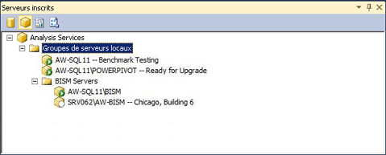

# Inscrire une instance Analysis Services dans un groupe de serveurs
[!INCLUDE[ssas-appliesto-sqlas](../../includes/ssas-appliesto-sqlas.md)]
Si vous utilisez un grand nombre d'instances de serveur Analysis Services, vous pouvez créer des groupes de serveurs dans Management Studio pour faciliter l'administration des serveurs. La finalité d'un groupe de serveurs est d'assurer la proximité au sein d'un groupe de serveurs associés dans l'espace de travail d'administration. Par exemple, supposons que votre rôle consiste à gérer dix instances distinctes d'Analysis Services. En les regroupant par mode serveur, par critères de temps d'exécution ou par service ou région, vous pouvez afficher les instances qui partagent les mêmes caractéristiques et vous y connecter plus facilement. Vous pouvez également ajouter des informations descriptives qui vous permettent de vous souvenir du mode d'utilisation du serveur.  
  
   
  
 Les groupes de serveurs peuvent être créés dans une structure hiérarchique. Le groupe de serveurs locaux est le nœud racine. Il contient toujours les instances d'Analysis Services qui s'exécutent sur l'ordinateur local. Vous pouvez ajouter des serveurs distants à n'importe quel groupe, y compris le groupe local.  
  
 Après avoir créé un groupe de serveurs, vous devez utiliser le volet Serveurs inscrits pour afficher les serveurs membres et vous y connecter. Le volet filtre les instances de SQL Server par type de serveur (moteur de base de données, Analysis Services, Reporting Services et Integration Services). Vous cliquez sur un type de serveur pour afficher les groupes de serveurs créés pour lui. Pour vous connecter à un serveur spécifique au sein d'un groupe, vous double-cliquez sur un serveur du groupe.  
  
 Les informations de connexion définies pour le serveur, notamment le nom du serveur, sont conservées avec l'inscription du serveur. Vous ne pouvez pas modifier les informations de connexion ni utiliser le nom enregistré en cas de connexion au serveur à l'aide d'autres outils.  
  
## Créer un groupe de serveurs et ajouter des serveurs inscrits  
  
1.  Dans Management Studio, cliquez sur Serveurs inscrits dans le menu Affichage pour ouvrir le volet Serveurs inscrits dans l'espace de travail. Par défaut, un groupe de serveurs locaux est déjà créé. Toutes les instances d'Analysis Services qui s'exécutent sur le serveur local en sont membres.  
  
2.  Cliquez avec le bouton droit sur le groupe de serveurs locaux, sélectionnez Nouveau groupe de serveurs, puis attribuez un nom au groupe.  
  
3.  Cliquez avec le bouton droit sur le groupe de serveurs et sélectionnez Nouvelle inscription de serveur. Entrez le nom réseau d'un serveur local ou distant, y compris le nom de l'instance si le serveur a été installé en tant qu'instance nommée. Éventuellement, vous pouvez fournir un nom de serveur inscrit qui apparaît dans le volet Serveurs inscrits. Ce nom est utilisé dans le volet Serveurs inscrits uniquement. Vous ne pouvez pas l'utiliser pour renommer un serveur, ni l'utiliser dans une chaîne de connexion. Un nom de serveur inscrit peut être plus descriptif que le nom du serveur réel ou inclure d'autres caractéristiques d'identification qui contribuent à distinguer ce serveur des autres serveurs.  
  
  
