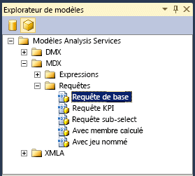

# <a name="use-analysis-services-templates-in-sql-server-management-studio"></a>Utiliser des modèles Analysis Services dans SQL Server Management Studio
[!INCLUDE[ssas-appliesto-sqlas-all-aas](../../includes/ssas-appliesto-sqlas-all-aas.md)]

  [!INCLUDE[ssManStudioFull](../../includes/ssmanstudiofull-md.md)] fournit un ensemble de modèles qui vous aident à créer rapidement des scripts XMLA et des requêtes DMX ou MDX, à créer des indicateurs de performance clés dans un cube ou un modèle tabulaire, à générer des scripts pour les opérations de sauvegarde et de restauration et à effectuer de nombreuses autres tâches. Les modèles sont situés dans l' **Explorateur de modèles** de [!INCLUDE[ssManStudio](../../includes/ssmanstudio-md.md)].  
  
 Cette rubrique inclut une liste de modèles pour les modèles MDX et tabulaires et fournit des exemples de génération d'une requête MDX et d'une instruction XMLA à l'aide de l'explorateur de métadonnées et de l'explorateur de modèles.  
  
 Cette rubrique ne couvre pas les modèles DMX. Pour obtenir des exemples montrant comment créer des requêtes d’exploration de données à l’aide de modèles, consultez [Créer une requête DMX dans SQL Server Management Studio](../../analysis-services/data-mining/create-a-dmx-query-in-sql-server-management-studio.md) ou [Créer une requête singleton de prédiction à partir d’un modèle](../../analysis-services/data-mining/create-a-singleton-prediction-query-from-a-template.md).  
  
##  <a name="bkmk_usingTE"></a> Ouvrir un modèle Analysis Services  
 Tous les modèles pour les requêtes de moteur de base de données ainsi que les requêtes et commandes Analysis Services sont disponibles dans l'explorateur de modèles.  
  
 Pour ouvrir l' **Explorateur de modèles**, sélectionnez-le dans le menu **Affichage** . Ensuite, cliquez sur l'icône en forme de cube pour afficher la liste des modèles disponibles pour [!INCLUDE[ssASnoversion](../../includes/ssasnoversion-md.md)].  
  
   
  
 Pour ouvrir un modèle, cliquez avec le bouton droit sur son nom et sélectionnez **Ouvrir**ou faites glisser le modèle dans une fenêtre de requête déjà ouverte. Une fois la fenêtre de requête ouverte, vous pouvez utiliser les commandes de la barre d'outils ou du menu Requête pour concevoir des instructions :  
  
-   Pour vérifier la syntaxe d'une requête, cliquez sur **Analyser**.  
  
-   Pour exécuter une requête, cliquez sur **Exécuter**.  
  
     Pour arrêter une requête en cours d'exécution, cliquez sur **Annuler l'exécution de la requête**.  
  
-   Consultez les résultats d'une requête dans l'onglet **Résultats** en bas de l'écran.  
  
     Basculez vers l'onglet **Messages** pour afficher le nombre d'enregistrements retournés, les erreurs, les instructions de requête et tous les autres messages associés à l'exécution de la requête. Par exemple, si vous exécutez une instruction DAX sur un modèle exécuté en mode Requête directe, vous pouvez voir l'instruction Transact-SQL qui est générée par le moteur d'analyse en mémoire xVelocity (VertiPaq).  
  
##  <a name="BKMK_Building_Queries"></a> Générer et exécuter une requête MDX sur un modèle tabulaire à l'aide d'un modèle  
 Cet exemple montre comment créer une requête MDX dans SQL Server Management Studio en utilisant une base de données model tabulaire comme source de données. Pour répéter cet exemple sur votre ordinateur, vous pouvez [télécharger l'exemple de projet de modèle tabulaire Adventureworks](http://go.microsoft.com/fwlink/?LinkId=231183).  
  
> [!WARNING]  
>  Vous ne pouvez pas utiliser de requêtes MDX sur les modèles tabulaires qui ont été déployés en mode Requête directe. En revanche, vous pouvez envoyer des requêtes équivalentes à l'aide de requêtes de table DAX avec la commande EVALUATE. Pour en savoir plus, voir [Paramètres des requêtes DAX](http://msdn.microsoft.com/en-us/c5841b4e-3395-4237-815b-9822a691e544).  
  
#### <a name="create-an-mdx-query-from-a-template"></a>Créer une requête MDX à partir d'un modèle  
  
1.  Dans [!INCLUDE[ssManStudioFull](../../includes/ssmanstudiofull-md.md)], ouvrez l'instance qui contient le modèle tabulaire à interroger. Cliquez avec le bouton droit sur l'icône de base de données et sélectionnez **Nouvelle requête**, puis **MDX**.  
  
2.  Dans l'explorateur de modèles, dans les modèles Analysis Services, ouvrez **MDX**, puis ouvrez **Requêtes**. Faites glisser **Requête de base** dans la fenêtre de requête.  
  
3.  À l'aide de l' **Explorateur de métadonnées**, faites glisser les champs et mesures suivants dans le modèle de requête :  
  
    1.  Remplacez \<row_axis, mdx_set > avec **[Product Category]. [ Product Category Name]**.  
  
    2.  Remplacez \<column_axis, mdx_set > avec **[Date]. [ Calendar Year]. [Année civile]** .  
  
    3.  Remplacez \<from_clause, mdx_name > avec **[Internet Sales]**.  
  
    4.  Remplacez \<where_clause, mdx_set > avec **[Measures]. [ Internet Total Sales]**.  
  
4.  Vous pouvez exécuter la requête en l'état, mais vous souhaiterez probablement apporter certaines modifications, notamment ajouter une fonction pour retourner des membres spécifiques. Par exemple, tapez **.members** après **[Product Category].[Product Category Name]**. Pour en savoir plus, voir [Using Member Expressions](../../mdx/using-member-expressions.md).  
  
##  <a name="bkmk_backup"></a> Créer un script XMLA à partir d'un modèle  
 Les modèles de commande XMLA fournis dans l'explorateur de modèles peuvent être utilisés pour créer des scripts afin de surveiller et de mettre à jour les objets [!INCLUDE[ssASnoversion](../../includes/ssasnoversion-md.md)] , que l'instance soit en mode MDX, en mode d'exploration de données ou en mode tabulaire. Les modèles **XMLA** incluent des exemples pour les types de scripts suivants :  
  
-   Opérations de sauvegarde, de restauration et de synchronisation  
  
-   Annuler un processus ou une commande spécifique  
  
-   Traiter un objet  
  
-   Découvrir des ensembles de lignes de schéma  
  
-   Surveiller l'état du serveur, notamment les travaux, les connexions, les transactions, la mémoire et les compteurs de performance  
  
#### <a name="create-a-backup-command-script-from-a-template"></a>Créer un script de commande de sauvegarde à partir d'un modèle  
  
1.  Dans [!INCLUDE[ssManStudioFull](../../includes/ssmanstudiofull-md.md)], ouvrez l'instance qui contient la base de données à interroger. Cliquez avec le bouton droit sur l'icône de base de données et sélectionnez **Nouvelle requête**, puis **XMLA**.  
  
    > [!WARNING]  
    >  Vous ne pouvez pas définir le contexte d'une requête XMLA en modifiant la liste de restriction ou en spécifiant une base de données dans la boîte de dialogue de connexion. Vous devez ouvrir la fenêtre de requête XMLA à partir de la base de données à interroger.  
  
2.  Faites glisser le modèle **Sauvegarde** dans la fenêtre de requête vide.  
  
3.  Double-cliquez sur le texte dans le \<DatabaseID > élément.  
  
4.  Dans l'Explorateur d'objets, sélectionnez la base de données que vous voulez sauvegarder, puis faites-la glisser entre les crochets de l'élément DatabaseID.  
  
5.  Double-cliquez sur le texte dans le \<fichier > élément. Tapez le chemin du fichier de sauvegarde suivi de l'extension de fichier .abf. Spécifiez le chemin d'accès de fichier complet si vous n'utilisez pas l'emplacement de sauvegarde par défaut. Pour plus d’informations, consultez [Sauvegarde, restauration et synchronisation de bases de données &#40;XMLA&#41;](../../analysis-services/multidimensional-models-scripting-language-assl-xmla/backing-up-restoring-and-synchronizing-databases-xmla.md).  
  
##  <a name="bkmk_schemarowset"></a> Générer une requête d'ensemble de lignes de schéma à l'aide d'un modèle XMLA  
 L' **Explorateur de modèles** contient un seul modèle pour les requêtes d'ensemble de lignes de schéma. Pour utiliser ce modèle, vous devez connaître les spécifications de l'ensemble de lignes de schéma spécifique à utiliser, notamment les éléments requis et les colonnes qui peuvent être utilisées comme restrictions. Pour plus d’informations, consultez [Ensembles de lignes de schéma Analysis Services](../../analysis-services/schema-rowsets/analysis-services-schema-rowsets.md).  
  
 Notez que de nombreux ensembles de lignes de schéma ont également été exposés sous forme de vues de gestion dynamiques (DMV) pour des raisons de simplification. En utilisant la vue DMV correspondante, vous pouvez interroger l'ensemble de lignes de schéma à l'aide d'une syntaxe telle que celle de Transact-SQL. Par exemple, les requêtes suivantes retournent les mêmes résultats, mais l'une est au format XML et l'autre au format tabulaire. Pour plus d’informations sur les vues DMV, consultez [Utiliser des vues de gestion dynamique &#40;DMV&#41; pour surveiller Analysis Services](../../analysis-services/instances/use-dynamic-management-views-dmvs-to-monitor-analysis-services.md).  
  
 Vue DMV qui retourne une liste de tous les ensembles de lignes de schéma disponibles en tant que vues DMV :  
  
```  
SELECT * FROM $system.DISCOVER_SCHEMA_ROWSETS  
```  
  
 Commande XMLA qui retourne la liste des ensembles de lignes de schéma disponibles :  
  
```  
<Discover xmlns="urn:schemas-microsoft-com:xml-analysis">  
<RequestType>DISCOVER_SCHEMA_ROWSETS</RequestType>  
    <Restrictions>  
<RestrictionList>  
</RestrictionList>  
</Restrictions>  
    <Properties>  
<PropertyList>  
   </PropertyList>  
</Properties>  
</Discover>  
```  
  
#### <a name="get-a-list-of-data-sources-for-a-tabular-model-using-a-schema-rowset-query"></a>Obtenir la liste des sources de données pour un modèle tabulaire à l'aide d'une requête d'ensemble de lignes de schéma  
  
1.  Dans [!INCLUDE[ssManStudioFull](../../includes/ssmanstudiofull-md.md)], ouvrez l'instance qui contient la base de données à interroger. Cliquez avec le bouton droit sur l'icône de base de données et sélectionnez **Nouvelle requête**, puis **XMLA**.  
  
    > [!WARNING]  
    >  Vous ne pouvez pas définir le contexte d'une requête XMLA en modifiant la liste de restriction ou en spécifiant une base de données dans la boîte de dialogue de connexion. Vous devez ouvrir la fenêtre de requête XMLA à partir de la base de données à interroger.  
  
2.  Ouvrez l' **Explorateur de modèles**, puis faites glisser le modèle, **Découvrir les ensembles de lignes du schéma**, dans la fenêtre de requête vide.  
  
3.  Dans le modèle, remplacez le [RequestType élément &#40;XMLA&#41; ](../../analysis-services/xmla/xml-elements-properties/requesttype-element-xmla.md) élément avec le texte suivant : `<RequestType>MDSCHEMA_INPUT_DATASOURCES</RequestType>`  
  
4.  Cliquez sur **Exécuter**.  
  
     Résultats attendus :  
  
    ```  
    <CATALOG_NAME>AW Internet Sales Tabular Model_ 24715b71-ea74-4828-aefc-d4c12c15db64</CATALOG_NAME>   
    <DATASOURCE_NAME>SqlServer localhost AdventureWorksDW2012</DATASOURCE_NAME>   
    <DATASOURCE_TYPE>Relational</DATASOURCE_TYPE>   
    <CREATED_ON>2011-10-12T20:27:05.196667</CREATED_ON>   
    <LAST_SCHEMA_UPDATE>2011-10-12T20:27:05.196667</LAST_SCHEMA_UPDATE>   
    <DESCRIPTION />   
    <TIMEOUT>0</TIMEOUT>   
    <DBMS_NAME>Microsoft SQL Server</DBMS_NAME>   
    <DBMS_VERSION>11.00.1724</DBMS_VERSION>  
  
    ```  
  
##  <a name="bkmk_Ref"></a> Référence du modèle Analysis Services  
 Les modèles suivants sont fournis pour travailler avec les bases de données Analysis Services et les objets qu'elles contiennent, notamment les structures et les modèles d'exploration de données, les cubes et les modèles tabulaires :  
  
|Catégorie|Modèle d'élément| Description|  
|--------------|-------------------|-----------------|  
|DMX\Contenu des modèles|Requête de contenu|Montre comment utiliser l’instruction DMX SELECT FROM  *\<modèle >*. Instruction de contenu pour extraire le contenu de jeu de lignes du schéma de modèle d’exploration de données pour un modèle d’exploration de données spécifié.|  
||Valeurs des colonnes continues|Montre comment utiliser l’instruction DMX SELECT DISTINCT FROM  *\<modèle >* instruction avec l’instruction DMX **RangeMin** et **RangeMax** fonctions pour récupérer un ensemble de valeurs dans une plage spécifiée à partir de colonnes continues dans un modèle d’exploration de données spécifié.|  
||Valeurs des colonnes discrètes|Montre comment utiliser l’instruction DMX SELECT DISTINCT FROM  *\<modèle >* instruction récupérer un ensemble complet de valeurs de colonnes discrètes dans un modèle d’exploration de données spécifié.|  
||Requête d'extraction|Indique comment utiliser l'instruction DMX SELECT * FROM Model.CASES avec la fonction DMX IsInNode pour exécuter une requête d'extraction|  
||Attributs de modèle|Montre comment utiliser la fonction DMX System.GetModelAttributes pour retourner une liste d'attributs utilisés par un modèle.|  
||Contenu PMML|Montre comment utiliser l’instruction DMX SELECT \* FROM  *\<modèle >*. Instruction PMML pour récupérer la représentation (Predictive Model Markup Language) du modèle d’exploration de données, pour les algorithmes qui prennent en charge cette fonctionnalité.|  
|DMX\Gestion des modèles|Ajouter un modèle|Indique comment utiliser l'instruction DMX ALTER MINING MODEL STRUCTURE pour ajouter un modèle d'exploration de données.|  
||Supprimer le modèle|Indique comment utiliser l'instruction DMX DELETE * FROM MINING MODEL pour supprimer le contenu d'un modèle d'exploration de données spécifié.|  
||Supprimer les exemples de structure|Indique comment utiliser l'instruction DMX DELETE FROM MINING STRUCTURE pour supprimer les exemples de structure de modèle d'exploration de données.|  
||Supprimer la structure|Indique comment utiliser l'instruction DMX DELETE FROM MINING STRUCTURE pour supprimer une structure de modèle d'exploration de données.|  
||Créer un modèle à partir de PMML|Indique comment utiliser l'instruction DMX CREATE MINING MODEL avec la clause FROM PMML pour créer un modèle d'exploration de données à partir d'une représentation PMML.|  
||Créer la structure imbriquée|Indique comment utiliser l'instruction DMX CREATE MINING STRUCTURE avec une liste de définition de colonnes imbriquées pour créer un modèle d'exploration de données avec des colonnes imbriquées.|  
||Créer la structure|Indique comment utiliser l'instruction DMX CREATE MINING STRUCTURE pour créer un modèle d'exploration de données.|  
||Supprimer le modèle|Indique comment utiliser l'instruction DMX DROP MINING MODEL pour supprimer un modèle d'exploration de données existant.|  
||Supprimer la structure|Indique comment utiliser l'instruction DMX DROP MINING STRUCTURE pour supprimer une structure d'exploration de données existante.|  
||Exporter le modèle|Indique comment utiliser l'instruction DMX EXPORT MINING MODEL à l'aide des clauses WITH DEPENDENCIES et PASSWORD pour exporter un modèle d'exploration de données, y compris la source de données et la vue de source de données dont dépend le modèle d'exploration de données, dans un fichier.|  
||Exporter la structure|Indique comment utiliser l'instruction DMX EXPORT MINING STRUCTURE à l'aide de la clause WITH DEPENDENCIES pour exporter une structure d'exploration de données, y compris tous les modèles d'exploration de données contenus dans la structure d'exploration de données, ainsi que la source de données et la vue de source de données dont dépend la structure d'exploration de données, dans un fichier.|  
||Importer|Indique comment utiliser l’instruction DMX IMPORT FROM à l’aide de la clause WITH PASSWORD pour effectuer une importation.|  
||Renommer le modèle|Indique comment utiliser l'instruction DMX RENAME MINING MODEL pour renommer un modèle d'exploration de données existant.|  
||Renommer la structure|Indique comment utiliser l'instruction DMX RENAME MINING STRUCTURE pour renommer un modèle d'exploration de données existant.|  
||Effectuer l'apprentissage du modèle|Indique comment utiliser l'instruction DMX INSERT INTO MINING MODEL pour effectuer l'apprentissage d'un modèle d'exploration de données dans une structure précédemment formée.|  
||Effectuer l'apprentissage de la structure imbriquée|Indique comment associer l'instruction DMX INSERT INTO MINING STRUCTURE à la requête de données sources SHAPE pour effectuer l'apprentissage d'un modèle d'exploration de données contenant des colonnes imbriquées avec des données contenant des tables imbriquées, récupérées à l'aide d'une requête, à partir d'une source de données existante.|  
||Effectuer l'apprentissage de la structure|Indique comment associer l'instruction DMX INSERT INTO MINING STRUCTURE à la requête de données sources OPENQUERY pour effectuer l'apprentissage d'une structure d'exploration de données.|  
|DMX\Requêtes de prédictions|Prédiction de base|Montre comment associer une instruction DMX SELECT FROM  *\<modèle >* instruction PREDICTION JOIN avec la requête de données sources OPENQUERY pour exécuter une requête de prédiction sur un modèle d’exploration de données à l’aide des données récupérées à l’aide d’une requête, à partir d’une source de données existante.|  
||Prédiction imbriquée|Montre comment associer une instruction DMX SELECT FROM  *\<modèle >* instruction PREDICTION JOIN avec les requêtes de données sources SHAPE et OPENQUERY pour exécuter une requête de prédiction sur un modèle d’exploration de données à l’aide de données qui contient des tables imbriquées, récupérées à l’aide d’une requête, à partir d’une source de données existante.|  
||Prédiction de singleton imbriqué|Montre comment utiliser une instruction DMX SELECT FROM  *\<modèle >* clause NATURAL PREDICTION JOIN pour exécuter une requête de prédiction sur un modèle d’exploration de données à l’aide d’une seule valeur, explicitement spécifiée dans la requête de prédiction, dans une colonne dont le nom correspond à une colonne dans le modèle d’exploration de données et qui contient un ensemble de valeurs dans une table imbriquée, créé à l’aide d’une instruction UNION dont les noms correspondent également à des colonnes imbriquées dans le modèle d’exploration de données.|  
||Prédiction de singleton|Montre comment utiliser une instruction DMX SELECT FROM \<modèle > NATURAL PREDICTION JOIN d’instruction à exécuter une requête de prédiction sur un modèle d’exploration de données à l’aide d’une seule valeur, explicitement spécifiée dans la requête de prédiction, dans une colonne dont le nom correspond à une colonne dans le modèle d’exploration de données.|  
||Appel de procédure stockée|Indique comment utiliser l'instruction DMX CALL pour appeler une procédure stockée.|  
|MDX\Expressions|Moyenne mobile-fixe|Indique comment utiliser les fonctions MDX **ParallelPeriod** et **CurrentMember** avec un jeu naturellement ordonné pour créer une mesure calculée qui fournit une moyenne mobile d'une mesure sur un nombre fixe de périodes de temps contenu par une hiérarchie dans une dimension de temps.|  
||Moyenne mobile-variable|Indique comment utiliser l'instruction MDX **CASE** au sein de la fonction **Avg** pour créer une mesure calculée qui fournit une moyenne mobile d'une mesure sur un nombre variable de périodes de temps contenu par une hiérarchie dans une dimension de temps.|  
||Cumul périodique jusqu'à ce jour|Indique comment utiliser la fonction MDX **PeriodsToDate** dans un membre calculé.|  
||Ratio to Parent|Indique comment utiliser la fonction MDX **Parent** pour créer une mesure calculée qui représente un pourcentage d'une mesure pour chaque enfant d'un membre parent dans une hiérarchie spécifiée.|  
||Ratio to Total|Indique comment utiliser le membre Tous pour créer une mesure calculée qui représente un pourcentage d'une mesure pour chaque membre dans une hiérarchie spécifiée.|  
|MDX\Requêtes|Requête de base|Indique une instruction MDX SELECT de base à partir de laquelle vous pouvez générer une requête MDX.|  
||Requête KPI|Indique comment utiliser les fonctions MDX **KPIValue** et **KPIGoal** pour récupérer les informations d'indicateur de performance clés dans une requête MDX.|  
||Requête sub-select|Indique comment créer une instruction MDX SELECT pour récupérer des informations d'un sous-cube défini par une autre instruction SELECT.|  
||Avec membre calculé|Indique comment utiliser la clause MDX WITH dans une instruction SELECT pour définir un membre calculé pour une requête MDX.|  
||Avec jeu nommé|Indique comment utiliser la clause MDX WITH dans une instruction SELECT pour définir un jeu nommé pour une requête MDX.|  
|XMLA\Gestion|Sauvegarde|Indique comment utiliser la commande XMLA **Sauvegarde** pour sauvegarder une base de données [!INCLUDE[ssASnoversion](../../includes/ssasnoversion-md.md)] dans un fichier.|  
||Annuler|Indique comment utiliser la commande XMLA **Annuler** pour annuler toutes les opérations en cours d’exécution dans la session (pour les utilisateurs autres que les administrateurs ou les administrateurs de serveur), la base de données (pour les administrateurs) ou l’instance (pour les administrateurs de serveur) actuelle.|  
||Créer une base de données de partition distante|Indique comment utiliser la commande XMLA **Créer** avec l’élément ASSL ( [!INCLUDE[ssASnoversion](../../includes/ssasnoversion-md.md)] Scripting Language) Database pour créer une base de données [!INCLUDE[ssASnoversion](../../includes/ssasnoversion-md.md)] et une source de données pour stocker les partitions distantes.|  
||Supprimer|Indique comment utiliser la commande XMLA **Supprimer** pour supprimer une base de données [!INCLUDE[ssASnoversion](../../includes/ssasnoversion-md.md)] existante.|  
||Traiter la dimension|Indique comment utiliser la commande XMLA **Batch** , associée à l'élément **Parallel** et à la commande **Process** , pour mettre à jour les attributs d'une dimension en utilisant une opération de traitement par lots parallèle.|  
||Traiter la partition|Indique comment utiliser la commande XMLA **Batch** , associée à l'élément **Parallel** et à la commande **Process** , pour traiter complètement une partition en utilisant une opération de traitement par lots parallèle.|  
||Restore|Indique comment utiliser la commande XMLA **Restore** pour restaurer une base de données [!INCLUDE[ssASnoversion](../../includes/ssasnoversion-md.md)] à partir d'un fichier de sauvegarde existant.|  
||Synchroniser|Indique comment utiliser la commande XMLA **Synchroniser** pour synchroniser une autre base de données [!INCLUDE[ssASnoversion](../../includes/ssasnoversion-md.md)] avec la base de données [!INCLUDE[ssASnoversion](../../includes/ssasnoversion-md.md)] database using the SkipMembership option for the SynchroniserSecurity tag.|  
|XMLA\Ensembles de lignes du schéma|Découvrir des ensembles de lignes de schéma|Indique comment utiliser la méthode XMLA **Découvrir** pour récupérer le contenu de l’ensemble de lignes du schéma DISCOVER_SCHEMA_ROWSETS.|  
|XMLA\État de serveur|Connexions|Indique comment utiliser la méthode XMLA **Découvrir** pour récupérer le contenu de l’ensemble de lignes du schéma DISCOVER_CONNECTIONS.|  
||Travaux|Indique comment utiliser la méthode XMLA **Découvrir** pour récupérer le contenu de l’ensemble de lignes du schéma DISCOVER_JOBS.|  
||Emplacements|Indique comment utiliser la méthode XMLA **Découvrir** pour récupérer le contenu de l’ensemble de lignes du schéma DISCOVER_LOCATIONS, en spécifiant le chemin des fichiers de sauvegarde d’emplacement.|  
||Verrous|Indique comment utiliser la méthode XMLA **Découvrir** pour récupérer le contenu de l’ensemble de lignes du schéma DISCOVER_LOCKS.|  
||Mémoire octroyée|Indique comment utiliser la méthode XMLA **Découvrir** pour récupérer le contenu de l’ensemble de lignes du schéma DISCOVER_MEMORYGRANT.|  
||Compteurs de performances|Indique comment utiliser la méthode XMLA **Découvrir** pour récupérer le contenu de l’ensemble de lignes du schéma DISCOVER_PERFORMANCE_COUNTERS.|  
||Sessions|Indique comment utiliser la méthode XMLA **Découvrir** pour récupérer le contenu de l’ensemble de lignes du schéma DISCOVER_SESSIONS.|  
||Traces|Indique comment utiliser la méthode XMLA **Découvrir** pour récupérer le contenu de l’ensemble de lignes du schéma DISCOVER_TRACES.|  
||Transactions|Indique comment utiliser la méthode XMLA **Découvrir** pour récupérer le contenu de l’ensemble de lignes du schéma DISCOVER_TRANSACTIONS.|  
  
## <a name="see-also"></a>Voir aussi  
 [Référence MDX &#40;Multidimensional Expressions&#41;](../../mdx/multidimensional-expressions-mdx-reference.md)   
 [Les Extensions d’exploration de données & #40 ; DMX & #41 ; Référence](../../dmx/data-mining-extensions-dmx-reference.md)   
 [Langage de script Analysis Services &#40;ASSL pour XMLA&#41;](../../analysis-services/scripting/analysis-services-scripting-language-assl-for-xmla.md)   
 [Analysis Services Scripting Language &#40;ASSL de XMLA&#41;](../../analysis-services/scripting/analysis-services-scripting-language-assl-for-xmla.md)  
  
  
