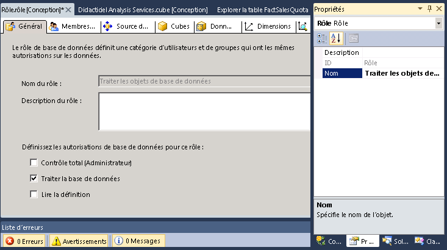
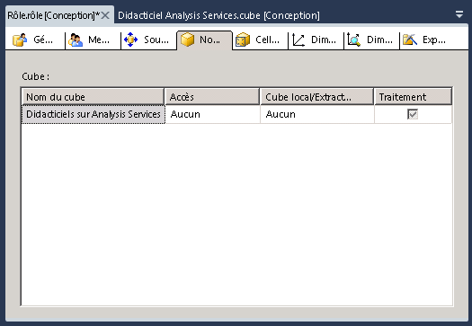

# Leçon 10 : octroi d’autorisations de base de données processus
[!INCLUDE[ssas-appliesto-sqlas](../includes/ssas-appliesto-sqlas.md)]

Après avoir installé une instance de [!INCLUDE[ssASnoversion](../includes/ssasnoversion-md.md)], tous les membres du rôle d'administrateur de serveur [!INCLUDE[ssASnoversion](../includes/ssasnoversion-md.md)] dans cette instance disposent d'autorisations sur le serveur pour exécuter n'importe quelle tâche dans l'instance de [!INCLUDE[ssASnoversion](../includes/ssasnoversion-md.md)]. Par défaut, aucun autre utilisateur n'est autorisé à administrer ou afficher des objets dans l'instance de [!INCLUDE[ssASnoversion](../includes/ssasnoversion-md.md)].  
  
Un membre du rôle d'administrateur de serveur peut octroyer aux utilisateurs l'accès administratif sur le serveur en les faisant membres du rôle. Un membre du rôle d'administrateur de serveur peut également accorder à des utilisateurs un accès plus limité en leur octroyant des autorisations d'administration ou d'accès limitées ou complètes au niveau de la base de données. Les autorisations administratives limitées incluent les autorisations de traiter ou de lire la définition au niveau de la base de données, du cube ou de la dimension.  
  
Dans les tâches de cette rubrique, vous allez définir le rôle de sécurité Process Database Objects, qui confère à ses membres l'autorisation de traiter tous les objets de base de données, mais ne les autorise pas à afficher des données dans la base de données.  
  
## Définition du rôle de sécurité Process Database Objects  
  
1.  Dans l’Explorateur de solutions, cliquez avec le bouton droit sur **Rôles** , puis cliquez sur **Nouveau rôle** pour ouvrir le Concepteur de rôle.  
  
2.  Activez la case à cocher **Traiter la base de données** .  
  
3.  Dans la fenêtre Propriétés, changez la propriété **Nom** de ce nouveau rôle en **Process Database Objects Role**.  
  
      
  
4.  Cliquez sur l'onglet **Adhésion** du Concepteur de rôles et cliquez sur **Ajouter**.  
  
5.  Entrez les comptes d'utilisateur de domaine ou de groupe Windows qui seront membres de ce rôle. Cliquez sur **Vérifier les noms** pour vérifier les informations de compte, puis cliquez sur **OK**.  
  
6.  Cliquez sur l'onglet **Cubes** du Concepteur de rôles.  
  
    Notez que les membres de ce rôle sont autorisés à traiter cette base de données, mais n'ont pas l'autorisation d'accéder aux données du cube du didacticiel de [!INCLUDE[ssASnoversion](../includes/ssasnoversion-md.md)] , ni d'accès Cube/Extraction local, comme le montre l'image suivante.  
  
      
  
7.  Cliquez sur l'onglet **Dimensions** du Concepteur de rôles.  
  
    Notez que les membres de ce rôle ont les autorisations nécessaires pour traiter tous les objets de dimension de cette base de données et, par défaut, ont les autorisations de lecture pour accéder à chaque objet de dimension dans la base de données du didacticiel de [!INCLUDE[ssASnoversion](../includes/ssasnoversion-md.md)] .  
  
8.  Dans le menu **Générer** , cliquez sur **Déployer Analysis Services Tutorial**.  
  
    Au terme de cette procédure, vous avez défini et déployé le rôle de sécurité Process Database Objects. Après le déploiement d'un cube vers l'environnement de production, les administrateurs du cube déployé peuvent ajouter des utilisateurs à ce rôle, ce qui leur permet de déléguer des responsabilités de traitement à des utilisateurs spécifiques.  
  
> [!NOTE]  
> Un projet complet pour la leçon 10 est disponible en téléchargeant et en installant les exemples mis à jour. Pour plus d’informations, consultez [Installer les exemples de données et de projets pour le didacticiel sur la modélisation multidimensionnelle Analysis Services](../analysis-services/install-sample-data-and-projects.md).  
  
## Voir aussi  
[Rôles et autorisations & #40 ; Analysis Services & #41 ;](../analysis-services/multidimensional-models/roles-and-permissions-analysis-services.md)  
  
  
  
