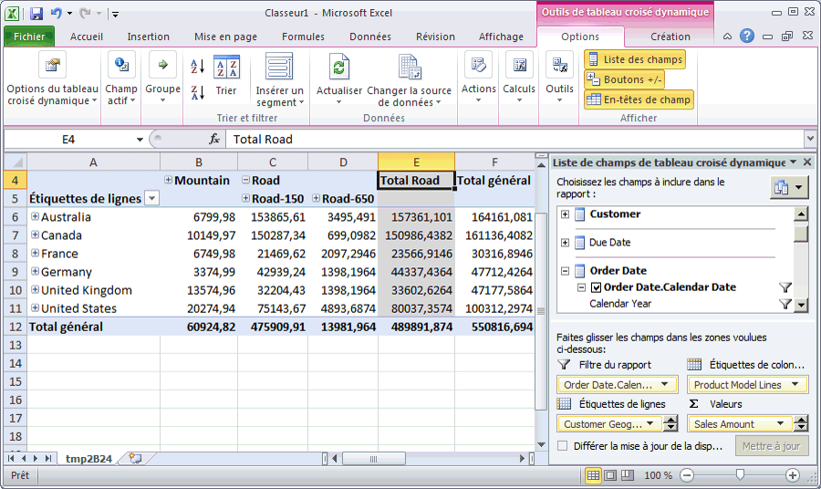

# Leçon 3-5-parcourir le Cube déployé
[!INCLUDE[ssas-appliesto-sqlas](../includes/ssas-appliesto-sqlas.md)]

Dans la tâche suivante, vous parcourez le cube du didacticiel [!INCLUDE[ssASnoversion](../includes/ssasnoversion-md.md)] . Étant donné que notre analyse compare la mesure entre plusieurs dimensions, utilisez un tableau croisé dynamique Excel pour parcourir vos données. Un tableau croisé dynamique permet de placer le client, la date et les informations produit sur différents axes afin que vous pouvoir voir les disparités des ventes sur Internet en fonction des points dans le temps, des caractéristiques démographiques de la clientèle et des gammes de produits.  
  
### Pour parcourir le cube déployé  
  
1.  Pour basculer dans le Concepteur de cube dans [!INCLUDE[ssBIDevStudio](../includes/ssbidevstudio-md.md)], double-cliquez sur le cube **[!INCLUDE[ssASnoversion](../includes/ssasnoversion-md.md)] Tutorial** dans le dossier **Cubes** de l'Explorateur de solutions.  
  
2.  Ouvrez l'onglet **Navigateur** , puis cliquez sur le bouton **Reconnecter** dans la barre d'outils du Concepteur.  
  
3.  Cliquez sur l'icône Excel pour lancer Excel avec la base de données d'espace de travail comme source de données. Lorsque vous êtes invité à activer les connexions, cliquez sur **Activer**.  
  
4.  Dans la liste des champs de tableau croisé dynamique, développez **Internet Sales**, puis faites glisser la mesure **Sales Amount** vers la zone **Valeurs** .  
  
5.  Dans la liste des champs de tableau croisé dynamique, développez **Product**.  
  
6.  Faites glisser la hiérarchie utilisateur **Product Model Lines** vers la zone **Colonnes** .  
  
7.  Dans la liste de champs de tableau croisé dynamique, développez **Customer**, puis **Location**et faites glisser la hiérarchie **Customer Geography** du dossier d'affichage Location de la dimension Customer vers la zone **Lignes** .  
  
8.  Dans la liste de champs du tableau croisé dynamique, développez **Order Date**, puis faites glisser la hiérarchie **Order Date.Calendar Date** vers la zone **Filtre de rapport** .  
  
9. Cliquez sur la flèche à droite du filtre **Order Date.Calendar Date** dans le volet de données, décochez la case des niveaux **(All)** , développez **2006**, **H1 CY 2006**, **Q1 CY 2006**, cochez la case **February 2006**, puis cliquez sur **OK**.  
  
    Les ventes Internet par région et ligne de produits pour le mois de février 2006 s'affichent comme illustré ci-dessous.  
  
      
  
## Leçon suivante  
[Leçon 4 : Définition des attributs avancés et des propriétés de Dimension](../analysis-services/lesson-4-defining-advanced-attribute-and-dimension-properties.md)  
  
  
  
