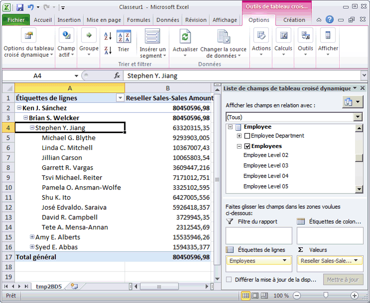
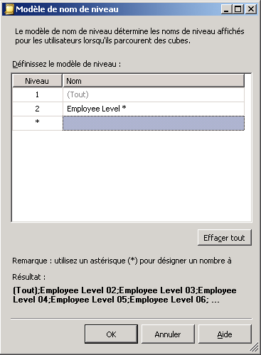
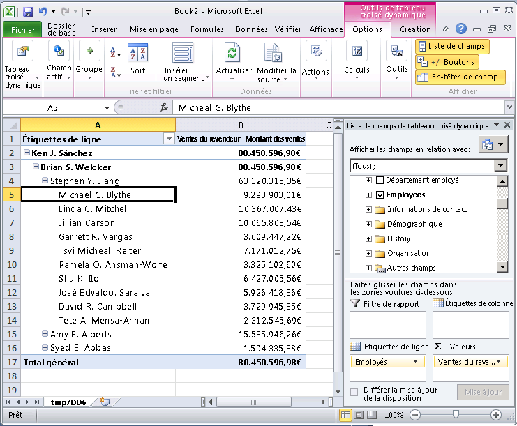

# Leçon 2-4-définition des propriétés d’attribut Parent dans une hiérarchie Parent-enfant
[!INCLUDE[ssas-appliesto-sqlas](../includes/ssas-appliesto-sqlas.md)]

Une hiérarchie parent-enfant est une hiérarchie dans une dimension fondée sur deux colonnes de table. Ensemble, ces colonnes définissent les relations hiérarchiques entre les membres de la dimension. La première colonne, appelée *colonne des clés de membre*, identifie chaque membre de dimension. L’autre colonne, appelée *colonne parente*, identifie le parent de chaque membre de dimension. La propriété **NamingTemplate** d’un attribut parent détermine le nom de chaque niveau de la hiérarchie parent-enfant et la propriété **MembersWithData** détermine si les données des membres parents doivent être affichées ou non.  
  
Pour plus d’informations, consultez [Dimensions parent-enfant](../analysis-services/multidimensional-models/parent-child-dimension.md), [Attributs dans des hiérarchies de type parent-enfant](../analysis-services/multidimensional-models/parent-child-dimension-attributes.md).  
  
> [!NOTE]  
> Lorsque vous utilisez l'Assistant Dimension pour créer une dimension, l'Assistant reconnaît les tables qui contiennent des relations parent-enfant et définit automatiquement la hiérarchie parent-enfant.  
  
Au cours des tâches de la présente rubrique, vous allez créer un modèle de nom qui définit le nom de chaque niveau de la hiérarchie parent-enfant dans la dimension **Employee** . Vous allez ensuite configurer l'attribut parent pour masquer toutes les données parent, de façon à ce que seules les ventes des membres de niveau feuille soient affichées.  
  
## Navigation dans la dimension Employee  
  
1.  Dans l’Explorateur de solutions, double-cliquez sur **Employee.dim** dans le dossier **Dimensions** pour ouvrir le Concepteur de dimensions pour la dimension Employee.  
  
2.  Cliquez sur l’onglet **Navigateur** , vérifiez que **Employees** est sélectionné dans la liste **Hiérarchie** , puis développez le membre **All Employees** .  
  
    Notez que **Ken J. Sánchez** est le responsable du plus haut niveau dans cette hiérarchie parent-enfant.  
  
3.  Sélectionnez le membre **Ken J. Sánchez** .  
  
    Notez que le nom du niveau pour ce membre est **Level 02**. (Le nom du niveau apparaît après **Niveau actuel**, immédiatement au-dessus du membre **All Employees**.) Au cours de la tâche suivante, vous allez définir des noms plus descriptifs pour chaque niveau.  
  
4.  Développez **Ken J. Sánchez** pour afficher les noms des employés qui travaillent sous l’autorité de ce responsable, puis sélectionnez **Brian S. Welcker** pour afficher le nom de ce niveau.  
  
    Notez que le nom du niveau pour ce membre est **Level 03**.  
  
5.  Dans l’Explorateur de solutions, double-cliquez sur **Analysis Services Tutorial.cube** dans le dossier **Cubes** pour ouvrir le Concepteur de cube pour le cube du didacticiel [!INCLUDE[ssASnoversion](../includes/ssasnoversion-md.md)] .  
  
6.  Cliquez sur l'onglet **Navigateur** .  
  
7.  Cliquez sur l’icône Excel, puis cliquez **Activer** quand vous êtes invité à activer les connexions.  
  
8.  Dans la liste des champs de tableau croisé dynamique, développez **Reseller Sales**. Faites glisser **Reseller Sales-Sales Amount** vers la zone Valeurs.  
  
9. Dans la liste des champs de tableau croisé dynamique, développez **Employee**, puis faites glisser la hiérarchie **Employees** vers la zone **Lignes** .  
  
    Tous les membres de la hiérarchie Employees sont ajoutés à la colonne A du rapport de tableau croisé dynamique.  
  
    L'illustration suivante montre la hiérarchie Employees développée.  
  
10.   
  
    Remarquez que les ventes faites par chaque responsable dans le niveau 03 sont également affichées dans le niveau 04. C'est parce que chaque responsable est également employé d'un autre responsable. Au cours de la tâche suivante, vous allez masquer les montants de ces ventes.  
  
## Modification des propriétés d'attribut parent dans la dimension Employee  
  
1.  Affichez le Concepteur de dimensions pour la dimension **Employee** .  
  
2.  Cliquez sur l’onglet **Structure de dimension** , puis sélectionnez la hiérarchie d’attributs **Employees** dans le volet **Attributs** .  
  
    Notez l'icône unique de l'attribut. Cette icône signifie que l'attribut est la clé parente dans une hiérarchie parent-enfant. Notez également, dans la fenêtre des propriétés, que la propriété **Usage** de l’attribut est définie comme **Parent**. Cette propriété a été définie par l'Assistant Dimension lors de la conception de la dimension. L'Assistant a détecté automatiquement la relation parent-enfant.  
  
3.  Dans la fenêtre des propriétés, cliquez sur le bouton (**...**) dans la cellule de la propriété **NamingTemplate** .  
  
    Dans la boîte de dialogue **Modèle de nom de niveau**, vous pouvez définir le modèle d’attribution de nom de niveau qui détermine les noms de niveau dans la hiérarchie parent-enfant que les utilisateurs voient quand ils parcourent les cubes.  
  
4.  Dans la deuxième ligne, la ligne **\***, tapez **Employee Level \*** dans la colonne **Name**, puis sélectionnez la troisième ligne.  
  
    Sous **Résultat**, chaque niveau est maintenant appelé « Employee Level » suivi d’un numéro incrémenté séquentiellement.  
  
    L’illustration suivante montre les éléments qui ont changé dans la boîte de dialogue **Modèle de nom de niveau** .  
  
      
  
5.  Cliquez sur **OK**.  
  
6.  Dans la fenêtre des propriétés de l’attribut **Employees** , dans la cellule de la propriété **MembersWithData** , sélectionnez **NonLeafDataHidden** pour remplacer cette valeur par l’attribut **Employees** .  
  
    Les données associées à des membres de niveau non-feuille de la hiérarchie parent-enfant sont masquées.  
  
## Navigation dans la dimension Employee avec les attributs modifiés  
  
1.  Dans le menu **Générer** de [!INCLUDE[ssBIDevStudioFull](../includes/ssbidevstudiofull-md.md)], cliquez sur **Déployer Analysis Services Tutorial**.  
  
2.  Une fois le déploiement terminé, affichez le Concepteur de cube pour le cube du didacticiel [!INCLUDE[ssASnoversion](../includes/ssasnoversion-md.md)] , puis cliquez sur **Reconnexion** dans la barre d’outils de l’onglet **Navigateur** .  
  
3.  Cliquez sur l'icône Excel, puis **Activer**.  
  
4.  Faites glisser **Reseller Sales-Sales Amount** vers la zone Valeurs.  
  
5.  Faites glisser la hiérarchie **Employees** vers la zone Étiquettes de ligne.  
  
    L'illustration suivante montre les modifications apportées à la hiérarchie Employees. Notez que Stephen Y. Jiang n’apparaît plus comme employé de lui-même.  
  
      
  
## Tâche suivante de la leçon  
[Regroupement automatique des membres d'attribut](../analysis-services/lesson-4-3-automatically-grouping-attribute-members.md)  
  
## Voir aussi  
[Dimensions parent-enfant](../analysis-services/multidimensional-models/parent-child-dimension.md)  
[Attributs dans des hiérarchies de type parent-enfant](../analysis-services/multidimensional-models/parent-child-dimension-attributes.md)  
  
  
  
