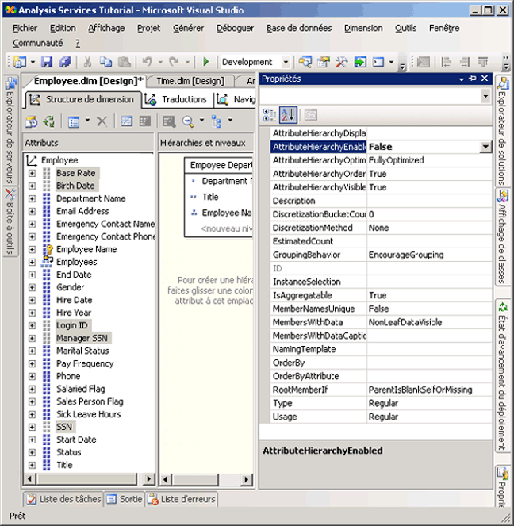
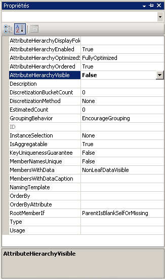

# Leçon 4-4-masquage et désactivation des hiérarchies d’attributs
[!INCLUDE[ssas-appliesto-sqlas](../includes/ssas-appliesto-sqlas.md)]

Par défaut, une hiérarchie d'attribut est créée pour chaque attribut dans une dimension, et chaque hiérarchie est disponible pour dimensionner les données de faits. Cette hiérarchie se compose d'un niveau « All » et d'un niveau de détail contenant tous les membres de la hiérarchie. Comme vous l'avez déjà appris, vous pouvez organiser les attributs en hiérarchies définies par l'utilisateur pour fournir les chemins de navigation dans un cube. Dans certaines circonstances, vous pouvez être amené à choisir de désactiver ou de masquer certains attributs et leurs hiérarchies. Par exemple, certains attributs, tels que les numéros de sécurité sociale ou les numéros de carte d'identité, les taux de rémunération, les dates de naissance et les informations de connexion ne sont pas des attributs par lesquels les utilisateurs pourront dimensionner les informations d'un cube. Ces informations sont au contraire généralement affichées uniquement comme détails d'un membre d'attribut spécifique. Vous pouvez choisir de masquer ces hiérarchies d'attributs, ce qui permet de laisser les attributs affichés uniquement en tant que propriétés de membre d'un attribut spécifique. Vous pouvez également choisir d'afficher les membres d'autres attributs, tels que les noms de clients ou les codes postaux, uniquement lorsqu'ils sont visualisés via une hiérarchie utilisateur et non indépendamment via une hiérarchie d'attributs. L'une des raisons qui amène à procéder ainsi est le nombre même de membres distincts dans la hiérarchie d'attributs. Enfin, pour améliorer les performances de traitement, vous devez désactiver les hiérarchies d'attributs auxquelles les utilisateurs ne feront pas appel pour l'exploration.  
  
La valeur de la propriété **AttributeHierarchyEnabled** détermine la création d'une hiérarchie d'attributs. Si la valeur de cette propriété est **False**, la hiérarchie d'attributs n'est pas créée et l'attribut ne peut pas être utilisé comme niveau dans une hiérarchie utilisateur : la hiérarchie d'attributs existe uniquement en tant que propriété de membre. Toutefois, il est toujours possible d'utiliser une hiérarchie d'attributs désactivée pour classer les membres d'un autre attribut. Si la valeur de la propriété **AttributeHierarchyEnabled** est **True**, la valeur de la propriété **AttributeHierarchyVisible** détermine si la hiérarchie d’attributs est visible indépendamment de son utilisation dans une hiérarchie définie par l’utilisateur.  
  
Lorsqu'une hiérarchie d'attributs est activée, vous pouvez spécifier des valeurs pour les trois autres propriétés suivantes :  
  
-   **IsAggregatable**  
  
    Par défaut, un niveau (All) est défini pour toutes les hiérarchies d'attributs. Pour désactiver le niveau (All) d’une hiérarchie d’attributs activée, affectez la valeur **False**à cette propriété.  
  
    > [!NOTE]  
    > Un attribut dont la propriété **IsAggregatable** a la valeur false peut être utilisé uniquement comme racine d’une hiérarchie définie par l’utilisateur et doit avoir un membre par défaut spécifié (sinon, le moteur [!INCLUDE[ssASnoversion](../includes/ssasnoversion-md.md)] en choisit un à votre place).  
  
-   **AttributeHierarchyOrdered**  
  
    Par défaut, [!INCLUDE[ssASnoversion](../includes/ssasnoversion-md.md)] classe les membres des hiérarchies d'attributs activées au cours du traitement, puis stocke les membres en fonction de la valeur de la propriété **OrderBy** . Par exemple, en fonction de la valeur Name ou Key. Si le classement ne présente pas d'intérêt pour vous, affectez à cette propriété la valeur **False**pour augmenter les performances de traitement.  
  
-   **AttributeHierarchyOptimizedState**  
  
    Par défaut, [!INCLUDE[ssASnoversion](../includes/ssasnoversion-md.md)] crée un index pour chaque hiérarchie d'attributs activée au cours du traitement pour améliorer les performances des requêtes. Si vous envisagez de ne pas utiliser de hiérarchies d'attributs pour l'exploration, vous pouvez augmenter les performances de traitement en affectant à cette propriété la valeur **NotOptimized**. Cependant, si vous utilisez une hiérarchie masquée comme attribut clé de la dimension, le fait de créer un index des membres d'attribut permet d'améliorer les performances.  
  
Ces propriétés ne peuvent pas être utilisées lorsque la hiérarchie d'attributs est désactivée.  
  
Au cours des tâches de cette rubrique, vous allez désactiver les numéros de sécurité sociale et d'autres attributs dans la dimension Employee qui ne seront pas utilisés pour l'exploration. Vous allez ensuite masquer les hiérarchies d'attributs relatives aux noms de clients et aux codes postaux dans la dimension Customer. En raison du grand nombre de membres d'attribut dans ces hiérarchies, leur exploration est relativement lente, indépendamment d'une hiérarchie utilisateur.  
  
## Définition des propriétés des hiérarchies d'attributs de la dimension Employee  
  
1.  Affichez le Concepteur de dimensions pour la dimension Employee, puis cliquez sur l'onglet **Navigateur** .  
  
2.  Vérifiez si les hiérarchies d'attributs suivantes apparaissent dans la liste **Hiérarchie** :  
  
    -   **Base Rate**  
  
    -   **Birth Date**  
  
    -   **Nom d'accès**  
  
    -   **Manager SSN**  
  
    -   **SSN**  
  
3.  Affichez l'onglet **Structure de dimension** , puis sélectionnez les attributs suivants dans le volet **Attributs** . Vous pouvez sélectionner plusieurs mesures en cliquant sur chacune d'elles tout en maintenant enfoncée la touche CTRL :  
  
    -   **Base Rate**  
  
    -   **Birth Date**  
  
    -   **Nom d'accès**  
  
    -   **Manager SSN**  
  
    -   **SSN**  
  
4.  Dans la fenêtre des propriétés, affectez la valeur **False** à la propriété **AttributeHierarchyEnabled** pour les attributs sélectionnés.  
  
    Notez, dans le volet **Attributs** , que l'icône de chaque attribut change pour indiquer que l'attribut n'est pas activé.  
  
    L'illustration suivante montre la propriété **AttributeHierarchyEnabled** avec la valeur False pour les attributs sélectionnés.  
  
      
  
5.  Dans le menu **Générer** , cliquez sur **Déployer Analysis Services Tutorial**.  
  
6.  Une fois le traitement terminé, affichez l'onglet **Navigateur** , cliquez sur **Reconnexion**, puis essayez d'explorer chaque hiérarchie d'attribut modifiée.  
  
    Notez que les membres des attributs modifiés ne sont pas disponibles dans la liste **Hiérarchie** et ne peuvent pas faire l'objet d'une exploration en tant que hiérarchies d'attributs. Si vous tentez d'ajouter l'une des hiérarchies d'attributs désactivées en tant que niveau dans une hiérarchie utilisateur, vous recevrez un message d'erreur signalant que la hiérarchie d'attributs doit être activée pour faire partie d'une hiérarchie définie par l'utilisateur.  
  
## Définition des propriétés des hiérarchies d'attributs de la dimension Customer  
  
1.  Affichez le Concepteur de dimensions pour la dimension Customer, puis cliquez sur l'onglet **Navigateur** .  
  
2.  Vérifiez si les hiérarchies d'attributs suivantes apparaissent dans la liste **Hiérarchie** :  
  
    -   **Nom complet**  
  
    -   **Postal Code**  
  
3.  Affichez l'onglet **Structure de dimension** , puis sélectionnez les attributs suivants dans le volet **Attributs** . Pour cela, utilisez la touche CTRL pour sélectionner plusieurs attributs en même temps :  
  
    -   **Nom complet**  
  
    -   **Postal Code**  
  
4.  Dans la fenêtre des propriétés, affectez la valeur **False** à la propriété **AttributeHierarchyVisible** pour les attributs sélectionnés.  
  
    Étant donné que les membres de ces hiérarchies d'attributs seront utilisés pour dimensionner les données de faits, le fait de classer et d'optimiser ces membres permettra d'améliorer les performances. Les propriétés de ces attributs ne doivent par conséquent pas être modifiées.  
  
    L'illustration suivante montre la propriété **AttributeHierarchyVisible** avec la valeur False.  
  
      
  
5.  Faites glisser l'attribut **Postal Code** du volet **Attributs** vers la hiérarchie utilisateur **Customer Geography** du volet **Hiérarchies et niveaux** , immédiatement sous le niveau **City** .  
  
    Notez qu'il est toujours possible de transformer un attribut masqué en niveau dans une hiérarchie utilisateur.  
  
6.  Dans le menu **Générer** , cliquez sur **Déployer Analysis Services Tutorial**.  
  
7.  Une fois le déploiement terminé, cliquez sur l'onglet **Navigateur** de la dimension Customer, puis cliquez sur **Reconnexion**.  
  
8.  Essayez de sélectionner l'une ou l'autre des hiérarchies d'attribut modifiées dans la liste **Hiérarchie** .  
  
    Notez qu'aucune hiérarchie d'attributs modifiée n'apparaît dans la liste **Hiérarchie** .  
  
9. Dans la liste **Hiérarchie** , sélectionnez **Customer Geography**, puis explorez chaque niveau dans le volet Navigateur.  
  
    Notez que les niveaux masqués, **Postal Code** et **Full Name**, sont visibles dans la hiérarchie définie par l’utilisateur.  
  
## Tâche suivante de la leçon  
[Tri des membres d’attribut basés sur un attribut secondaire](../analysis-services/lesson-4-5-sorting-attribute-members-based-on-a-secondary-attribute.md)  
  
  
  
