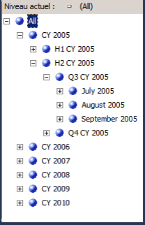
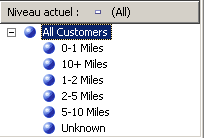
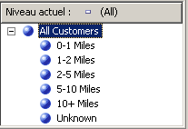

# Leçon 4-5 - tri des membres d’attribut basés sur un attribut secondaire
[!INCLUDE[ssas-appliesto-sqlas](../includes/ssas-appliesto-sqlas.md)]
Au cours de la leçon 3, vous avez appris à trier les membres d'attribut en fonction de leur nom ou de la valeur de leur clé. Vous avez également appris à utiliser une clé de membre composite pour modifier les membres d'attribut et l'ordre de tri. Pour plus d’informations, consultez [Modification de la dimension Date](../analysis-services/lesson-3-4-modifying-the-date-dimension.md). Toutefois, si ni le nom ni la clé de l'attribut principal ne fournissent l'ordre de tri que vous souhaitez, vous pouvez utiliser un attribut secondaire pour obtenir l'ordre de tri désiré. En définissant une relation entre les attributs, vous pouvez utiliser le deuxième attribut pour trier les membres du premier attribut.  
  
Les relations d'attributs définissent les relations ou les dépendances entre les attributs. Dans une dimension qui est basée sur une seule table relationnelle, tous les attributs sont généralement liés les uns aux autres via l'attribut clé. Cela est dû au fait que tous les attributs d'une dimension fournissent des informations sur les membres liés par l'attribut clé de la dimension aux faits de la table de faits pour chaque groupe de mesures associé. Dans une dimension basée sur plusieurs tables, les attributs sont généralement liés par une clé de jointure entre les tables. Si les données sous-jacentes le prennent en charge, les attributs associés peuvent être utilisés pour spécifier un ordre de tri. Par exemple, vous pouvez créer un nouvel attribut qui fournit la logique de tri pour un attribut associé.  
  
Le Concepteur de dimensions permet de définir d'autres relations entre les attributs ou de modifier les relations par défaut pour augmenter les performances. Lorsque vous créez une relation d'attribut, la principale contrainte est de s'assurer que l'attribut référencé n'a qu'une seule valeur pour chaque membre dans l'attribut auquel il est lié. Lorsque vous définissez une relation entre deux attributs, vous pouvez définir une relation rigide ou flexible selon que les relations entre les membres doivent ou non évoluer dans le temps. Par exemple, un employé peut être muté dans une autre région, mais la ville elle-même ne changera pas d'état. Si une relation est définie en tant que relation rigide, les agrégations d'attributs ne sont pas recalculées à chaque fois que la dimension est traitée de façon incrémentielle. Toutefois, si la relation entre les membres ne change pas, elle doit être traitée entièrement. Pour plus d’informations, consultez [Relations d’attributs](../analysis-services/multidimensional-models-olap-logical-dimension-objects/attribute-relationships.md), [Définir des relations d’attributs](../analysis-services/multidimensional-models/attribute-relationships-define.md), [Configurer des propriétés de relations d’attributs](../analysis-services/multidimensional-models/attribute-relationships-configure-attribute-properties.md)et [Spécification des relations d’attribut dans une hiérarchie définie par l’utilisateur](../analysis-services/4-6-specifying-attribute-relationships-in-user-defined-hierarchy.md).  
  
Au cours des tâches de cette rubrique, vous allez définir un nouvel attribut dans la dimension **Date** basé sur une colonne existante de la table de dimension sous-jacente. Vous allez utiliser ce nouvel attribut pour trier les membres de type mois calendaire par ordre chronologique et non par ordre alphabétique. Vous allez également définir un nouvel attribut dans la dimension **Customer** basé sur le calcul nommé que vous utiliserez pour trier les membres d’attribut **Commute Distance** . Au cours des tâches de la rubrique suivante, vous allez apprendre à utiliser les relations d'attributs pour augmenter les performances des requêtes.  
  
## Définition d'une relation d'attribut et d'un ordre de tri dans la dimension Date  
  
1.  Ouvrez le Concepteur de dimensions pour la dimension **Date** , puis vérifiez la propriété **OrderBy** de l’attribut **Month Name** dans la fenêtre des propriétés.  
  
    Notez que les membres d’attribut **Month Name** sont triés en fonction de la valeur de leur clé.  
  
2.  Affichez l’onglet **Navigateur** , vérifiez si la hiérarchie **Calendar Date** est sélectionnée dans la liste **Hiérarchie** , puis développez les niveaux de la hiérarchie définie par l’utilisateur pour vérifier l’ordre de tri appliqué pour les mois calendaires.  
  
    Notez que les membres de la hiérarchie d'attribut sont triés en fonction des valeurs ASCII de leurs clés de membre, qui sont les mois et les années. Dans ce cas, le tri sur le nom ou la clé de l'attribut ne permet pas de trier les mois calendaires par ordre chronologique. Pour résoudre ce problème, vous devez trier les membres de la hiérarchie d’attribut en fonction d’un nouvel attribut, l’attribut **MonthNumberOfYear** . Vous allez créer cet attribut à partir d’une colonne qui existe dans la table de dimension **Date** .  
  
3.  Affichez l’onglet **Structure de dimension** pour la dimension Date, cliquez avec le bouton droit sur **MonthNumberOfYear** dans le volet **Vue de source de données** et choisissez **Nouvel attribut de colonne**.  
  
4.  Dans le volet **Attributs** , sélectionnez **Month Number Of Year**, dans la fenêtre des propriétés affectez à la propriété **AttributeHierarchyEnabled** la valeur **False** , à la propriété **AttributeHierarchyOptimizedState** la valeur **NotOptimized**et à la propriété **AttributeHierarchyOrdered** la valeur **False**.  
  
    Ces paramètres masqueront l'attribut aux utilisateurs et amélioreront le temps de traitement. Cet attribut ne sera pas utilisé pour l'exploration. Il sera utilisé uniquement pour classer les membres d'un autre attribut.  
  
    > [!NOTE]  
    > Le tri alphabétique des propriétés dans la fenêtre correspondante simplifie cette tâche dans la mesure où ces trois propriétés sont triées de manière adjacente.  
  
5.  Cliquez sur l’onglet **Relations d’attributs** .  
  
    Notez que tous les attributs de la dimension **Date** sont liés directement à l’attribut **Date** . Cet attribut est la clé de membre qui lie les membres de dimension aux faits dans les groupes de mesures associés. Aucune relation n’est définie entre l’attribut **Month Name** et l’attribut **Month Number Of Year** .  
  
6.  Dans le diagramme, cliquez avec le bouton droit sur l’attribut **Month Name** , puis sélectionnez **Nouvelle relation d’attribut**.  
  
7.  Dans la boîte de dialogue **Créer une relation d’attribut** , **l’Attribut source** est **Month Name**. Définissez **l’Attribut associé** sur **Month Number Of Year**.  
  
8.  Dans la liste **Type de relation** , définissez le type de relation sur **Rigide**.  
  
    Les relations entre les membres de l’attribut **Month Name** et de l’attribut **Month Number Of Year** ne changeront pas au fil du temps. Par conséquent, Analysis Services ne supprime pas les agrégations pour cette relation au cours du traitement incrémentiel. Si une modification survient, une erreur de traitement se produit au cours du traitement incrémentiel et vous devrez effectuer un traitement complet de la dimension. Vous êtes maintenant prêt à définir l’ordre de tri pour les membres de l’attribut **Month Name**.  
  
9. [!INCLUDE[clickOK](../includes/clickok-md.md)]  
  
10. Cliquez sur l’onglet **Structure de dimension** .  
  
11. Sélectionnez **Month Name** dans le volet **Attributs** puis, dans la fenêtre des propriétés, affectez à la propriété **OrderBy** la valeur **AttributeKey** et à la propriété **OrderByAttribute** la valeur **Month Number Of Year**.  
  
12. Dans le menu **Générer** , cliquez sur **Déployer Analysis Services Tutorial**.  
  
13. Une fois le déploiement terminé, affichez l’onglet **Navigateur** pour la dimension Date, cliquez sur **Reconnexion**et parcourez les hiérarchies utilisateur **Calendar Date** et **Fiscal Date** pour vérifier si les mois sont maintenant triés par ordre chronologique.  
  
    Notez que les mois sont bien triés par ordre chronologique, comme montré dans l'illustration suivante.  
  
      
  
## Définition des relations d'attributs et d'un ordre de tri dans la dimension Customer  
  
1.  Basculez vers l’onglet **Navigateur** du Concepteur de dimensions pour la dimension Customer, puis explorez les membres de la hiérarchie d’attribut **Commute Distance** .  
  
    Notez que les membres de la hiérarchie d'attribut sont triés en fonction des valeurs ASCII de leur clé de membre. Dans ce cas, le tri sur le nom ou la clé de l'attribut ne permet pas de trier les distances parcourues par ordre croissant. Au cours de cette tâche, vous allez trier les membres de la hiérarchie d’attribut sur la base du calcul nommé **CommuteDistanceSort** qui attribue le numéro de tri approprié à chaque valeur distincte dans la colonne. Pour gagner du temps, ce calcul nommé a déjà été ajouté à la table **Customer** dans la vue de source de données de l’entrepôt de données [!INCLUDE[ssSampleDBCoShort](../includes/sssampledbcoshort-md.md)] . Vous pouvez basculer vers cette vue de source de données pour consulter le script SQL utilisé dans ce calcul nommé. Pour plus d’informations, consultez [Définir des calculs nommés dans une vue de source de données &#40;Analysis Services&#41;](../analysis-services/multidimensional-models/define-named-calculations-in-a-data-source-view-analysis-services.md).  
  
    L’illustration suivante montre les membres de la hiérarchie d’attribut **Commute Distance** , triés en fonction des valeurs ASCII de la clé de membre.  
  
      
  
2.  Affichez l’onglet **Structure de dimension** dans le Concepteur de dimensions pour la dimension Customer, cliquez avec le bouton droit sur **CommuteDistanceSort** dans la table **Customer** du volet **Vue de source de données** et choisissez **Nouvel attribut de colonne**.  
  
3.  Dans le volet **Attributs** , sélectionnez **Commute Distance Sort**, dans la fenêtre des propriétés, affectez à la propriété **AttributeHierarchyEnabled** de cet attribut la valeur **False** , à la propriété **AttributeHierarchyOptimizedState** la valeur **NotOptimized**et à la propriété **AttributeHierarchyOrdered** la valeur **False**.  
  
    Ces paramètres masqueront l'attribut aux utilisateurs et amélioreront le temps de traitement. Cet attribut ne sera pas utilisé pour l'exploration. Il sera utilisé uniquement pour classer les membres d'un autre attribut.  
  
4.  Sélectionnez **Geography**puis, dans la fenêtre des propriétés, affectez la valeur **False** à la propriété **AttributeHierarchyVisible** , la valeur **NotOptimized** à la propriété **AttributeHierarchyOptimizedState**et la valeur **False** à la propriété **AttributeHierarchyOrdered**.  
  
    Ces paramètres masqueront l'attribut aux utilisateurs et amélioreront le temps de traitement. Cet attribut ne sera pas utilisé pour l'exploration. Il sera utilisé uniquement pour classer les membres d’un autre attribut. Comme **Geography** a des propriétés de membre, sa propriété **AttributeHierarchyEnabled** doit avoir la valeur **True**. Ainsi, pour masquer l’attribut vous affectez la valeur **False** à la propriété **AttributeHierarchyVisible**.  
  
5.  Cliquez sur l’onglet **Relations d’attributs** .  
  
6.  Dans la liste des attributs, cliquez avec le bouton droit sur l’attribut **Commute Distance** , puis sélectionnez **Nouvelle relation d’attribut**.  
  
7.  Dans la boîte de dialogue **Créer une relation d’attribut** , **l’Attribut source** est **Commute Distance**. Affectez la valeur **Commute Distance Sort** à **Attribut associé**.  
  
8.  Dans la liste **Type de relation** , définissez le type de relation sur **Rigide**.  
  
    Les relations entre les membres de l’attribut **Commute Distance** et de l’attribut **Commute Distance Sort** ne changeront pas au fil du temps.  
  
9. [!INCLUDE[clickOK](../includes/clickok-md.md)]  
  
    Vous êtes maintenant prêt à définir l’ordre de tri pour l’attribut **Commute Distance** .  
  
10. Cliquez sur l’onglet **Structure de dimension** .  
  
11. Sélectionnez **Commute Distance** dans le volet **Attributs**puis, dans la fenêtre des propriétés, affectez à la propriété **OrderBy** la valeur **AttributeKey**et à la propriété **OrderByAttribute** la valeur **Commute Distance Sort**.  
  
12. Dans le menu **Générer** , cliquez sur **Déployer Analysis Services Tutorial**.  
  
13. Une fois le déploiement terminé, cliquez sur l’onglet **Navigateur** du Concepteur de dimensions pour la dimension Customer, cliquez sur **Reconnexion**, puis parcourez la hiérarchie d’attribut **Commute Distance** .  
  
    Notez que les membres de la hiérarchie d'attribut sont maintenant triés par ordre croissant, comme montré dans l'illustration suivante.  
  
      
  
## Tâche suivante de la leçon  
[Spécification des relations d’attribut dans une hiérarchie définie par l’utilisateur](../analysis-services/4-6-specifying-attribute-relationships-in-user-defined-hierarchy.md)  
  
  
  
