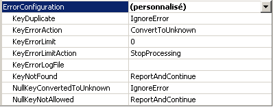
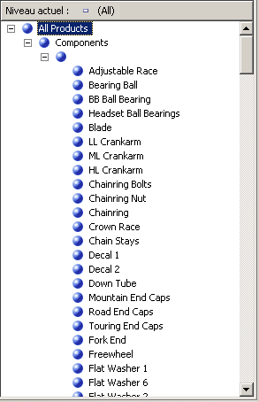
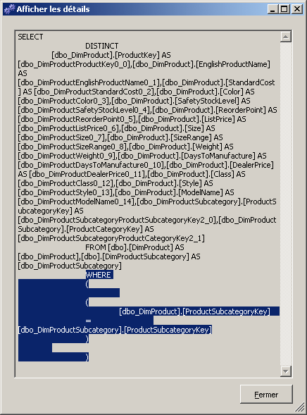
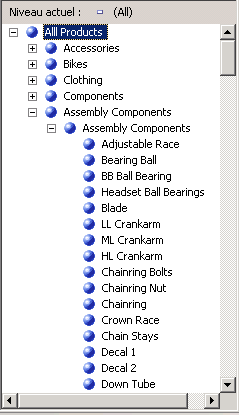

# Leçon 4-7 : définition des propriétés de traitement des valeurs Null et membre inconnu
[!INCLUDE[ssas-appliesto-sqlas](../includes/ssas-appliesto-sqlas.md)]

Lorsque [!INCLUDE[ssASnoversion](../includes/ssasnoversion-md.md)] traite une dimension, toutes les valeurs distinctes des colonnes sous-jacentes dans les tables ou les vues de la vue de source de données remplissent les attributs de la dimension. Si [!INCLUDE[ssASnoversion](../includes/ssasnoversion-md.md)] rencontre une valeur Null au cours du traitement, par défaut, elle convertit celle-ci en zéro pour des colonnes numériques ou en une chaîne vide pour des colonnes de type chaîne. Vous pouvez modifier les paramètres par défaut ou convertir les valeurs Null dans votre processus d’extraction, de transformation et de chargement (le cas échéant) de l’entrepôt de données relationnelles sous-jacent. Par ailleurs, vous pouvez faire en sorte que [!INCLUDE[ssASnoversion](../includes/ssasnoversion-md.md)] convertisse la valeur Null en une valeur désignée en configurant trois propriétés : les propriétés **UnknownMember** et **UnknownMemberName** pour la dimension, et la propriété **NullProcessing** pour l’attribut de clé de la dimension.  
  
L'Assistant Dimension et l'Assistant Cube activeront automatiquement ces propriétés si l'attribut de clé d'une dimension peut accepter une valeur Null ou si l'attribut racine d'une dimension en flocons est basée sur une colonne pouvant être Null. Dans ce cas, la propriété **NullProcessing** de l’attribut de clé a la valeur **UnknownMember** et la propriété **UnknownMember** a la valeur **Visible**.  
  
Toutefois, quand vous construisez des dimensions à flocons incrémentielles, comme c’est le cas avec la dimension Product dans ce didacticiel, ou si vous définissez des dimensions à l’aide du Concepteur de dimensions, puis incorporez ces dimensions dans un cube, les propriétés **UnknownMember** et **NullProcessing** doivent peut-être être définies manuellement.  
  
Au cours des tâches de cette rubrique, vous allez ajouter les attributs de la catégorie de produit et de la sous-catégorie de produit à la dimension Product des tables en flocons que vous avez ajoutées à la vue de source de données de l'entrepôt de données [!INCLUDE[ssSampleDBCoShort](../includes/sssampledbcoshort-md.md)] . Ensuite, vous activez la propriété **UnknownMember** pour la dimension Product, spécifiez la valeur **Assembly Components** pour la propriété **UnknownMemberName** , liez les attributs **Subcategory** et **Category** à l’attribut du nom de produit, puis définissez une gestion d’erreur personnalisée pour l’attribut de clé de membre qui lie les tables en flocons.  
  
> [!NOTE]  
> Si vous avez ajouté les attributs Subcategory et Category lors de la définition initiale du cube du didacticiel de [!INCLUDE[ssASnoversion](../includes/ssasnoversion-md.md)] à l'aide de l'Assistant Cube, ces étapes ont été effectuées automatiquement.  
  
## Vérification des propriétés de la gestion d'erreur et du membre inconnu dans la dimension Product  
  
1.  Affichez le Concepteur de dimensions pour la dimension **Product** , cliquez sur l’onglet **Structure de dimension** , puis sélectionnez **Product** dans le volet **Attributs** .  
  
    Vous pouvez ainsi afficher et modifier les propriétés de la dimension elle-même.  
  
2.  Dans la fenêtre des propriétés, vérifiez les propriétés **UnknownMember** et **UnknownMemberName** .  
  
    Notez que la propriété **UnknownMember** n’est pas activée, car sa valeur est **None** , et non **Visible** ou **Hidden**, et qu’aucun nom n’est spécifié pour la propriété **UnknownMemberName** .  
  
3.  Dans la fenêtre des propriétés, sélectionnez **(Personnalisé)** dans la cellule de la propriété **ErrorConfiguration** , puis développez la collection de propriétés **ErrorConfiguration** .  
  
    Si la propriété **ErrorConfiguration** a la valeur **(Personnalisé)** , vous avez la possibilité d’afficher les paramètres de configuration d’erreur par défaut, cela ne modifie aucun paramètre.  
  
4.  Vérifiez les propriétés de la clé et de la configuration de l'erreur de clé Null, mais n'apportez aucune modification.  
  
    Notez que par défaut, lorsque les clés Null sont converties en membre inconnu, l'erreur de traitement associée à cette conversion est ignorée.  
  
    L’illustration suivante montre les paramètres de propriété définis pour la collection de propriétés **ErrorConfiguration** .  
  
      
  
5.  Cliquez sur l’onglet **Navigateur** , vérifiez que **Product Model Lines** est sélectionné dans la liste **Hiérarchie** , puis développez **All Products**.  
  
    Notez la présence de cinq membres au niveau Product Line.  
  
6.  Développez **Components**, puis le membre sans nom du niveau **Model Name** .  
  
    Ce niveau contient les composants d’assembly utilisés pour la création d’autres composants, en commençant par le produit **Adjustable Race** , comme le montre l’illustration suivante.  
  
      
  
## Définition des attributs à partir des tables en flocons et d'une hiérarchie définie par l'utilisateur Product Category  
  
1.  Ouvrez le Concepteur de vues de source de données pour la vue de source de données de l’entrepôt de données [!INCLUDE[ssSampleDBCoShort](../includes/sssampledbcoshort-md.md)] , sélectionnez **Reseller Sales** dans le volet **Bibliothèque de diagrammes** , puis cliquez sur **Ajouter/supprimer des objets** dans le menu **Vue de source de données** de [!INCLUDE[ssBIDevStudioFull](../includes/ssbidevstudiofull-md.md)].  
  
    La boîte de dialogue **Ajouter/supprimer des tables** s’affiche.  
  
2.  Dans la liste **Objets inclus** , sélectionnez **DimProduct (dbo)**, puis cliquez sur **Ajouter des tables associées**.  
  
    Les tables **DimProductSubcategory (dbo)** et **FactProductInventory (dbo)** sont ajoutées. Supprimez **FactProductInventory (dbo)** pour que seule la table **DimProductSubcategory (dbo)** soit ajoutée à la liste des **Objets inclus** .  
  
3.  Une fois la table **DimProductSubcategory (dbo)** sélectionnée par défaut comme la table la plus récemment ajoutée, recliquez sur **Ajouter des tables associées** .  
  
    La table **DimProductCategory (dbo)** est ajoutée à la liste **Objets inclus** .  
  
4.  Cliquez sur **OK**.  
  
5.  Dans le menu **Format** de [!INCLUDE[ssBIDevStudio](../includes/ssbidevstudio-md.md)], pointez sur **Disposition automatique**, puis cliquez sur **Diagramme**.  
  
    Notez que la table **DimProductSubcategory (dbo)** et la table **DimProductCategory (dbo)** sont liées l’une à l’autre, ainsi qu’à la table **ResellerSales** , par le biais de la table **Product** .  
  
6.  Affichez le Concepteur de dimensions pour la dimension **Product** , puis cliquez sur l’onglet **Structure de dimension** .  
  
7.  Cliquez avec le bouton droit dans le volet **Vue de source de données** , puis cliquez sur **Afficher toutes les tables**.  
  
8.  Dans le volet **Vue de source de données** , recherchez la table **DimProductCategory** , cliquez avec le bouton droit sur **ProductCategoryKey** dans cette table et cliquez sur **Nouvel attribut de colonne**.  
  
9. Dans le volet **Attributs** , nommez ce nouvel attribut **Category**.  
  
10. Dans la fenêtre de propriétés, cliquez dans le champ de propriété **NameColumn** , puis cliquez sur le bouton Parcourir (**.**) pour ouvrir la boîte de dialogue **Colonne de nom** .  
  
11. Sélectionnez **EnglishProductCategoryName** dans la liste **Colonne source** , puis cliquez sur **OK**.  
  
12. Dans le volet **Vue de source de données** , recherchez la table **DimProductSubcategory** , cliquez avec le bouton droit sur **ProductSubcategoryKey** dans cette table, puis cliquez sur **Nouvel attribut de colonne**.  
  
13. Dans le volet **Attributs** , nommez ce nouvel attribut **Subcategory**.  
  
14. Dans la fenêtre de propriétés, cliquez dans le champ de propriété **NameColumn** puis cliquez sur le bouton Parcourir ( **...** ) pour ouvrir la boîte de dialogue **Colonne de nom** .  
  
15. Sélectionnez **EnglishProductSubcategoryName** dans la liste **Colonne source** , puis cliquez sur **OK**.  
  
16. Créez une hiérarchie définie par l’utilisateur appelée **Product Categories** avec les niveaux suivants en commençant par le haut : **Category**, **Subcategory**et **Product Name**.  
  
17. Spécifiez **All Products** comme valeur pour la propriété **AllMemberName** de la hiérarchie définie par l’utilisateur Product Categories.  
  
## Exploration des hiérarchies définies par l'utilisateur dans la dimension Product  
  
1.  Dans la barre d’outils de l’onglet **Structure de dimension** du **Concepteur de dimensions** pour la dimension **Product** , cliquez sur **Traiter**.  
  
2.  Cliquez sur **Oui** pour créer et déployer le projet, puis sur **Exécuter** pour traiter la dimension **Product** .  
  
3.  Une fois le traitement terminé, développez **Traitement de la dimension « Product » terminé** dans la boîte de dialogue **État d’avancement du traitement** , développez **Traitement de l’attribut de dimension « Product Name » terminé**, puis développez **Requêtes SQL 1**.  
  
4.  Sélectionnez la requête SELECT DISTINCT et cliquez sur **Afficher les détails**.  
  
    Notez qu'une clause WHERE a été ajoutée à la clause SELECT DISTINCT qui supprime les produits pour lesquels il n'existe aucune valeur dans la colonne ProductSubcategoryKey, comme le montre l'illustration suivante.  
  
      
  
5.  Cliquez trois fois sur **Fermer** pour fermer toutes les boîtes de dialogue de traitement.  
  
6.  Cliquez sur l’onglet **Navigateur** dans le Concepteur de dimensions pour la dimension **Product** , puis cliquez sur **Reconnexion**.  
  
7.  Vérifiez que **Product Model Lines** apparaît dans la liste **Hiérarchie** , développez **All Products**, puis **Components**.  
  
8.  Sélectionnez **Product Categories** dans la liste **Hiérarchie** , développez **Products**, puis **Components**.  
  
    Notez qu'aucun composant d'assembly n'apparaît.  
  
Pour modifier le comportement mentionné dans la tâche précédente, activez la propriété **UnknownMember** de la dimension Products, affectez une valeur à la propriété **UnknownMemberName** , affectez à la propriété **NullProcessing** des attributs **Subcategory** et **Model Name** la valeur **UnknownMember**, définissez l’attribut **Category** en tant qu’attribut associé de l’attribut **Subcategory** , puis définissez l’attribut **Product Line** en tant qu’attribut associé de l’attribut **Model Name** . Ces étapes permettront à [!INCLUDE[ssASnoversion](../includes/ssasnoversion-md.md)] d’utiliser la valeur du nom du membre inconnu pour chaque produit qui n’a pas de valeur dans la colonne **SubcategoryKey** , comme vous le constatez dans la tâche suivante.  
  
## Activation du membre inconnu, définition des relations d'attribut et définition des propriétés de traitement personnalisé pour les valeurs Null  
  
1.  Dans le Concepteur de dimensions pour la dimension **Product** , cliquez sur l’onglet **Structure de dimension** , puis sélectionnez **Product** dans le volet **Attributs** .  
  
2.  Dans la fenêtre **Propriétés** , affectez à la propriété **UnknownMember** la valeur **Visible**et affectez à la propriété **UnknownMemberName** la valeur **Assembly Components**.  
  
    L’attribution de la valeur **Visible** ou **Hidden** à la propriété **UnknownMember** active la propriété **UnknownMember** de la dimension.  
  
3.  Cliquez sur l’onglet **Relations d’attributs** .  
  
4.  Dans le diagramme, cliquez avec le bouton droit sur l’attribut **Subcategory** , puis sélectionnez **Nouvelle relation d’attribut**.  
  
5.  Dans la boîte de dialogue **Créer une relation d’attribut** , **l’Attribut source** est **Subcategory**. Définissez **Attribut associé** sur **Category**. Laissez le type de relation défini sur **Flexible**.  
  
6.  [!INCLUDE[clickOK](../includes/clickok-md.md)]  
  
7.  Dans le volet **Attributs** , sélectionnez **Subcategory**  
  
8.  Dans la fenêtre Propriétés, développez la propriété **KeyColumns** , puis la propriété **DimProductSubcategory.ProductSubcategoryKey (Integer)** .  
  
9. Remplacez la propriété **NullProcessing** par **UnknownMember**.  
  
10. Dans le volet **Attributs** , sélectionnez **Model Name**.  
  
11. Dans la fenêtre Propriétés, développez la propriété **KeyColumns** , puis la propriété **Product.ModelName (WChar)** .  
  
12. Remplacez la propriété **NullProcessing** par **UnknownMember**.  
  
    Une fois ces modifications effectuées, quand [!INCLUDE[ssASnoversion](../includes/ssasnoversion-md.md)] rencontre une valeur Null pour l’attribut **Subcategory** ou **Model Name** au cours du traitement, la valeur du membre inconnu est utilisée comme valeur de clé et les hiérarchies définies par l’utilisateur sont créées correctement.  
  
## Nouvelle exploration de la dimension Product  
  
1.  Dans le menu **Générer** , cliquez sur **Déployer Analysis Services Tutorial**.  
  
2.  Une fois le déploiement terminé, cliquez sur l’onglet **Navigateur** dans le Concepteur de dimensions pour la dimension **Product** , puis cliquez sur **Reconnexion**.  
  
3.  Vérifiez que **Product Categories** est sélectionné dans la liste **Hiérarchie** , puis développez **All Products**.  
  
    Notez que Assembly Components apparaît en tant que nouveau membre du niveau Category.  
  
4.  Développez le membre **Assembly Components** du niveau **Category** , puis le membre **Assembly Components** du niveau **Subcategory** .  
  
    Notez que tous les composants d’assembly apparaissent maintenant au niveau **Product Name** , comme le montre l’illustration suivante.  
  
      
  
## Leçon suivante  
[Leçon 5 : Définition des relations entre les Dimensions et les groupes de mesures](../analysis-services/lesson-5-defining-relationships-between-dimensions-and-measure-groups.md)  
  
  
  
