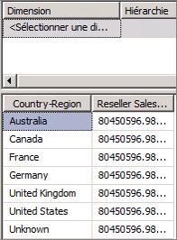
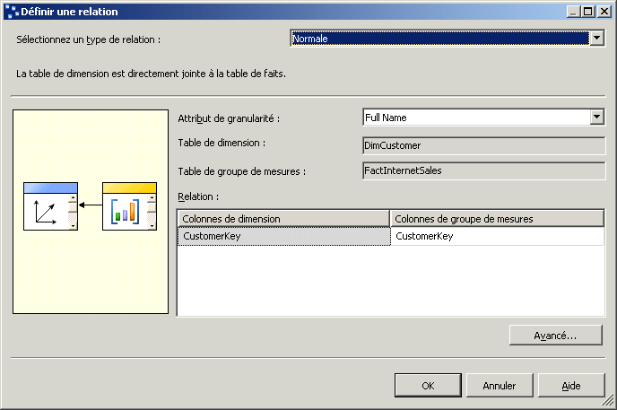
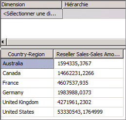

# Leçon 5-1-définir une relation référencée
[!INCLUDE[ssas-appliesto-sqlas](../includes/ssas-appliesto-sqlas.md)]

Jusqu'à présent, vous avez défini dans ce didacticiel des dimensions de cube basées sur une table directement liée à la table de faits d'un groupe de mesures par une relation clé primaire/clé étrangère. Au cours des tâches de cette rubrique, vous allez lier la dimension **Geography** à la table de faits pour les ventes de revendeurs par le biais de la dimension **Reseller** , qui est appelée *dimension de référence*. Cela permet aux utilisateurs de dimensionner les ventes des revendeurs par zone géographique. Pour plus d’informations, consultez [Définir une relation référencée et des propriétés de relation référencée](../analysis-services/multidimensional-models/define-a-referenced-relationship-and-referenced-relationship-properties.md).  
  
## Dimensionnement des ventes des revendeurs par zones géographiques  
  
1.  Dans l’Explorateur de solutions, cliquez avec le bouton droit sur **Didacticiel Analysis Services** dans le dossier **Cubes** , puis cliquez sur **Parcourir**.  
  
2.  Supprimez toutes les hiérarchies du volet Données et vérifiez si la mesure **Reseller Sales-Sales Amount** apparaît dans la zone de données du volet Données. Ajoutez-la au volet Données si elle n'y figure pas déjà.  
  
3.  Dans la dimension **Geography** du volet Métadonnées, faites glisser la hiérarchie définie par l’utilisateur **Geographies** vers la zone **Placer les champs de ligne ici** du volet Données.  
  
    Notez que la mesure **Reseller Sales-Sales Amount** n’est pas dimensionnée correctement par les membres d’attribut **Country-Region** de la hiérarchie **Regions** . La valeur de **Reseller Sales-Sales Amount** se répète pour chaque membre d’attribut de **Country-Region** .  
  
      
  
4.  Ouvrez le Concepteur de vues de source de données pour la vue de source de données **Adventure Works DW 2012** .  
  
5.  Dans le volet **Bibliothèque de diagrammes** , consultez la relation entre la table **Geography** et la table **ResellerSales** .  
  
    Notez qu'il n'existe aucun lien direct entre ces tables. Il existe toutefois un lien indirect entre ces tables à travers la table **Reseller** ou la table **SalesTerritory** .  
  
6.  Double-cliquez sur la flèche qui représente la relation entre la table **Geography** et la table **Reseller** .  
  
    Dans la boîte de dialogue **Modifier la relation** , notez que la colonne **GeographyKey** est la clé primaire de la table **Geography** et la clé étrangère de la table **Reseller** .  
  
7.  Cliquez sur **Annuler**, affichez le Concepteur de cube pour le cube du didacticiel [!INCLUDE[ssASnoversion](../includes/ssasnoversion-md.md)] , puis cliquez sur l’onglet **Utilisation de la dimension** .  
  
    Notez que la dimension de cube **Geography** n’a actuellement aucune relation avec le groupe de mesures **Internet Sales** ou **Reseller Sales** .  
  
8.  Cliquez sur le bouton Parcourir (**…**) dans la cellule **Nom complet** située à l’intersection de la dimension **Customer** et du groupe de mesures **Internet Sales** .  
  
    Dans la boîte de dialogue **Définir une relation** , notez qu’une relation **régulière** est définie entre la table de dimension **DimCustomer** et le groupe de mesures **FactInternetSales** , et qu’elle est basée sur la colonne **CustomerKey** dans chacune de ces tables. Toutes les relations que vous avez définies jusqu'à présent dans ce didacticiel sont des relations régulières.  
  
    L’illustration suivante représente la boîte de dialogue **Définir une relation** avec une relation régulière entre la table de dimension **DimCustomer** et la table du groupe de mesures **FactInternetSales** .  
  
      
  
9. Cliquez sur **Annuler**.  
  
10. Cliquez sur le bouton Parcourir (**…**) dans la cellule sans nom située à l’intersection de la dimension **Geography** et du groupe de mesures **Reseller Sales** .  
  
    Dans la boîte de dialogue **Définir une relation** , notez qu’aucune relation n’est actuellement définie entre la dimension de cube Geography et le groupe de mesures Reseller Sales. Vous ne pouvez pas définir une relation régulière car il n'existe pas de relation directe entre la table de dimension de la dimension Geography et la table de faits du groupe de mesures Reseller Sales.  
  
11. Dans la liste **Sélectionnez un type de relation** , sélectionnez **Référence**.  
  
    Pour définir une relation référencée, spécifiez une dimension connectée directement à la table de groupe de mesures, appelée *dimension intermédiaire*, utilisable par [!INCLUDE[ssASnoversion](../includes/ssasnoversion-md.md)] pour lier la dimension de référence à la table de faits. Vous devez ensuite spécifier l'attribut qui lie la dimension de référence à la dimension intermédiaire.  
  
12. Dans la liste **Dimension intermédiaire** , sélectionnez **Reseller**.  
  
    La table sous-jacente de la dimension Geography est liée à la table de faits par le biais de la table sous-jacente de la dimension Reseller.  
  
13. Dans la liste **Attribut de dimension de référence** , sélectionnez **Geography Key**, puis essayez de sélectionner **Geography Key** dans la liste **Attribut de dimension intermédiaire** .  
  
    Notez que **Geography Key** n’apparaît pas dans la liste **Attribut de dimension intermédiaire** . Cela est dû au fait que la colonne **GeographyKey** n’est pas définie en tant qu’attribut dans la dimension **Reseller** .  
  
14. Cliquez sur **Annuler**.  
  
Au cours de la tâche suivante, vous allez résoudre ce problème en définissant un attribut qui est basé sur la colonne GeographyKey dans la dimension Reseller.  
  
## Définition de l'attribut de dimension intermédiaire et de la relation de dimension référencée  
  
1.  Ouvrez le Concepteur de dimensions pour la dimension **Reseller** , vérifiez les colonnes de la table **Reseller** dans le volet **Vue de source de données** , puis les attributs définis dans la dimension **Reseller** du volet **Attributs** .  
  
    Bien que la colonne GeographyKey soit définie en tant que colonne dans la table Reseller, aucun attribut de dimension n'est défini dans la dimension Reseller basée sur cette colonne. La colonne Geography est définie en tant qu'attribut de dimension dans la dimension Geography car elle est la colonne clé qui lie la table sous-jacente de cette dimension à la table de faits.  
  
2.  Pour ajouter un attribut **Geography Key** à la dimension **Reseller** , cliquez avec le bouton droit sur **GeographyKey** dans le volet **Vue de source de données** , puis cliquez sur **Nouvel attribut de colonne**.  
  
3.  Dans le volet **Attributs** , sélectionnez **Geography Key**puis, dans la fenêtre des propriétés, affectez à la propriété **AttributeHierarchyOptimizedState** la valeur **NotOptimized**, à la propriété **AttributeHierarchyOrdered** la valeur **False**et à la propriété **AttributeHierarchyVisible** la valeur **False**.  
  
    L'attribut Geography Key de la dimension Reseller sera utilisé uniquement pour lier la dimension Geography à la table de faits Reseller Sales. Étant donné que la hiérarchie d'attributs ne sera pas utilisée pour des recherches, cela ne présente pas d'intérêt de la définir comme hiérarchie visible. En outre, le classement et l'optimisation de la hiérarchie d'attributs nuit aux performances. Toutefois, l'attribut doit être activé pour servir de lien entre les deux dimensions.  
  
4.  Affichez le Concepteur de cube du cube du didacticiel [!INCLUDE[ssASnoversion](../includes/ssasnoversion-md.md)] , cliquez sur l’onglet **Utilisation de la dimension** , puis cliquez sur le bouton Parcourir (**…**) à l’intersection du groupe de mesures **Reseller Sales** et de la dimension de cube **Geography** .  
  
5.  Dans la liste **Sélectionnez un type de relation** , sélectionnez **Référence**.  
  
6.  Dans la liste **Dimension intermédiaire** , sélectionnez **Reseller**.  
  
7.  Dans la liste **Attribut de dimension de référence** , sélectionnez **Geography Key**, puis sélectionnez **Geography Key** dans la liste **Attribut de dimension intermédiaire** .  
  
    Notez que la case **Matérialiser** est cochée. Il s'agit du paramètre par défaut pour les dimensions MOLAP. La matérialisation du lien de l'attribut de dimension entraîne la matérialisation de la valeur du lien entre la table de faits et la dimension de référence pour chaque ligne, ou son stockage dans la structure MOLAP de la dimension au cours du traitement. Ceci a un effet mineur sur les performances du traitement et sur l'espace de stockage requis, mais permet d'accroître les performances des requêtes (parfois de manière significative).  
  
8.  Cliquez sur **OK**.  
  
    Notez que la dimension de cube **Geography** est maintenant liée au groupe de mesures **Reseller Sales** . L'icône indique que la relation est une relation de dimension référencée.  
  
9. Dans la liste **Dimensions** de l’onglet **Utilisation de la dimension** , cliquez avec le bouton droit sur **Geography**et choisissez **Renommer**.  
  
10. Remplacez le nom de cette dimension du cube par **Reseller Geography**.  
  
    Cette dimension de cube étant maintenant liée au groupe de mesures **Reseller Sales** , les utilisateurs pourront définir explicitement son utilisation dans le cube, pour éviter toute confusion.  
  
## Dimensionnement des ventes des revendeurs par zones géographiques  
  
1.  Dans le menu **Générer** , cliquez sur **Déployer Analysis Services Tutorial**.  
  
2.  Une fois le déploiement terminé, cliquez sur l’onglet **Navigateur** dans le Concepteur de cube pour le cube du didacticiel [!INCLUDE[ssASnoversion](../includes/ssasnoversion-md.md)] , puis cliquez sur **Reconnexion** .  
  
3.  Dans le volet Métadonnées, développez **Reseller Geography**, cliquez avec le bouton droit sur **Geographies**et choisissez **Ajouter à la zone de lignes**.  
  
    Notez que la mesure **Reseller Sales-Sales Amount** est désormais dimensionnée correctement par l’attribut **Country-Region** de la hiérarchie **Geographies** définie par l’utilisateur, comme le montre l’illustration suivante.  
  
      
  
## Tâche suivante de la leçon  
[Définition d’une relation de faits](../analysis-services/lesson-5-2-defining-a-fact-relationship.md)  
  
## Voir aussi  
[Relations d'attributs](../analysis-services/multidimensional-models-olap-logical-dimension-objects/attribute-relationships.md)  
[Définir une relation référencée et des propriétés de relation référencée](../analysis-services/multidimensional-models/define-a-referenced-relationship-and-referenced-relationship-properties.md)  
  
  
  
