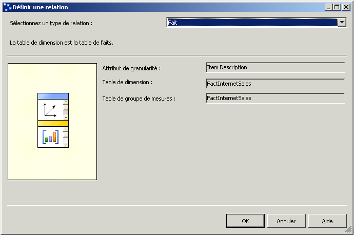
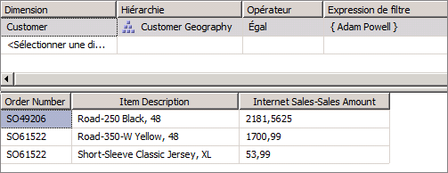

# Leçon 5-2-définition d’une relation de faits
[!INCLUDE[ssas-appliesto-sqlas](../includes/ssas-appliesto-sqlas.md)]

Les utilisateurs souhaitent parfois pouvoir dimensionner des mesures par élément de données se trouvant dans la table de faits ou exécuter des requêtes sur la table de faits pour obtenir des informations spécifiques connexes supplémentaires, telles que des numéros de factures ou de bons de commande associés à des ventes spécifiques. Quand vous définissez une dimension basée sur un élément de table de faits de ce type, la dimension est appelée *dimension de fait*. Les dimensions de fait sont aussi appelées dimensions dégénérées. Les dimensions de fait servent à regrouper des lignes connexes de la table de faits, par exemple toutes les lignes concernant un numéro de facture particulier. Bien qu'il soit possible de stocker cette information dans une table de dimensions distincte dans la base de données relationnelles, la création d'une table de dimensions distincte pour cette information n'offre aucun avantage, car la table de dimensions augmente à la même vitesse que la table de faits et le seul résultat obtenu est la duplication des données et une plus grande complexité, ce qui est inutile.  
  
Dans [!INCLUDE[ssASnoversion](../includes/ssasnoversion-md.md)], vous pouvez déterminer s'il est nécessaire de dupliquer les données des dimensions de fait dans la structure de dimensions MOLAP pour augmenter les performances des requêtes ou s'il est nécessaire de définir les dimensions de fait en tant que dimensions ROLAP pour gagner de l'espace de stockage aux dépens des performances des requêtes. Lorsque vous stockez une dimension avec le mode de stockage MOLAP, tous les membres de dimension sont stockés dans l'instance de [!INCLUDE[ssASnoversion](../includes/ssasnoversion-md.md)] dans une structure MOLAP avec un taux de compression élevé et sont aussi stockés dans les partitions du groupe de mesures. Lorsque vous stockez une dimension avec un mode de stockage ROLAP, seule la définition de la dimension est stockée dans la structure MOLAP ; les requêtes sont exécutées sur les membres de la dimension à partir de la table de faits relationnelle sous-jacente. Le mode de stockage approprié se choisit en fonction de la fréquence à laquelle les requêtes sont exécutées sur la dimension de fait, du nombre de lignes retournées par une requête classique, de la performance de la requête et enfin, du coût de traitement. Pour définir une dimension ROLAP, il n'est pas nécessaire que tous les cubes qui utilisent la dimension soient également stockés avec le mode de stockage ROLAP. Le mode de stockage pour chaque dimension peut être configuré indépendamment.  
  
Lorsque vous définissez une dimension de fait, vous pouvez définir la relation entre cette dimension et le groupe de mesures comme étant une relation de faits. Les contraintes suivantes s'appliquent aux relations de faits :  
  
-   L'attribut de granularité doit correspondre à la colonne clé de la dimension, ce qui crée une relation un-à-un entre la dimension et les faits de la table de faits.  
  
-   Une dimension peut avoir une relation de faits avec un seul groupe de mesures uniquement.  
  
> [!NOTE]  
> Les dimensions de fait doivent être mises à jour de façon incrémentielle après chaque mise à jour vers le groupe de mesures auquel la relation de faits se réfère.  
  
Pour plus d’informations, consultez [Relations de dimension](../analysis-services/multidimensional-models-olap-logical-cube-objects/dimension-relationships.md)et [Définir une relation de fait et des propriétés de relation de fait](../analysis-services/multidimensional-models/define-a-fact-relationship-and-fact-relationship-properties.md).  
  
Au cours des tâches de cette rubrique, vous allez ajouter une nouvelle dimension de cube basée sur la colonne **CustomerPONumber** dans la table de faits **FactInternetSales** . Vous allez ensuite définir la relation entre cette nouvelle dimension de cube et le groupe de mesures **Internet Sales** en tant que relation de faits.  
  
## Définition de la dimension de faits Internet Sales Orders  
  
1.  Dans l’Explorateur de solutions, cliquez avec le bouton droit sur **Dimensions**, puis cliquez sur **Nouvelle dimension**.  
  
2.  Dans la page **Assistant Dimension** , cliquez sur **Suivant**.  
  
3.  Dans la page **Sélectionner la méthode de création** , vérifiez que l’option **Utiliser une table existante** est sélectionnée, puis cliquez sur **Suivant**.  
  
4.  Dans la page **Spécifier des informations sur la source** , vérifiez que la vue de source des données **Adventure Works DW 2012** est sélectionnée.  
  
5.  Dans la liste **Table principale** , sélectionnez **InternetSales**.  
  
6.  Dans la liste **Colonnes clés** , vérifiez que **SalesOrderNumber** et **SalesOrderLineNumber** sont mentionnées.  
  
7.  Dans la liste **Colonne de nom** , sélectionnez **SalesOrderLineNumber**.  
  
8.  Cliquez sur **Suivant**.  
  
9. Dans la page **Sélectionner les tables associées** , décochez les cases à côté de toutes les tables, puis cliquez sur **Suivant**.  
  
10. Dans la page **Sélectionner les attributs de la dimension** , cliquez deux fois sur la case à cocher de l’en-tête pour décocher toutes les cases. L’attribut **Sales Order Number** reste sélectionné car il s’agit de l’attribut de clé.  
  
11. Sélectionnez l’attribut **Customer PO Number** , puis cliquez sur **Suivant**.  
  
12. Dans la page **Fin de l’Assistant** , remplacez le nom par **Internet Sales Order Details** , puis cliquez sur **Terminer** pour fermer l’Assistant.  
  
13. Dans le menu **Fichier** , cliquez sur **Enregistrer tout**.  
  
14. Dans le volet **Attributs** du Concepteur de dimensions pour la dimension **Internet Sales Order Details** , sélectionnez **Sales Order Number**, puis remplacez la propriété **Name** dans la fenêtre Propriétés par **Item Description**.  
  
15. Dans la cellule de propriété **NameColumn** , cliquez sur le bouton Parcourir **(...)**. Dans la boîte de dialogue **Colonne de nom** , sélectionnez **Product** dans la liste **Table source** , sélectionnez **EnglishProductName** comme **Colonne source**, puis cliquez sur **OK**.  
  
16. Ajoutez l’attribut **Sales Order Number** à la dimension. Pour cela, faites glisser la colonne **SalesOrderNumber** de la table **InternetSales** du volet **Vue de source de données** vers le volet **Attributs** .  
  
17. Remplacez la propriété **Name** du nouvel attribut **Sales Order Number** par **Order Number**et remplacez la propriété **OrderBy** par la propriété **Key**.  
  
18. Dans le volet **Hiérarchies** , créez une hiérarchie utilisateur **Internet Sales Orders** qui contient les niveaux **Order Number** et **Item Description** , en respectant cet ordre.  
  
19. Dans le volet **Attributs** , sélectionnez **Internet Sales Order Details**et vérifiez la valeur de la propriété **StorageMode** dans la fenêtre des propriétés.  
  
    Notez que cette dimension est stockée par défaut en tant que dimension MOLAP. Si l'utilisation du mode de stockage ROLAP en lieu et place du mode MOLAP permet de réduire le temps de traitement et de gagner de l'espace de stockage, elle se fait toutefois au dépend des performances des requêtes. Dans le cadre de ce didacticiel, vous allez utiliser le mode de stockage MOLAP.  
  
20. Pour ajouter la dimension créée récemment au cube du didacticiel [!INCLUDE[ssASnoversion](../includes/ssasnoversion-md.md)] comme dimension du cube, basculez vers le **Concepteur de cube**. Sous l’onglet **Structure de cube** , cliquez avec le bouton droit dans le volet **Dimensions** et sélectionnez **Ajouter une dimension de cube**.  
  
21. Dans la boîte de dialogue **Ajouter une dimension de cube**, sélectionnez **Internet Sales Order Details** , puis cliquez sur **OK**.  
  
## Définition d'une relation de faits pour la dimension de fait  
  
1.  Dans le Concepteur de cube du cube du didacticiel [!INCLUDE[ssASnoversion](../includes/ssasnoversion-md.md)] , cliquez sur l’onglet **Utilisation de la dimension** .  
  
    Notez que la dimension de cube **Internet Sales Order Details** est configurée automatiquement avec une relation de faits, comme le montre l’icône unique.  
  
2.  À l’intersection du groupe de mesures**Internet Sales**et de la dimension **Internet Sales Order Details,** cliquez sur le bouton ( **…** ) dans la cellule **Item Description** pour vérifier les propriétés de la relation de faits.  
  
    La boîte de dialogue **Définir une relation** s’affiche. Notez que vous ne pouvez pas configurer les propriétés.  
  
    L’illustration suivante montre les propriétés de la relation de faits dans la boîte de dialogue **Définir une relation** .  
  
      
  
3.  Cliquez sur **Annuler**.  
  
## Exploration du cube en utilisant la dimension de fait  
  
1.  Dans le menu **Générer** , cliquez sur **Déployer Analysis Services Tutorial** pour déployer les modifications sur l’instance de [!INCLUDE[ssASnoversion](../includes/ssasnoversion-md.md)] et traiter la base de données.  
  
2.  Une fois le déploiement terminé, cliquez sur l’onglet **Navigateur** dans le Concepteur de cube correspondant au cube du didacticiel [!INCLUDE[ssASnoversion](../includes/ssasnoversion-md.md)] , puis cliquez sur **Reconnexion** .  
  
3.  Désactivez toutes les mesures et toutes les hiérarchies du volet Données, puis ajoutez la mesure **Internet Sales-Sales Amount** à la zone de données du volet Données.  
  
4.  Dans le volet Métadonnées, développez **Customer**, **Location**, **Customer Geography**, **Members**, **All Customers**, **Australia**, **Queensland**, **Brisbane**, **4000**, puis cliquez avec le bouton droit sur **Adam Powell**et choisissez **Ajouter au filtre**.  
  
    L'application d'un filtre pour limiter les commandes retournées à un seul client permet à l'utilisateur d'explorer les données détaillées sous-jacentes dans une table de faits volumineuse sans enregistrer une diminution des performances des requêtes.  
  
5.  Ajoutez la hiérarchie définie par l’utilisateur **Internet Sales Orders** de la dimension **Internet Sales Order Details** vers la zone de lignes du volet Données.  
  
    Notez que les bons de commande et les montants des ventes Internet correspondant au client Adam Powell apparaissent dans le volet Données.  
  
    L'illustration suivante montre le résultat des étapes précédentes.  
  
      
  
## Tâche suivante de la leçon  
[Définition d’une relation plusieurs-à-plusieurs](../analysis-services/lesson-5-3-defining-a-many-to-many-relationship.md)  
  
## Voir aussi  
[Relations de dimension](../analysis-services/multidimensional-models-olap-logical-cube-objects/dimension-relationships.md)  
[Définir une relation de faits et les propriétés de relation de faits](../analysis-services/multidimensional-models/define-a-fact-relationship-and-fact-relationship-properties.md)  
  
  
  
