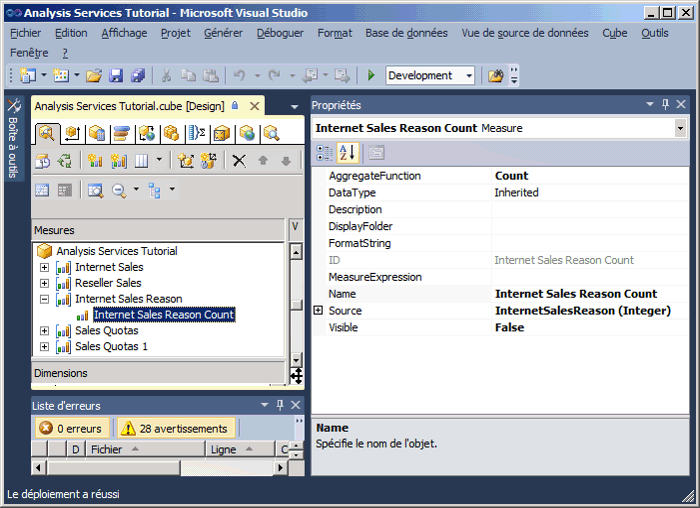
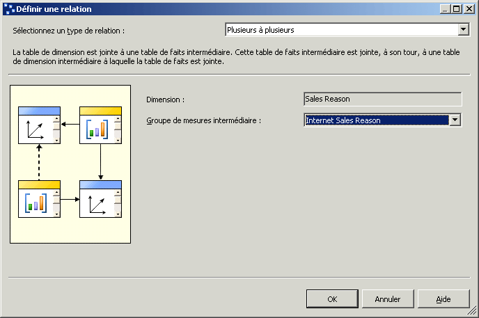
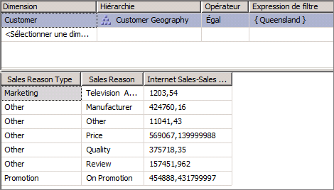

# Leçon 5-3-définir une relation plusieurs-à-plusieurs
[!INCLUDE[ssas-appliesto-sqlas](../includes/ssas-appliesto-sqlas.md)]

Lorsque vous définissez une dimension, chaque fait est joint généralement à un et un seul membre de dimension, tandis qu'un même membre de dimension peut être associé à plusieurs faits différents. Par exemple, chaque client peut avoir plusieurs commandes mais chaque commande se rapporte à un seul client. Dans la terminologie des bases de données relationnelles, on parle de *relation un-à-plusieurs*. Cependant, un seul fait peut parfois être joint à plusieurs membres de dimension. Dans la terminologie des bases de données relationnelles, on parle de *relation plusieurs-à-plusieurs*. Par exemple, l'achat d'un client peut être motivé par plusieurs raisons et un même motif d'achat peut être associé à plusieurs achats. Une table de jointure sert à définir les motifs de vente relatifs à chaque achat. Une dimension Sales Reason créée à partir de relations de ce type aura par conséquent plusieurs membres associés à une seule transaction de vente. Les dimensions plusieurs-à-plusieurs étendent le modèle dimensionnel au-delà du schéma en étoile classique et prend en charge les analyses complexes lorsque les dimensions ne sont pas reliées directement à une table de faits.  
  
Dans [!INCLUDE[ssASnoversion](../includes/ssasnoversion-md.md)], les relations plusieurs-à-plusieurs entre une dimension et un groupe de mesures se définissent en spécifiant une table de faits intermédiaire qui est jointe à la table de dimension. 0Une table de faits intermédiaire est jointe, à son tour, à une table de dimension intermédiaire à laquelle la table de faits est jointe. Les relations plusieurs-à-plusieurs entre la table de faits intermédiaire et les tables de dimension dans la relation et la dimension intermédiaire créent les relations plusieurs-à-plusieurs entre les membres de la dimension principale et les mesures du groupe de mesures qui sont spécifiées par la relation. Afin de définir une relation plusieurs-à-plusieurs entre une dimension et un groupe de mesures par le biais d'un groupe de mesures intermédiaire, ce groupe doit partager une ou plusieurs dimensions avec le groupe de mesures d'origine.  
  
Dans une dimension plusieurs à plusieurs, les valeurs sont des sommes distinctes, ce qui signifie qu'elles ne s'agrègent pas plus d'une fois au membre Tous.  
  
> [!NOTE]  
> Afin de prendre en charge une relation de dimensions plusieurs-à-plusieurs, il est nécessaire de définir une relation clé primaire-clé étrangère dans la vue de source de données entre toutes les tables impliquées. Si vous ne procédez pas ainsi, vous ne pourrez pas sélectionner le groupe de mesures intermédiaire correct pour établir la relation sous l’onglet **Utilisation de la dimension** du Concepteur de cube.  
  
Pour plus d’informations, consultez [Relations de dimension](../analysis-services/multidimensional-models-olap-logical-cube-objects/dimension-relationships.md)et [Définir une relation plusieurs à plusieurs et les propriétés d’une relation plusieurs à plusieurs](../analysis-services/multidimensional-models/define-a-many-to-many-relationship-and-many-to-many-relationship-properties.md).  
  
Au cours des tâches de cette rubrique, vous allez définir la dimension Sales Reasons et le groupe de mesures Sales Reasons et définir ensuite une relation plusieurs-à-plusieurs entre la dimension Sales Reasons et le groupe de mesures Internet Sales par le biais du groupe de mesures Sales Reasons.  
  
## Ajout des tables requises dans la vue de source de données  
  
1.  Ouvrez le Concepteur de vues de source de données pour la vue de source de données **Adventure Works DW 2012** .  
  
2.  Cliquez avec le bouton droit dans le volet **Bibliothèque de diagrammes** , choisissez **Nouveau diagramme**, puis spécifiez **Internet Sales Order Reasons** comme nom du nouveau diagramme.  
  
3.  Faites glisser la table **InternetSales** du volet **Tables** vers le volet **Diagramme** .  
  
4.  Cliquez avec le bouton droit dans le volet **Diagramme** et choisissez **Ajouter/Supprimer des tables**.  
  
5.  Dans la boîte de dialogue **Ajouter/supprimer des tables** , ajoutez la table **DimSalesReason** et la table **FactInternetSalesReason** à la liste **Objets inclus** , puis cliquez sur **OK**.  
  
    Notez que les relations clé primaire-clé étrangère entre les tables impliquées sont établies automatiquement, car ces relations sont définies dans la base de données relationnelles sous-jacente. Si ces relations n'étaient pas définies dans la base de données relationnelles, il vous faudrait les définir dans la vue de source de données.  
  
6.  Dans le menu **Format** , pointez sur **Disposition automatique**, puis cliquez sur **Diagramme**.  
  
7.  Dans la fenêtre des propriétés, remplacez la propriété **FriendlyName** de la table **DimSalesReason** par **SalesReason**, puis remplacez la propriété **FriendlyName** de la table **FactInternetSalesReason** par **InternetSalesReason**.  
  
8.  Dans le volet **Tables** , développez **InternetSalesReason (dbo.FactInternetSalesReason)**, sélectionnez **SalesOrderNumber**, puis vérifiez la propriété **DataType** pour cette colonne de données dans la fenêtre des propriétés.  
  
    Notez que le type de données de la colonne **SalesOrderNumber** est un type de données chaîne.  
  
9. Vérifiez les types de données des autres colonnes de la table **InternetSalesReason** .  
  
    Notez que les types de données des deux autres colonnes dans cette table sont des types de données numériques.  
  
10. Dans le volet **Tables** , cliquez avec le bouton droit sur **InternetSalesReason (dbo.FactInternetSalesReason)** et choisissez **Explorer les données**.  
  
    Notez que, pour chaque numéro de ligne de chaque commande, une valeur clé identifie la raison de la vente pour l'achat correspondant à ce poste, comme montré dans l'illustration suivante.  
  
      
  
## Définition du groupe de mesures intermédiaire  
  
1.  Affichez le Concepteur de cube pour le cube du didacticiel [!INCLUDE[ssASnoversion](../includes/ssasnoversion-md.md)] , puis cliquez sur l’onglet **Structure de cube** .  
  
2.  Cliquez dans le volet **Mesures** et choisissez **Nouveau groupe de mesures**. Pour plus d’informations, consultez [Création de mesures et de groupes de mesures dans les modèles multidimensionnels](../analysis-services/multidimensional-models/create-measures-and-measure-groups-in-multidimensional-models.md).  
  
3.  Dans la boîte de dialogue **Nouveau groupe de mesures** , sélectionnez **InternetSalesReason** dans la liste **Sélectionnez une table à partir de la vue de source de données** , puis cliquez sur **OK**.  
  
    Notez que le groupe de mesures **Internet Sales Reason** apparaît maintenant dans le volet **Mesures** .  
  
4.  Développez le groupe de mesures **Internet Sales Reason** .  
  
    Notez qu’une seule mesure est définie pour ce nouveau groupe de mesures, la mesure **Internet Sales Reason Count** .  
  
5.  Sélectionnez **Internet Sales Reason Count** et vérifiez les propriétés de cette mesure dans la fenêtre des propriétés.  
  
    Notez que la propriété **AggregateFunction** de cette mesure est définie comme **Count** , et non **Sum**. [!INCLUDE[ssASnoversion](../includes/ssasnoversion-md.md)]Choisissez **nombre** , car le type de données sous-jacent est un type de données chaîne. Les deux autres colonnes dans la table de faits sous-jacente n'ont pas été sélectionnées en tant que mesures car [!INCLUDE[ssASnoversion](../includes/ssasnoversion-md.md)] a détecté qu'il s'agissait de clés numériques et non de mesures en tant que telles. Pour plus d’informations, consultez [Définir le comportement semi-additif](../analysis-services/multidimensional-models/define-semiadditive-behavior.md).  
  
6.  Dans la fenêtre des propriétés, remplacez la propriété **Visible** de la mesure **Internet Sales Reason Count** par **False**.  
  
    Cette mesure sera utilisée uniquement pour joindre la dimension Sales Reason, que vous allez définir ensuite, au groupe de mesures Internet Sales. Les utilisateurs n'exploreront pas cette mesure directement.  
  
    L’illustration suivante montre les propriétés de la mesure **Internet Sales Reason Count** .  
  
      
  
## Définition d'une dimension plusieurs-à-plusieurs  
  
1.  Dans l’Explorateur de solutions, cliquez avec le bouton droit sur **Dimensions**, puis cliquez sur **Nouvelle dimension**.  
  
2.  Dans la page **Assistant Dimension** , cliquez sur **Suivant**.  
  
3.  Dans la page **Sélectionner la méthode de création** , vérifiez que l’option **Utiliser une table existante** est sélectionnée, puis cliquez sur **Suivant**.  
  
4.  Dans la page **Spécifier des informations sur la source** , vérifiez que la vue de source des données [!INCLUDE[ssSampleDBCoShort](../includes/sssampledbcoshort-md.md)] DW 2012 est sélectionnée.  
  
5.  Dans la liste **Table principale** , sélectionnez **SalesReason**.  
  
6.  Dans la liste **Colonnes clés** , vérifiez que **SalesReasonKey** apparaît.  
  
7.  Dans la liste **Colonne de nom** , sélectionnez **SalesReasonName**.  
  
8.  Cliquez sur **Suivant**.  
  
9. Dans la page **Sélectionner les attributs de la dimension** , l’attribut **Sales Reason Key** est sélectionné automatiquement car c’est l’attribut de clé. Cochez la case à côté de l’attribut **Sales Reason Reason Type** , remplacez son nom par **Sales Reason Type**, puis cliquez sur **Suivant**.  
  
10. Dans la page **Fin de l’Assistant** , cliquez sur **Terminer** pour créer la dimension Sales Reason.  
  
11. Dans le menu **Fichier** , cliquez sur **Enregistrer tout**.  
  
12. Dans le volet **Attributs** du Concepteur de dimensions pour la dimension **Sales Reason** , sélectionnez **Sales Reason Key**, puis remplacez la propriété **Name** de la fenêtre des propriétés par **Sales Reason**.  
  
13. Dans le volet **Hiérarchies et niveaux** du Concepteur de dimensions, créez une hiérarchie utilisateur **Sales Reasons** qui contient les niveaux **Sales Reason Type** et **Sales Reason** , en respectant cet ordre.  
  
14. Dans la fenêtre des propriétés, définissez **All Sales Reasons** comme valeur de la propriété **AllMemberName** de la hiérarchie Sales Reasons.  
  
15. Définissez **All Sales Reasons** comme valeur de la propriété **AttributeAllMemberName** de la dimension Sales Reason.  
  
16. Pour ajouter la dimension créée récemment au cube du didacticiel [!INCLUDE[ssASnoversion](../includes/ssasnoversion-md.md)] comme dimension du cube, basculez vers le **Concepteur de cube**. Sous l’onglet **Structure de cube** , cliquez avec le bouton droit dans le volet **Dimensions** et sélectionnez **Ajouter une dimension de cube**.  
  
17. Dans la boîte de dialogue **Ajouter une dimension de cube** , sélectionnez **Sales Reason** puis cliquez sur **OK**.  
  
18. Dans le menu **Fichier** , cliquez sur **Enregistrer tout**.  
  
## Définition d'une relation plusieurs-à-plusieurs  
  
1.  Affichez le Concepteur de cube pour le cube du didacticiel [!INCLUDE[ssASnoversion](../includes/ssasnoversion-md.md)] , puis cliquez sur l’onglet **Utilisation de la dimension** .  
  
    Notez que la dimension **Sales Reason** est liée par une relation régulière au groupe de mesures **Internet Sales Reason** , mais qu’elle n’est liée par aucune relation aux groupes de mesures **Internet Sales** ou **Reseller Sales** . Notez aussi que la dimension **Internet Sales Order Details** est liée par une relation régulière à la dimension **Internet Sales Reason** , qui de son côté a une **Relation de fait** avec le groupe de mesures **Internet Sales** . Si cette dimension n’était pas présente (ou une autre dimension avec une relation dont sont absents les groupes de mesures **Internet Sales Reason** et **Internet Sales** ), vous ne pourriez pas définir la relation plusieurs-à-plusieurs.  
  
2.  Cliquez sur la cellule à l’intersection de la dimension **Sales Reason** et du groupe de mesures **Internet Sales** , puis cliquez sur le bouton Parcourir (**…**).  
  
3.  Dans la boîte de dialogue **Définir une relation** , sélectionnez **Plusieurs à plusieurs** dans la liste **Sélectionnez un type de relation** .  
  
    Vous devez définir le groupe de mesures intermédiaire qui lie la dimension Sales Reason au groupe de mesures Internet Sales.  
  
4.  Dans la liste **Groupe de mesures intermédiaire** , sélectionnez **Internet Sales Reason**.  
  
    L’illustration suivante montre les modifications apportées dans la boîte de dialogue **Définir une relation** .  
  
      
  
5.  Cliquez sur **OK**.  
  
    Notez l'icône plusieurs-à-plusieurs qui représente la relation entre la dimension Sales Reason et le groupe de mesures Internet Sales.  
  
## Exploration du cube et de la dimension plusieurs-à-plusieurs  
  
1.  Dans le menu **Générer** , cliquez sur **Déployer Analysis Services Tutorial**.  
  
2.  Une fois le déploiement terminé, affichez l’onglet **Navigateur** dans le Concepteur de cube pour le cube du didacticiel [!INCLUDE[ssASnoversion](../includes/ssasnoversion-md.md)] , puis cliquez sur **Reconnexion**.  
  
3.  Ajoutez la mesure **Internet Sales-Sales Amount** dans la zone des données du volet Données.  
  
4.  Ajoutez la hiérarchie définir par l’utilisateur **Sales Reasons** de la dimension **Sales Reason** vers la zone de ligne du volet de données.  
  
5.  Dans le volet Métadonnées, développez **Customer**, **Location**, **Customer Geography**, **Members**, **All Customers**et **Australia**, cliquez avec le bouton droit sur **Queensland**, puis cliquez sur **Ajouter au filtre**.  
  
6.  Développez chaque membre du niveau **Sales Reason Type** pour passer en revue les valeurs en dollars associées aux motifs d’achat indiqués par les clients du Queensland pour un produit [!INCLUDE[ssSampleDBCoShort](../includes/sssampledbcoshort-md.md)] acheté sur Internet.  
  
    Notez que la somme des totaux associés à chaque raison de vente est supérieure au total des ventes. Cela s'explique par le fait que certains clients ont cité plusieurs raisons pour leur achat.  
  
    L’illustration suivante montre le volet **Filtre** et le volet **Données** du Concepteur de cube.  
  
      
  
## Tâche suivante de la leçon  
[Définir la granularité des dimensions dans un groupe de mesures](../analysis-services/lesson-5-4-defining-dimension-granularity-within-a-measure-group.md)  
  
## Voir aussi  
[Utiliser des diagrammes dans le Concepteur de vue de Source de données & #40 ; Analysis Services & #41 ;](../analysis-services/multidimensional-models/work-with-diagrams-in-data-source-view-designer-analysis-services.md)  
[Relations de dimension](../analysis-services/multidimensional-models-olap-logical-cube-objects/dimension-relationships.md)  
[Définir une relation plusieurs à plusieurs et les propriétés d’une relation plusieurs à plusieurs](../analysis-services/multidimensional-models/define-a-many-to-many-relationship-and-many-to-many-relationship-properties.md)  
  
  
  
