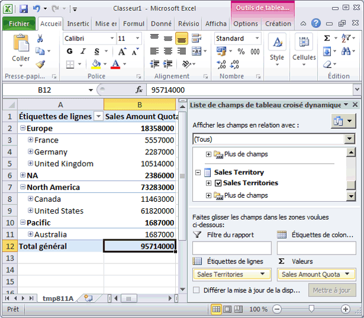
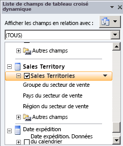
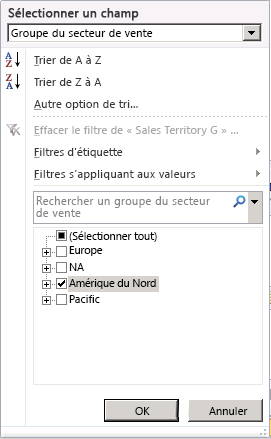
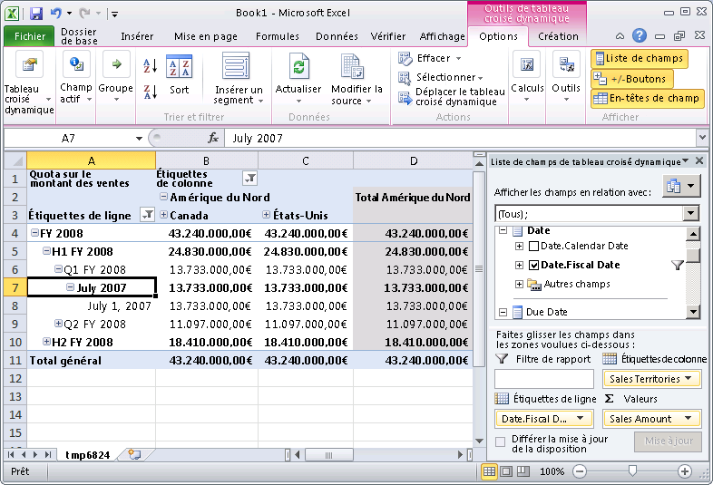
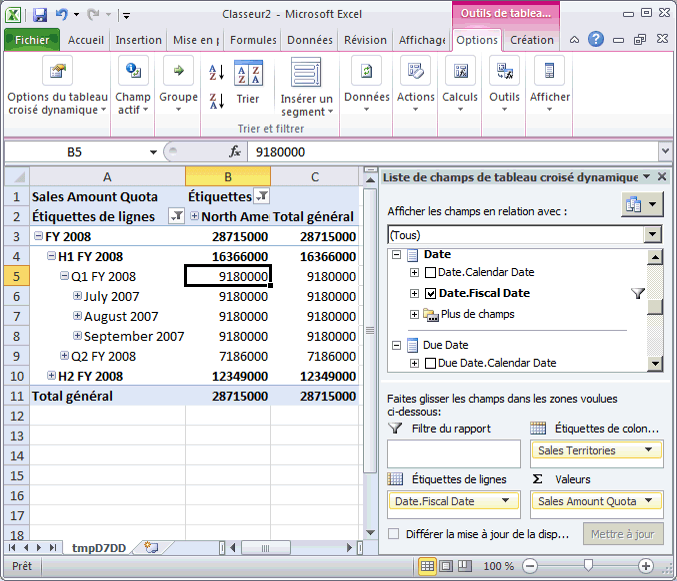

# Leçon 5-4-définition granularité des dimensions dans un groupe de mesures
[!INCLUDE[ssas-appliesto-sqlas](../includes/ssas-appliesto-sqlas.md)]

Les utilisateurs peuvent souhaiter dimensionner des données de faits avec des granularités ou spécificités différentes pour diverses raisons. Prenons l'exemple d'un scénario dans lequel les données de ventes des revendeurs ou des ventes Internet sont enregistrées quotidiennement tandis que les données relatives aux quotas de ventes n'existent qu'au niveau du mois ou du trimestre. Dans un scénario de ce type, les utilisateurs souhaiteront que la dimension de temps ait une granularité ou un niveau de détail différent pour chaque table de faits. S'il est possible de définir une nouvelle dimension de base de données comme dimension de temps avec une granularité différente, la méthode qui fait appel à [!INCLUDE[ssASnoversion](../includes/ssasnoversion-md.md)]est plus simple.  
  
Par défaut, dans [!INCLUDE[ssASnoversion](../includes/ssasnoversion-md.md)], lorsqu'une dimension est utilisée au sein d'un groupe de mesures, la granularité des données de cette dimension est fonction de son attribut de clé. Par exemple, lorsqu'une dimension de temps est incluse dans un groupe de mesures et que le niveau de granularité par défaut de la dimension de temps est le jour, le niveau de granularité par défaut de cette dimension dans le groupe de mesures est le jour. Ce niveau de granularité convient dans la plupart des cas, par exemple pour les groupes de mesures **Internet Sales** et **Reseller Sales** du présent didacticiel. Cependant, lorsqu'une dimension de ce type est incluse dans d'autres types de groupes de mesures, tels que les groupes de mesures des quotas de ventes ou du budget, une granularité de niveau mensuel ou trimestriel est généralement plus appropriée.  
  
Pour spécifier une granularité de dimension de cube différente de la granularité par défaut, vous devez modifier l’attribut de granularité de la dimension de cube utilisé dans le groupe de mesures particulier à partir de l’onglet **Utilisation de la dimension** du Concepteur de cube. Lorsque vous remplacez la granularité d'une dimension dans un groupe de mesures spécifique par un attribut qui n'est pas l'attribut de clé de cette dimension, vous devez vous assurer que tous les autres attributs du groupe de mesures sont directement ou indirectement associés au nouvel attribut de granularité. Pour cela, vous devez spécifier les relations entre tous les autres attributs et l'attribut qui est défini comme l'attribut de granularité dans le groupe de mesures. Dans ce cas, définissez des relations d'attribut supplémentaires au lieu de déplacer les relations d'attribut. L'attribut défini comme l'attribut de granularité devient l'attribut de clé dans le groupe de mesures pour les attributs restants dans la dimension. Si vous ne définissez pas correctement les relations d'attribut, [!INCLUDE[ssASnoversion](../includes/ssasnoversion-md.md)] ne pourra pas agréger correctement les valeurs, comme vous pourrez le constater dans les tâches de cette rubrique.  
  
Pour plus d’informations, consultez [Relations de dimension](../analysis-services/multidimensional-models-olap-logical-cube-objects/dimension-relationships.md)et [Définir une relation régulière et des propriétés de relation régulière](../analysis-services/multidimensional-models/define-a-regular-relationship-and-regular-relationship-properties.md).  
  
Au cours des tâches de cette rubrique, vous allez ajouter un groupe de mesures Sales Quotas et définir la granularité de la dimension Date de ce groupe de mesures sur un niveau mensuel. Vous définirez ensuite les relations d'attributs entre l'attribut de niveau mensuel et les autres attributs de dimension pour que [!INCLUDE[ssASnoversion](../includes/ssasnoversion-md.md)] puisse agréger les valeurs correctement.  
  
## Ajout de tables et définition du groupe de mesures Sales Quotas  
  
1.  Basculez vers la vue de source de données **Adventure Works DW 2012** .  
  
2.  Cliquez avec le bouton droit n’importe où dans le volet **Bibliothèque de diagrammes** , cliquez sur **Nouveau diagramme**, puis nommez le diagramme **Sales Quotas**.  
  
3.  Faites glisser les tables **Employee**, **Sales Territory**et **Date** du volet **Tables** vers le volet **Schéma** .  
  
4.  Ajoutez la table **FactSalesQuota** au volet **Schéma** en cliquant avec le bouton droit dans le volet **Schéma** et en sélectionnant **Ajouter/supprimer des tables**.  
  
    Notez que la table **SalesTerritory** est liée à la table **FactSalesQuota** par le biais de la table **Employee** .  
  
5.  Passez en revue les colonnes dans la table **FactSalesQuota** puis explorez les données de cette table.  
  
    Notez que le niveau de granularité des données de cette table est le trimestre calendaire, qui est le niveau de détail le plus bas dans la table FactSalesQuota.  
  
6.  Dans le Concepteur de vues de source de données, affectez à la propriété **FriendlyName** de la table **FactSalesQuota** la valeur **SalesQuotas**.  
  
7.  Basculez vers le cube du didacticiel [!INCLUDE[ssASnoversion](../includes/ssasnoversion-md.md)] , puis cliquez sur l’onglet **Structure de cube** .  
  
8.  Cliquez avec le bouton droit dans le volet **Mesures** , cliquez sur **Nouveau groupe de mesures**, sur **SalesQuotas** dans la boîte de dialogue **Nouveau groupe de mesures** , puis sur **OK**.  
  
    Le groupe de mesures **Sales Quotas** apparaît dans le volet **Mesures** . Dans le volet **Dimensions** , notez qu’une nouvelle dimension de cube **Date** est également définie. Elle est basée sur la dimension de base de données **Date** . Une nouvelle dimension de cube temporelle est définie car [!INCLUDE[ssASnoversion](../includes/ssasnoversion-md.md)] ne sait pas quelles dimensions temporelles existantes associer à la colonne **DateKey** de la table de faits **FactSalesQuota** sous-jacente au groupe de mesures Sales Quotas. Vous allez modifier cela ultérieurement, au cours d'une autre tâche de cette rubrique.  
  
9. Développez le groupe de mesures **Sales Quotas** .  
  
10. Dans le volet **Mesures** , sélectionnez **Sales Amount Quota**et affectez à la propriété **FormatString** la valeur **Currency** dans la fenêtre des propriétés.  
  
11. Sélectionnez la mesure **Sales Quotas Count** et affectez à la propriété **FormatString** la valeur **#,#** dans la fenêtre des propriétés.  
  
12. Supprimez la mesure **Calendar Quarter** dans le groupe de mesures **Sales Quotas** .  
  
    [!INCLUDE[ssASnoversion](../includes/ssasnoversion-md.md)] a détecté la colonne sous-jacente de la mesure Calendar Quarter comme étant une colonne contenant des mesures. Toutefois, cette colonne et la colonne CalendarYear contiennent les valeurs que vous allez utiliser plus tard dans cette rubrique pour lier le groupe de mesures Sales Quotas à la dimension Date.  
  
13. Dans le volet **Mesures** , cliquez avec le bouton droit sur le groupe de mesures **Sales Quotas** , puis cliquez sur **Nouvelle mesure**.  
  
    La boîte de dialogue **Nouvelle mesure** s’affiche et présente les colonnes sources disponibles pour une mesure avec le type d’utilisation **Sum**.  
  
14. Dans la boîte de dialogue **Nouvelle mesure** , sélectionnez **Comptage de valeurs** dans la liste **Utilisation** , vérifiez si **SalesQuotas** est sélectionné dans la liste **Table source** , sélectionnez **EmployeeKey** dans la liste **Colonne source** , puis cliquez sur **OK**.  
  
    Notez que la mesure est créée dans un nouveau groupe de mesures appelé **Sales Quotas 1**. Des mesures de comptage de valeurs dans [!INCLUDE[ssNoVersion](../includes/ssnoversion-md.md)] sont créées dans leurs propres groupes de mesures pour augmenter les performances de traitement.  
  
15. Remplacez la valeur de la propriété **Name** de la mesure **Employee Key Distinct Count** par la valeur **Sales Person Count**, puis affectez à la propriété **FormatString** la valeur **#,#** .  
  
## Exploration des mesures du groupe de mesures Sales Quota sur la base de la dimension Date  
  
1.  Dans le menu **Générer** , cliquez sur **Déployer Analysis Services Tutorial**.  
  
2.  Une fois le déploiement terminé, cliquez sur l’onglet **Navigateur** dans le Concepteur de cube pour le cube du didacticiel [!INCLUDE[ssASnoversion](../includes/ssasnoversion-md.md)] , puis cliquez sur **Reconnexion**.  
  
3.  Cliquez sur le raccourci Excel, puis sur **Activer**.  
  
4.  Dans la liste des champs de tableau croisé dynamique, développez le groupe de mesures **Sales Quotas** , puis faites glisser la mesure **Sales Amount Quota** vers la zone Valeurs.  
  
5.  Développez la dimension **Sales Territory** , puis faites glisser la hiérarchie définie par l’utilisateur **Sales Territories** vers Étiquettes de ligne.  
  
    Notez que la dimension de cube Sales Territory n'est pas liée, directement ou indirectement, à la table Fact Sales Quota, comme le montre l'illustration suivante.  
  
      
  
    Au cours des prochaines étapes de la présente rubrique, vous allez définir une relation de dimension de référence entre cette dimension et cette table de faits.  
  
6.  Déplacez la hiérarchie utilisateur **Sales Territories** de la zone Étiquettes de ligne vers la zone Étiquettes de colonne.  
  
7.  Dans la liste des champs de tableau croisé dynamique, sélectionnez la hiérarchie définie par l’utilisateur **Sales Territories** , puis cliquez sur la flèche vers le bas située à droite.  
  
      
  
8.  Dans le filtre, cliquez sur la case à cocher Sélectionner tout pour effacer toutes les sélections, puis choisissez uniquement **North America**.  
  
      
  
9. Dans la liste des champs de tableau croisé dynamique, développez **Date**.  
  
10. Faites glisser la hiérarchie utilisateur **Date.Fiscal Date** vers Étiquettes de ligne.  
  
11. Dans le tableau croisé dynamique, cliquez sur la flèche vers le bas en regard de la zone Étiquettes de ligne. Effacez toutes les années à l’exception de **FY 2008**.  
  
    Remarquez que seul le membre **July 2007** du niveau **Month** apparaît en lieu et place des membres **July, 2007**, **August, 2007**et **September, 2007** du niveau **Month** , et que seul le membre **July 1, 2007** du niveau **Date** apparaît en lieu et place des 31 jours. Ce comportement est dû au fait que le niveau de granularité des données de la table de faits est le trimestre et celui de la dimension **Date** est le jour. Vous allez modifier cela ultérieurement, au cours de la tâche suivante de cette rubrique.  
  
    Notez également que la valeur **Sales Amount Quota** des niveaux Month et Day est la même pour le niveau Quarter, $13,733,000.00. Cela est dû au fait que le niveau le plus bas des données dans le groupe de mesures est le niveau trimestriel :Quarter. Vous modifierez ce comportement au cours de la leçon 6.  
  
    L’illustration suivante montre les valeurs de la mesure **Sales Amount Quota**.  
  
      
  
## Définition des propriétés d'utilisation des dimensions pour le groupe de mesures Sales Quotas  
  
1.  Ouvrez le Concepteur de dimensions pour la dimension **Employee** , cliquez avec le bouton droit sur **SalesTerritoryKey** dans le volet **Vue de source de données** , puis cliquez sur **Nouvel attribut de colonne**.  
  
2.  Dans le volet **Attributs** , sélectionnez **SalesTerritoryKey**puis, dans la fenêtre Propriétés, affectez à la propriété **AttributeHierarchyVisible** la valeur **False** , à la propriété **AttributeHierarchyOptimizedState** la valeur **NotOptimized**et à la propriété **AttributeHierarchyOrdered** la valeur **False**.  
  
    Cet attribut est obligatoire pour lier la dimension **Sales Territory** aux groupes de mesures **Sales Quotas** et **Sales Quotas 1** en tant que dimension référencée.  
  
3.  Dans le Concepteur de cube pour le cube du didacticiel [!INCLUDE[ssASnoversion](../includes/ssasnoversion-md.md)] , cliquez sur l’onglet **Utilisation de la dimension** , puis notez l’utilisation de la dimension dans les groupes de mesures **Sales Quotas** et **Sales Quotas 1** .  
  
    Notez que les dimensions de cube **Employee** et **Date** sont liées aux groupes de mesures **Sales Quotas et Sales Quotas 1** par le biais de relations régulières. Notez également que la dimension de cube **Sales Territory** n’est liée à aucun de ces groupes de mesures.  
  
4.  Cliquez sur la cellule à l’intersection de la dimension **Sales Territory** et du groupe de mesures **Sales Quotas** , puis cliquez sur le bouton Parcourir (**…**). La boîte de dialogue **Définir une relation** s’affiche.  
  
5.  Dans la liste **Sélectionnez un type de relation** , sélectionnez **Référence**.  
  
6.  Dans la liste **Dimension intermédiaire** , sélectionnez **Employee**.  
  
7.  Dans la liste **Attribut de dimension de référence** , sélectionnez **Sales Territory Region**.  
  
8.  Dans la liste **Attribut de dimension intermédiaire** , sélectionnez **Sales Territory Key**. (La colonne clé de l'attribut Sales Territory Region est la colonne SalesTerritoryKey.)  
  
9. Vérifiez que la case **Matérialiser** est cochée.  
  
10. Cliquez sur **OK**.  
  
11. Cliquez sur la cellule à l’intersection de la dimension **Sales Territory** et du groupe de mesures **Sales Quotas 1** , puis cliquez sur le bouton Parcourir (**…**). La boîte de dialogue **Définir une relation** s’affiche.  
  
12. Dans la liste **Sélectionnez un type de relation** , sélectionnez **Référence**.  
  
13. Dans la liste **Dimension intermédiaire** , sélectionnez **Employee**.  
  
14. Dans la liste **Attribut de dimension de référence** , sélectionnez **Sales Territory Region**.  
  
15. Dans la liste **Attribut de dimension intermédiaire** , sélectionnez **Sales Territory Key**. (La colonne clé de l'attribut Sales Territory Region est la colonne SalesTerritoryKey.)  
  
16. Vérifiez que la case **Matérialiser** est cochée.  
  
17. Cliquez sur **OK**.  
  
18. Supprimez la dimension de cube **Date** .  
  
    Au lieu d’utiliser quatre dimensions de cube temporelles, vous allez utiliser la dimension de cube **Order Date** du groupe de mesures **Sales Quotas** comme valeur de date sur laquelle dimensionner les quotas de ventes. Vous allez également utiliser cette dimension de cube comme dimension de date principale dans le cube.  
  
19. Dans la liste **Dimensions** , remplacez la dimension de cube **Order Date** par la dimension **Date**.  
  
    Remplacer la dimension de cube **Order Date** par **Date** permet aux utilisateurs de comprendre son rôle en tant que dimension de date principale dans ce cube.  
  
20. Cliquez sur le bouton Parcourir (**…**) dans la cellule située à l’intersection du groupe de mesures **Sales Quotas** et de la dimension **Date** .  
  
21. Dans la boîte de dialogue **Définir une relation** , sélectionnez **Normal** dans la liste **Sélectionnez un type de relation** .  
  
22. Dans la liste **Attribut de granularité** , sélectionnez **Calendar Quarter**.  
  
    Un message d'avertissement apparaît. Il vous signale qu'étant donné que vous avez sélectionné un attribut non-clé comme attribut de granularité, vous devez vous assurer que tous les autres attributs sont directement ou indirectement liés à l'attribut de granularité en les déclarant comme propriétés de membre.  
  
23. Dans la zone **Relation** de la boîte de dialogue **Définir une relation** , liez les colonnes de dimension **CalendarYear** et **CalendarQuarter** de la table sous-jacente de la dimension de cube Date aux colonnes **CalendarYear** et **CalendarQuarter** de la table sous-jacente du groupe de mesures Sales Quota, puis cliquez sur **OK**.  
  
    > [!NOTE]  
    > La dimension Calendar Quarter est définie comme attribut de granularité pour la dimension du cube Date dans le groupe de mesures Sales Quotas, mais l'attribut Date continue d'être l'attribut de granularité pour les groupes de mesures Internet Sales et Reseller Sales.  
  
24. Répétez les opérations des quatre étapes précédentes pour le groupe de mesures **Sales Quotas 1** .  
  
## Définition des relations d'attributs entre l'attribut Calendar Quarter et les attributs des autres dimensions dans la dimension Date  
  
1.  Affichez le **Concepteur de dimensions** pour la dimension **Date** , puis cliquez sur l’onglet **Relations d’attributs** .  
  
    Notez que même si l’attribut **Calendar Year** est lié à l’attribut **Calendar Quarter** par le biais de l’attribut **Calendar Semester** , les attributs qui définissent le calendrier fiscal sont liés uniquement entre eux et ne sont pas liés à l’attribut **Calendar Quarter** . Par conséquent, ils ne vont pas être agrégés correctement dans le groupe de mesures **Sales Quotas** .  
  
2.  Dans le diagramme, cliquez avec le bouton droit sur l’attribut **Calendar Semester** , puis sélectionnez **Nouvelle relation d’attribut**.  
  
3.  Dans la boîte de dialogue **Créer une relation d’attribut** , **l’Attribut source** est **Calendar Semester**. Affectez la valeur **Fiscal Quarter** à **Attribut associé**.  
  
4.  Cliquez sur **OK**.  
  
    Notez qu’un message d’avertissement signale que la dimension **Date** contient une ou plusieurs relations d’attributs redondantes qui peuvent empêcher l’agrégation des données si un attribut non-clé est utilisé comme attribut de granularité.  
  
5.  Supprimez la relation d’attribut entre l’attribut **Month Name** et l’attribut **Fiscal Quarter** .  
  
6.  Dans le menu **Fichier** , cliquez sur **Enregistrer tout**.  
  
## Exploration des mesures du groupe de mesures Sales Quota sur la base de la dimension Date  
  
1.  Dans le menu **Générer** , cliquez sur **Déployer Analysis Services Tutorial**.  
  
2.  Une fois le déploiement terminé, cliquez sur l’onglet **Navigateur** dans le Concepteur de cube pour le cube du didacticiel [!INCLUDE[ssASnoversion](../includes/ssasnoversion-md.md)] , puis cliquez sur **Reconnexion**.  
  
3.  Cliquez sur le raccourci Excel, puis sur **Activer**.  
  
4.  Faites glisser la mesure **Sales Amount Quota** vers la zone Valeurs.  
  
5.  Faites glisser la hiérarchie utilisateur **Sales Territories** vers la zone Étiquettes de colonnes, puis filtrez sur **North America**.  
  
6.  Faites glisser la hiérarchie utilisateur **Date.Fiscal Date** vers la zone Étiquettes de ligne, cliquez sur la flèche vers le bas en regard de **Étiquettes de ligne** dans le tableau croisé dynamique, puis décochez toutes les cases sauf la case **FY 2008**pour afficher uniquement l’année fiscale 2008.  
  
7.  Cliquez sur OK.  
  
8.  Développez **FY 2008**, **H1 FY 2008**, puis **Q1 FY 2008**.  
  
    L'illustration suivante montre le tableau croisé dynamique pour le cube du didacticiel [!INCLUDE[ssASnoversion](../includes/ssasnoversion-md.md)] et le groupe de mesures Sales Quota dimensionné correctement.  
  
    Notez également que chaque membre du niveau fiscal trimestriel a la même valeur qu'au niveau trimestriel. Par exemple, avec **Q1 FY 2008** , le quota de 9 180 000,00 $ pour **Q1 FY 2008** correspond également à la valeur de chacun de ses membres. Ce résultat est obtenu car le niveau de granularité des données de la table de faits est le trimestre et celui de la dimension Date est également le trimestre. Dans la leçon 6, vous allez découvrir comment allouer la valeur du niveau trimestriel proportionnellement à chaque mois.  
  
      
  
## Leçon suivante  
[Leçon 6 : Définition de calculs](../analysis-services/lesson-6-defining-calculations.md)  
  
## Voir aussi  
[Relations de dimension](../analysis-services/multidimensional-models-olap-logical-cube-objects/dimension-relationships.md)  
[Définir une relation régulière et des propriétés de relation régulière](../analysis-services/multidimensional-models/define-a-regular-relationship-and-regular-relationship-properties.md)  
[Utiliser des diagrammes dans un concepteur de vues de sources de données &#40;Analysis Services&#41;](../analysis-services/multidimensional-models/work-with-diagrams-in-data-source-view-designer-analysis-services.md)  
  
  
  
