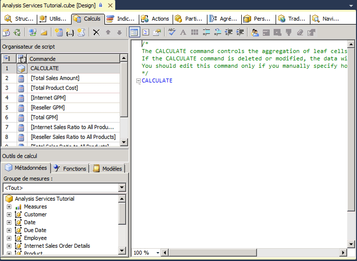
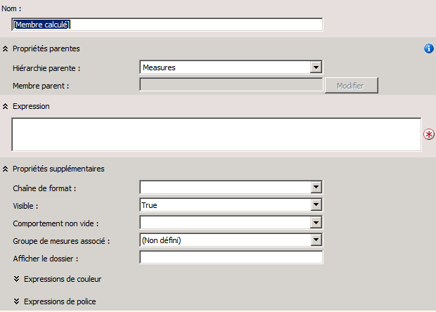
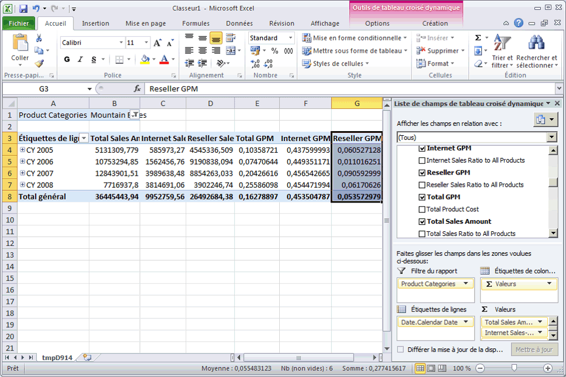

# <a name="lesson-6-1---defining-calculated-members"></a>Leçon 6-1-définir des membres calculés
[!INCLUDE[ssas-appliesto-sqlas](../includes/ssas-appliesto-sqlas.md)]

Les membres calculés sont les membres d'une dimension ou d'un groupe de mesures qui sont définis à l'aide d'une combinaison de données de cube, d'opérateurs arithmétiques, de nombres et de fonctions. Par exemple, vous pouvez créer un membre calculé qui additionne deux mesures physiques dans le cube. Les définitions de membre calculé sont stockées dans les cubes, mais leurs valeurs sont calculées lors du traitement des requêtes.  
  
Pour créer un membre calculé, utilisez la commande **Nouveau membre calculé** , disponible sous l'onglet **Calculs** du Concepteur de cube. Vous pouvez créer un membre calculé au sein d'une dimension, y compris la dimension de mesures. Vous pouvez aussi placer un membre calculé dans un dossier d'affichage dans la boîte de dialogue **Propriétés de calcul** . Pour plus d’informations, consultez [Calculs](../analysis-services/multidimensional-models-olap-logical-cube-objects/calculations.md), [Calculs dans les modèles multidimensionnels](../analysis-services/multidimensional-models/calculations-in-multidimensional-models.md)et [Créer des membres calculés](../analysis-services/multidimensional-models/create-calculated-members.md).  
  
Dans les tâches de cette rubrique, vous définissez des mesures calculées pour permettre aux utilisateurs d'afficher le pourcentage de marge brute et les ratios des ventes pour les ventes par Internet, les ventes de revendeurs et l'ensemble des ventes.  
  
## <a name="defining-calculations-to-aggregate-physical-measures"></a>Définition de calculs pour agréger des mesures physiques  
  
1.  Ouvrez le Concepteur de cube pour le cube du didacticiel de [!INCLUDE[ssASnoversion](../includes/ssasnoversion-md.md)] , puis cliquez sur l'onglet **Calculs** .  
  
    Notez la présence de la commande par défaut CALCULATE dans le volet **Expressions de calcul** et dans le volet **Organisateur de script** . Cette commande spécifie que les mesures du cube doivent être agrégées en fonction de la valeur qui est spécifiée par leurs propriétés AggregateFunction. Les valeurs de mesure sont généralement additionnées mais peuvent aussi être comptées ou agrégées d'une autre manière.  
  
    L'image suivante montre l'onglet **Calculs** du Concepteur de cube.  
  
      
  
2.  Dans la barre d'outils de l'onglet **Calculs** , cliquez sur **Nouveau membre calculé**.  
  
    Un nouveau formulaire apparaît dans le volet **Expressions de calcul** pour vous permettre de définir les propriétés de ce nouveau membre calculé. Le nouveau membre apparaît aussi dans le volet **Organisateur de script** .  
  
    L'image suivante montre le formulaire qui apparaît dans le volet **Expressions de calcul** lorsque vous cliquez sur **Nouveau membre calculé**.  
  
      
  
3.  Dans la zone **Nom** , changez le nom de la mesure calculée en **[Total Sales Amount]**.  
  
    Si le nom d'un membre calculé contient un espace, le nom du membre calculé doit être placé entre crochets.  
  
    Dans la liste **Hiérarchie parente** , notez que, par défaut, un nouveau membre calculé est créé dans la dimension **Mesures** . Souvent, un membre calculé dans la dimension Mesures est également appelé mesure calculée.  
  
4.  Sous l'onglet **Métadonnées** , dans le volet **Outils de calcul** de l'onglet **Calculs** , développez **Mesures** , puis développez **Internet Sales** pour afficher les métadonnées du groupe de mesures **Internet Sales** .  
  
    Vous pouvez faire glisser des métadonnées depuis le volet **Outils de calcul** jusqu’à la zone **Expression** , puis ajouter des opérateurs et d’autres éléments pour créer des expressions MDX (Multidimensional Expressions). Ou bien, vous pouvez taper l'expression MDX directement dans la zone **Expression** .  
  
    > [!NOTE]  
    > Si le volet **Outils de calcul** ne contient pas de métadonnées, cliquez sur **Reconnexion** dans la barre d'outils. Si cette opération ne donne pas de résultats, il se peut que vous deviez traiter le cube ou démarrer une instance de [!INCLUDE[ssASnoversion](../includes/ssasnoversion-md.md)].  
  
5.  Faites glisser **Internet Sales-Sales Amount** depuis l’onglet **Métadonnées** du volet **Outils de calcul** jusqu’à la zone **Expression** dans le volet **Expressions de calcul** .  
  
6.  Dans la zone **Expression** , tapez un signe plus (**+**) après **[Measures].[Internet Sales-Sales Amount]**.  
  
7.  Sous l’onglet **Métadonnées** dans le volet **Outils de calcul** , développez **Reseller Sales**, puis faites glisser **Reseller Sales-Sales Amount** dans la zone **Expression** du volet **Expressions de calcul** après le signe plus (+).  
  
8.  Dans la liste **Chaîne de format** , sélectionnez **Devise**.  
  
9. Dans la liste **Comportement non vide** , cochez les cases pour **Internet Sales-Sales Amount** et **Reseller Sales-Sales Amount**, puis cliquez sur **OK**.  
  
    Les mesures que vous spécifiez dans la liste **Comportement non vide** sont utilisées pour résoudre les requêtes NON EMPTY dans les expressions MDX. Quand vous spécifiez une ou plusieurs mesures dans la liste **Comportement non vide** , [!INCLUDE[ssASnoversion](../includes/ssasnoversion-md.md)] traite le membre calculé comme s’il était vide si toutes les mesures spécifiées sont vides. Si la propriété **Comportement non vide** n’est pas définie, [!INCLUDE[ssASnoversion](../includes/ssasnoversion-md.md)] doit évaluer le membre calculé lui-même pour déterminer s’il est vide.  
  
    L'image suivante montre le volet **Expressions de calcul** rempli à l'aide des paramètres que vous avez spécifiés dans les étapes précédentes.  
  
      
  
10. Dans la barre d'outils de l'onglet **Calculs** , cliquez sur **Mode Script**, puis examinez le script de calcul dans le volet **Expressions de calcul** .  
  
    Remarquez que le nouveau calcul est ajouté à l'expression CALCULATE initiale ; les différents calculs sont séparés par des points-virgules. Observez également qu'un commentaire apparaît au début du script de calcul. L'ajout de commentaires au script de calcul pour les groupes de calculs constitue une méthode conseillée, car elle facilite la compréhension des scripts de calcul complexes.  
  
11. Ajoutez une nouvelle ligne au script de calcul après la commande **Calculate;** et avant le script de calcul que vous venez d'ajouter, puis ajoutez le texte suivant au script sur sa propre ligne :  
  
    ```  
    /* Calculations to aggregate Internet Sales and Reseller Sales measures */  
    ```  
  
    L'image suivante montre les scripts de calcul tels qu'ils doivent apparaître dans le volet **Expressions de calcul** à ce stade dans le didacticiel.  
  
      
  
12. Dans la barre d’outils de l’onglet **Calculs** , cliquez sur **Mode Formulaire**, vérifiez que **[Total Sales Amount]** est sélectionné dans le volet **Organisateur de script** , puis cliquez sur **Nouveau membre calculé**.  
  
13. Changez le nom de ce nouveau membre calculé en **[Total Product Cost]**, puis créez l’expression suivante dans la zone **Expression** :  
  
    ```  
    [Measures].[Internet Sales-Total Product Cost] + [Measures].[Reseller Sales-Total Product Cost]  
    ```  
  
14. Dans la liste **Chaîne de format** , sélectionnez **Devise**.  
  
15. Dans la liste **Comportement non vide** , cochez les cases pour **Internet Sales-Total Product Cost** et **Reseller Sales-Total Product Cost**, puis cliquez sur **OK**.  
  
    Vous avez ainsi défini deux membres calculés, qui sont tous deux visibles dans le volet **Organisateur de script** . Ces membres calculés peuvent être utilisés par d'autres calculs que vous définissez plus loin dans le script de calcul. Vous pouvez afficher la définition d'un membre calculé en le sélectionnant dans le volet **Organisateur de script** ; la définition du membre calculé apparaîtra dans le volet **Expressions de calcul** en Mode Formulaire. Les membres calculés qui viennent d'être définis n'apparaîtront pas dans le volet **Outils de calcul** tant que ces objets n'auront pas été déployés. Les calculs ne nécessitent pas de traitement.  
  
## <a name="defining-gross-profit-margin-calculations"></a>Définition de calculs de marge brute  
  
1.  Vérifiez que **[Total Product Cost]** est sélectionné dans le volet **Organisateur de script** , puis cliquez sur **Nouveau membre calculé** dans la barre d’outils de l’onglet **Calculs** .  
  
2.  Dans la zone **Nom** , changez le nom de cette nouvelle mesure calculée en **[Internet GPM]**.  
  
3.  Dans la zone **Expression** , créez l'expression MDX suivante :  
  
    ```  
    ([Measures].[Internet Sales-Sales Amount] -   
    [Measures].[Internet Sales-Total Product Cost]) /  
    [Measures].[Internet Sales-Sales Amount]  
    ```  
  
4.  Dans la liste **Chaîne de format** , sélectionnez **Pourcentage**.  
  
5.  Dans la liste **Comportement non vide** , cochez la case pour **Internet Sales-Sales Amount**, puis cliquez sur **OK**.  
  
6.  Dans la barre d'outils de l'onglet **Calculs** , cliquez sur **Nouveau membre calculé**.  
  
7.  Dans la zone **Nom** , changez le nom de cette nouvelle mesure calculée en **[Reseller GPM]**.  
  
8.  Dans la zone **Expression** , créez l'expression MDX suivante :  
  
    ```  
    ([Measures].[Reseller Sales-Sales Amount] -   
    [Measures].[Reseller Sales-Total Product Cost]) /  
    [Measures].[Reseller Sales-Sales Amount]  
    ```  
  
9. Dans la liste **Chaîne de format** , sélectionnez **Pourcentage**.  
  
10. Dans la liste **Comportement non vide** , cochez la case pour **Reseller Sales-Sales Amount**, puis cliquez sur **OK**.  
  
11. Dans la barre d'outils de l'onglet **Calculs** , cliquez sur **Nouveau membre calculé**.  
  
12. Dans la zone **Nom** , changez le nom de cette nouvelle mesure calculée en **[Total GPM]**.  
  
13. Dans la zone **Expression** , créez l'expression MDX suivante :  
  
    ```  
    ([Measures].[Total Sales Amount] -   
    [Measures].[Total Product Cost]) /  
    [Measures].[Total Sales Amount]  
    ```  
  
    Remarquez que ce membre calculé référence d'autres membres calculés. Ce membre calculé est valide car il sera calculé après les membres calculés auxquels il fait référence.  
  
14. Dans la liste **Chaîne de format** , sélectionnez **Pourcentage**.  
  
15. Dans la liste **Comportement non vide** , cochez les cases pour **Internet Sales-Sales Amount** et **Reseller Sales-Sales Amount**, puis cliquez sur **OK**.  
  
16. Dans la barre d'outils de l'onglet **Calculs** , cliquez sur **Mode Script** et examinez les trois calculs que vous avez ajoutés au script de calcul.  
  
17. Ajoutez une nouvelle ligne au script de calcul immédiatement avant le calcul **[Internet GPM]** , puis ajoutez le texte suivant au script sur sa propre ligne :  
  
    ```  
    /* Calculations to calculate gross profit margin */  
    ```  
  
    L'image suivante montre le volet **Expressions** avec les trois nouveaux calculs.  
  
      
  
## <a name="defining-the-percent-of-total-calculations"></a>Définition des calculs de pourcentage du total  
  
1.  Dans la barre d'outils de l'onglet **Calculs** , cliquez sur **Mode formulaire**.  
  
2.  Dans la zone **Organisateur de script** , sélectionnez **[Total GPM]**, puis cliquez sur **Nouveau membre calculé** dans la barre d’outils de l’onglet **Calculs** .  
  
    Le fait de cliquer sur le membre calculé final dans le volet **Organisateur de script** avant de cliquer sur **Nouveau membre calculé** garantit que le nouveau membre calculé sera entré à la fin du script. Les scripts s'exécutent dans l'ordre où ils apparaissent dans le volet **Organisateur de script** .  
  
3.  Changez le nom de ce nouveau membre calculé en **[Internet Sales Ratio to All Products]**.  
  
4.  Tapez l'expression suivante dans la zone **Expression** :  
  
    ```  
    Case  
        When IsEmpty( [Measures].[Internet Sales-Sales Amount] )   
        Then 0  
        Else ( [Product].[Product Categories].CurrentMember,  
               [Measures].[Internet Sales-Sales Amount]) /  
             ( [Product].[Product Categories].[(All)].[All],   
               [Measures].[Internet Sales-Sales Amount] )  
        End  
    ```  
  
    Cette expression MDX calcule la contribution de chaque produit au total des ventes par Internet. L'instruction Case et la fonction IS EMPTY excluent la division par zéro lorsqu'un produit n'a pas de ventes.  
  
5.  Dans la liste **Chaîne de format** , sélectionnez **Pourcentage**.  
  
6.  Dans la liste **Comportement non vide** , cochez la case pour **Internet Sales-Sales Amount**, puis cliquez sur **OK**.  
  
7.  Dans la barre d'outils de l'onglet **Calculs** , cliquez sur **Nouveau membre calculé**.  
  
8.  Changez le nom de ce membre calculé en **[Reseller Sales Ratio to All Products]**.  
  
9. Tapez l'expression suivante dans la zone **Expression** :  
  
    ```  
    Case  
        When IsEmpty( [Measures].[Reseller Sales-Sales Amount] )   
        Then 0  
        Else ( [Product].[Product Categories].CurrentMember,  
               [Measures].[Reseller Sales-Sales Amount]) /  
             ( [Product].[Product Categories].[(All)].[All],   
               [Measures].[Reseller Sales-Sales Amount] )  
        End  
    ```  
  
10. Dans la liste **Chaîne de format** , sélectionnez **Pourcentage**.  
  
11. Dans la liste **Comportement non vide** , cochez la case pour **Reseller Sales-Sales Amount**, puis cliquez sur **OK**.  
  
12. Dans la barre d'outils de l'onglet **Calculs** , cliquez sur **Nouveau membre calculé**.  
  
13. Changez le nom de ce membre calculé en **[Total Sales Ratio to All Products]**.  
  
14. Tapez l'expression suivante dans la zone **Expression** :  
  
    ```  
    Case  
        When IsEmpty( [Measures].[Total Sales Amount] )   
        Then 0  
        Else ( [Product].[Product Categories].CurrentMember,  
               [Measures].[Total Sales Amount]) /  
             ( [Product].[Product Categories].[(All)].[All],   
               [Measures].[Total Sales Amount] )  
        End  
    ```  
  
15. Dans la liste **Chaîne de format** , sélectionnez **Pourcentage**.  
  
16. Dans la liste **Comportement non vide** , cochez les cases pour **Internet Sales-Sales Amount** et **Reseller Sales-Sales Amount**, puis cliquez sur **OK**.  
  
17. Dans la barre d'outils de l'onglet **Calculs** , cliquez sur **Mode Script**et examinez les trois calculs que vous avez ajoutés au script de calcul.  
  
18. Ajoutez une nouvelle ligne au script de calcul immédiatement avant le calcul **[Internet Sales Ratio to All Products]** , puis ajoutez le texte suivant au script sur sa propre ligne :  
  
    ```  
    /* Calculations to calculate percentage of product to total product sales */  
    ```  
  
    À présent, vous avez défini au total huit membres calculés, qui sont visibles dans le volet **Organisateur de script** lorsque vous travaillez en mode Formulaire.  
  
## <a name="browsing-the-new-calculated-members"></a>Exploration des nouveaux membres calculés  
  
1.  Dans le menu **Générer** de [!INCLUDE[ssBIDevStudioFull](../includes/ssbidevstudiofull-md.md)], cliquez sur **Déployer Analysis Services Tutorial**.  
  
2.  Après avoir déployé le didacticiel, cliquez sur l'onglet **Navigateur** , puis sur **Reconnexion**.  
  
3.  Cliquez sur l'icône Excel, puis **Activer**.  
  
4.  Dans le volet **Liste de champs de tableau croisé dynamique** , développez le dossier **Valeurs** pour afficher les nouveaux membres calculés de la dimension de mesures.  
  
5.  Faites glisser **Total Sales Amount** vers la zone Valeurs, puis examinez les résultats.  
  
    Faites glisser les mesures **Internet Sales-Sales Amount** et **Reseller Sales-Sales Amount** des groupes de mesures **Internet Sales** et **Reseller Sales** vers la zone Valeurs.  
  
    Observez que la mesure **Total Sales Amount** est la somme de la mesure **Internet Sales-Sales Amount** et de la mesure **Reseller Sales-Sales Amount** .  
  
6.  Ajoutez la hiérarchie **Product Categories** définie par l’utilisateur à la zone de filtre de la zone **Filtre de rapport** , puis filtrez les données par **Mountain Bikes**.  
  
    Notez que la mesure **Total Sales Amount** est calculée pour la catégorie de ventes de produit **Mountain Bikes** en fonction des mesures **Internet Sales-Sales Amount** et **Reseller Sales-Sales Amount** pour **Mountain Bikes**.  
  
7.  Ajoutez la hiérarchie définie par l’utilisateur **Date.Calendar Date** à la zone d’étiquettes de ligne, puis examinez les résultats.  
  
    Notez que la mesure **Total Sales Amount** pour chaque année fiscale est calculée pour la catégorie de ventes de produit **Mountain Bikes** en fonction des mesures **Internet Sales-Sales Amount** et **Reseller Sales-Sales Amount** pour **Mountain Bikes**.  
  
8.  Ajoutez les mesures **Total GPM**, **Internet GPM**et **Reseller GPM** à la zone Valeurs, puis examinez les résultats.  
  
    Observez que la marge brute pour les ventes de revendeurs est nettement plus faible que pour les ventes par Internet, comme l'illustre l'image suivante.  
  
      
  
9. Ajoutez les mesures **Total Sales Ratio to All Products**, **Internet Sales Ratio to All Products**et **Reseller Sales Ratio to All Products** à la zone Valeurs.  
  
    Observez que le ratio des ventes de vélos tout terrain sur les ventes de tous les produits a augmenté dans le temps pour les ventes par Internet, mais diminue progressivement pour les ventes de revendeurs. Notez également que le ratio des ventes de vélos tout terrain sur les ventes de tous les produits est plus faible dans les ventes de revendeurs que dans les ventes par Internet.  
  
10. À la place de **Mountain Bikes** , utilisez le filtre **Bikes**et examinez les résultats.  
  
    Observez que la marge brute pour tous les vélos vendus par des revendeurs est négative parce que les vélos de cyclotourisme et les vélos de route sont vendus à perte.  
  
11. Changez de filtre en spécifiant **Accessories**, puis examinez les résultats.  
  
    Observez que la vente d'accessoires augmente dans le temps, mais qu'elle ne représente qu'une petite partie des ventes totales. Notez également que la marge brute des accessoires est supérieure à celle des vélos.  
  
## <a name="next-task-in-lesson"></a>Tâche suivante de la leçon  
[Définition de jeux nommés](../analysis-services/lesson-6-2-defining-named-sets.md)  
  
## <a name="see-also"></a>Voir aussi  
[Calculs](../analysis-services/multidimensional-models-olap-logical-cube-objects/calculations.md)  
[Calculs dans les modèles multidimensionnels](../analysis-services/multidimensional-models/calculations-in-multidimensional-models.md)  
[Créer des membres calculés](../analysis-services/multidimensional-models/create-calculated-members.md)  
  
  
  
