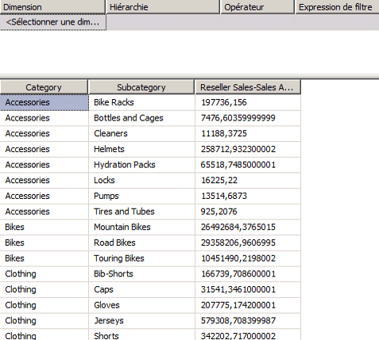
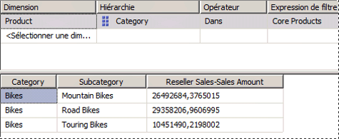
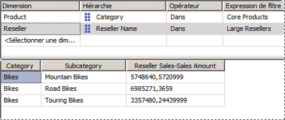

# <a name="lesson-6-2---defining-named-sets"></a>Leçon 6-2 - définition de jeux nommés
[!INCLUDE[ssas-appliesto-sqlas](../includes/ssas-appliesto-sqlas.md)]

Un jeu nommé est une expression MDX (Multidimensional Expressions) qui retourne un ensemble de membres de dimension. Vous pouvez définir des jeux nommés et les enregistrer en tant que partie de la définition du cube ; vous pouvez aussi créer des jeux nommés dans des applications clientes. Vous créez des jeux nommés en combinant des données de cube, des opérateurs arithmétiques, des nombres et des fonctions. Les jeux nommés peuvent être employés par les utilisateurs dans des requêtes MDX dans des applications clientes. Ils peuvent aussi être utilisés pour définir des jeux dans des sous-cubes. Un sous-cube est une collection de jeux joints entre eux qui limite l'espace du cube au sous-espace défini pour les instructions suivantes. Définir un espace de cube limité est un des concepts fondamentaux des scripts MDX.  
  
Les jeux nommés simplifient les requêtes MDX et fournissent d'utiles alias pour les expressions d'ensemble complexes utilisées généralement. Par exemple, vous pouvez définir un jeu nommé appelé Large Resellers qui contient les membres de la dimension Reseller qui ont le plus d'employés. Les utilisateurs finaux pourront ensuite utiliser le jeu nommé Large Resellers dans des requêtes, ou s'en servir pour définir un ensemble dans un sous-cube. Les définitions de jeu nommé sont stockées dans les cubes, mais leurs valeurs existent uniquement en mémoire. Pour créer un jeu nommé, utilisez la commande **Nouveau jeu nommé** , disponible sous l'onglet **Calculs** du Concepteur de cube. Pour plus d’informations, consultez [Calculs](../analysis-services/multidimensional-models-olap-logical-cube-objects/calculations.md)et [Créer des jeux nommés](../analysis-services/multidimensional-models/create-named-sets.md).  
  
Dans les tâches de cette rubrique, vous allez définir deux jeux nommés : un jeu nommé Core Products et un jeu nommé Large Resellers.  
  
## <a name="defining-a-core-products-named-set"></a>Définition d'un jeu nommé Core Products  
  
1.  Cliquez sur l'onglet **Calculs** du Concepteur de cube pour le cube du didacticiel de [!INCLUDE[ssASnoversion](../includes/ssasnoversion-md.md)] , puis cliquez sur **Mode Formulaire** dans la barre d'outils.  
  
2.  Cliquez sur **[Total Sales Ratio to All Products]** dans le volet **Organisateur de script** , puis cliquez sur **Nouveau jeu nommé** dans la barre d’outils de l’onglet **Calculs** .  
  
    Lorsque vous définissez un nouveau calcul sous l'onglet **Calculs** , n'oubliez pas que les calculs sont résolus dans l'ordre où ils apparaissent dans le volet **Organisateur de script** . La partie de ce volet qui est active lorsque vous créez un nouveau calcul détermine l'ordre d'exécution du calcul ; un nouveau calcul est défini immédiatement après le calcul actif.  
  
3.  Dans la zone **Nom** , changez le nom du nouveau jeu nommé en **[Core Products]**.  
  
    Dans le volet **Organisateur de script** , remarquez l'icône unique qui différencie un jeu nommé d'une commande de script ou d'un membre calculé.  
  
4.  Sous l'onglet **Métadonnées** du volet **Outils de calcul** , développez **Product**, développez **Category**, développez **Members**, puis développez **All Products**.  
  
    > [!NOTE]  
    > Si le volet **Outils de calcul** ne contient pas de métadonnées, cliquez sur **Reconnexion** dans la barre d'outils. Si cette opération ne donne pas de résultats, il se peut que vous deviez traiter le cube ou démarrer une instance de [!INCLUDE[ssASnoversion](../includes/ssasnoversion-md.md)].  
  
5.  Faites glisser **Bikes** jusqu'à la zone **Expression** .  
  
    Vous venez de créer une expression d'ensemble qui retournera le jeu de membres qui sont dans la catégorie Bike de la dimension Product.  
  
## <a name="defining-a-large-resellers-named-set"></a>Définition d'un jeu nommé Large Resellers  
  
1.  Cliquez avec le bouton droit sur **[Core Products]** dans le volet **Organisateur de script** , puis cliquez sur **Nouveau jeu nommé**.  
  
2.  Dans la zone **Nom** , changez le nom de ce nouveau jeu nommé en **[Large Resellers]**.  
  
3.  Dans la zone **Expression** , tapez **Exists()**.  
  
    Vous allez utiliser la fonction Exists pour retourner le jeu de membres de la hiérarchie d’attribut Reseller Name qui a une intersection avec le jeu de membres de la hiérarchie d’attribut Number of Employees ayant le plus grand nombre d’employés.  
  
4.  Sous l'onglet **Métadonnées** du volet **Outils de calcul** , développez la dimension **Reseller** , puis développez la hiérarchie d'attribut **Reseller Name** .  
  
5.  Faites glisser le niveau **Reseller Name** et placez-le entre les parenthèses de l’expression d’ensemble Exists.  
  
    Vous allez utiliser la fonction Members pour retourner tous les membres de ce jeu. Pour plus d’informations, consultez [Members &#40;Set&#41; &#40;MDX&#41;](../mdx/members-set-mdx.md).  
  
6.  Après l’expression d’ensemble incomplète, tapez un point, puis ajoutez la fonction Members. Votre expression doit présenter l'aspect suivant :  
  
    ```  
    Exists([Reseller].[Reseller Name].[Reseller Name].Members)  
    ```  
  
    À présent que vous avez défini le premier jeu pour l’expression d’ensemble Exists, vous êtes prêt à ajouter le second (le jeu de membres de la dimension Reseller contenant le plus grand nombre d’employés).  
  
7.  Sous l'onglet **Métadonnées** du volet **Outils de calcul** , développez **Number of Employees** dans la dimension Reseller, développez **Members**, puis développez **All Resellers**.  
  
    Observez que les membres de cette hiérarchie d'attribut ne sont pas groupés.  
  
8.  Ouvrez le Concepteur de dimensions pour la dimension **Reseller** , puis cliquez sur **Number of Employees** dans le volet **Attributs** .  
  
9. Dans la fenêtre Propriétés, changez la valeur de la propriété **DiscretizationMethod** en **Automatic**et la valeur de la propriété **DiscretizationBucketCount** en **5**. Pour plus d’informations, consultez [Regrouper des membres d’un attribut &#40;discrétisation&#41;](../analysis-services/multidimensional-models/attribute-properties-group-attribute-members.md).  
  
10. Dans le menu **Générer** de [!INCLUDE[ssBIDevStudioFull](../includes/ssbidevstudiofull-md.md)], cliquez sur **Déployer Analysis Services Tutorial**.  
  
11. Une fois le déploiement achevé, ouvrez le cube du didacticiel de [!INCLUDE[ssASnoversion](../includes/ssasnoversion-md.md)] dans le Concepteur de cube, puis cliquez sur **Reconnexion** dans la barre d'outils de l'onglet **Calculs** .  
  
12. Sous l'onglet **Métadonnées** du volet **Outils de calcul** , développez **Number of Employees** dans la dimension **Reseller** , développez **Members**, puis développez **All Resellers**.  
  
    Observez que les membres de cette hiérarchie d'attributs sont maintenant contenus dans cinq groupes, numérotés de 0 à 4. Pour afficher le numéro d'un groupe, arrêtez le pointeur sur le groupe qui vous intéresse pour faire apparaître une info-bulle. Pour la plage `2 -17`, l'info-bulle doit contenir `[Reseller].[Number of Employees].&[0]`.  
  
    Les membres de cette hiérarchie d’attribut sont groupés, car la propriété DiscretizationBucketCount a la valeur **5** et la propriété DiscretizationMethod la valeur **Automatic**.  
  
13. Dans la zone **Expression** , ajoutez une virgule à l’expression d’ensemble Exists après la fonction Members et avant la parenthèse fermante, puis faites glisser **83 - 100** depuis le volet **Métadonnées** jusqu’à la position suivant immédiatement cette virgule.  
  
    Vous avez maintenant terminé l’expression d’ensemble Exists qui, quand le jeu nommé Large Resellers sera placé sur un axe, retournera le jeu de membres ayant une intersection avec les deux jeux spécifiés, à savoir le jeu de tous les revendeurs et le jeu de revendeurs qui ont de 83 à 100 employés.  
  
    L’image suivante montre le volet **Expressions de calcul** pour le jeu nommé **[Large Resellers]** .  
  
    ![Volet des Expressions de calcul pour [Large Resellers]](../analysis-services/media/l6-named-set-02.gif "volet des Expressions de calcul pour [Large Resellers]")  
  
14. Dans la barre d'outils de l'onglet **Calculs** , cliquez sur **Mode Script**et examinez les deux jeux nommés que vous venez d'ajouter au script de calcul.  
  
15. Ajoutez une nouvelle ligne au script de calcul immédiatement avant la première commande CREATE SET, puis ajoutez le texte suivant au script sur sa propre ligne :  
  
    ```  
    /* named sets */  
    ```  
  
    Vous avez ainsi défini deux jeux nommés, qui sont visibles dans le volet **Organisateur de script** . Vous êtes maintenant prêt à déployer ces jeux nommés, puis à parcourir ces mesures dans le cube du didacticiel de [!INCLUDE[ssASnoversion](../includes/ssasnoversion-md.md)] .  
  
## <a name="browsing-the-cube-by-using-the-new-named-sets"></a>Exploration du cube en utilisant les nouveaux jeux nommés  
  
1.  Dans le menu **Générer** de [!INCLUDE[ssBIDevStudio](../includes/ssbidevstudio-md.md)], cliquez sur **Déployer Analysis Services Tutorial**.  
  
2.  Après avoir déployé le didacticiel, cliquez sur l'onglet **Navigateur** , puis cliquez sur **Reconnexion**.  
  
3.  Effacez la grille dans le volet des données.  
  
4.  Ajoutez la mesure **Reseller Sales-Sales Amount** à la zone de données.  
  
5.  Développez la dimension Product, puis ajoutez Category et Subcategory dans la zone de lignes, comme le montre l'image suivante.  
  
      
  
6.  Dans le volet **Métadonnées** , dans la dimension **Product** , faites glisser **Core Products** vers la zone de filtre.  
  
    Notez que seuls le membre **Bike** de l'attribut **Category** et les membres des sous-catégories de **Bike** restent dans le cube. Cela est dû au fait que le jeu nommé **Core Products** est utilisé pour définir un sous-cube. Ce sous-cube limite les membres de l'attribut **Category** dans la dimension **Product** à l'intérieur du sous-cube à ceux qui sont membres du jeu nommé **Core Product** , comme le montre l'image suivante.  
  
      
  
7.  Dans le volet **Métadonnées** , développez **Reseller**, ajoutez **Large Resellers** à la zone de filtre.  
  
    Notez que la mesure Reseller Sales Amount dans le volet Données n'affiche les montants des ventes que pour les grands revendeurs de vélos. Observez également que le volet Filtre affiche maintenant les deux jeux nommés utilisés pour définir ce sous-cube particulier, comme le montre l'image suivante.  
  
      
  
## <a name="next-lesson"></a>Leçon suivante  
[Leçon 7 : Définition d’indicateurs de Performance clés & #40 ; Indicateurs de performance clés & #41 ;](../analysis-services/lesson-7-defining-key-performance-indicators-kpis.md)  
  
## <a name="see-also"></a>Voir aussi  
[Calculs](../analysis-services/multidimensional-models-olap-logical-cube-objects/calculations.md)  
[Créer des jeux nommés](../analysis-services/multidimensional-models/create-named-sets.md)  
  
  
  
