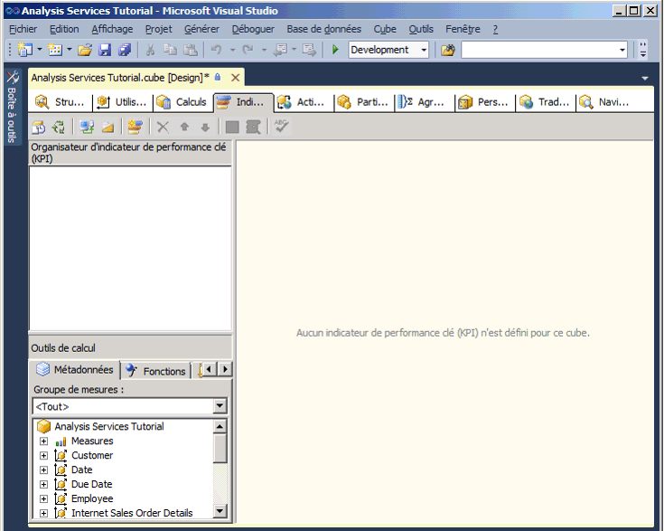
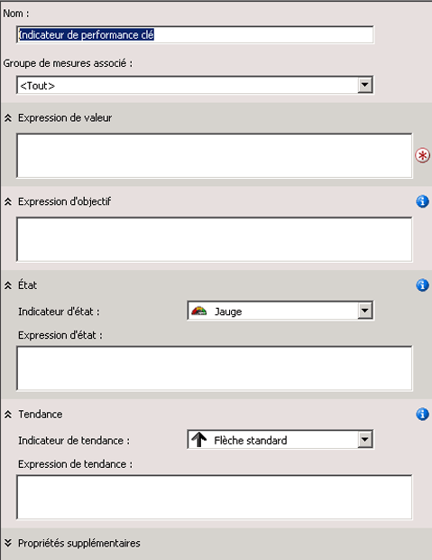

# <a name="lesson-7-1---defining-and-browsing-kpis"></a>Leçon 7-1-Définition et exploration d’indicateurs de performance clés
[!INCLUDE[ssas-appliesto-sqlas](../includes/ssas-appliesto-sqlas.md)]

Pour définir un indicateur de performance clé (PKI, Key Performance Indicator), vous définissez d'abord son nom et le groupe de mesures auquel il est associé. Un indicateur de performance clé peut être associé à tous les groupes de mesures ou à un seul groupe de mesures. Vous définissez ensuite les éléments suivants de l'indicateur de performance clé :  
  
-   L'expression de valeur  
  
    Une expression de valeur est une mesure physique, par exemple Sales, une mesure calculée, par exemple Profit, ou un calcul qui est défini dans l'indicateur de performance clé à l'aide d'une expression MDX (Multidimensional Expressions).  
  
-   L'expression d'objectif  
  
    Une expression d'objectif est soit une valeur, soit une expression MDX dont la résolution fournit une valeur, qui fixe la cible de la mesure que définit l'expression de valeur. Par exemple, une expression d'objectif peut être le montant par lequel les directeurs d'une société veulent augmenter les ventes ou le bénéfice.  
  
-   L'expression d'état  
  
    Une expression d'état est une expression MDX que [!INCLUDE[ssASnoversion](../includes/ssasnoversion-md.md)] utilise pour évaluer l'état actuel de l'évolution de l'expression de valeur par rapport à l'expression d'objectif. Une expression de but est une valeur normalisée appartenant à la plage de -1 à +1, où -1 est synonyme de très mauvais et +1 de très bon. L'expression d'état s'affiche avec une image pour vous aider à déterminer facilement l'état de l'expression de valeur comparée à l'expression d'objectif.  
  
-   L'expression de tendance  
  
    Une expression de tendance est une expression MDX que [!INCLUDE[ssASnoversion](../includes/ssasnoversion-md.md)] utilise pour évaluer la tendance actuelle de l'évolution de l'expression de valeur par rapport à l'expression d'objectif. L'expression de tendance aide l'utilisateur à déterminer rapidement si l'expression de valeur s'améliore ou se dégrade par rapport à l'expression d'objectif. Vous pouvez associer différentes images à l'expression de tendance pour permettre aux utilisateurs dans une entreprise de comprendre la tendance d'un coup d'œil.  
  
En plus de ces éléments, vous définissez plusieurs propriétés d'un indicateur de performance clé. Ces propriétés incluent un dossier d'affichage, un indicateur parent si l'indicateur est calculé à partir d'autres indicateurs de performance clés, le membre de temps actif (s'il y en a un), le poids de l'indicateur de performance clé (s'il en a un) et une description.  
  
> [!NOTE]  
> Pour obtenir plus d’exemples d’indicateurs de performance clés (KPI), consultez les exemples de KPI sous l’onglet Modèles du volet Outils de calcul ou dans les exemples de l’entrepôt de données **Adventure Works DW 2012** . Pour plus d’informations sur la façon d’installer cette base de données, consultez [Installer les exemples de données et de projets pour le didacticiel sur la modélisation multidimensionnelle Analysis Services](../analysis-services/install-sample-data-and-projects.md).  
  
Dans la tâche de cette leçon, vous définissez les indicateurs de performance clés dans le projet du didacticiel [!INCLUDE[ssASnoversion](../includes/ssasnoversion-md.md)] , puis vous parcourez le cube du didacticiel [!INCLUDE[ssASnoversion](../includes/ssasnoversion-md.md)] en utilisant ces indicateurs de performance clés. Vous allez définir les indicateurs de performance clés suivants :  
  
-   Reseller Revenue  
  
    Cet indicateur de performance clé permet de comparer les ventes de revendeurs réelles aux quotas pour les ventes de revendeurs, de mesurer leur éloignement de l'objectif et d'identifier la tendance dans la réalisation de l'objectif.  
  
-   Product Gross Profit Margin  
  
    Cet indicateur de performance clé sert d'une part à déterminer l'éloignement de la marge brute totale pour chaque catégorie de produit par rapport à l'objectif de chaque catégorie de produit, et d'autre part, à identifier la tendance dans la réalisation de cet objectif.  
  
## <a name="defining-the-reseller-revenue-kpi"></a>Définition de l'indicateur de performance clé Reseller Revenue  
  
1.  Ouvrez le Concepteur de cube pour le cube du didacticiel de [!INCLUDE[ssASnoversion](../includes/ssasnoversion-md.md)] , puis cliquez sur l’onglet **Indicateurs de performance clés** .  
  
    L’onglet **Indicateurs de performance clés** comporte plusieurs volets. Sur le côté gauche de l’onglet se trouvent le volet **Organisateur d’indicateur de performance clé (KPI)** et le volet **Outils de calcul** . Le volet d’informations au milieu de l’onglet contient les détails de l’indicateur de performance clé qui est sélectionné dans le volet **Organisateur d’indicateur de performance clé (KPI)** .  
  
    L’image suivante montre l’onglet **Indicateurs de performance clés** du Concepteur de cube.  
  
      
  
2.  Dans la barre d’outils de l’onglet **Indicateurs de performance clés** , cliquez sur le bouton **Nouvel indicateur de performance clé (KPI)** .  
  
    Un modèle d'indicateur de performance clé vide apparaît dans le volet d'informations, comme le montre l'image suivante.  
  
      
  
3.  Dans la zone **Nom** , tapez **Reseller Revenue**, puis cliquez sur **Reseller Sales** dans la liste **Groupe de mesures associé** .  
  
4.  Sous l’onglet **Métadonnées** du volet **Outils de calcul** , développez **Mesures**, **Reseller Sales**, puis faites glisser la mesure **Reseller Sales-Sales Amount** jusqu’à la zone **Expression de valeur** .  
  
5.  Sous l’onglet **Métadonnées** du volet **Outils de calcul** , développez **Mesures**, **Sales Quotas**, puis faites glisser la mesure **Sales Amount Quota** jusqu’à la zone **Expression d’objectif** .  
  
6.  Vérifiez que l’indicateur **Jauge** est sélectionné dans la liste **Indicateur d’état** , puis tapez l’expression MDX suivante dans la zone **Expression d’état** :  
  
    ```  
    Case  
     When   
      KpiValue("Reseller Revenue")/KpiGoal("Reseller Revenue")>=.95  
       Then 1  
     When  
      KpiValue("Reseller Revenue")/KpiGoal("Reseller Revenue")<.95  
       And   
      KpiValue("Reseller Revenue")/KpiGoal("Reseller Revenue")>=.85  
       Then 0  
      Else-1  
    End  
    ```  
  
    Cette expression MDX fournit la base d'évaluation des progrès réalisés en direction de l'objectif. Dans cette expression MDX, si les ventes de revendeurs réelles s'élèvent à plus de 85 pour cent de l'objectif, une valeur de 0 est utilisée pour remplir l'image choisie. Comme la jauge est l'image choisie, le pointeur de la jauge sera à mi-chemin entre vide et plein. Si les ventes de revendeurs réelles dépassent 90 pour cent de l'objectif, le pointeur de la jauge sera aux trois-quarts du chemin entre vide et plein.  
  
7.  Vérifiez que l’indicateur **Flèche standard** est sélectionné dans la liste **Indicateur de tendance** , puis tapez l’expression suivante dans la zone **Expression de tendance** :  
  
    ```  
    Case  
     When IsEmpty  
      (ParallelPeriod  
       ([Date].[Calendar Date].[Calendar Year],1,  
           [Date].[Calendar Date].CurrentMember))  
      Then 0    
     When  (  
      KpiValue("Reseller Revenue") -   
       (KpiValue("Reseller Revenue"),   
        ParallelPeriod  
         ([Date].[Calendar Date].[Calendar Year],1,  
           [Date].[Calendar Date].CurrentMember))  
          /  
          (KpiValue ("Reseller Revenue"),  
           ParallelPeriod  
            ([Date].[Calendar Date].[Calendar Year],1,  
             [Date].[Calendar Date].CurrentMember)))  
           >=.02  
      Then 1  
       When(  
        KpiValue("Reseller Revenue") -   
         (KpiValue ( "Reseller Revenue" ),  
          ParallelPeriod  
           ([Date].[Calendar Date].[Calendar Year],1,  
            [Date].[Calendar Date].CurrentMember))  
           /  
            (KpiValue("Reseller Revenue"),  
             ParallelPeriod  
              ([Date].[Calendar Date].[Calendar Year],1,  
                [Date].[Calendar Date].CurrentMember)))  
            <=.02  
      Then -1  
       Else 0  
    End  
    ```  
  
    Cette expression MDX fournit la base d'évaluation de la tendance dans la réalisation de l'objectif défini.  
  
## <a name="browsing-the-cube-by-using-the-reseller-revenue-kpi"></a>Exploration du cube en utilisant l'indicateur de performance clé Reseller Revenue  
  
1.  Dans le menu **Générer** de [!INCLUDE[ssBIDevStudioFull](../includes/ssbidevstudiofull-md.md)], cliquez sur **Déployer Analysis Services Tutorial**.  
  
2.  Après avoir déployé le didacticiel, cliquez sur le bouton **Mode Navigateur** dans la barre d’outils de l’onglet **Indicateurs de performance clés** , puis cliquez sur **Reconnexion**.  
  
    Les jauges d’état et de tendance sont affichées dans le volet **Navigateur d’indicateur de performance clé (KPI)** pour les ventes de revendeurs en fonction des valeurs du membre par défaut de chaque dimension, avec la valeur de l’expression de valeur et de l’expression d’objectif. Le membre par défaut de chaque dimension est le membre Tous du niveau Tous parce que vous n'avez pas défini d'autre membre de dimension que le membre par défaut.  
  
3.  Dans le volet de filtre, sélectionnez **Sales Territory** dans la liste **Dimension** , sélectionnez **Sales Territories** dans la liste **Hiérarchie** , sélectionnez **Equal** dans la liste **Opérateur** , puis cochez la case **North America** dans la liste **Expression de filtre** et cliquez sur **OK**.  
  
4.  Dans la ligne suivante du volet **Filtre** , sélectionnez **Date** dans la liste **Dimension** , sélectionnez **Calendar Date** dans la liste **Hiérarchie** , sélectionnez **Equal** dans la liste **Opérateur** , puis cochez la case **Q3 CY 2007** dans la liste **Expression de filtre** et cliquez sur **OK**.  
  
5.  Cliquez n’importe où dans le volet **Navigateur d’indicateur de performance clé (KPI)** pour actualiser les valeurs de **l’indicateur de performance clé Reseller Revenue**.  
  
    Notez que les sections **Valeur**, **Objectif**et **État** de l’indicateur de performance clé reflètent les valeurs pour la nouvelle période de temps.  
  
## <a name="defining-the-product-gross-profit-margin-kpi"></a>Définition de l'indicateur de performance clé Product Gross Profit Margin  
  
1.  Cliquez sur le bouton **Mode Formulaire** dans la barre d’outils de l’onglet **Indicateurs de performance clés** , puis cliquez sur le bouton **Nouvel indicateur de performance clé (KPI)** .  
  
2.  Dans la zone **Nom** , tapez **Product Gross Profit Margin**, puis vérifiez que **<All>** apparaît dans la liste **Groupe de mesures associé** .  
  
3.  Sous l’onglet **Métadonnées** du volet **Outils de calcul** , faites glisser la mesure **Total GPM** jusqu’à la zone **Expression de valeur** .  
  
4.  Dans la zone **Expression d’objectif** , tapez l’expression suivante :  
  
    ```  
    Case  
        When [Product].[Category].CurrentMember Is  
          [Product].[Category].[Accessories]  
        Then .40                   
        When [Product].[Category].CurrentMember   
          Is [Product].[Category].[Bikes]  
        Then .12                  
        When [Product].[Category].CurrentMember Is  
          [Product].[Category].[Clothing]  
        Then .20  
        When [Product].[Category].CurrentMember Is  
          [Product].[Category].[Components]  
        Then .10  
        Else .12              
    End  
    ```  
  
5.  Dans la liste **Indicateur d’état** , sélectionnez **Cylindre**.  
  
6.  Tapez l’expression MDX suivante dans la zone **Expression d’état** :  
  
    ```  
    Case  
        When KpiValue( "Product Gross Profit Margin" ) /   
             KpiGoal ( "Product Gross Profit Margin" ) >= .90  
        Then 1  
        When KpiValue( "Product Gross Profit Margin" ) /   
             KpiGoal ( "Product Gross Profit Margin" ) <  .90  
             And   
             KpiValue( "Product Gross Profit Margin" ) /   
             KpiGoal ( "Product Gross Profit Margin" ) >= .80  
        Then 0  
        Else -1  
    End  
    ```  
  
    Cette expression MDX fournit la base d'évaluation des progrès réalisés en direction de l'objectif.  
  
7.  Vérifiez que l’indicateur **Flèche standard** est sélectionné dans la liste **Indicateur de tendance** , puis tapez l’expression MDX suivante dans la zone **Expression de tendance** :  
  
    ```  
    Case  
    When IsEmpty  
      (ParallelPeriod  
       ([Date].[Calendar Date].[Calendar Year],1,  
           [Date].[Calendar Date].CurrentMember))  
      Then 0    
       When VBA!Abs  
        (  
          KpiValue( "Product Gross Profit Margin" ) -   
           (  
             KpiValue ( "Product Gross Profit Margin" ),  
              ParallelPeriod  
              (   
                [Date].[ Calendar Date].[ Calendar Year],  
                1,  
                [Date].[ Calendar Date].CurrentMember  
              )  
            ) /  
            (  
              KpiValue ( "Product Gross Profit Margin" ),  
              ParallelPeriod  
              (   
                [Date].[ Calendar Date].[ Calendar Year],  
                1,  
                [Date].[ Calendar Date].CurrentMember  
              )  
            )    
          ) <=.02  
      Then 0  
      When KpiValue( "Product Gross Profit Margin" ) -   
           (  
             KpiValue ( "Product Gross Profit Margin" ),  
             ParallelPeriod  
             (   
               [Date].[ Calendar Date].[ Calendar Year],  
               1,  
               [Date].[ Calendar Date].CurrentMember  
             )  
           ) /  
           (  
             KpiValue ( "Product Gross Profit Margin" ),  
             ParallelPeriod  
             (   
               [Date].[Calendar Date].[Calendar Year],  
               1,  
               [Date].[Calendar Date].CurrentMember  
             )  
           )  >.02  
      Then 1  
      Else -1  
    End  
    ```  
  
    Cette expression MDX fournit la base d'évaluation de la tendance dans la réalisation de l'objectif défini.  
  
## <a name="browsing-the-cube-by-using-the-total-gross-profit-margin-kpi"></a>Exploration du cube en utilisant l'indicateur de performance clé Total Gross Profit Margin  
  
1.  Dans le menu **Générer** , cliquez sur **Déployer Analysis Services Tutorial**.  
  
2.  Après avoir déployé le didacticiel, cliquez sur **Reconnexion** dans la barre d’outils de l’onglet **Indicateurs de performance clés** , puis cliquez sur **Mode Navigateur**.  
  
    L’indicateur de performance clé **Product Gross Profit Margin** apparaît et affiche la valeur KPI pour **Q3 CY 2007** et le secteur de ventes **North America** .  
  
3.  Dans le volet **Filtre** , sélectionnez **Product** dans la liste **Dimension** , sélectionnez **Category** dans la liste **Hiérarchie** , sélectionnez **Equal** dans la liste **Opérateur** , sélectionnez **Bikes** dans la liste **Expression de filtre** , puis cliquez sur **OK**.  
  
    La marge brute de la vente de vélos par les revendeurs en Amérique du Nord pour le troisième trimestre de l'année fiscale 2007 s'affiche.  
  
## <a name="next-lesson"></a>Leçon suivante  
[Leçon 8 : Définition des Actions](../analysis-services/lesson-8-defining-actions.md)  
  
