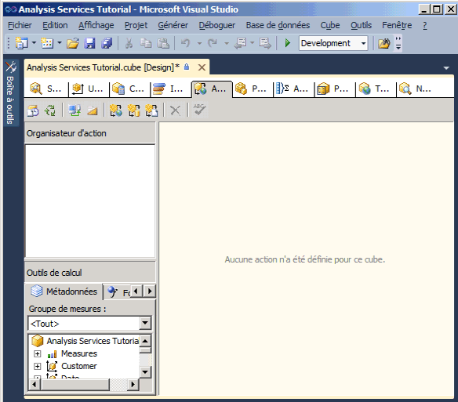
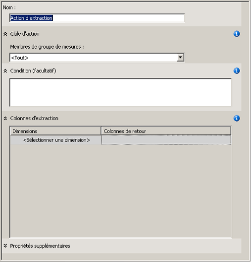
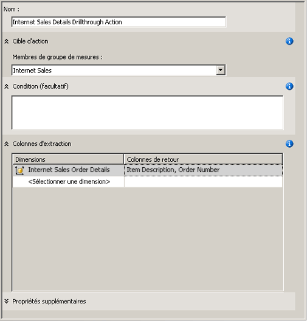
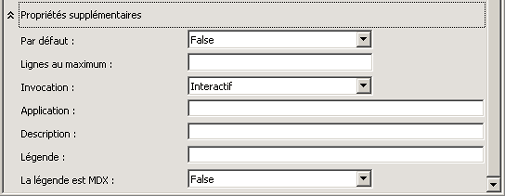
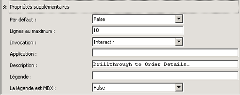
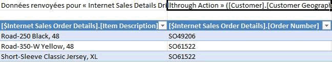
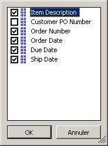
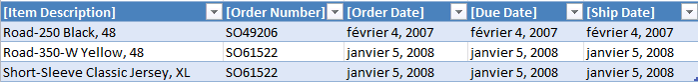

# Leçon 8-1 : définition et utilisation d’une Action d’extraction
[!INCLUDE[ssas-appliesto-sqlas](../includes/ssas-appliesto-sqlas.md)]

Le dimensionnement des données de fait par une dimension de fait sans filtrage correct des données retournées par la requête peut ralentir les performances des requêtes. Pour éviter ceci, vous pouvez définir une action d'extraction qui restreint le nombre total de lignes retournées. Cela améliorera considérablement les performances des requêtes.  
  
Dans les tâches de cette rubrique, vous définissez une action d'extraction pour retourner des informations détaillées sur les commandes pour les ventes à des clients via Internet.  
  
## Définition des propriétés d'une action d'extraction  
  
1.  Ouvrez le Concepteur de cube pour le cube du didacticiel de [!INCLUDE[ssASnoversion](../includes/ssasnoversion-md.md)] , puis cliquez sur l’onglet **Actions** .  
  
    L’onglet **Actions** comporte plusieurs volets. Sur le côté gauche de l’onglet se trouvent le volet **Organisateur d’action** et le volet **Outils de calcul** . À droite de ces deux volets se trouve le volet de **visualisation** , qui contient les détails de l’action qui est sélectionnée dans le volet **Organisateur d’action** .  
  
    L’image suivante montre l’onglet **Actions** du Concepteur de cube.  
  
      
  
2.  Dans la barre d’outils de l’onglet **Actions** , cliquez sur le bouton **Nouvelle action d’extraction** .  
  
    Un modèle d'action vide apparaît dans le volet de visualisation.  
  
      
  
3.  Dans la zone **Nom** , changez le nom de cette action en **Internet Sales Details Drillthrough Action**.  
  
4.  Dans la liste **Membres de groupe de mesures** , sélectionnez **Internet Sales**.  
  
5.  Dans la zone **Colonnes d’extraction** , sélectionnez **Internet Sales Order Details** dans la liste **Dimensions** .  
  
6.  Dans la liste **Colonnes de retour** , cochez les cases **Item Description** et **Order Number** , puis cliquez sur **OK**. L'image suivante montre le modèle d'action tel qu'il doit se présenter à ce stade de la procédure.  
  
      
  
7.  Développez la zone **Propriétés supplémentaires** , comme le montre l’image suivante.  
  
      
  
8.  Dans la zone **Lignes au maximum** , tapez **10**.  
  
9. Dans la zone **Légende** , tapez **Drillthrough to Order Details…**.  
  
    Ces paramètres limitent le nombre de lignes retournées et spécifient la légende qui apparaît dans le menu de l'application cliente. L’image suivante montre ces paramètres dans la zone **Propriétés supplémentaires** .  
  
      
  
## Utilisation de l'action d'extraction  
  
1.  Dans le menu **Générer** , cliquez sur **Déployer Analysis Services Tutorial**.  
  
2.  Une fois le déploiement terminé, cliquez sur l’onglet **Navigateur** dans le Concepteur de cube pour le cube du didacticiel [!INCLUDE[ssASnoversion](../includes/ssasnoversion-md.md)] , puis cliquez sur **Reconnexion** .  
  
3.  Démarrez Excel.  
  
4.  Ajoutez la mesure **Internet Sales-Sales Amount** à la zone Valeurs.  
  
5.  Ajoutez la hiérarchie définie par l’utilisateur **Customer Geography** à partir du dossier **Location** de la dimension **Customer** à la zone **Filtre de rapport** .  
  
6.  Dans le tableau croisé dynamique, dans **Customer Geography**, ajoutez un filtre qui sélectionne un seul client. Développez successivement **All Customers**, **Australia**, **Queensland**, **Brisbane**et **4000**, cochez la case **Adam Powell**, puis cliquez sur **OK**.  
  
    Les ventes totales de produits par [!INCLUDE[ssSampleDBCoFull](../includes/sssampledbcofull-md.md)] à Adam Powell sont affichées dans la zone de données.  
  
7.  Cliquez avec le bouton droit sur le montant des ventes, pointez sur **Actions supplémentaires**, puis cliquez sur **Drillthrough to Order Details**.  
  
    Les détails des commandes qui ont été expédiées à Adam Powell sont affichés dans la **Visionneuse des données d’exemple**, comme le montre l’image suivante. Cependant, certains détails supplémentaires pourraient être utiles, par exemple la date de la commande, la date de livraison prévue et la date d'expédition. Dans la procédure suivante, vous allez ajouter ces détails supplémentaires.  
  
      
  
8.  Fermez Excel.  
  
## Modification de l'action d'extraction  
  
1.  Ouvrez le Concepteur de dimensions pour la dimension **Internet Sales Order Details** .  
  
    Observez que trois attributs seulement ont été définis pour cette dimension.  
  
2.  Dans le volet **Vue de source de données** , cliquez avec le bouton droit dans une zone ouverte, puis cliquez sur **Afficher toutes les tables**.  
  
3.  Dans le menu **Format** , pointez sur **Disposition automatique** , puis cliquez sur **Diagramme**.  
  
4.  Localisez la table **InternetSales (dbo.FactInternetSales)** en cliquant avec le bouton droit dans une zone ouverte du volet **Vue de source de données** . Puis, cliquez sur **Rechercher une table** , cliquez sur **InternetSales** et cliquez sur **OK**.  
  
5.  Créez les nouveaux attributs basés sur les colonnes suivantes :  
  
    -   OrderDateKey  
  
    -   DueDateKey  
  
    -   ShipDateKey  
  
6.  Remplacez la propriété **Name** de l’attribut **Order Date Key** par **Order Date** . Cliquez ensuite sur le bouton Parcourir pour rechercher la propriété **Name Column** et, dans la boîte de dialogue **Name Column** , sélectionnez **Date** comme table source et SimpleDate comme colonne source. [!INCLUDE[clickOK](../includes/clickok-md.md)]  
  
7.  Remplacez la propriété **Name** de l’attribut **Due Date Key** par **Due Date**, puis, en utilisant la même méthode que pour l’attribut **Order Date Key** , remplacez la propriété **Name Column** de cet attribut par **Date.SimpleDate (WChar)**.  
  
8.  Remplacez la propriété **Name** de l’attribut **Ship Date Key** par **Ship Date**, puis remplacez la propriété **Name Column** de cet attribut par **Date.SimpleDate (WChar)**.  
  
9. Sélectionnez l’onglet **Actions** du Concepteur de cube pour le cube du didacticiel de [!INCLUDE[ssASnoversion](../includes/ssasnoversion-md.md)] .  
  
10. Dans la zone **Colonnes d’extraction** , cochez les cases pour ajouter les colonnes suivantes à la liste **Colonnes de retour** , puis cliquez sur **OK**:  
  
    -   Order Date  
  
    -   Due Date  
  
    -   Ship Date  
  
    L'image suivante montre ces colonnes sélectionnées.  
  
      
  
## Vérification de l'action d'extraction modifiée  
  
1.  Dans le menu **Générer** , cliquez sur **Déployer Analysis Services Tutorial**.  
  
2.  Une fois le déploiement terminé, cliquez sur l’onglet **Navigateur** dans le Concepteur de cube pour le cube du didacticiel [!INCLUDE[ssASnoversion](../includes/ssasnoversion-md.md)] , puis cliquez sur **Reconnexion** .  
  
3.  Démarrez Excel.  
  
4.  Recréez le tableau croisé dynamique à l’aide de **Internet Sales-Sales Amount** dans la zone Valeurs et **Customer Geography** dans le Filtre de rapport.  
  
    Ajoutez un filtre qui sélectionne **All Customers**, **Australia**, **Queensland**, **Brisbane**, **4000**et **Adam Powell**.  
  
5.  Cliquez sur la cellule de données **Internet Sales-Sales Amount** , pointez sur **Actions supplémentaires**, puis cliquez **Drillthrough to Order Details**.  
  
    Les détails des commandes expédiées à Adam Powell sont affichés dans la feuille de calcul temporaire. Cela inclut une description de l'article, le numéro de commande, la date de commande, la date d'échéance et la date de livraison, comme illustré dans l'image suivante.  
  
      
  
## Leçon suivante  
[Leçon 9 : Définition de Perspectives et traductions](../analysis-services/lesson-9-defining-perspectives-and-translations.md)  
  
## Voir aussi  
[Actions &#40;Analysis Services - Données multidimensionnelles&#41;](../analysis-services/multidimensional-models/actions-analysis-services-multidimensional-data.md)  
[Actions dans les modèles multidimensionnels](../analysis-services/multidimensional-models/actions-in-multidimensional-models.md)  
[Relations de dimension](../analysis-services/multidimensional-models-olap-logical-cube-objects/dimension-relationships.md)  
[Définition d'une relation de faits](../analysis-services/lesson-5-2-defining-a-fact-relationship.md)  
[Définir une relation de fait et des propriétés de relation de fait](../analysis-services/multidimensional-models/define-a-fact-relationship-and-fact-relationship-properties.md)  
  
  
  
