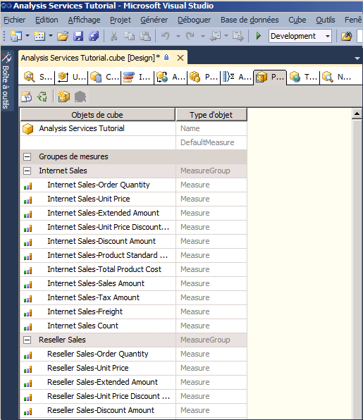
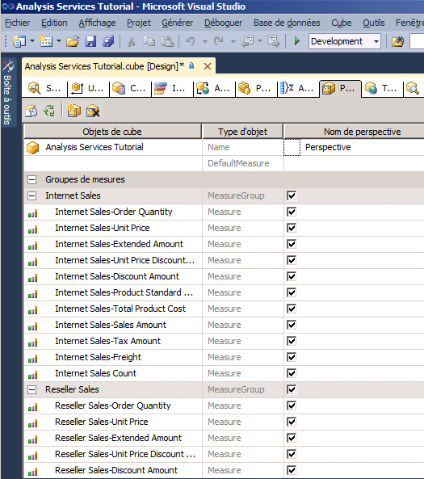
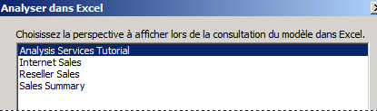
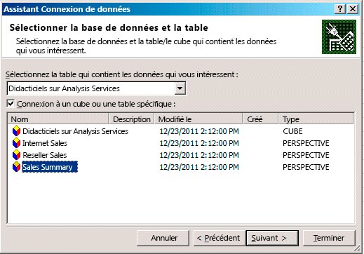
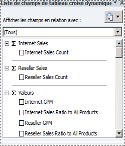

# Leçon 9-1-Définition et exploration de Perspectives
[!INCLUDE[ssas-appliesto-sqlas](../includes/ssas-appliesto-sqlas.md)]

Une perspective peut simplifier l'affichage d'un cube à des fins spécifiques. Par défaut, les utilisateurs peuvent voir tous les éléments d'un cube auquel ils sont autorisés à accéder. Ce que les utilisateurs voient lorsqu'ils affichent l'intégralité d'un cube [!INCLUDE[ssASnoversion](../includes/ssasnoversion-md.md)] est la perspective par défaut du cube. Il peut s'avérer très difficile de naviguer à travers une vue du cube tout entier, surtout pour les utilisateurs auxquels il suffit d'interagir avec une petite partie du cube pour satisfaire leurs besoins en matière de décisionnel et de rapports.  
  
Pour réduire l’apparente complexité d’un cube, vous pouvez créer des sous-ensembles visualisables du cube, appelés *perspectives*, qui ne montrent aux utilisateurs qu’une partie définie des groupes de mesures, des mesures, des dimensions, des attributs, des hiérarchies, des indicateurs de performance clés, des actions et des membres calculés du cube. Cette opération est particulièrement utile lorsque vous travaillez avec des applications clientes qui n'ont pas été écrites pour une version précédente de [!INCLUDE[ssASnoversion](../includes/ssasnoversion-md.md)]. Ces clients ignorent tout des dossiers d'affichage ou des perspectives, par exemple ; en revanche, une perspective s'affiche aux anciens clients comme s'il s'agissait d'un cube. Pour plus d’informations, consultez [Perspectives](../analysis-services/multidimensional-models-olap-logical-cube-objects/perspectives.md), et [Perspectives dans les modèles multidimensionnels](../analysis-services/multidimensional-models/perspectives-in-multidimensional-models.md).  
  
> [!NOTE]  
> Une perspective n'est pas un mécanisme de sécurité, mais un outil pour améliorer le confort de travail de l'utilisateur. Toute la sécurité d'une perspective est héritée du cube sous-jacent.  
  
Dans les tâches de cette rubrique, vous allez définir plusieurs perspectives différentes, puis parcourir le cube à travers chacune de ces nouvelles perspectives.  
  
## Définition d'une perspective Internet Sales  
  
1.  Ouvrez le Concepteur de cube pour le cube du didacticiel de [!INCLUDE[ssASnoversion](../includes/ssasnoversion-md.md)] , puis cliquez sur l’onglet **Perspectives** .  
  
    Tous les objets et leurs types d’objets apparaissent dans le volet **Perspectives** , comme le montre l’image suivante.  
  
      
  
2.  Dans la barre d’outils de l’onglet **Perspectives** , cliquez sur **Nouvelle perspective** .  
  
    Une nouvelle perspective apparaît dans la colonne **Nom de perspective** avec le nom de perspective par défaut de **Perspective**, comme le montre l’image suivante. Observez que les cases à cocher de tous les objets sont activées ; cette perspective est identique à la perspective par défaut de ce cube jusqu'à ce que vous désactiviez la case à cocher d'un objet.  
  
      
  
3.  Remplacez le nom de la perspective par **Internet Sales**.  
  
4.  Sur la ligne suivante, affectez à DefaultMeasure la valeur **Internet Sales-Sales Amount**.  
  
    Lorsqu'ils parcourront le cube à l'aide de cette perspective, les utilisateurs verront cette mesure, sauf s'ils en spécifient une autre.  
  
    > [!NOTE]  
    > Vous pouvez aussi définir la mesure par défaut pour la totalité du cube du didacticiel de [!INCLUDE[ssASnoversion](../includes/ssasnoversion-md.md)] dans la fenêtre Propriétés sous l’onglet **Structure de cube** pour le cube.  
  
5.  Désactivez la case à cocher pour les objets suivants :  
  
    -   Groupe de mesures**Reseller Sales**   
  
    -   Groupe de mesures**Sales Quotas**   
  
    -   Groupe de mesures**Sales Quotas 1**   
  
    -   Dimension de cube**Reseller**   
  
    -   Dimension de cube**Reseller Geography**   
  
    -   Dimension de cube**Sales Territory**   
  
    -   Dimension de cube**Employee**   
  
    -   Dimension de cube**Promotion**   
  
    -   Indicateur de performance clé**Reseller Revenue**   
  
    -   Jeu nommé**Large Resellers**   
  
    -   Membre calculé**Total Sales Amount**   
  
    -   Membre calculé**Total Product Cost**   
  
    -   Membre calculé**Reseller GPM**   
  
    -   Membre calculé**Total GPM**   
  
    -   Membre calculé**Reseller Sales Ratio to All Products**   
  
    -   Membre calculé**Total Sales Ratio to All Products**   
  
    Ces objets ne concernent pas les ventes par Internet.  
  
    > [!NOTE]  
    > Dans chaque dimension, vous pouvez aussi sélectionner individuellement les hiérarchies définies par l'utilisateur et les attributs que vous souhaitez voir apparaître dans une perspective.  
  
## Définition d'une perspective Reseller Sales  
  
1.  Dans la barre d’outils de l’onglet **Perspectives** , cliquez sur **Nouvelle perspective** .  
  
2.  Affectez à la nouvelle perspective le nom **Reseller Sales**.  
  
3.  Définissez **Reseller Sales-Sales Amount** comme mesure par défaut.  
  
    Lorsqu'ils parcourront le cube dans cette perspective, les utilisateurs verront cette mesure, sauf s'ils en spécifient une autre.  
  
4.  Désactivez la case à cocher pour les objets suivants :  
  
    -   Groupe de mesures**Internet Sales**   
  
    -   Groupe de mesures**Internet Sales Reason**   
  
    -   Dimension de cube**Customer**   
  
    -   Dimension de cube**Internet Sales Order Details**   
  
    -   Dimension de cube**Sales Reason**   
  
    -   Action d’extraction**Internet Sales Details Drillthrough Action**   
  
    -   Membre calculé**Total Sales Amount**   
  
    -   Membre calculé**Total Product Cost**   
  
    -   Membre calculé**Internet GPM**   
  
    -   Membre calculé**Total GPM**   
  
    -   Membre calculé**Internet Sales Ratio to All Products**   
  
    -   Membre calculé**Total Sales Ratio to All Products**   
  
    Ces objets ne concernent pas les ventes de revendeurs.  
  
## Définition d'une perspective Sales Summary  
  
1.  Dans la barre d’outils de l’onglet **Perspectives** , cliquez sur **Nouvelle perspective** .  
  
2.  Affectez à la nouvelle perspective le nom **Sales Summary**.  
  
    > [!NOTE]  
    > Vous ne pouvez pas spécifier une mesure calculée comme mesure par défaut.  
  
3.  Désactivez la case à cocher pour les objets suivants :  
  
    -   Groupe de mesures**Internet Sales**   
  
    -   Groupe de mesures**Reseller Sales**   
  
    -   Groupe de mesures**Internet Sales Reason**   
  
    -   Groupe de mesures**Sales Quotas**   
  
    -   Groupe de mesures**Sales Quotas1**   
  
    -   Dimension de cube**Internet Sales Order Details**   
  
    -   Dimension de cube**Sales Reason**   
  
    -   Action d’extraction**Internet Sales Details Drillthrough Action**   
  
4.  Activez la case à cocher pour les objets suivants :  
  
    -   Mesure**Internet Sales Count**   
  
    -   Mesure**Reseller Sales Count**   
  
## Exploration du cube à travers chaque perspective  
  
1.  Dans le menu **Générer** , cliquez sur **Déployer Analysis Services Tutorial**.  
  
2.  Une fois le déploiement terminé, cliquez sur l’onglet **Navigateur** , puis sur **Reconnexion** .  
  
3.  Démarrez Excel.  
  
4.  L'analyse dans Excel vous invite à choisir la perspective à utiliser pour parcourir le modèle dans Excel, comme le montre l'image suivante.  
  
      
  
5.  Sinon, vous pouvez ouvrir Excel à partir du menu Démarrer de Windows, définir une connexion à la base de données Analysis Services Tutorial sur localhost, et choisir une perspective l'Assistant Connexion de données, comme le montre l'image suivante.  
  
      
  
6.  Sélectionnez **Internet Sales** dans la liste **Perspective** , puis examinez les mesures et les dimensions dans le volet de métadonnées.  
  
    Observez que seuls les objets spécifiés pour la perspective Internet Sales apparaissent.  
  
7.  Dans le volet de métadonnées, développez **Mesures**.  
  
    Notez que seul le groupe de mesures **Internet Sales** apparaît, avec les membres calculés **Internet GPM** et **Internet Sales Ratio to All Products** .  
  
8.  Dans le modèle, sélectionnez à nouveau Excel. Sélectionnez **Sales Summary**.  
  
    Observez que dans chacun de ces groupes de mesures, une seule mesure apparaît, comme le montre l'image suivante.  
  
      
  
## Tâche suivante de la leçon  
[Définition et exploration de traductions](../analysis-services/lesson-9-2-defining-and-browsing-translations.md)  
  
## Voir aussi  
[Perspectives](../analysis-services/multidimensional-models-olap-logical-cube-objects/perspectives.md)  
[Perspectives dans les modèles multidimensionnels](../analysis-services/multidimensional-models/perspectives-in-multidimensional-models.md)  
  
  
  
