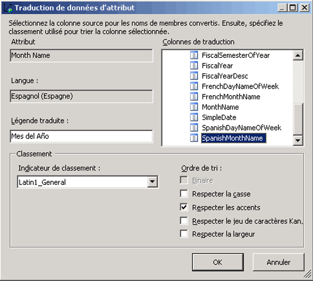
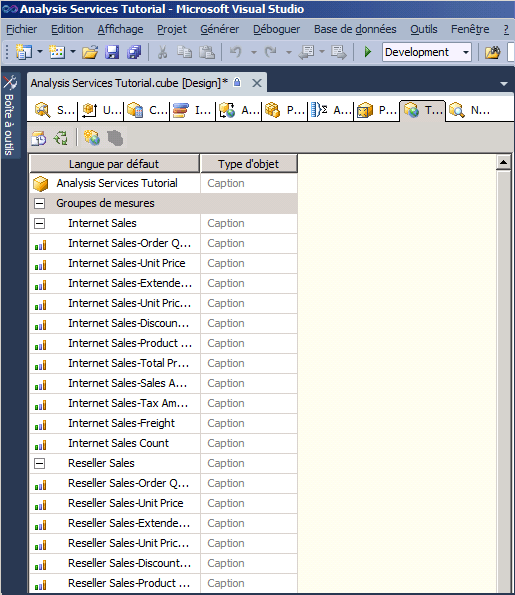
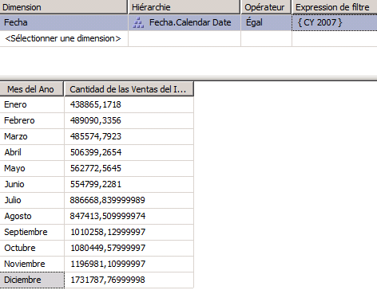

# Leçon 9-2-définition et exploration de traductions
[!INCLUDE[ssas-appliesto-sqlas](../includes/ssas-appliesto-sqlas.md)]

Une traduction est la représentation de noms d'objets [!INCLUDE[ssASnoversion](../includes/ssasnoversion-md.md)] dans un langage spécifique. Les objets incluent les groupes de mesures, mesures, dimensions, attributs, hiérarchies, indicateurs de performance clé, actions et membres calculés. Les traductions permettent au serveur de prendre en charge les applications clientes qui autorisent l'emploi de plusieurs langues. Un tel client transmet l'identificateur des paramètres régionaux locaux (LCID, Locale Identifier) à l'instance de [!INCLUDE[ssASnoversion](../includes/ssasnoversion-md.md)], qui l'utilise pour déterminer le jeu de traductions à employer lorsqu'elle fournit des métadonnées pour des objets [!INCLUDE[ssASnoversion](../includes/ssasnoversion-md.md)] . Si un objet [!INCLUDE[ssASnoversion](../includes/ssasnoversion-md.md)] ne contient pas de traduction pour cette langue ou ne contient pas de traduction pour un objet spécifié, la langue par défaut est utilisée pour renvoyer les métadonnées d'objets au client. Par exemple, si un utilisateur situé en France accède à un cube à partir d'une station de travail utilisant les paramètres régionaux français, l'utilisateur en question voit les légendes des membres et les valeurs de leurs propriétés en français si une traduction française est disponible. Cependant, si un utilisateur situé en Allemagne accède au même cube à partir d'une station de travail utilisant des paramètres régionaux allemands, cet utilisateur voit les noms des légendes et les valeurs des propriétés de membre en allemand. Pour plus d’informations, consultez [Traductions de dimension](../analysis-services/multidimensional-models-olap-logical-dimension-objects/dimension-translations.md), [Traductions de cube](../analysis-services/multidimensional-models-olap-logical-cube-objects/cube-translations.md)et [Prise en charge des traductions dans Analysis Services](../analysis-services/translation-support-in-analysis-services.md).  
  
Dans les tâches de cette rubrique, vous allez définir les traductions de métadonnées pour un ensemble limité d'objets de dimension dans la dimension Date et d'objets de cube dans le cube du didacticiel de [!INCLUDE[ssASnoversion](../includes/ssasnoversion-md.md)] . Ensuite, vous allez parcourir ces objets de dimension et de cube pour examiner les traductions des métadonnées.  
  
## Spécification de traductions pour les métadonnées de la dimension Date  
  
1.  Ouvrez le Concepteur de dimensions pour la dimension **Date** , puis cliquez sur l’onglet **Traductions** .  
  
    Les métadonnées apparaissent dans la langue par défaut pour chaque objet de dimension. La langue par défaut dans le cube du didacticiel de [!INCLUDE[ssASnoversion](../includes/ssasnoversion-md.md)] est l'anglais.  
  
2.  Dans la barre d’outils de l’onglet **Traductions** , cliquez sur **Nouvelle traduction** .  
  
    Une liste de langues apparaît dans la boîte de dialogue **Sélectionnez une langue** .  
  
3.  Cliquez sur **Espagnol (Espagne)**, puis sur **OK**.  
  
    Dans la nouvelle colonne qui apparaît, vous allez définir les traductions en espagnol pour les objets de métadonnées que vous souhaitez traduire. Dans ce didacticiel, nous n'allons traduire qu'un petit nombre d'objets pour illustrer le processus.  
  
4.  Dans la barre d’outils de l’onglet **Traductions** , cliquez sur **Nouvelle traduction** , cliquez sur **Français (France)** dans la boîte de dialogue **Sélectionner une langue** , puis cliquez sur **OK**.  
  
    Une autre colonne de langue apparaît pour vous permettre de définir les traductions en français.  
  
5.  Sur la ligne de l’objet **Caption** pour la dimension **Date**, tapez **Fecha** dans la colonne de traduction **Espagnol (Espagne)** et **Date** dans la colonne de traduction **Français (France)**.  
  
6.  Sur la ligne de l’objet **Caption** pour l’attribut **Month Name** , tapez **Mes del Año** dans la colonne de traduction **Espagnol (Espagne)** et **Mois de l’année** dans la colonne de traduction **Français (France)** .  
  
    Notez que quand vous entrez ces traductions, des points de suspension (**…**) apparaissent. En cliquant sur ces points de suspension, vous pouvez spécifier une colonne de la table sous-jacente qui fournit les traductions pour chaque membre de la hiérarchie d'attribut.  
  
7.  Cliquez sur les points de suspension (**…**) pour la traduction **Espagnol (Espagne)** de l’attribut **Month Name** .  
  
    La boîte de dialogue **Traduction de données d’attribut** apparaît.  
  
8.  Dans la liste **Colonnes de traduction** , sélectionnez **SpanishMonthName**, comme le montre l’image suivante.  
  
      
  
9. Cliquez sur **OK**, puis cliquez sur les points de suspension (**…**) pour la traduction **Français (France)** de l’attribut **Month Name** .  
  
10. Dans la liste **Colonnes de traduction** , sélectionnez **FrenchMonthName**, puis cliquez sur **OK**.  
  
    Les étapes de cette procédure illustrent le processus de définition de traductions des métadonnées pour les objets et les membres de dimension.  
  
## Spécification de traductions pour les métadonnées du cube du didacticiel de Analysis Services  
  
1.  Ouvrez le Concepteur de cube pour le cube du didacticiel de [!INCLUDE[ssASnoversion](../includes/ssasnoversion-md.md)] , puis cliquez sur l’onglet **Traductions** .  
  
    Les métadonnées apparaissent dans la langue par défaut pour chaque objet de cube, comme le montre l'image suivante. La langue par défaut dans le cube du didacticiel de [!INCLUDE[ssASnoversion](../includes/ssasnoversion-md.md)] est l'anglais.  
  
      
  
2.  Dans la barre d’outils de l’onglet **Traductions** , cliquez sur **Nouvelle traduction** .  
  
    Une liste de langues apparaît dans la boîte de dialogue **Sélectionnez une langue**.  
  
3.  Sélectionnez **Espagnol (Espagne)**, puis cliquez sur **OK**.  
  
    Dans la nouvelle colonne qui apparaît, vous allez définir les traductions en espagnol pour les objets de métadonnées que vous souhaitez traduire. Dans ce didacticiel, nous n'allons traduire qu'un petit nombre d'objets pour illustrer le processus.  
  
4.  Dans la barre d’outils de l’onglet **Traductions** , cliquez sur **Nouvelle traduction** , cliquez sur **Français (France)** dans la boîte de dialogue **Sélectionner une langue** , puis cliquez sur **OK**.  
  
    Une autre colonne de langue apparaît pour vous permettre de définir les traductions en français.  
  
5.  Sur la ligne de l’objet **Caption** pour la dimension **Date** , tapez **Fecha** dans la colonne de traduction **Espagnol (Espagne)** et **Date** dans la colonne de traduction **Français (France)** .  
  
6.  Sur la ligne de l’objet **Caption** pour le groupe de mesures **Internet Sales** , tapez **Ventas del lnternet** dans la colonne de traduction **Espagnol (Espagne)** et **Ventes sur Internet** dans la colonne de traduction **Français (France)** .  
  
7.  Sur la ligne de l’objet **Caption** pour la mesure Internet Sales-Sales Amount, tapez **Cantidad de las Ventas del Internet** dans la colonne de traduction **Espagnol (Espagne)** et **Montant des ventes sur Internet** dans la colonne de traduction **Français (France)** .  
  
    Les étapes de cette procédure illustrent le processus de définition de traductions des métadonnées pour les objets de cube.  
  
## Exploration du cube en utilisant des traductions  
  
1.  Dans le menu **Générer** , cliquez sur **Déployer Analysis Services Tutorial**.  
  
2.  Après avoir déployé le didacticiel, revenez à l’onglet **Navigateur** , puis cliquez sur **Reconnexion**.  
  
3.  Supprimez toutes les hiérarchies et toutes les mesures du volet **Données** et sélectionnez Didacticiel [!INCLUDE[ssASnoversion](../includes/ssasnoversion-md.md)] dans la liste **Perspectives** .  
  
4.  Dans le volet Métadonnées, développez **Mesures** puis développez **Internet Sales**.  
  
    Notez que la mesure **Internet Sales-Sales Amount** apparaît en anglais dans ce groupe de mesures.  
  
5.  Dans la barre d’outils, sélectionnez **Espagnol (Espagne)** dans la liste **Langue** .  
  
    Observez que les éléments du volet Métadonnées sont remplis à nouveau. Une fois les éléments du volet Métadonnées actualisés, observez que la mesure Internet Sales-Sales Amount ne figure plus dans le dossier d'affichage Internet Sales. Au lieu de cela, elle apparaît en espagnol dans un nouveau dossier d’affichage nommé **Ventas del lnternet**, comme le montre l’image suivante.  
  
      
  
6.  Dans le volet Métadonnées, cliquez avec le bouton droit sur **Cantidad de las Ventas del Internet** , puis sélectionnez **Ajouter à la requête**.  
  
7.  Dans le volet Métadonnées, développez **Fecha**, développez **Fecha.Calendar Date**, cliquez avec le bouton droit sur **Fecha.Calendar Date**, puis sélectionnez **Ajouter au filtre**.  
  
8.  Dans le volet **Filtre** , sélectionnez **CY 2007** comme expression de filtre.  
  
9. Dans le volet Métadonnées, cliquez avec le bouton droit sur **Mes del Año** et sélectionnez **Ajouter à la requête**.  
  
    Observez que les noms de mois apparaissent en espagnol, comme le montre l'image suivante.  
  
      
  
10. Dans la barre d’outils, sélectionnez **Français (France)** dans la liste **Langue** .  
  
    Observez que les noms de mois apparaissent maintenant en français, de même que le nom de la mesure.  
  
## Leçon suivante  
[Leçon 10 : Définition de rôles administratifs](../analysis-services/lesson-10-defining-administrative-roles.md)  
  
## Voir aussi  
[Traductions de dimension](../analysis-services/multidimensional-models-olap-logical-dimension-objects/dimension-translations.md)  
[Traductions de cube](../analysis-services/multidimensional-models-olap-logical-cube-objects/cube-translations.md)  
[Prise en charge des traductions dans Analysis Services](../analysis-services/translation-support-in-analysis-services.md)  
  
  
  
