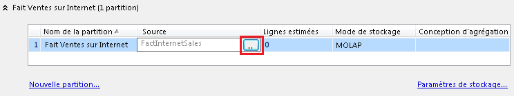

# Créer et gérer une partition locale (Analysis Services)
[!INCLUDE[ssas-appliesto-sqlas](../../includes/ssas-appliesto-sqlas.md)]
  Vous pouvez créer des partitions supplémentaires pour un groupe de mesures afin d'améliorer les performances de traitement. Le fait de disposer de plusieurs partitions permet d'allouer des données de faits sur un nombre correspondant de fichiers de données physiques sur les serveurs locaux, ainsi que sur les serveurs distants. Dans Analysis Services, les partitions peuvent être traitées indépendamment et en parallèle, ce qui vous permet de contrôler davantage le traitement des charges de travail sur le serveur.  
  
 Les partitions peuvent être créées dans [!INCLUDE[ssBIDevStudio](../../includes/ssbidevstudio-md.md)] pendant la conception de modèle, ou une fois que la solution est déployée à l’aide de [!INCLUDE[ssManStudioFull](../../includes/ssmanstudiofull-md.md)] ou de XMLA. Nous vous recommandons de choisir une seule approche uniquement. Si vous passez d'un outil à un autre, vous allez peut-être constater que les modifications apportées à une base de données déployée dans [!INCLUDE[ssManStudioFull](../../includes/ssmanstudiofull-md.md)] sont remplacées lorsque vous redéployez ultérieurement la solution depuis [!INCLUDE[ssBIDevStudio](../../includes/ssbidevstudio-md.md)].  
  
## Avant de commencer  
 Vérifiez si vous disposez de la version Business Intelligence Edition ou Enterprise Edition. L'édition Standard ne prend pas en charge plusieurs partitions. Pour vérifier l’édition que vous utilisez, cliquez avec le bouton droit sur le nœud du serveur dans [!INCLUDE[ssManStudioFull](../../includes/ssmanstudiofull-md.md)] et choisissez **Rapports** | **Général**. Pour plus d’informations sur la disponibilité des fonctionnalités, consultez [Fonctionnalités prises en charge par les éditions de SQL Server 2016](../../analysis-services/analysis-services-features-supported-by-the-editions-of-sql-server-2016.md).  
  
 Dès le départ, il est important de comprendre que les partitions doivent partager la même conception d'agrégation si vous voulez les fusionner ultérieurement. Les partitions peuvent être fusionnées uniquement si elles ont des modes de stockage et des conceptions d'agrégation identiques.  
  
> [!TIP]  
>  Explorez les données dans la vue de source de données (DSV) afin de comprendre l'étendue et la profondeur des données que vous partitionnez. Par exemple, si le partitionnement s'effectue par date, vous pouvez procéder au tri sur une colonne de date afin de déterminer les limites supérieure et inférieure de chaque partition.  
  
## Choisir une approche  
 Le point le plus important à prendre en compte lors de la création de partitions consiste à segmenter les données afin d'éviter les lignes dupliquées. Les données doivent être stockées dans une seule et unique partition, pour éviter le double comptage des lignes. Par conséquent, il est courant de partitionner par DATE afin que vous puissiez définir des limites claires entre chaque partition.  
  
 Vous pouvez utiliser l'une ou l'autre technique pour distribuer les données de faits entre plusieurs partitions. Les techniques suivantes peuvent être utilisées pour segmenter les données.  
  
|Technique|Recommandations|  
|---------------|---------------------|  
|Utiliser des requêtes SQL pour segmenter les données de faits|Les partitions peuvent provenir de requêtes SQL. Au cours du traitement, la requête SQL consiste à récupérer les données. La clause WHERE de la requête fournit le filtre qui segmente les données pour chaque partition. Analysis Services génère la requête à votre place, mais vous devez remplir la clause WHERE afin de segmenter correctement les données.   Le principal avantage de cette méthode réside dans la facilité avec laquelle vous pouvez partitionner des données depuis une seule table source. Si toutes les données sources proviennent d'une table de faits volumineuse, vous pouvez générer des requêtes qui filtrent ces données dans des partitions discrètes, sans avoir à créer des structures de données supplémentaires dans la vue de source de données (DSV).   En revanche, l'utilisation de requêtes rompt la liaison entre la partition et la vue de source de données (DSV). Si, ultérieurement, vous effectuez une mise à jour de la vue DSV dans le projet Analysis Services, notamment en ajoutant des colonnes à la table de faits, vous devez modifier manuellement les requêtes pour chaque partition de manière à inclure la nouvelle colonne. La deuxième méthode, présentée ci-dessous, ne présente pas cet inconvénient.|  
|Utiliser des tables dans la vue DSV pour segmenter les données de faits|Vous pouvez lier une partition à une table, une requête nommée ou une vue dans la vue DSV. Les trois méthodes sont fonctionnellement équivalentes en tant que base d'une partition. La table entière, la requête nommée ou la vue fournit l'ensemble des données à une partition unique.   L'utilisation d'une table, d'une vue ou d'une requête nommée place toute la logique de sélection des données dans la vue DSV, laquelle peut être gérée et entretenue plus facilement au fil du temps. L'un des avantages importants de cette approche est que les liaisons de table sont conservées. Si, ultérieurement, vous mettez à jour la table source, vous n'avez pas à modifier les partitions qui l'utilisent. Deuxièmement, toutes les tables, les requêtes nommées et les vues se trouvent dans un espace de travail commun, ce qui rend les mises à jour plus pratiques et évite de devoir ouvrir et modifier des requêtes de partition individuellement.|  
  
## Option 1 : filtrer une table de faits pour plusieurs partitions  
 Pour créer plusieurs partitions, commencez par modifier la propriété **Source** de la partition par défaut. Par défaut, un groupe de mesures est créé avec une seule partition qui est liée à une table unique dans la vue DSV. Avant de pouvoir ajouter des partitions supplémentaires, vous devez modifier la partition d'origine de manière à ce qu'elle contienne uniquement une partie des données de faits. Vous pouvez continuer à créer des partitions supplémentaires pour stocker les autres données.  
  
 Construisez des filtres de sorte que les données ne soient pas dupliquée entre les partitions. Le filtre d'une partition spécifie quelles données de la table de faits sont utilisées dans la partition. Il est important que les filtres de toutes les partitions utilisées dans un cube extraient, à partir de la table de faits, des jeux de données qui s'excluent mutuellement. Les mêmes données de faits peuvent être comptées deux fois si elles apparaissent dans plusieurs partitions.  
  
1.  Dans [!INCLUDE[ssBIDevStudio](../../includes/ssbidevstudio-md.md)], dans l’Explorateur de solutions, double-cliquez sur le cube pour l’ouvrir dans le Concepteur de cube, puis cliquez sur l’onglet **Partitions** .  
  
2.  Développez le groupe de mesures pour lequel vous ajoutez des partitions. Par défaut, chaque groupe de mesures comporte une partition, liée à une table de faits dans la vue DSV.  
  
3.  Dans la colonne Source, cliquez sur le bouton de navigation (. pour ouvrir la boîte de dialogue Source de partition.  
  
       
  
4.  Dans Type de liaison, sélectionnez **Liaison de requête**. La requête SQL qui sélectionne les données apparaît automatiquement.  
  
5.  Dans la clause WHERE située dans la partie inférieure, ajoutez un filtre qui segmente les données pour cette partition.  
  
     Exemples de syntaxe de la clause WHERE : `WHERE OrderDateKey >= '20060101'` ou `WHERE OrderDateKey BETWEEN '20051001' AND '20051201'`. Pour obtenir des exemples, consultez [WHERE &#40;Transact-SQL&#41;](../../t-sql/queries/where-transact-sql.md).  
  
     Notez que les filtres suivants s'excluent mutuellement dans chaque jeu :  
  
    |||  
    |-|-|  
    |Ensemble 1 :|"SaleYear" = 2012   "Année_de_Vente" = 2013|  
    |Jeu 2 :|"Continent" = 'Amérique_du_Nord'   "Continent" = 'Europe'   "Continent" = 'Amérique_du_Sud'|  
    |Ensemble 3 :|"Pays" = 'USA'   "Pays" = 'Mexique'   ("Pays" <> 'USA' AND "Pays" <> 'Mexique')|  
  
6.  Cliquez sur **Vérifier** pour rechercher les erreurs de syntaxe, puis cliquez sur **OK**.  
  
7.  Répétez les étapes précédentes pour créer les partitions restantes, en modifiant chaque fois la clause WHERE pour sélectionner la tranche de données suivante.  
  
8.  Déployez la solution ou traitez la partition pour charger les données. Veillez à traiter toutes les partitions.  
  
9. Parcourez le cube pour vérifier que les données correctes sont retournées.  
  
 Une fois que vous disposez d'un groupe de mesures qui utilise plusieurs groupes de mesures, vous pouvez créer des partitions supplémentaires dans [!INCLUDE[ssManStudioFull](../../includes/ssmanstudiofull-md.md)]. Dans un groupe de mesures, cliquez avec le bouton droit sur le dossier Partitions, puis sélectionnez **Nouvelles partitions** pour démarrer l’Assistant.  
  
> [!NOTE]  
>  Au lieu de filtrer les données dans une partition, vous pouvez utiliser la même requête pour créer une requête nommée dans la vue DSV, puis baser la partition sur la requête nommée.  
  
## Option 2 : utiliser des tables, des vues ou des requêtes nommées  
 Si la vue DSV organise déjà des faits dans des tables individuelles (par exemple, par année ou trimestre), vous pouvez créer des partitions basées sur une table individuelle, où chaque partition possède sa propre table de source de données. Il s'agit de la procédure généralement utilisée pour partitionner les groupes de mesures par défaut, mais dans le cas de plusieurs partitions, vous divisez la partition d'origine en plusieurs partitions et mappez chaque nouvelle partition à la table de source de données qui fournit les données.  
  
 Les vues et les requêtes nommées sont équivalentes aux tables, d'un point de vue fonctionnel, car les trois objets sont définis dans la vue DSV et liés à une partition à l'aide de l'option Liaison de table de la boîte de dialogue Source de partition. Vous pouvez créer une vue ou une requête nommée pour générer le segment de données requis pour chaque partition. Pour plus d’informations, consultez [Définir des requêtes nommées dans une vue de source de données &#40;Analysis Services&#41;](../../analysis-services/multidimensional-models/define-named-queries-in-a-data-source-view-analysis-services.md).  
  
> [!IMPORTANT]  
>  Lorsque vous créez des requêtes nommées s'excluant mutuellement pour des partitions dans une vue DSV, assurez-vous que les données combinées pour les partitions contiennent toutes les données d'un groupe de mesures que vous souhaitez inclure dans le cube. Assurez-vous que vous ne conservez pas une partition par défaut basée sur la table complète pour le groupe de mesures, ou les partitions basées sur les requêtes empièteront sur la requête basée sur la table complète.  
  
1.  Créez une ou plusieurs requêtes nommées à utiliser comme source de partition. Pour plus d’informations, consultez [Définir des requêtes nommées dans une vue de source de données &#40;Analysis Services&#41;](../../analysis-services/multidimensional-models/define-named-queries-in-a-data-source-view-analysis-services.md).  
  
     La requête nommée doit être basée sur la table de faits associée au groupe de mesures. Par exemple, si vous partitionnez le groupe de mesures FactInternetSales, les requêtes nommées dans la vue DSV doivent spécifier la table FactInternetSales dans l'instruction FROM.  
  
2.  Dans [!INCLUDE[ssBIDevStudio](../../includes/ssbidevstudio-md.md)], dans l’Explorateur de solutions, double-cliquez sur le cube pour l’ouvrir dans le Concepteur de cube, puis cliquez sur l’onglet **Partitions** .  
  
3.  Développez le groupe de mesures pour lequel vous ajoutez des partitions.  
  
4.  Cliquez sur **Nouvelle partition** pour lancer l’Assistant Partition. Si vous avez créé des requêtes nommées en utilisant la table de faits liée au groupe de mesures, vous devez voir chacune des requêtes nommées que vous avez créées à l'étape précédente.  
  
5.  Dans Spécifier des informations sur la source, choisissez l'une des requêtes nommées que vous avez créées à l'étape précédente. Si vous ne voyez aucune requête nommée, revenez à la vue DSV et vérifiez l'instruction FROM.  
  
6.  Cliquez sur **Suivant** pour accepter les paramètres par défaut pour chaque page suivante.  
  
7.  Sur la dernière page, Fin de l'Assistant, donnez à la partition un nom descriptif.  
  
8.  Cliquez sur **Terminer**.  
  
9. Répétez les étapes précédentes pour créer les partitions restantes, en choisissant une requête nommée différente chaque fois pour sélectionner la tranche de données suivante.  
  
10. Déployez la solution ou traitez la partition pour charger les données. Veillez à traiter toutes les partitions.  
  
11. Parcourez le cube pour vérifier que les données correctes sont retournées.  
  
## Étape suivante  
 Lorsque vous créez des requêtes s'excluant mutuellement pour des partitions, assurez-vous que les données des partitions combinées contiennent toutes les données que vous souhaitez inclure dans le cube.  
  
 Dans la dernière étape, vous voulez normalement supprimer la partition par défaut qui était basée sur la table elle-même (si elle existe toujours), sinon les partitions basées sur la requête empièteront sur la requête basée sur la table entière.  
  
## Voir aussi  
 [Partitions & #40 ; Analysis Services - données multidimensionnelles & #41 ;](../../analysis-services/multidimensional-models-olap-logical-cube-objects/partitions-analysis-services-multidimensional-data.md)   
 [Partitions distantes](../../analysis-services/multidimensional-models-olap-logical-cube-objects/partitions-remote-partitions.md)   
 [Fusionner des Partitions dans Analysis Services & #40 ; SSAS - multidimensionnel & #41 ;](../../analysis-services/multidimensional-models/merge-partitions-in-analysis-services-ssas-multidimensional.md)  
  
  
