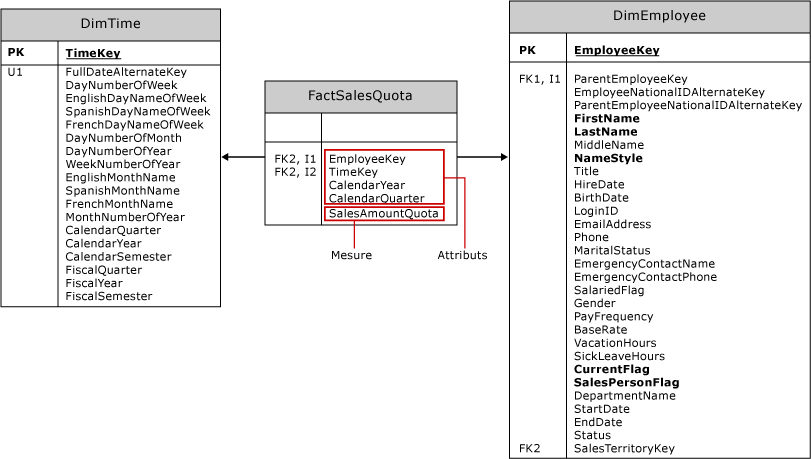

# Création de mesures et de groupes de mesures dans les modèles multidimensionnels
[!INCLUDE[ssas-appliesto-sqlas](../../includes/ssas-appliesto-sqlas.md)]
  Une *mesure* est une agrégation de valeurs de données numériques, telle qu'une somme, un décompte, un minimum, un maximum, une moyenne ou une expression MDX personnalisée que vous créez. Un *groupe de mesures* est un conteneur d'une ou de plusieurs mesures. Toutes les mesures existent dans un groupe de mesures, même s'il n'y a qu'une seule mesure. Un cube doit comporter au moins une mesure et un groupe de mesures.  
  
 Cette rubrique comprend les sections suivantes :  
  
-   [Approches permettant la création de mesures](#bkmk_create)  
  
-   [Composants d'une mesure](#bkmk_comps)  
  
-   [Mesures et groupes de mesures de modélisation sur des faits et des tables de faits](#bkmk_modeling)  
  
-   [Granularité d'un groupe de mesures](#bkmk_grain)  
  
##   Approches permettant la création de mesures  
 Les mesures peuvent être un élément statique du cube, créé au moment du design, toujours présent lorsque le cube fait l'objet d'un accès. Mais vous pouvez aussi définir une mesure en tant que *membre calculé* en utilisant une expression MDX pour fournir une valeur calculée pour une mesure basée sur d'autres mesures du cube. Un membre calculé peut être limité à une session ou à un utilisateur.  
  
 Pour créer une mesure ou un groupe de mesures, utilisez l'une des approches suivantes :  
  
|||  
|-|-|  
|Assistant Cube|Exécutez l'Assistant Cube de [!INCLUDE[ssBIDevStudioFull](../../includes/ssbidevstudiofull-md.md)] pour créer un cube.   Dans l’Explorateur de solutions, cliquez avec le bouton droit sur **Cubes**, puis choisissez **Nouveau cube**. Si vous avez besoin d’aide pour exécuter ces étapes, consultez [Modélisation multidimensionnelles &#40;didacticiel Adventure Works&#41;](../../analysis-services/multidimensional-modeling-adventure-works-tutorial.md).   Lorsque vous créez un cube basé sur des tables d'un entrepôt de données existant, les définitions des mesures et du groupe de mesures se matérialisent dans le cadre du processus de création du cube. Dans l'Assistant, vous choisissez les faits et les tables de faits à utiliser comme base pour les objets mesures et groupes de mesure de votre cube.|  
|Boîte de dialogue Nouvelle mesure|Si l'on part du principe que le cube existe déjà dans [!INCLUDE[ssBIDevStudioFull](../../includes/ssbidevstudiofull-md.md)], double-cliquez sur le nom du cube dans l'Explorateur de solutions pour l'ouvrir dans le Concepteur de cube. Dans le volet Mesures, cliquez avec le bouton droit sur le nœud supérieur pour créer un groupe de mesures ou des mesures, en spécifiant une table source, une colonne et un type d'agrégation. Si vous utilisez cette approche, vous devez choisir la méthode d'agrégation dans une liste fixe de fonctions prédéfinies. Pour obtenir une description des agrégations les plus couramment utilisées, consultez [Use Aggregate Functions](../../analysis-services/multidimensional-models/use-aggregate-functions.md) .|  
|membre calculé|Les membres calculés ajoutent de la flexibilité et des fonctionnalités d'analyse à un cube dans [!INCLUDE[ssASnoversion](../../includes/ssasnoversion-md.md)] , car vous pouvez contrôler comment et à quel moment ils sont créés. Vous avez parfois uniquement besoin d'une mesure temporaire, pour la durée d'une session utilisateur, ou dans le cadre d'une analyse dans Management Studio.   Dans [!INCLUDE[ssBIDevStudioFull](../../includes/ssbidevstudiofull-md.md)], ouvrez l'onglet Calculs pour créer un membre calculé.   Choisissez cette approche lorsque vous basez une mesure sur une expression MDX. Pour plus d’informations, consultez les rubriques suivantes : [Génération de mesures dans une expression MDX](../../analysis-services/multidimensional-models/mdx/mdx-building-measures.md), [Calculs](../../analysis-services/multidimensional-models-olap-logical-cube-objects/calculations.md), [Calculs dans les modèles multidimensionnels](../../analysis-services/multidimensional-models/calculations-in-multidimensional-models.md) et [Principes de base des scripts MDX &#40;Analysis Services&#41;](../../analysis-services/multidimensional-models/mdx/mdx-scripting-fundamentals-analysis-services.md).|  
|MDX ou XMLA|Dans SQL Server Management Studio, vous pouvez exécuter des scripts MDX ou XMLA pour modifier une base de données afin d'inclure une nouvelle mesure calculée. Cette approche est utile pour le test ad hoc de données, une fois la solution déployée sur un serveur. Consultez [Document and Script an Analysis Services Database](../../analysis-services/multidimensional-models/document-and-script-an-analysis-services-database.md).|  
  
##   Composants d'une mesure  
 Une mesure est un objet ayant des propriétés. En plus de son nom, une mesure doit avoir un type d'agrégation, ainsi qu'une colonne source ou une expression utilisée pour charger la mesure avec des données. Vous pouvez modifier la définition de la mesure en définissant ses propriétés.  
  
|||  
|-|-|  
|**source**|La plupart des mesures proviennent de colonnes numériques de tables de faits contenues dans un entrepôt de données externe, telles que la colonne Sales Amount des tables Internet Sales et Reseller Sales contenues dans l'entrepôt de données AdventureWorks. Toutefois, vous pouvez également créer de nouvelles mesures entièrement basées sur des calculs que vous définissez.   Les colonnes d'attribut de tables de dimension peuvent être utilisées pour définir des mesures, mais de telles mesures ont généralement un comportement d'agrégation de type semi-additif ou non additif. Pour plus d’informations sur le comportement semi-additif, consultez [Définir le comportement semi-additif](../../analysis-services/multidimensional-models/define-semiadditive-behavior.md).|  
|**agrégation**|Par défaut, les mesures sont additionnées avec chaque dimension. Toutefois, la propriété **AggregateFunction** vous permet de modifier ce comportement. Pour obtenir la liste des fonctions d'agrégation, consultez [Use Aggregate Functions](../../analysis-services/multidimensional-models/use-aggregate-functions.md) .|  
|**Propriétés**|Pour obtenir des descriptions de propriété supplémentaires, consultez [Configure Measure Properties](../../analysis-services/multidimensional-models/configure-measure-properties.md) .|  
  
##   Mesures et groupes de mesures de modélisation sur des faits et des tables de faits  
 Avant d'exécuter un Assistant, il est utile de comprendre les principes de modélisation qui sous-tendent la définition d'une mesure.  
  
 Les mesures et groupes de mesures sont les objets multidimensionnels qui représentent des faits et des tables de faits d'un entrepôt de données externe. Dans la plupart des cas, les mesures et groupes de mesures sont basés sur des objets d'une vue de source de données qui, quant à eux, sont créés à partir de l'entrepôt de données sous-jacent.  
  
 Le diagramme suivant représente la table de faits **FactSalesQuota** et les deux tables de dimension qui lui sont associées, **DimTime** et **DimEmployee**. Dans l'exemple de cube Adventure Works, ces tables sont utilisées comme base du groupe de mesures Sales Quotas et des dimensions Time et Employee.  
  
   
  
 La table de faits contient deux types fondamentaux de colonnes : les colonnes d'attribut et les colonnes de mesure.  
  
-   Les colonnes d'attribut sont utilisées pour créer des relations de clé étrangères avec des tables de dimension, ce qui permet d'organiser les données quantifiables des colonnes de mesure par les données contenues dans les tables de dimension. Les colonnes d'attribut sont également utilisées pour définir la granularité d'une table de faits et de son groupe de mesures.  
  
-   Les colonnes de mesure définissent les mesures composant un groupe de mesures.  
  
 Lorsque vous exécutez l'Assistant Cube, les clés étrangères sont filtrées. Dans la liste des colonnes restantes que vous pouvez choisir, vous verrez les colonnes de mesure, ainsi que les colonnes d'attribut qui ne sont pas identifiées en tant que clé étrangère. Dans l'exemple **FactSalesQuote** , l'Assistant propose **CalendarYear** et **CalendarQuarter** en plus de **SalesAmountQuota**. Seule la colonne de mesure **SalesAmountQuota** donne lieu à une mesure acceptable pour votre modèle multidimensionnel. Il existe d'autres colonnes basées sur une date pour chaque quantité de quota. Vous devez exclure les autres colonnes, **CalendarYear** et **CalendarQuarter**, de la liste de mesures dans l’Assistant Cube (ou les supprimer du groupe de mesures ultérieurement dans le concepteur).  
  
 Le point à retenir de cette discussion est que toutes les colonnes proposées par l'Assistant ne sont pas utiles en tant que mesure. Appuyez-vous sur votre connaissance des données et de la façon dont elles seront utilisées lorsque vous décidez des colonnes à utiliser comme mesures. N'oubliez pas que vous pouvez cliquer avec le bouton droit sur une table dans la vue de source de données pour explorer les données, ce qui peut vous aider à identifier les colonnes à utiliser en tant que mesures. Pour plus d’informations, consultez [Explorer des données dans une vue de source de données &#40;Analysis Services&#41;](../../analysis-services/multidimensional-models/explore-data-in-a-data-source-view-analysis-services.md).  
  
> [!NOTE]  
>  Les mesures ne sont pas toutes dérivées directement d'une valeur stockée dans une colonne de la table de faits. Par exemple, la mesure **Sales Person Count** définie dans le groupe de mesures **Sales Quota** de l’exemple de cube Adventure Works est en réalité basée sur le nombre de valeurs uniques (ou comptage de valeurs) présentes dans la colonne **EmployeeKey** de la table de faits **FactSalesQuota** .  
  
##   Granularité d'un groupe de mesures  
 Les groupes de mesures ont une granularité associée qui fait référence au niveau de détail pris en charge par une table de faits. La granularité est définie via la relation de clé étrangère avec une dimension.  
  
 Par exemple, la table de faits **FactSalesQuota** a une relation de clé étrangère avec la table **DimEmployee** , chaque enregistrement de la table **FactSalesQuota** est lié à un seul employé, et par conséquent, la granularité du groupe de mesures, du point de vue de la dimension Employee, est au niveau de l'employé individuel.  
  
 Il n'est jamais possible de définir la granularité d'un groupe de mesures plus fine que le niveau le plus bas de la dimension, du point de vue du groupe de mesures, mais vous pouvez définir une granularité plus grossière à l'aide d'attributs supplémentaires. Par exemple, la table de faits **FactSalesQuota** utilise trois colonnes, **TimeKey**, **CalendarYear**et **CalendarQuarter**, pour définir la granularité de la relation avec la table **DimTime** . Par conséquent, la granularité du groupe de mesures, du point de vue de la dimension Time, est par trimestre de calendrier (et non par jour, le niveau le plus bas de la dimension Time).  
  
 Vous pouvez spécifier la granularité d'un groupe de mesures par rapport à une dimension spécifique à l'aide de l'onglet **Utilisation de la dimension** du Concepteur de cube. Pour plus d'informations sur les relations de dimension, consultez [Dimension Relationships](../../analysis-services/multidimensional-models-olap-logical-cube-objects/dimension-relationships.md).  
  
## Voir aussi  
 [Cubes dans les modèles multidimensionnels](../../analysis-services/multidimensional-models/cubes-in-multidimensional-models.md)   
 [Mesures et groupes de mesures](../../analysis-services/multidimensional-models/measures-and-measure-groups.md)  
  
  
