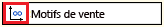
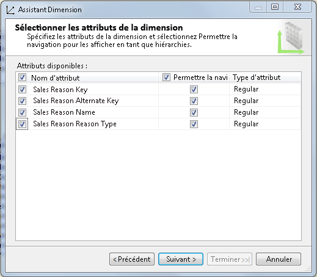
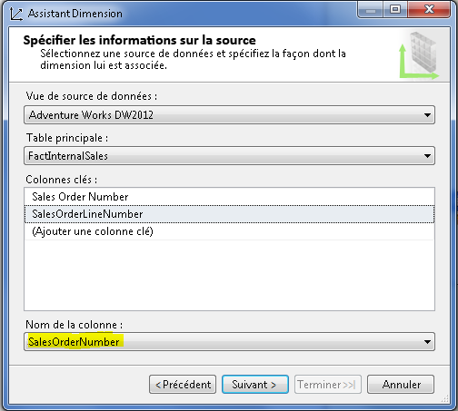
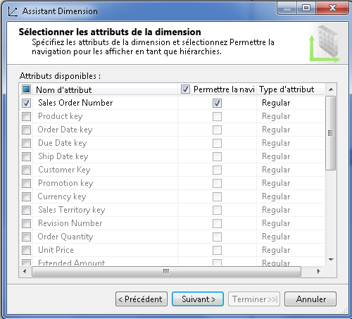
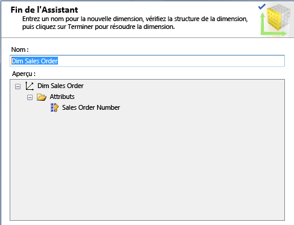
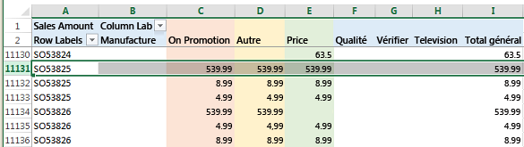
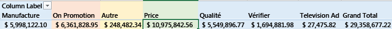

# Définir une relation plusieurs à plusieurs et les propriétés d'une relation plusieurs à plusieurs
[!INCLUDE[ssas-appliesto-sqlas](../../includes/ssas-appliesto-sqlas.md)]
  Cette rubrique explique les dimensions plusieurs-à-plusieurs dans Analysis Services, à quel moment les utiliser, et comment les créer.  
  
## Introduction  
 Analysis Services prend en charge les dimensions plusieurs-à-plusieurs pour des analyses plus complexes par rapport à un schéma en étoile classique. Dans un schéma en étoile classique, toutes les dimensions ont une relation un-à-plusieurs avec une table de faits. Chaque fait joint un seul membre de dimension et un seul membre de dimension peut être associé à plusieurs faits.  
  
 La dimension plusieurs-à-plusieurs supprime cette restriction de modèle et permet d'associer un fait (comme un solde de compte) à plusieurs membres de la même dimension (le solde d'un compte joint peut avoir deux ou plus propriétaires d'un compte joint).  
  
 Au niveau du concept, une relation dimensionnelle plusieurs-à-plusieurs dans Analysis Services est équivalente aux relations plusieurs-à-plusieurs dans un modèle relationnel, prenant en charge le même type de scénario. Voici quelques exemples de dimensions plusieurs-à-plusieurs :  
  
-   Les étudiants sont inscrits à plusieurs cours ; chaque cours a plusieurs étudiants.  
  
-   Les médecins ont plusieurs patients ; les patients ont plusieurs médecins.  
  
-   Les clients ont plusieurs comptes bancaires ; les comptes bancaires peuvent appartenir à plus d'un client.  
  
-   Dans Adventure Works, plusieurs clients ont plusieurs motifs pour commander un produit, et le motif de la vente peut être associé à plusieurs commandes.  
  
 D'un point de vue analytique, une relation plusieurs-à-plusieurs donne une représentation exacte d'un nombre ou d'une somme afférente à la relation dimensionnelle (généralement, en éliminant les doublons lors des calculs d'un membre de dimension spécifique). Un exemple permettra de mieux comprendre ce point. Prenons un produit ou un service qui appartient à plus d'une catégorie. Si vous deviez compter le nombre de services par catégorie, un service appartenant à deux catégories serait inclus dans chaque catégorie. Parallèlement, il peut être souhaitable de ne pas surestimer le nombre de services que vous fournissez. En spécifiant une relation dimensionnelle plusieurs-à-plusieurs, il est probable que vous obtiendrez les résultats corrects lors d'une requête par catégorie ou par service. Toutefois, il est toujours nécessaire de s'en assurer au moyen d'un test.  
  
 Structurellement, la création d'une relation dimensionnelle plusieurs-à-plusieurs est similaire à la création d'une relation plusieurs-à-plusieurs dans un modèle de données relationnel. Tandis qu'un modèle relationnel utilise une *table de jonction* pour stocker les associations de ligne, un modèle multidimensionnel utilise un *groupe de mesures intermédiaire*. « Groupe de mesures intermédiaire » est le terme que nous utilisons pour désigner une table qui mappe des membres de différentes dimensions.  
  
 Visuellement, une relation plusieurs-à-plusieurs n'est pas indiquée dans un diagramme de cube. Utilisez plutôt l'onglet Utilisation de la dimension pour identifier rapidement toutes les relations plusieurs-à-plusieurs dans un modèle. Une relation plusieurs-à-plusieurs est indiquée par l'icône suivante.  
  
   
  
 Cliquez sur le bouton pour ouvrir la boîte de dialogue Définir une relation, vérifier si le type de la relation est plusieurs-à-plusieurs, et pour voir quel groupe de mesures intermédiaire est utilisé dans la relation.  
  
   
  
 Dans les sections suivantes, vous découvrirez comment configurer une dimension plusieurs-à-plusieurs et tester les comportements du modèle. Si vous souhaitez obtenir davantage d'informations, ou commencer par un didacticiel, reportez-vous à la section **En savoir plus** à la fin de cet article.  
  
## Créer une dimension plusieurs-à-plusieurs  
 Une relation plusieurs-à-plusieurs simple comprend deux dimensions ayant une cardinalité plusieurs-à-plusieurs, un groupe de mesures intermédiaire pour stocker les associations des membres, et un groupe de mesures de fait contenant les données mesurables, comme la somme des ventes totales ou le solde d'un compte bancaire.  
  
 Les dimensions dans une relation plusieurs-à-plusieurs peuvent avoir des tables correspondantes dans la vue de source de données, où chaque dimension dans le modèle est basée sur une table existante dans une source de données. En revanche, les dimensions dans votre modèle peuvent dériver d'un plus petit nombre de tables ou de tables physiques différentes dans la vue de gestion dynamique. En utilisant les motifs de vente et les commandes comme exemple, l'exemple de cube Adventure Works montre une relation plusieurs-à-plusieurs utilisant des dimensions qui existent en tant que structures de données propres au modèle, sans contreparties physiques dans la vue de gestion dynamique. La dimension Sales Order est basée sur la table de faits et non sur la table de dimensions, dans la source de données sous-jacente.  
  
 La procédure suivante suppose que vous connaissez déjà les entités qui participent dans la relation plusieurs-à-plusieurs. Pour approfondir ce sujet, consultez **En savoir plus** .  
  
 Pour illustrer les étapes de création d'une relation plusieurs-à-plusieurs, cette procédure recrée l'une des relations plusieurs-à-plusieurs dans l'exemple de cube Adventure Works. Si les données sources (c'est-à-dire, l'entrepôt de données d'exemple Adventure Works) sont installées sur une instance de moteur de base de données relationnelle, suivez les étapes suivantes.  
  
#### Étape 1 - Vérifier les relations de la vue de gestion dynamique  
  
1.  Dans SQL Server Data Tools, dans un projet multidimensionnel, créez une source de données sur l'entrepôt de données Adventure Works DW 2012, hébergé sur une instance de moteur de base de données SQL Server.  
  
2.  Créez une vue de source de données à l'aide des tables existantes suivantes :  
  
    -   FactInternetSales  
  
    -   FactInternetSalesReason  
  
    -   DimSalesReason  
  
3.  Vérifiez que toutes les tables que vous envisagez d'utiliser dans les relations plusieurs-à-plusieurs sont liées dans la vue de source dynamique via des relations de clé primaire. Cela est requis pour établir un lien au groupe de mesures intermédiaire dans une étape ultérieure.  
  
    > [!NOTE]  
    >  Si la source de données sous-jacente ne fournit pas de relations de clé primaire et étrangère, vous pouvez créer les relations manuellement dans la vue de gestion dynamique. Pour plus d’informations, consultez [Définir des relations logiques dans une vue de source de données &#40;Analysis Services&#41;](../../analysis-services/multidimensional-models/define-logical-relationships-in-a-data-source-view-analysis-services.md).  
  
     L'exemple suivant confirme que les tables utilisées dans cette procédure sont liées à l'aide de clés primaires.  
  
       
  
#### Étape 2 - Créer des dimensions et des groupes de mesures  
  
1.  Dans SQL Server Data Tools, dans un projet multidimensionnel, cliquez avec le bouton droit sur **Dimensions** et sélectionnez **Nouvelle dimension**.  
  
2.  Créez une dimension basée sur la table existante, **DimSalesReason**. Acceptez toutes les valeurs par défaut lorsque vous spécifiez la source.  
  
     Sélectionnez tous les attributs.  
  
       
  
3.  Créez une seconde dimension basée sur la table existante, Fact Internet Sales. Bien qu'il s'agisse d'une table de faits, elle contient des informations de commande (Sales Order). Nous allons l'utiliser pour créer une dimension Sales Order.  
  
4.  Dans Spécifier des informations sur la source, un avertissement indique que la colonne de nom doit être spécifiée. Choisissez **SalesOrderNumber** comme nom.  
  
       
  
5.  Dans la page suivante de l'Assistant, choisissez les attributs. Dans cet exemple, sélectionnez uniquement **SalesOrderNumber**.  
  
       
  
6.  Renommez la dimension sous la forme **Dim Sales Orders**afin de disposer d’une convention d’affectation de noms cohérente pour les dimensions.  
  
       
  
7.  Cliquez avec le bouton droit sur **Cubes** , puis sélectionnez **Nouveau cube**.  
  
8.  Dans les tables de groupe de mesures, choisissez **FactInternetSales** et **FactInternetSalesReason**.  
  
     Vous devez choisir la table **FactInternetSales** , car elle contient les mesures que vous souhaitez utiliser dans ce cube. Vous devez choisir **FactInternetSalesReason** , car il s’agit du groupe de mesures intermédiaire fournissant les données d’association des membres qui lient les commandes aux motifs de commande.  
  
9. Choisissez les mesures pour chaque table de faits.  
  
     Pour simplifier votre modèle, effacez toutes les mesures, puis sélectionnez uniquement **Sales Amount** et **Fact Internet Sales Count** au bas de la liste. **FactInternetSalesReason** ne comporte qu’une seule mesure, qui est donc automatiquement sélectionnée.  
  
10. La liste des dimensions devrait contenir **Dim Sales Reason** et **Dim Sales Orders**.  
  
     Sur la page Sélectionner de nouvelles dimensions, l’Assistant vous invite à créer une dimension pour **Fact Internet Sales Dimension**. Vous n'avez pas besoin de cette dimension, par conséquent, effacez-la de la liste.  
  
11. Nommez le cube et cliquez sur **Terminer**.  
  
#### Étape 3 - Définir une relation plusieurs-à-plusieurs  
  
1.  Dans le concepteur de cube, cliquez sur l'onglet Utilisation de la dimension. Notez qu’il existe déjà une relation plusieurs à plusieurs entre **Dim Sales Reason** et **Fact Internet Sales**. Rappelez-vous que l'icône suivante indique une relation plusieurs-à-plusieurs.  
  
       
  
2.  Cliquez sur la cellule à l’intersection entre **Dim Sales Reason** et **Fact Internet Sales**, puis cliquez sur le bouton pour ouvrir la boîte de dialogue Définir une relation.  
  
     Notez que cette boîte de dialogue est utilisée pour spécifier une relation plusieurs-à-plusieurs. Si vous deviez ajouter des dimensions avec une relation normale, vous utiliseriez cette boîte de dialogue pour la modifier en relation plusieurs-à-plusieurs.  
  
       
  
3.  Déployez le projet dans une instance multidimensionnelle d'Analysis Services. Au cours de la prochaine étape, vous allez explorer le cube dans Excel pour vérifier ses comportements.  
  
## Test d'une relation plusieurs-à-plusieurs  
 Lorsque vous définissez une relation plusieurs-à-plusieurs dans un cube, il est impératif de la tester afin de vous assurer que les requêtes retournent les résultats attendus. Vous devez tester le cube avec l'outil client qui sera utilisé par les utilisateurs finaux. Dans la procédure suivante, vous allez utiliser Excel pour vous connecter au cube et vérifier les résultats des requêtes.  
  
#### Parcourir le cube dans Excel  
  
1.  Déployez le projet, puis parcourez le cube pour vérifier que les agrégations sont valides.  
  
2.  Dans Excel, cliquez sur **Données** | **À partir d’autres sources** | **À partir d’Analysis Services**. Entrez le nom du serveur, puis choisissez la base de données et le cube.  
  
3.  Créez un tableau croisé dynamique qui utilise les éléments suivants :  
  
    -   **Sales Amount** pour la valeur  
  
    -   **Sales Reason Name** pour les colonnes  
  
    -   **Sales Order Number** pour les lignes  
  
4.  Analyser les résultats. Étant donné que nous utilisons des exemples de données, l'impression initiale est que toutes les commandes ont des valeurs identiques. Toutefois, si vous faites défiler le tableau, vous commencez à voir des différences.  
  
     À la moitié du tableau, repérez le montant de vente et le motif de vente de la commande **SO5382**. Le total global de cette commande est de **539,99**, et les motifs de vente attribués à cette commande comprennent Promotion, Other et Price.  
  
       
  
     Notez que le montant de vente est correctement calculé pour la commande, soit **539,99** pour la totalité de la commande. Bien que la valeur **539,99** soit indiquée pour chaque motif, cette valeur n’est pas additionnée pour les trois motifs, car cela gonflerait incorrectement le total global.  
  
     Quelle est l'utilité d'ajouter le montant de vente sous chaque motif de vente ? Cela permet d'identifier le montant de vente attribuable à chaque motif.  
  
5.  Faites défiler la feuille jusqu'en bas. Nous pouvons maintenant voir que le prix est le principal motif d'achat des clients, par rapport aux autres motifs, et par rapport au total global.  
  
       
  
#### Astuces en cas de résultats de requête inattendu  
  
1.  Dans le groupe de mesures intermédiaire, masquez les mesures, par exemple le nombre, qui ne retournent pas des résultats significatifs dans une requête. Cela évite que les utilisateurs tentent d'utiliser des agrégations qui produisent des données inutiles. Pour masquer une mesure, définissez **Visibilité** sur **False** pour l'attribut, dans le concepteur de dimensions.  
  
2.  Créez des perspectives pour utiliser un sous-ensemble de mesures et dimensions qui prennent en charge l'expérience d'analyse souhaitée. Un cube qui contient de nombreux groupes de mesures et dimensions ne fonctionne pas bien de toutes façons. En isolant les dimensions et les groupes de mesures que vous souhaitez utiliser ensemble, le résultat sera plus prévisible.  
  
3.  N'oubliez pas de déployer et vous reconnecter après avoir modifié un modèle. Dans Excel, utilisez le bouton Actualiser sur le ruban Analyser du tableau croisé dynamique.  
  
4.  Évitez d'utiliser des groupes de mesures liés dans des relations plusieurs-à-plusieurs, en particulier lorsque ces relations sont dans des cubes différents. Cela peut entraîner des agrégations ambiguës. Pour plus d’informations, consultez [Quantités incorrectes de mesures liées dans les cubes contenant des relations plusieurs-à-plusieurs](http://social.technet.microsoft.com/wiki/contents/articles/22911.incorrect-amounts-for-linked-measures-in-cubes-containing-many-to-many-relationships-ssas-troubleshooting.aspx).  
  
##   Learn more  
 Consultez les liens suivants pour obtenir davantage d'informations sur ces concepts.  
  
 [La révolution 2.0 des relations plusieurs-à-plusieurs](http://go.microsoft.com/fwlink/?LinkId=324760)  
  
 [Didacticiel - Exemple d'une dimension plusieurs-à-plusieurs pour SQL Server Analysis Services](http://go.microsoft.com/fwlink/?LinkId=324761)  
  
## Voir aussi  
 [Relations de dimension](../../analysis-services/multidimensional-models-olap-logical-cube-objects/dimension-relationships.md)   
 [Installer les exemples de données et des projets pour les didacticiel de modélisation multidimensionnelle Analysis Services](../../analysis-services/install-sample-data-and-projects.md)   
 [Déployer des projets Analysis Services & #40 ; SSDT & #41 ;](../../analysis-services/multidimensional-models/deploy-analysis-services-projects-ssdt.md)   
 [Perspectives dans les modèles multidimensionnels](../../analysis-services/multidimensional-models/perspectives-in-multidimensional-models.md)  
  
  
