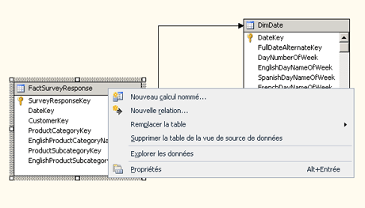

# <a name="define-named-calculations-in-a-data-source-view-analysis-services"></a>Définir des calculs nommés dans une vue de source de données (Analysis Services)
[!INCLUDE[ssas-appliesto-sqlas](../../includes/ssas-appliesto-sqlas.md)]
  Un calcul nommé est une expression SQL représentée sous la forme d'une colonne calculée. Cette expression apparaît et se comporte comme une colonne dans la table. Un calcul nommé vous permet d'étendre le schéma relationnel des tables ou vues existantes dans une vue de source de données sans modifier les tables ou vues dans la source de données sous-jacente. Observez les exemples suivants :  
  
-   Créez un seul calcul nommé dérivé de plusieurs colonnes dans une table de faits (par exemple, en créant le montant des taxes en multipliant un taux de taxe par un prix de vente).  
  
-   Construisez un nom convivial pour un membre de dimension.  
  
-   À titre d'amélioration des performances des requêtes, créez un calcul nommé dans la vue DSV au lieu de créer un membre calculé dans un cube. Les calculs nommés sont calculés pendant le traitement alors que les membres calculés sont calculés lors de l'exécution de la requête.  
  
## <a name="creating-named-calculations"></a>Création de calculs nommés  
  
> [!NOTE]  
>  Vous ne pouvez pas ajouter un calcul nommé dans une requête nommée, ni baser une requête nommée sur une table contenant un calcul nommé.  
  
 Lorsque vous créez un calcul nommé, vous spécifiez un nom, l'expression SQL et éventuellement une description du calcul. L'expression SQL peut faire référence à d'autres tables dans la vue de source de données. Une fois le calcul nommé défini, l'expression contenue dans le calcul nommé est envoyée au fournisseur de la source de données et validée comme l'instruction SQL suivante dans laquelle `<Expression>` contient l'expression qui définit le calcul nommé.  
  
```  
SELECT   
   <Table Name in Data Source>.*,   
   <Expression> AS <Column Name>   
FROM   
   <Table Name in Data Source> AS <Table Name in Data Source View>  
```  
  
 Le type de données de la colonne est déterminé par le type de données de la valeur scalaire retournée par l'expression. Si le fournisseur ne trouve pas d'erreur dans l'expression, la colonne est ajoutée dans la table.  
  
 Les colonnes référencées dans l'expression ne doivent pas être qualifiées ou doivent être qualifiées par le nom de table uniquement. Par exemple, pour faire référence à la colonne SaleAmount dans une table, `SaleAmount` ou `Sales.SaleAmount` est valide, mais `dbo.Sales.SaleAmount` génère une erreur.  
  
 L'expression n'est pas automatiquement placée entre parenthèses. Par conséquent, si une expression, telle qu’une instruction SELECT, nécessite des parenthèses, vous devez les taper dans la zone **Expression** . Par exemple, l'expression ci-dessous est valide uniquement si vous tapez les parenthèses.  
  
```  
(SELECT Description FROM Categories WHERE Categories.CategoryID = CategoryID)  
```  
  
## <a name="add-or-edit-a-named-calculation"></a>Ajouter ou modifier un calcul nommé  
  
1.  Dans [!INCLUDE[ssBIDevStudioFull](../../includes/ssbidevstudiofull-md.md)], ouvrez le projet ou connectez-vous à la base de données qui contient la vue de source de données dans laquelle vous souhaitez définir un calcul nommé.  
  
2.  Dans l’Explorateur de solutions, développez le dossier **Vues des sources de données** , puis double-cliquez sur la vue de source de données.  
  
3.  Cliquez avec le bouton droit sur la table dans laquelle vous voulez définir le calcul nommé dans le volet **Tables** ou **Diagramme** , puis cliquez sur **Nouveau calcul nommé**. Veillez à cliquer avec le bouton droit sur le nom de la table, et non sur un attribut. Le menu doit ressembler à ce qui suit :  
  
       
  
    > [!NOTE]  
    >  Pour rechercher une table ou une vue, vous pouvez utiliser l’option **Rechercher une table** en cliquant sur le menu **Vue de source de données** ou en cliquant avec le bouton droit dans une zone ouverte du volet **Tables** ou **Diagramme** .  
  
4.  Dans la boîte de dialogue **Créer un calcul nommé** , procédez comme suit :  
  
    -   Dans la zone de texte **Nom de la colonne** , tapez le nom de la nouvelle colonne.  
  
    -   Dans la zone de texte **Description** , tapez la description de la nouvelle colonne.  
  
    -   Dans la zone de texte **Expression** , tapez l’expression qui génère le contenu de la nouvelle colonne dans le dialecte SQL approprié pour le fournisseur de données.  
  
5.  Cliquez sur **OK**.  
  
     La colonne du calcul nommé est la dernière colonne dans la table de la vue de source de données. Un symbole de calculateur indique que la colonne contient un calcul nommé.  
  
## <a name="delete-a-named-calculation"></a>Supprimer un calcul nommé  
 Lorsque vous supprimez un calcul nommé, la liste des objets définis dans le projet ou la base de données et qui ne seront plus valides après la suppression s'affichent. Examinez la liste soigneusement avant de supprimer le calcul.  
  
## <a name="see-also"></a>Voir aussi  
 [Définir des requêtes nommées dans une vue de Source de données & #40 ; Analysis Services & #41 ;](../../analysis-services/multidimensional-models/define-named-queries-in-a-data-source-view-analysis-services.md)  
  
  
