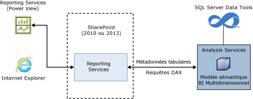
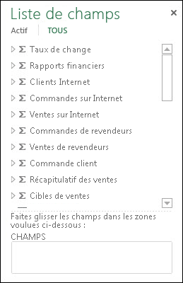
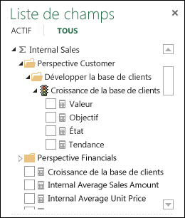
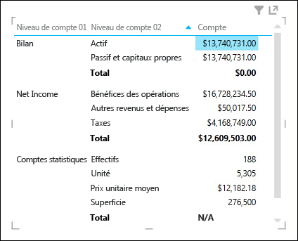
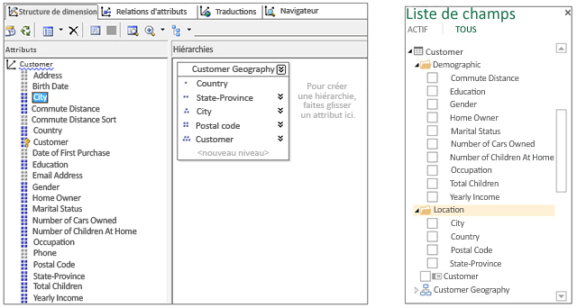
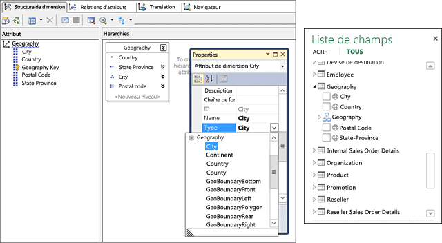
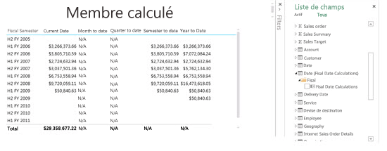
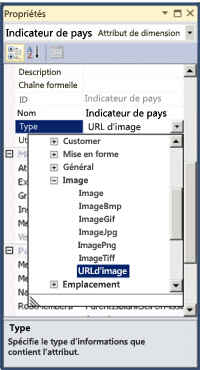
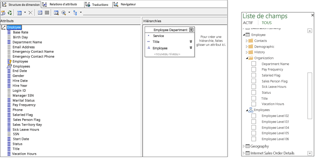
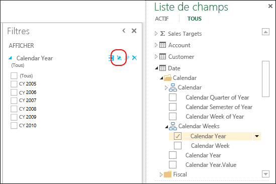

# <a name="understanding-power-view-for-multidimensional-models"></a>Présentation de Power View pour les modèles multidimensionnels
[!INCLUDE[ssas-appliesto-sqlas](../../includes/ssas-appliesto-sqlas.md)]
  Cet article décrit la fonctionnalité Power View pour les modèles multidimensionnels de SQL Server. Il fournit des informations importantes pour les administrateurs et les professionnels dans le secteur du décisionnel qui envisagent d’implémenter Power View pour les modèles multidimensionnels dans leur organisation.  
  
 Les modèles multidimensionnels fournissent des solutions d'analyse, de stockage et de modélisation des données OLAP à la pointe de la technologie. Les modèles multidimensionnels SQL Server prennent en charge l’analyse, l’exploration et la visualisation des données ad hoc grâce à Microsoft Power View.  
  
 Power View est un client Web dynamique qui est lancé directement dans le navigateur à partir d'un fichier de source de données de rapport (.rsds) partagé dans une bibliothèque SharePoint. La source de données de rapport agit comme un pont entre la source de données principale et le client. La source de données principale peut être un classeur [!INCLUDE[ssGemini](../../includes/ssgemini-md.md)] dans SharePoint, un modèle tabulaire sur un serveur Analysis Services s’exécutant en mode tabulaire ou un modèle multidimensionnel sur un serveur Analysis Services s’exécutant en mode multidimensionnel. Il est alors possible d'enregistrer des rapports Power View dans une galerie ou une bibliothèque SharePoint, puis de les partager avec d'autres membres de votre organisation.  
  
 **Power View pour l'architecture des modèles multidimensionnels**  
  
   
  
## <a name="prerequisites"></a>Configuration requise  
 **Configuration requise au niveau du serveur**  
  
-   Microsoft SQL Server 2016 Analysis Services exécuté en mode multidimensionnel.  
  
-   Complément Microsoft SQL Server 2016 Reporting Services pour Microsoft SharePoint Server 2010 ou plus, version Enterprise Edition.  
  
 **Configuration requise au niveau du client**  
  
-   La fonctionnalité cliente Power View requiert Microsoft Silverlight 5. Pour plus d’informations, consultez [Planification de la prise en charge des navigateurs pour Reporting Services et Power View](../../reporting-services/browser-support-for-reporting-services-and-power-view.md).  
  
## <a name="features"></a>Fonctionnalités  
 **Prise en charge native de Power View**  
  
 Dans cette version, les modèles multidimensionnels prennent en charge l'analyse et la visualisation grâce à l'utilisation de Power View en mode SharePoint. Aucune configuration particulière de vos modèles multidimensionnels n'est nécessaire. Il existe toutefois quelques différences dans la manière dont les objets de modèle multidimensionnel sont affichés dans Power View, par rapport à d'autres outils clients, tels que Microsoft Excel et Microsoft Performance Point. Cette version ne prend pas en charge l’analyse et la visualisation de modèles multidimensionnels à l’aide de Power View dans Excel.  
  
 **Prise en charge native pour les requêtes DAX**  
  
 Avec cette version, les modèles multidimensionnels prennent en charge les fonctions et les requêtes DAX, en plus des requêtes MDX plus traditionnelles. Certaines fonctions DAX, telles que PATH, ne sont pas applicables dans la modélisation multidimensionnelle. Pour mieux comprendre le fonctionnement de DAX et ses différences par rapport à MDX, consultez [Data Analysis Expressions et MDX](http://msdn.microsoft.com/library/ff487170\(SQL.105\).aspx).  
  
## <a name="multidimensional-to-tabular-object-mapping"></a>Mappage d'objets multidimensionnels/tabulaires  
 Analysis Services fournit une représentation de métadonnées de modèle tabulaire d'un modèle multidimensionnel. Les objets d'un modèle multidimensionnel sont représentés en tant qu'objets tabulaires dans Power View et dans CSDL en sortie avec des annotations BI.  
  
 **Résumé du mappage d'objets**  
  
|Objet multidimensionnel|Objet tabulaire|  
|-----------------------------|--------------------|  
|Cube|Modèle|  
|Dimension de cube|Table|  
|Attributs de dimension (clé, nom)|Colonne|  
|Groupe de mesures|Table|  
|Measure|Measure|  
|Mesure sans groupe de mesures|Dans un tableau nommé Mesures|  
|Relations de dimension de cube de groupe de mesures|Relation|  
|Perspective|Perspective|  
|Indicateur de performance clé|Indicateur de performance clé|  
|Hiérarchies parent-enfant/utilisateur|Hiérarchie|  
|Afficher le dossier|Afficher le dossier|  
  
## <a name="measures-measure-groups-and-kpis"></a>Mesures, groupes de mesures et indicateurs de performance clés  
  
> [!NOTE]  
>  Certains textes et images de cet article font référence au modèle multidimensionnel Adventure Works pour l'exemple de base de données SQL Server 2012.  
  
 Les groupes de mesures d'un cube multidimensionnel sont vus dans la liste de champs Power View sous forme de tableaux portant le signe sigma (∑).  
  
 **Groupes de mesures dans la liste de champs Power View**  
  
   
  
 Les mesures dans un groupe de mesures apparaissent sous forme de mesures. En présence de mesures calculées qui ne sont associées à aucun groupe de mesures, elles sont regroupées sous un tableau spécial appelé Mesures.  
  
 Pour simplifier les modèles dimensionnels plus complexes, les auteurs de modèle peuvent définir un ensemble de mesures ou d'indicateurs de performance clés dans un cube devant se trouver dans un dossier d'affichage. Power View peut afficher des dossiers d'affichage, ainsi que les mesures et les indicateurs de performance clés qu'ils contiennent.  
  
 **Mesures et indicateurs de performance clés dans un groupe de mesures**  
  
   
  
### <a name="measures-as-variants"></a>Mesures en tant que variantes  
 Les mesures des modèles multidimensionnels sont des variantes. Cela signifie que les mesures ne sont pas fortement typées et qu'elles peuvent avoir des types de données différents. Par exemple, dans l'image ci-dessous, la mesure Amount dans le tableau Financial Reporting par défaut correspond au type de données Devise, mais elle comporte également une valeur de chaîne « NA » pour le sous-total de « Statistical Accounts », présentant le type de données de chaîne. Power View reconnaît certaines mesures en tant que variantes et affiche la mise en forme et les valeurs correctes dans les différentes visualisations.  
  
 **Mesure en tant que variante**  
  
   
  
### <a name="implicit-measures"></a>Mesures implicites  
 Les modèles tabulaires fournissent aux utilisateurs la possibilité de créer des mesures *implicites* , telles qu'un compte, une somme ou une moyenne sur des champs. Pour les modèles multidimensionnels, étant donné que les données d’attribut de dimension sont stockées différemment, interrogation de mesures implicites peut prendre un certain temps. De ce fait, les mesures implicites ne sont pas disponibles dans Power View.  
  
## <a name="dimensions-attributes-and-hierarchies"></a>Dimensions, attributs et hiérarchies  
 Les dimensions de cube sont exposées sous forme de tableaux dans les métadonnées tabulaires. Dans la liste de champs Power View, les attributs de dimension sont affichés en tant que colonnes dans les dossiers d'affichage.  Les attributs de dimension dont la propriété AttributeHierarchyEnabled est définie avec la valeur False, par exemple, l'attribut de date de naissance dans la dimension Customer, ou dont la propriété AttributeHierarchyVisible est définie avec la valeur False, n'apparaissent pas dans la liste de champs Power View. Les hiérarchies à plusieurs niveaux ou les hiérarchies d'utilisateurs, par exemple, Customer Geography dans la dimension Customer, sont exposées en tant que hiérarchies dans la liste de champs Power View. Les éléments UnknownMembers cachés d'un attribut de dimension, sont exposés dans les requêtes DAX et dans Power View.  
  
 **Dimension, attributs et hiérarchies dans SQL Server Data Tools (SSDT) et dans une liste de champs Power View**  
  
   
  
### <a name="dimension-attribute-type"></a>Type d'attribut de dimension  
 Les modèles multidimensionnels prennent en charge l'association d'attributs de dimension avec des types d'attributs de dimension spécifiques. L'image ci-dessous montre la dimension Geography dans laquelle les attributs de dimension de ville, d'état/province, de pays et de code postal sont associés aux types geography. Ceux-ci sont exposés dans les métadonnées tabulaires. Power View reconnaît les métadonnées permettant aux utilisateurs de créer des visualisations de carte. C'est ce qu'indique l'icône de carte en regard des colonnes de ville, pays, code postal et état/province dans le tableau Geography dans la liste de champs Power View.  
  
 **Types geography d'attributs de dimension dans SSDT et la liste de champs Power View**  
  
   
  
### <a name="dimension-calculated-members"></a>Membres calculés de dimension  
 Les modèles multidimensionnels prennent en charge les membres calculés pour l'enfant de tous les membres avec un membre réel unique. Il existe des contraintes supplémentaires lors de l'exposition de ce type de membre calculé :  
  
-   Doit être un membre réel unique lorsque la dimension comporte plus d'un attribut.  
  
-   Un attribut contenant des membres calculés ne peut pas être l'attribut clé de la dimension, sauf s'il s'agit du seul attribut.  
  
-   Un attribut contenant des membres calculés ne peut pas être un attribut parent-enfant.  
  
 Les membres calculés de hiérarchies d'utilisateurs ne sont pas exposés dans Power View ; toutefois, les utilisateurs finaux sont toujours en mesure de se connecter à un cube contenant des membres calculés sur des hiérarchies d'utilisateurs.  
  
 L'image ci-dessous montre un rapport Power View pour un cube qui contient des membres calculés en fonction du temps sur l'attribut de dimension « Fiscal Date Calculations » dans la dimension de date.  
  
 **Rapport Power View avec des membres calculés**  
  
   
  
### <a name="default-members"></a>Membres par défaut  
 Les modèles multidimensionnels prennent en charge les membres par défaut des attributs de dimension. Le membre par défaut est utilisé par Analysis Services lors de l'agrégation de données pour une requête. Le membre par défaut d'un attribut de dimension est exposé en tant que valeur par défaut ou filtre pour la colonne correspondante dans les métadonnées tabulaires.  
  
 Power View se comporte à peu près comme les tableaux croisés dynamiques Excel lors de l'application d'attributs. Lorsqu'un utilisateur ajoute une colonne à une visualisation Power View (tableau, matrice ou graphique) qui contient une valeur par défaut, cette dernière n'est pas appliquée et toutes les valeurs disponibles sont affichées. Si l'utilisateur ajoute la colonne aux filtres, la valeur par défaut est appliquée.  
  
### <a name="dimension-security"></a>Sécurité des dimensions  
 Les modèles multidimensionnels prennent en charge la sécurité au niveau de la cellule et de la dimension au moyen de rôles. Un utilisateur se connectant à un cube à l'aide de Power View est authentifié et évalué pour connaître les autorisations appropriées. Lorsque la sécurité des dimensions est appliquée, les membres des dimensions respectives ne sont pas vus par l'utilisateur dans Power View ; en revanche, si un utilisateur dispose d'une autorisation de sécurité au niveau de la cellule pour laquelle certaines cellules sont restreintes, il ne peut pas se connecter au cube avec Power View. Dans certains cas, les utilisateurs peuvent voir des données agrégées lorsque des portions de ces données sont calculées à partir de données sécurisées.  
  
### <a name="non-aggregatable-attributeshierarchies"></a>Hiérarchies/Attributs ne pouvant faire l'objet d'une agrégation  
 Dans un modèle multidimensionnel, la valeur False peut être définie pour la propriété IsAggregatable des attributs d'une dimension. Cela signifie que l'auteur du modèle a spécifié que les applications clientes ne doivent pas agréger les données entre les hiérarchies (attributs ou à plusieurs niveaux) lorsqu'elles interrogent les données. Dans Power View, cet attribut de dimension est exposé en tant que colonne pour laquelle les sous-totaux ne sont pas disponibles. Dans l'image ci-dessous, vous pouvez voir un exemple d'une hiérarchie ne pouvant faire l'objet d'une agrégation : Accounts. Le niveau le plus élevé de la hiérarchie parent-enfant Accounts ne peut pas faire l'objet d'une agrégation, contrairement aux autres niveaux. Dans une visualisation sous forme de matrice de la hiérarchie Accounts (deux premiers niveaux), vous voyez les sous-totaux pour le niveau 02 d'Accounts, mais pas pour le niveau le plus élevé (01).  
  
 **Hiérarchie ne pouvant faire l'objet d'une agrégation dans Power View**  
  
   
  
## <a name="images"></a>Images  
 Power View offre la possibilité de rendre des images. Dans les modèles multidimensionnels, l'une des manières pour fournir des images à Power View consiste à exposer des colonnes contenant des URL (Uniform Resource Locator) des images. Dans cette version, Analysis Services prend en charge le balisage des attributs de dimension comme type ImageURL. Ce type de données est alors fourni à Power View dans les métadonnées tabulaires. Power View peut alors télécharger et afficher les images spécifiées dans les URL dans les visualisations.  
  
 **Type d'attribut de dimension ImageURL dans SSDT**  
  
   
  
## <a name="parent-child-hierarchies"></a>Hiérarchies parent-enfant  
 Les modèles multidimensionnels prennent en charge les hiérarchies parent-enfant, lesquelles sont exposées en tant que hiérarchies dans les métadonnées tabulaires. Chaque niveau de la hiérarchie parent-enfant est exposé en tant que colonne masquée. L'attribut de clé de la dimension parent-enfant n'est pas exposé dans les métadonnées tabulaires.  
  
 **Hiérarchies de type parent-enfant dans Power View**  
  
   
  
## <a name="perspectives-and-translations"></a>Perspectives et traductions  
 Les perspectives sont des vues de cubes dans lesquelles seules certaines dimensions ou seuls certains groupes de mesures sont visibles dans les outils clients. Vous pouvez spécifier un nom de perspective comme valeur pour la propriété de chaîne de connexion Cube. Par exemple, dans la chaîne de connexion suivante, ‘Direct Sales’ est une perspective dans le modèle multidimensionnel :  
  
 `Data Source=localost;Initial Catalog=AdventureWorksDW-MD;Cube='Direct Sales'`  
  
 Les cubes peuvent disposer de traductions de données et de métadonnées, spécifiées pour différentes langues au sein du modèle. Pour pouvoir voir les traductions (données et métadonnées), vous devez ajouter la propriété facultative « Locale Identifier » à la chaîne de connexion dans le fichier RSDS, comme illustré ci-dessous.  
  
 `Data Source=localost;Initial Catalog=AdventureWorksDW-MD;Cube='Adventure Works'; Locale Identifier=3084`  
  
 Lorsque Power View se connecte à un modèle multidimensionnel avec un fichier .rsds comportant la propriété Locale Identifier et qu'une traduction correspondante est contenue dans le cube, les utilisateurs peuvent voir les traductions dans Power View.  
  
 Pour plus d'informations, consultez [Create a Report Data Source](../../analysis-services/multidimensional-models/create-a-report-data-source.md).  
  
## <a name="power-view-pinned-filters"></a>Filtres épinglés Power View  
 Les rapports Power View peuvent contenir plusieurs vues. Dans cette version, la fonctionnalité *Filtre épinglé* pour les modèles tabulaires et multidimensionnels permet de créer des filtres qui s'appliquent à toutes les vues d'un rapport. L'image ci-dessous montre le bouton bascule Filtre épinglé pour un filtre de vue. Par défaut, un filtre de vue n'est pas épinglé et s'applique uniquement à cette vue. Épingler un filtre de vue permet de l'appliquer à toutes les vues ; le désépingler le supprime des autres vues.  
  
 **Filtres épinglés**  
  
   
  
## <a name="unsupported-features"></a>Fonctionnalités non prises en charge  
 **Power View dans Excel 2013** ne prend pas en charge la connexion ni la création de rapports pour les modèles multidimensionnels. Toutefois, **Power View dans Excel 2016** ne prend pas en charge la connexion et la création de rapports pour les modèles multidimensionnels. Pour en savoir plus, voir [Power View et OLAP dans Excel 2016](https://support.office.com/en-us/article/power-view-and-olap-in-excel-2016-ea5ff7a5-ea5f-48d4-aeb0-98c89ab738ac).  
  
 Les**actions** ne sont pas prises en charge dans les rapports Power View ni dans les requêtes DAX portant sur un modèle multidimensionnel.  
  
 Les**jeux nommés** dans les modèles multidimensionnels ne sont pas pris en charge dans Power View ni dans les requêtes DAX portant sur un modèle multidimensionnel.  
  
> [!NOTE]  
>  Les actions et les jeux nommés non pris en charge n'empêchent pas les utilisateurs de se connecter et d'explorer les modèles multidimensionnels avec Power View.  
  
 La**sécurité au niveau des cellules** n'est pas prise en charge dans les rapports Power View.  
  
## <a name="csdlbi-annotations"></a>Annotations CSDLBI  
 Les métadonnées de cube multidimensionnelles sont exposées en tant que modèle conceptuel basé sur EDM (Entity Data Model) par les annotations CSDLBI (Conceptual Schema Definition Language avec Business Intelligence).  
  
 Les métadonnées multidimensionnelles sont représentées en tant qu'espace de noms de modèle tabulaire dans un document CSDLBI, ou CSDL en sortie, lorsqu'une requête DISCOVER_CSDL_METADATA est envoyée à l'instance Analysis Services.  
  
 **Exemple de requête DISCOVER_CSDL_METADATA**  
  
```  
<Envelopexmlns=”http://schemas.xmlsoap.org/soap/envelope/”>  
   <Body>  
      <Discoverxmlns=”urn:schemas-microsoft-com:xml-analysis”>  
         <RequestType>DISCOVER_CSDL_METADATA</RequestType>  
         <Restrictions>  
            <RestrictionList>  
              <CATALOG_NAME>”catalogname”<CATALOG_NAME>  
            </RestrictionList>  
         </Restrictions>  
         <Properties>  
            <PropertyList>  
            </PropertyList>  
         </Properties>  
      </Discover>  
   </Body>  
</Envelope>  
  
```  
  
 La requête DISCOVER_CSDL_METADATA présente les restrictions suivantes :  
  
|Nom|Requis| Description|  
|----------|--------------|-----------------|  
|CATALOG_NAME|Oui|Nom du catalogue\base de données.|  
|PERSPECTIVE_NAME|Oui, si le cube contient plusieurs perspectives. Facultatif en présence d'un seul cube ou s'il existe une perspective par défaut.|Nom du cube ou de la perspective dans la base de données multidimensionnelle.|  
|VERSION|Oui|Version CSDL demandée par le client. Les constructions et fonctionnalités multidimensionnelles sont prises en charge dans la version 2.0.|  
  
 Le document CSDL en sortie retourné représente le modèle en tant qu'espace de noms qui contient des entités, des associations et des propriétés.  
  
 Pour plus d’informations sur les annotations CSDLBI pour les modèles tabulaires, consultez [Guide de référence technique pour les annotations BI du langage CSDL](../../analysis-services/tabular-model-programming-compatibility-levels-1050-1103/conceptual-schema-definition-language-csdl/technical-reference-for-bi-annotations-to-csdl.md) sur MSDN et [\[MS-CSDLBI\]: Conceptual Schema Definitions File Format with Business Intelligence Annotations](http://msdn.microsoft.com/library/jj161299\(SQL.105\).aspx).  
  
## <a name="client-help-on-officecom"></a>Aide sur le client sur Office.com  
 Les articles suivants sont fournis sur Office.com pour aider les utilisateurs à en savoir plus sur la manière dont les objets de modèle multidimensionnel apparaissent dans Power View et sur la procédure de création d'un rapport d'exemple :  
  
 [Comprendre les objets de modèle multidimensionnel dans Power View](http://office.microsoft.com/en-us/excel-help/understanding-multidimensional-model-objects-in-power-view-HA104018589.aspx)  
  
 [Explorer le modèle multidimensionnel Adventure Works avec Power View](http://office.microsoft.com/excel-help/explore-the-adventure-works-multidimensional-model-by-using-power-view-HA104046830.aspx)  
  
  
