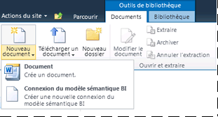

# Ajouter le Type contenu de la connexion de modèle sémantique BI à la bibliothèque
[!INCLUDE[ssas-appliesto-sqlas](../../includes/ssas-appliesto-sqlas.md)]
  Une connexion du modèle sémantique BI est créée dans SharePoint et assure la redirection vers les données du modèle sémantique Business Intelligence situées dans un classeur [!INCLUDE[ssGemini](../../includes/ssgemini-md.md)] ou une base de données model tabulaire Analysis Services sur un serveur réseau. Avant de pouvoir créer une connexion de modèle sémantique BI dans SharePoint, vous devez étendre une bibliothèque de documents pour autoriser la création d'un fichier .bism. Cette étape est effectuée une seule fois pour chaque bibliothèque, mais vous devrez la répéter pour toutes les bibliothèques à partir desquelles vous souhaitez créer des fichiers .bism. Les meilleures pratiques recommandent de créer une bibliothèque centralisée pour le stockage des fichiers .bism, afin que vous puissiez gérer les autorisations dans un seul emplacement.  
  
> [!NOTE]  
>  Si vous utilisez déjà des bibliothèques de connexion de données SharePoint, le type de contenu Connexion de modèle sémantique BI est ajouté automatiquement à ce modèle de bibliothèque. Vous pouvez ignorer les étapes de cette section si vous utilisez une bibliothèque de connexions de données qui vous permet déjà de créer des documents de connexion de modèle sémantique BI.  
  
##   Ajouter le type de contenu à une bibliothèque de documents  
 Pour ajouter et configurer un type de contenu, vous devez au minimum disposer d'une autorisation Gérer les listes. Cette autorisation est intégrée au niveau d'autorisation de conception et aux niveaux supérieurs.  
  
 Le site qui contient la bibliothèque de documents doit disposer d’une activation des fonctionnalités pour [!INCLUDE[ssGemini](../../includes/ssgemini-md.md)] pour SharePoint. Pour plus d’informations, consultez [Activer l’intégration des fonctionnalités Power Pivot pour des collections de sites dans l’Administration centrale](../../analysis-services/power-pivot-sharepoint/activate-power-pivot-integration-for-site-collections-in-ca.md).  
  
1.  Ouvrez la bibliothèque de documents pour laquelle activer le type de contenu Connexion de modèle sémantique BI.  
  
2.  Sur le ruban SharePoint, dans Outils de bibliothèque, cliquez sur **Bibliothèque**.  
  
3.  Cliquez sur **Paramètres de la bibliothèque**.  
  
4.  Sous Paramètres généraux, cliquez sur **Paramètres avancés**.  
  
5.  Dans Types de contenu, dans la section « Autoriser la gestion des types de contenu ? », cliquez sur **Oui**.  
  
6.  Cliquez sur **OK**.  
  
7.  Dans la section Types de contenu, cliquez sur **Ajouter à partir de types de contenu de site existants**. Si vous ne voyez pas cette page, retournez au site, cliquez sur **Bibliothèque** dans Outils de bibliothèque, puis sur **Paramètres de la bibliothèque**.  
  
8.  Dans Types de contenu, cliquez sur **Ajouter à partir de types de contenu de site existants**.  
  
9. Dans Sélectionner des types de contenu dans, sélectionnez **Aide à la décision**.  
  
10. Dans Types de contenu de site disponibles, cliquez sur **Fichier de connexion de modèle sémantique BI**, puis sur **Ajouter** pour déplacer le type de contenu sélectionné dans la liste Types de contenu à ajouter.  
  
11. Cliquez sur **OK**.  
  
12. Pour vérifier que vous avez ajouté le type de contenu, revenez à la bibliothèque et cliquez sur **Nouveau document** dans la zone Documents du ruban de bibliothèque. Vous devez voir **Fichier de connexion de modèle sémantique BI** dans la liste des nouveaux documents.  
  
       
  
 Après avoir activé le type de contenu Connexion de modèle sémantique BI pour une bibliothèque, vous pouvez créer une connexion qui assure la redirection vers des données de modèle sémantique d'entreprise qui peuvent être utilisées par des rapports Excel ou [!INCLUDE[ssCrescent](../../includes/sscrescent-md.md)] . Choisissez parmi les liens suivants pour en savoir plus sur cette étape suivante :  
  
 [Créer une connexion de modèle sémantique BI à un classeur PowerPivot](../../analysis-services/power-pivot-sharepoint/create-a-bi-semantic-model-connection-to-a-power-pivot-workbook.md)  
  
 [Créer une connexion de modèle sémantique BI à une base de données model tabulaire](../../analysis-services/power-pivot-sharepoint/create-a-bi-semantic-model-connection-to-a-tabular-model-database.md)  
  
## Voir aussi  
 [Connexion de modèle sémantique BI Power Pivot &#40;.bism&#41;](../../analysis-services/power-pivot-sharepoint/power-pivot-bi-semantic-model-connection-bism.md)   
 [Utiliser une connexion de modèle sémantique BI dans Excel ou Reporting Services](../../analysis-services/power-pivot-sharepoint/use-a-bi-semantic-model-connection-in-excel-or-reporting-services.md)  
  
  
