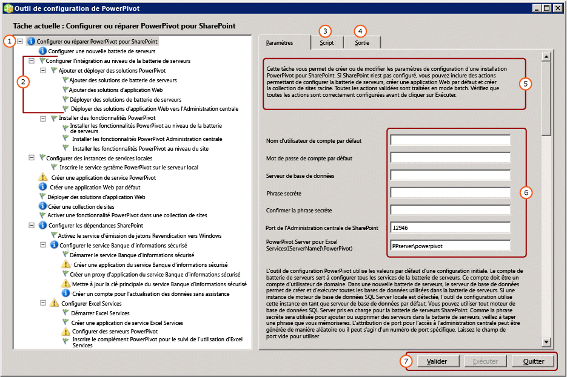

# <a name="configure-or-repair-power-pivot-for-sharepoint-2013"></a>Configurer ou réparer PowerPivot pour SharePoint 2013
[!INCLUDE[ssas-appliesto-sqlas](../../includes/ssas-appliesto-sqlas.md)]
  Utilisez l'Outil de configuration de [!INCLUDE[ssCurrent](../../includes/sscurrent-md.md)][!INCLUDE[ssGemini](../../includes/ssgemini-md.md)] pour SharePoint pour configurer ou réparer une installation de [!INCLUDE[ssGemini](../../includes/ssgemini-md.md)] pour SharePoint 2013, L'outil de configuration commence par analyser le système, puis retourne une liste d'actions nécessaires pour achever ou réparer votre installation. L'Assistant Installation de [!INCLUDE[ssCurrent](../../includes/sscurrent-md.md)] installe l'outil de configuration de [!INCLUDE[ssGemini](../../includes/ssgemini-md.md)] pour SharePoint 2010 et un outil de configuration de [!INCLUDE[ssGemini](../../includes/ssgemini-md.md)] pour SharePoint 2013. Cette rubrique décrit l'outil de configuration de [!INCLUDE[ssGemini](../../includes/ssgemini-md.md)] pour SharePoint 2013. Pour plus d’informations sur SharePoint 2010, consultez [Configurer ou réparer Power Pivot pour SharePoint 2010 (outil de configuration de Power Pivot)](http://msdn.microsoft.com/en-us/d61f49c5-efaa-4455-98f2-8c293fa50046).  
  
 **[!INCLUDE[applies](../../includes/applies-md.md)]**  SharePoint 2013  
  
 **Dans cette rubrique :**  
  
 [Avant de commencer](#bkmk_before)  
  
 [Pour utiliser l’outil de configuration de Power Pivot pour SharePoint 2013](#bkmk_using)  
  
 [Étapes de configuration](#bkmk_steps)  
  
 [Valeurs d'entrée utilisées pour configurer le serveur](#bkmk_input)  
  
 [Étapes suivantes](#bkmk_nextsteps)  
  
##  <a name="bkmk_before"></a> Avant de commencer  
 L'outil de configuration de [!INCLUDE[ssGemini](../../includes/ssgemini-md.md)] pour SharePoint 2013 recherche les fichiers programme, les paramètres du Registre et les ports disponibles. Pour optimiser l'utilisation de ces outils, vérifiez les points suivants.  
  
-   Exigences générales pour exécuter l'outil de configuration [Power Pivot Configuration Tools](../../analysis-services/power-pivot-sharepoint/power-pivot-configuration-tools.md).  
  
-   [!INCLUDE[ssGemini](../../includes/ssgemini-md.md)] pour SharePoint 2013 préfère que l'application Web soit configurée pour l'authentification basée sur les revendications. Si l'outil de configuration de [!INCLUDE[ssGemini](../../includes/ssgemini-md.md)] pour SharePoint 2013 crée l'application pour vous, il la configure pour utiliser l'authentification par revendications de Windows. Pour plus d'informations sur les spécifications d'authentification, consultez [Power Pivot Authentication and Authorization](../../analysis-services/power-pivot-sharepoint/power-pivot-authentication-and-authorization.md).  
  
-   Le port 80 doit être disponible pour que l'outil de configuration de[!INCLUDE[ssGemini](../../includes/ssgemini-md.md)] pour SharePoint 2013 puisse créer une application Web.  
  
##  <a name="bkmk_using"></a> Pour utiliser l’outil de configuration de Power Pivot pour SharePoint 2013  
 La première page de l'outil fournit un résumé des valeurs d'entrée utilisées pour configurer la batterie de serveurs SharePoint. En plus des valeurs d'entrée fournies, des valeurs par défaut sont utilisées pour configurer le système. Des noms par défaut sont utilisés pour les applications de service, les bases de données d'application de service et les propriétés d'application de service.  
  
> [!TIP]  
>  Si l'outil de configuration analyse l'ordinateur et retourne une liste de tâches vide dans le volet gauche, aucune fonctionnalité ou paramètre nécessitant une configuration n'a été détecté. Pour modifier la configuration de SharePoint ou [!INCLUDE[ssGemini](../../includes/ssgemini-md.md)] , utilisez Windows PowerShell ou les pages d'administration dans l'Administration centrale de SharePoint. Pour plus d’informations, consultez [Administration et configuration d’un serveur Power Pivot dans l’Administration centrale](../../analysis-services/power-pivot-sharepoint/power-pivot-server-administration-and-configuration-in-central-administration.md).  
  
 Les valeurs des comptes de service sont utilisées pour plusieurs services. Par exemple, l'outil de configuration utilise le compte par défaut sur la première page pour configurer toutes les identités du pool d'applications. Vous pouvez modifier ces comptes ultérieurement en modifiant les propriétés d'application de service dans l'Administration centrale.  
  
 L'outil fournit une interface avec onglets qui comporte les entrées de paramètre, le script Windows PowerShell et les messages d'état.  
  
 L'outil utilise Windows PowerShell pour configurer le serveur. Vous pouvez cliquer sur l'onglet **Script** pour consulter le script Windows PowerShell que l'outil utilise pour configurer le serveur.  
  
   
  
|| Description|  
|-|-----------------|  
|**(1)**|Fenêtre de la liste des tâches.|  
|**(2)**|Chacune des actions.|  
|**(3)**|Scripts Windows PowerShell créés par l'outil de configuration.|  
|**(4)**|Messages du journal créés lorsque vous démarrez les actions de validation ou d'exécution.|  
|**(5)**|Description de la page.|  
|**(6)**|Paramètres d'entrée|  
|**(7)**|Le bouton **Exécuter** est activé après avoir validé les actions.|  
  
##  <a name="bkmk_steps"></a> Étapes de configuration  
 Le lien vers l’outil de configuration est visible uniquement lorsque [!INCLUDE[ssGemini](../../includes/ssgemini-md.md)] pour SharePoint 2013 est installé sur le serveur local.  
  
1.  Dans le menu **Démarrer** , pointez sur **Tous les programmes**, puis sur [!INCLUDE[ssCurrentUI](../../includes/sscurrentui-md.md)], sur **Outils de configuration**, puis cliquez sur **[!INCLUDE[ssGemini](../../includes/ssgemini-md.md)] pour SharePoint 2013**.  
  
2.  Cliquez sur **Configurer ou réparer [!INCLUDE[ssGemini](../../includes/ssgemini-md.md)] pour SharePoint**.  
  
3.  Affichez la fenêtre en plein écran. Vous devez voir une barre d'icônes en bas de la fenêtre qui comprend les commandes **Valider**, **Exécuter**et **Quitter** .  
  
4.  **Compte par défaut :** sous l'onglet Paramètres, entrez un compte d'utilisateur de domaine pour **Nom d'utilisateur de compte par défaut**. Ce compte est utilisé pour configurer des services essentiels, notamment le pool d'applications de service [!INCLUDE[ssGemini](../../includes/ssgemini-md.md)] . Ne spécifiez pas un compte intégré tel que Service réseau ou Système local. L'outil bloque les configurations qui spécifient des comptes intégrés.  
  
     **Phrase secrète :** entrez une phrase secrète. Pour une nouvelle batterie de serveurs SharePoint, la phrase secrète est utilisée chaque fois que vous ajoutez un nouveau serveur ou une nouvelle application à la batterie de serveurs SharePoint. Si la batterie existe, entrez la phrase secrète qui vous permet d'ajouter une application de serveur à la batterie.  
  
5.  **Port :** si vous le souhaitez, entrez un numéro de port pour vous connecter à l'application Web de l'Administration centrale ou utilisez le nombre généré de manière aléatoire fourni. L'outil de configuration vérifie que le nombre est disponible avant de le proposer comme option.  
  
6.  Dans la page principale, tapez le nom d'un serveur [!INCLUDE[ssCurrent](../../includes/sscurrent-md.md)][!INCLUDE[ssGemini](../../includes/ssgemini-md.md)] exécuté en mode SharePoint.  
  
7.  Éventuellement, examinez les valeurs d'entrée restantes utilisées pour effectuer chaque action. Pour plus d'informations sur chacune d'elles, consultez [Valeurs d'entrée utilisées pour configurer le serveur](#bkmk_input) dans cette rubrique.  
  
8.  Éventuellement, supprimez toutes les actions que vous ne souhaitez pas traiter. Par exemple, si vous souhaitez configurer le service Banque d'informations sécurisé ultérieurement, cliquez sur **Configurer le service Banque d'informations sécurisé**, puis désactivez la case à cocher **Inclure cette action dans la liste des tâches**.  
  
9. Cliquez sur **Valider** pour vérifier que l'outil dispose d'informations suffisantes pour traiter les actions de la liste.  
  
10. Cliquez sur **Exécuter** pour traiter toutes les actions de la liste des tâches. Le bouton **Exécuter** devient disponible lorsque vous avez validé les actions. Si **Exécuter** n'est pas activé, commencez par cliquer sur **Valider** .  
  
     Si un message d'erreur semblable au suivant s'affiche, vérifiez que l'instance de base de données SQL Server est démarrée.  
  
    ```  
    Cannot connect to the database server instance  
    ```  
  
11. [Verify a Power Pivot for SharePoint Installation](../../analysis-services/instances/install-windows/verify-a-power-pivot-for-sharepoint-installation.md).  
  
##  <a name="bkmk_input"></a> Valeurs d'entrée utilisées pour configurer le serveur  
 L'outil de configuration de [!INCLUDE[ssGemini](../../includes/ssgemini-md.md)] utilise une combinaison de valeurs d'entrée que vous tapez et de valeurs par défaut qu'il détecte ou utilise automatiquement.  
  
 La liste des actions que l'outil de configuration affiche dépend de la configuration actuelle des batteries de serveurs SharePoint. Par exemple, si la batterie de serveurs SharePoint est déjà configurée, vous ne voyez pas les actions de configuration de la batterie ou de création d'une application Web. Vous pouvez exécuter l'outil à tout moment pour configurer, réparer, ou détecter des erreurs de configuration. Si des services requis, tels qu'Excel Services ou le service Banque d'informations sécurisé, ne s'exécutent pas dans la batterie, l'outil détecte les services manquants et fournit des options permettant de les activer. Si aucune action n'est requise, la liste des tâches est vide.  
  
 Le tableau suivant décrit les valeurs utilisées pour configurer le serveur.  
  
|Radiomessagerie|Valeur d'entrée|Source| Description|  
|----------|-----------------|------------|-----------------|  
|**Configurer ou réparer [!INCLUDE[ssGemini](../../includes/ssgemini-md.md)] pour SharePoint**|Compte par défaut|Utilisateur actuel|Le compte par défaut est un compte d'utilisateur de domaine Windows utilisé pour configurer des services partagés dans la batterie. Il est utilisé pour mettre en service les éléments suivants :|  
||||-<br />                    [!INCLUDE[ssGemini](../../includes/ssgemini-md.md)] par défaut|  
||||- Service Banque d’informations sécurisé|  
||||- Excel Services|  
||||- Identité du pool d’applications Web|  
||||- Administrateur de collection de sites|  
||||- Compte d’actualisation des données [!INCLUDE[ssGemini](../../includes/ssgemini-md.md)] sans assistance|  
||||Le compte de domaine de l’utilisateur actuel est utilisé par défaut.<br /><br /> Remarque : Il est recommandé de remplacer la valeur par défaut sauf si vous configurez un serveur à des fins d’évaluation et expérimentales.<br /><br /> Vous pouvez modifier les identités de service après une configuration ou une réparation, à l’aide de l’Administration centrale.<br /><br /> Éventuellement, dans l'outil de configuration de [!INCLUDE[ssGemini](../../includes/ssgemini-md.md)] , spécifiez des comptes dédiés pour ce qui suit :|  
||||- Application web, via la page **Créer une application Web par défaut** (en supposant que l’outil crée une application web pour la batterie).|  
||||-<br />                    [!INCLUDE[ssGemini](../../includes/ssgemini-md.md)] , à l’aide de la page **Créer un compte sans assistance pour l’actualisation des données** de cet outil.|  
||Serveur de base de données|Instance nommée [!INCLUDE[ssGemini](../../includes/ssgemini-md.md)] locale, le cas échéant|Si une instance du moteur de base de données est installée en tant qu'instance nommée [!INCLUDE[ssGemini](../../includes/ssgemini-md.md)] , l'outil renseigne le champ du serveur de base de données avec ce nom d'instance. Si vous n'avez pas installé le moteur de base de données, ce champ est vide.<br /><br /> Le**Serveur de base de données**  est un paramètre obligatoire. Il peut s'agir de n'importe quelle version ou édition de SQL Server prise en charge pour les batteries de serveurs SharePoint.|  
||Phrase secrète|Entrée utilisateur|Si vous créez une nouvelle batterie, la phrase secrète que vous entrez est utilisée comme phrase secrète pour la batterie. Si vous ajoutez [!INCLUDE[ssGemini](../../includes/ssgemini-md.md)] pour SharePoint à une batterie de serveurs existante, tapez la phrase secrète de la batterie de serveurs existante.|  
||Port de l'Administration centrale de SharePoint|Par défaut, si nécessaire|Si la batterie de serveurs n'est pas configurée, l'outil fournit des options pour la création de la batterie de serveurs, notamment pour la création d'un point de terminaison HTTP dans l'Administration centrale. Il choisit un numéro de port généré de manière aléatoire qui n'est pas encore utilisé.|  
||[!INCLUDE[ssGemini](../../includes/ssgemini-md.md)] pour Excel Services ([NomServeur]\ [!INCLUDE[ssGemini](../../includes/ssgemini-md.md)])|Entrée utilisateur|Le serveur [!INCLUDE[ssGemini](../../includes/ssgemini-md.md)] est requis pour qu'Excel Services active les fonctionnalités principales de [!INCLUDE[ssGemini](../../includes/ssgemini-md.md)] . Le nom du serveur que vous tapez dans cette page est aussi ajouté à la liste figurant dans la page **Configurer les serveurs [!INCLUDE[ssGemini](../../includes/ssgemini-md.md)]**.|  
|**Configurer une nouvelle batterie de serveurs**|Serveur de base de données<br /><br /> Compte de batterie de serveurs<br /><br /> Phrase secrète<br /><br /> Port de l'Administration centrale de SharePoint|Par défaut, si nécessaire|Valeur par défaut de paramètres que vous avez entrés dans dans la page principale.|  
|**Créer une application de service [!INCLUDE[ssGemini](../../includes/ssgemini-md.md)]**|Nom d'application de service|Par défaut|[!INCLUDE[ssGemini](../../includes/ssgemini-md.md)] Le nom par défaut est **Par défaut [!INCLUDE[ssGemini](../../includes/ssgemini-md.md)] Service Application**. Vous pouvez le remplacer par une valeur différente dans l'outil.|  
||Serveur de base de données|Par défaut|Serveur de base de données qui héberge la base de données d'application de service [!INCLUDE[ssGemini](../../includes/ssgemini-md.md)] . Le nom par défaut du serveur est le même que celui du serveur de base de données utilisé pour la batterie. Vous pouvez utiliser une autre valeur que le nom du serveur par défaut.|  
||Nom de la base de données|Par défaut|Nom de la base de données à créer pour la base de données d'application de service [!INCLUDE[ssGemini](../../includes/ssgemini-md.md)] . Le nom de la base de données par défaut est basé sur le nom de l'application de service, suivi d'un GUID pour garantir un nom unique. Vous pouvez le remplacer par une valeur différente dans l'outil.|  
|**Créer une application Web par défaut**|Nom de l'application Web|Par défaut, si nécessaire|S'il n'existe aucune application Web, l'outil en crée une. L'application Web est configurée pour l'authentification en mode classique et écoute le port 80. La taille maximale de téléchargement de fichier a la valeur 2047, qui est la valeur maximale autorisée par SharePoint. La taille maximale de téléchargement de fichier permet de prendre en charge les fichiers [!INCLUDE[ssGemini](../../includes/ssgemini-md.md)] volumineux qui seront téléchargés sur le serveur.|  
||URL|Par défaut, si nécessaire|L'outil crée une URL basée sur le nom du serveur, en respectant les mêmes conventions d'affectation de noms de fichier que SharePoint.|  
||Pool d'applications|Par défaut, si nécessaire|L'outil crée un pool d'applications par défaut dans IIS.|  
||Compte et mot de passe du pool d'applications|Par défaut, si nécessaire|Le compte du pool d'applications est basé sur le compte par défaut, mais vous pouvez le remplacer dans l'outil.|  
||Serveur de base de données|Par défaut, si nécessaire|L'instance de base de données par défaut est présélectionnée pour stocker la base de données de contenu d'application, mais vous pouvez spécifier une autre instance de SQL Server dans l'outil.|  
||Nom de la base de données|Par défaut, si nécessaire|Nom de la base de données d'application. Le nom de la base de données est basé sur les conventions d'affectation de noms de fichier de SharePoint, mais vous pouvez choisir un autre nom.|  
|**Déployer une solution d'application Web**|URL|Par défaut, si nécessaire|L'URL par défaut provient de l'application Web par défaut.|  
||Taille maximale de fichier (en Mo)|Par défaut, si nécessaire|Le paramètre par défaut est 2047. Les bibliothèques de documents SharePoint sont également limitées en taille et le paramètre [!INCLUDE[ssGemini](../../includes/ssgemini-md.md)] ne doit pas dépasser le paramètre de la bibliothèque de documents. Pour plus d’informations, consultez [Configurer la taille maximale de chargement de fichiers &#40;PowerPivot pour SharePoint&#41;](../../analysis-services/power-pivot-sharepoint/configure-maximum-file-upload-size-power-pivot-for-sharepoint.md).|  
|**Créer une collection de sites**|Administrateur de site|Par défaut, si nécessaire|L'outil utilise le compte par défaut. Vous pouvez le remplacer dans la page **Créer une collection de sites** .|  
||Adresse de messagerie du contact|Par défaut, si nécessaire|Si Microsoft Outlook est configuré sur le serveur, l'outil utilisera l'adresse de messagerie de l'utilisateur actuel. Sinon, une valeur d'espace réservé est utilisée.|  
||URL du site|Par défaut, si nécessaire|L'outil crée l'URL de site, en respectant les mêmes conventions d'affectation de noms d'URL que SharePoint.|  
||Titre du site|Par défaut, si nécessaire|L’outil ajoute **Site [!INCLUDE[ssGemini](../../includes/ssgemini-md.md)]** comme titre par défaut.|  
|**Activer une fonctionnalité [!INCLUDE[ssGemini](../../includes/ssgemini-md.md)] dans une collection de sites**|URL du site||URL de la collection de sites pour laquelle vous activez les fonctionnalités [!INCLUDE[ssGemini](../../includes/ssgemini-md.md)] .|  
||Activer la fonctionnalité Premium pour ce site||Activez la fonctionnalité de site SharePoint « PremiumSite ».|  
|**Créer une application du service Banque d'informations sécurisé**|Nom d'application de service|Par défaut, si nécessaire|Tapez le nom de l'application du Service Banque d'informations sécurisé.|  
||Serveur de base de données|Entrée utilisateur|Tapez le nom du serveur de base de données à utiliser pour l'application du Service Banque d'informations sécurisé.|  
|**Créer un proxy d'application du service Banque d'informations sécurisé**|Nom d'application de service|Par défaut, si nécessaire|Tapez le nom de l'application du Service Banque d'informations sécurisé entré dans la page précédente.|  
||Proxy d'application de service|Par défaut, si nécessaire|Tapez le nom du proxy du Service Banque d'informations sécurisé. Le nom apparaît dans le groupe de connexions par défaut qui associe les applications aux applications Web de contenu SharePoint.|  
|**Mettre à jour la clé principale du service Banque d'informations sécurisé**|Proxy d'application de service|Par défaut, si nécessaire|Tapez le nom du proxy de l'application du Service Banque d'informations sécurisé entré dans la page précédente.|  
||Phrase secrète|Entrée utilisateur|La clé principale est utilisée pour le chiffrement des données. Par défaut, la phrase secrète utilisée pour générer cette clé est la même que celle utilisée pour configurer de nouveaux serveurs dans la batterie de serveurs. Vous pouvez remplacer la phrase secrète par défaut par une phrase secrète unique.|  
|**Créer un compte pour l'actualisation des données sans assistance**|ID de l'application cible|Par défaut, si nécessaire|Créez une application cible qui stocke les informations d'identification pour l'actualisation des données [!INCLUDE[ssGemini](../../includes/ssgemini-md.md)] sans assistance.<br /><br /> L'ID d'application peut être du texte descriptif.|  
||Nom convivial pour l'application cible|Par défaut, si nécessaire||  
||Nom d'utilisateur et mot de passe du compte sans assistance|Par défaut, si nécessaire|Tapez les informations d'identification d'un compte d'utilisateur Windows utilisé par l'application cible pour exécuter l'actualisation des données sans assistance. Pour plus d’informations, consultez [d’actualisation des données de configurer Excel Services à l’aide du compte de service sans assistance dans SharePoint Server 2013](http://technet.microsoft.com/library/hh525344\(office.15\).aspx) (http://technet.microsoft.com/en-us/library/hh525344(office.15).aspx).|  
||URL du site|Par défaut, si nécessaire|Tapez l'URL du site de la collection de sites associée à l'application cible. Pour associer d'autres collections de sites, utilisez l'Administration centrale de SharePoint.|  
|**Créer une application de service Excel Services**|Nom d'application de service|Par défaut, si nécessaire|Entrez un nom pour l'application de service. Une base de données d'application de service portant le même nom est créée sur le serveur de base de données de la batterie de serveurs SharePoint.|  
|**Configurer les serveurs [!INCLUDE[ssGemini](../../includes/ssgemini-md.md)]**|Nom d'application de service|Par défaut, si nécessaire|Nom de l'application de service que vous avez entré dans la page précédente.|  
||[!INCLUDE[ssGemini](../../includes/ssgemini-md.md)] Nom de serveur||Liste des serveurs [!INCLUDE[ssGemini](../../includes/ssgemini-md.md)] enregistrés.<br /><br /> Le nom du serveur entré dans la page principale est automatiquement ajouté à cette page.|  
|**Inscrire le complément [!INCLUDE[ssGemini](../../includes/ssgemini-md.md)] pour le suivi de l’utilisation d’Excel Services**|Nom d'application de service||Nom de l'application de service que vous avez entré dans la page précédente.|  
|||||  
  
 Si l’outil de configuration [!INCLUDE[ssGemini](../../includes/ssgemini-md.md)] pour SharePoint 2013 crée la batterie, il crée les bases de données requises sur le serveur de base de données, en respectant les mêmes conventions d’affectation de noms de fichier que SharePoint. Vous ne pouvez pas modifier le nom de la base de données de la batterie de serveurs.  
  
 Si l'outil crée une collection de sites, il crée une base de données de contenu sur le serveur de base de données, en respectant les mêmes conventions d'affectation de noms de fichier que SharePoint. Vous ne pouvez pas modifier le nom de la base de données de contenu.  
  
## <a name="verify-the-configuration"></a>Vérifier la configuration  
 Consultez la section « Vérifiez la configuration de [!INCLUDE[ssGemini](../../includes/ssgemini-md.md)]» de la rubrique [Configurer Power Pivot et déployer des solutions &#40;SharePoint 2013&#41;](../../analysis-services/instances/install-windows/configure-power-pivot-and-deploy-solutions-sharepoint-2013.md).  
  
##  <a name="bkmk_nextsteps"></a> Étapes suivantes  
 Une fois que vous avez terminé l'installation du serveur, vous devez effectuer plusieurs tâches de post-installation :  
  
-   Accordez les autorisations SharePoint aux individus et aux groupes. Cette tâche est nécessaire pour permettre l'accès aux sites et au contenu.  
  
-   Modifiez les identités du pool d'applications de service pour exécuter le programme sous un autre compte. La spécification d'identités différentes pour les services et les applications est une meilleure pratique SharePoint recommandée pour un déploiement sécurisé.  
  
-   Créez des sites de confiance supplémentaires dans Excel Services afin que vous puissiez varier au mieux les autorisations et les paramètres de configuration pour l'accès aux données [!INCLUDE[ssGemini](../../includes/ssgemini-md.md)] .  
  
-   Installez les fournisseurs de données les plus courants pour permettre l'actualisation des données côté serveur.  
  
### <a name="grant-sharepoint-permissions-to-workbook-users"></a>Accorder des autorisations SharePoint aux utilisateurs des classeurs  
 Les utilisateurs ont besoin d'autorisations SharePoint pour pouvoir publier ou consulter des classeurs. Accordez des autorisations **Affichage** aux utilisateurs qui doivent consulter des classeurs publiés, et des autorisations **Collaboration** aux utilisateurs qui publient ou gèrent des classeurs. Vous devez être administrateur de collection de sites pour pouvoir accorder des autorisations.  
  
1.  Dans un site SharePoint 2013, cliquez sur l’icône paramètres  puis cliquez sur **paramètres du Site**.  
  
2.  Cliquez sur **Autorisations de site** dans le groupe **Utilisateurs et autorisations** .  
  
3.  Créez autant de groupes que nécessaire si vous souhaitez configurer un ensemble d'utilisateurs ayant des autorisations de **Collaboration** et un groupe différent d'utilisateurs ayant uniquement des autorisations d' **Affichage** .  
  
4.  Entrez les comptes d'utilisateur ou de groupe de domaine Windows qui doivent appartenir aux groupes. Comme précédemment, n'utilisez pas d'adresses de messagerie ni de groupe de distribution si l'application est configurée pour une authentification classique.  
  
### <a name="install-data-providers-used-in-data-refresh-and-check-user-permissions"></a>Installer les fournisseurs de données utilisés dans l'actualisation des données et vérifier les autorisations utilisateur  
 L'actualisation des données côté serveur autorise des utilisateurs à ré-importer des données mises à jour en mode sans assistance. Pour que l'actualisation des données réussisse, le serveur qui exécute Analysis Services en mode SharePoint doit avoir les mêmes fournisseurs de données que ceux utilisés à l'origine pour importer les données. De plus, le compte d'utilisateur sous lequel l'actualisation des données s'exécute requiert souvent des autorisations de lecture sur les sources de données externes. Veillez à vérifier les configurations requises pour l'activation et la configuration de l'actualisation des données afin de garantir le résultat. Pour plus d’informations, consultez [Actualisation des données Power Pivot SharePoint 2010](http://msdn.microsoft.com/en-us/01b54e6f-66e5-485c-acaa-3f9aa53119c9).  
  
> [!NOTE]  
>  Pour [!INCLUDE[ssCurrent](../../includes/sscurrent-md.md)][!INCLUDE[ssGemini](../../includes/ssgemini-md.md)] pour SharePoint 2013, les fournisseurs de données sont installés lorsque vous exécutez le programme d'installation **spPowerPivot.msi** et l'outil de configuration de [!INCLUDE[ssGemini](../../includes/ssgemini-md.md)] pour SharePoint 2013. Pour plus d’informations, consultez [Installer ou désinstaller le complément Power Pivot pour SharePoint &#40;SharePoint 2013&#41;](../../analysis-services/instances/install-windows/install-or-uninstall-the-power-pivot-for-sharepoint-add-in-sharepoint-2013.md).  
  
### <a name="change-application-pool-and-service-identities-in-sharepoint"></a>Modifier les identités de pool d'applications et de service dans SharePoint  
 L'outil de configuration de [!INCLUDE[ssGemini](../../includes/ssgemini-md.md)] comprend des fonctionnalités de batterie, des applications et des services à exécuter sous un compte unique. Cela simplifie l'installation, mais ne produit pas un déploiement conforme aux exigences de sécurité d'une batterie de serveurs SharePoint. Pour créer un déploiement plus fiable, modifiez les identités de pools d'applications et de services pour qu'ils s'exécutent sous des comptes différents, une fois l'installation terminée. Pour plus d’informations, consultez [Configurer des comptes de service PowerPivot](../../analysis-services/power-pivot-sharepoint/configure-power-pivot-service-accounts.md).  
  
### <a name="create-additional-trusted-sites-in-excel-services"></a>Créer des sites de confiance supplémentaires dans Excel Services  
 Ajoutez des sites de confiance dans Excel Services pour varier les autorisations et les paramètres de configuration sur les sites qui fournissent des classeurs Excel et des données [!INCLUDE[ssGemini](../../includes/ssgemini-md.md)] . Pour plus d’informations, voir [Create a trusted location for Power Pivot sites in Central Administration](../../analysis-services/power-pivot-sharepoint/create-a-trusted-location-for-power-pivot-sites-in-central-administration.md).  
  
### <a name="build-a-includessgeminiincludesssgemini-mdmd-workbook"></a>Créer un classeur [!INCLUDE[ssGemini](../../includes/ssgemini-md.md)]  
 Après avoir installé les composants serveur dans une batterie, créez créer votre premier classeur Excel 2013 qui utilise des données [!INCLUDE[ssGemini](../../includes/ssgemini-md.md)] incorporées, puis publiez-le dans une bibliothèque SharePoint. Vous pouvez également télécharger ou publier un classeur [!INCLUDE[ssGemini](../../includes/ssgemini-md.md)] d'exemple pour vérifier l'accès aux données [!INCLUDE[ssGemini](../../includes/ssgemini-md.md)] dans SharePoint. Pour plus d'informations, consultez les documents suivants :  
  
-   [Aide du tableau croisé dynamique de l’alimentation](https://support.office.com/en-us/article/Power-Pivot-Help-241aac41-92e3-4e46-ae58-2f2cd7dbcf4f) (https://support.office.com/en-us/article/Power-Pivot-Help-241aac41-92e3-4e46-ae58-2f2cd7dbcf4f).  
  
-   [Démarrer Power Pivot dans Excel 2013-](http://office.microsoft.com/excel-help/start-powerpivot-in-excel-2013-add-in-HA102837097.aspx?CTT=5&origin=HA102837110) (http://office.microsoft.com/excel-help/start-powerpivot-in-excel-2013-add-in-HA102837097.aspx?CTT=5&origin=HA102837110).  
  
### <a name="add-additional-analysis-services-servers-in-sharepoint-mode"></a>Ajouter des serveurs Analysis Services supplémentaires en mode SharePoint  
 Avec le temps, si vous souhaitez élargir les capacités de stockage et de traitement des données, vous pouvez ajouter à la batterie de serveurs des serveurs supplémentaires exécutant Analysis Services en mode SharePoint. Pour [!INCLUDE[ssCurrent](../../includes/sscurrent-md.md)][!INCLUDE[ssGemini](../../includes/ssgemini-md.md)] pour SharePoint 2013, vous installez de nouveaux serveurs [!INCLUDE[ssASnoversion](../../includes/ssasnoversion-md.md)] en mode SharePoint, puis vous configurez Excel Services. Pour plus d’informations, consultez la section « Au-delà de l’installation de serveur unique » de la rubrique [Installation d’Analysis Services en mode Power Pivot](../../analysis-services/instances/install-windows/install-analysis-services-in-power-pivot-mode.md).  
  
## <a name="additional-resources"></a>Ressources supplémentaires  
  [envoyer les informations de commentaires et de contact par le biais des commentaires de SQL Server](https://feedback.azure.com/forums/908035-sql-server).  
  
## <a name="see-also"></a>Voir aussi  
 [Installer ou désinstaller le complément Power Pivot pour SharePoint &#40;SharePoint 2013&#41;](../../analysis-services/instances/install-windows/install-or-uninstall-the-power-pivot-for-sharepoint-add-in-sharepoint-2013.md)   
 [Outils de Configuration Power Pivot](../../analysis-services/power-pivot-sharepoint/power-pivot-configuration-tools.md)   
 [Administration et configuration d’un serveur Power Pivot dans l’Administration centrale](../../analysis-services/power-pivot-sharepoint/power-pivot-server-administration-and-configuration-in-central-administration.md)   
 [Mettre à niveau les classeurs et l’actualisation planifiée des données & #40 ; SharePoint 2013 & #41 ;](../../analysis-services/instances/install-windows/upgrade-workbooks-and-scheduled-data-refresh-sharepoint-2013.md)  
  
  
