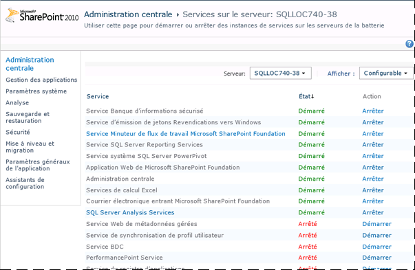
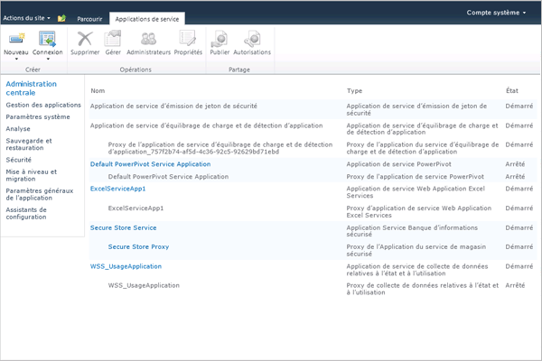
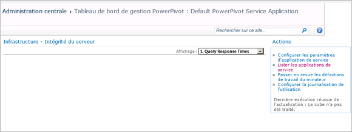

# <a name="configure-power-pivot-health-rules"></a>Configurer des règles d’intégrité PowerPivot
[!INCLUDE[ssas-appliesto-sqlas](../../includes/ssas-appliesto-sqlas.md)]
[!INCLUDE[ssGemini_md](../../includes/ssgemini-md.md)] pour SharePoint inclut des règles d’intégrité SharePoint qui vous aident à analyser et à résoudre les problèmes de disponibilité et de configuration du serveur. Les règles d’intégrité qui s’appliquent à [!INCLUDE[ssGemini_md](../../includes/ssgemini-md.md)] pour SharePoint apparaissent dans la page Vérifier les définitions de règles.  
  
 Les règles d'intégrité permettent la détection anticipée des problèmes de serveur susceptibles de provoquer des interruptions de service. [!INCLUDE[ssGemini_md](../../includes/ssgemini-md.md)] pour SharePoint fournit plusieurs règles pour vous aider à identifier et résoudre les problèmes avant qu’ils ne touchent vos utilisateurs. Vous pouvez personnaliser beaucoup de ces règles pour les adapter aux besoins uniques de votre déploiement. Par exemple, si vous souhaitez disposer de plus de temps pour traiter les avertissements relatifs à l'espace disque, vous pouvez augmenter le pourcentage d'espace disque disponible de 5 % à 10 % afin de recevoir l'avertissement plus tôt.  
  
 Les règles qui peuvent être personnalisées sont celles qui surveillent la consommation des ressources ou la disponibilité du serveur. La personnalisation est utile dans ce cas parce que la capacité du système sous-jacent varie fortement selon les topologies de serveur et de déploiement. Par opposition, aucune personnalisation n'est possible pour les règles qui identifient la configuration du serveur ou les problèmes de sécurité. Ces règles doivent être appliquée uniformément sur toutes les installations.  
  
||  
|-|  
|**[!INCLUDE[applies](../../includes/applies-md.md)]**  SharePoint 2013 &#124; SharePoint 2010|  
  
 **Remarque :** les paramètres des règles d’intégrité sont configurés séparément pour l’instance de SQL Server Analysis Services et l’application de service [!INCLUDE[ssGemini_md](../../includes/ssgemini-md.md)] . Suivez les instructions de cette rubrique pour configurer des règles d'intégrité pour chaque service. Pour un déploiement SharePoint 2013, [!INCLUDE[ssGeminiShort](../../includes/ssgeminishort-md.md)] utilise uniquement l'application de service. Par conséquent, [!INCLUDE[ssGeminiShort](../../includes/ssgeminishort-md.md)] installe différents jeux de règles d'intégrité pour différentes versions de SharePoint. Consultez la colonne « Version » de la rubrique [Informations de référence sur les règles d’intégrité &#40;Power Pivot pour SharePoint&#41;](../../analysis-services/power-pivot-sharepoint/health-rules-reference-power-pivot-for-sharepoint.md), ou exécutez la commande Windows PowerShell suivante pour voir les règles installées.  
  
```  
Get-SPHealthAnalysisRule | select name, enabled, summary | where {$_.summary -like “*power*”}  | format-table -property * -autosize | out-default  
```  
  
 **Dans cette rubrique :**  
  
 [Afficher les règles d’intégrité PowerPivot](#bkmk_view)  
  
 [Configurer les règles d'intégrité utilisées pour évaluer la stabilité du serveur (SQL Server Analysis Services)](#bkmk_HR_SSAS)  
  
 [Configurer les règles d’intégrité utilisées pour évaluer la stabilité de l’application (Application de service PowerPivot)](#bkmk_evaluate_application_stability)  
  
## <a name="prerequisites"></a>Configuration requise  
 Vous devez être administrateur d’application de service pour modifier les propriétés de configuration de l’instance d’Analysis Services et de l’application de service [!INCLUDE[ssGemini_md](../../includes/ssgemini-md.md)] .  
  
##  <a name="bkmk_view"></a> Afficher les règles d’intégrité PowerPivot  
  
1.  Dans l'Administration centrale de SharePoint, cliquez sur **Analyse**, puis dans la section **Analyseur d’intégrité** , cliquez sur **Vérifier les définitions de règles**.  
  
2.  Dans la section Configuration, recherchez les règles qui ont le préfixe **[!INCLUDE[ssGemini_md](../../includes/ssgemini-md.md)]:** . Toutes les règles d’intégrité liées à [!INCLUDE[ssGemini_md](../../includes/ssgemini-md.md)]ont ce préfixe, pour vous aider à les distinguer des règles SharePoint intégrées.  
  
 Ces règles s'afficheront dans la page **Examiner les problèmes et solutions** lorsque des problèmes sont détectés.  
  
 Si vous soupçonnez un problème et souhaitez vérifier cela immédiatement, vous pouvez exécuter manuellement une vérification de la règle pour déterminer si un problème existe.  
  
 Pour ce faire, cliquez sur la règle pour ouvrir sa définition, puis cliquez sur **Exécuter maintenant** dans le ruban. Cliquez sur **Fermer** pour revenir à la page **Examiner les problèmes et solutions** et afficher le rapport. Si la règle a détecté un problème, un avertissement ou une erreur sera signalé sur la page. Dans certains cas, l'affichage de l'erreur ou de l'avertissement peut prendre quelques minutes.  
  
##  <a name="bkmk_HR_SSAS"></a> Configurer les règles d'intégrité utilisées pour évaluer la stabilité du serveur (SQL Server Analysis Services)  
 L'instance d'Analysis Services inclut des règles d'intégrité qui détectent des problèmes au niveau du système (UC, mémoire et espace disque utilisé pour la mise en cache). Utilisez les instructions suivantes pour modifier les seuils qui déclenchent des règles d'intégrité spécifiques.  
  
1.  Dans l'Administration centrale de SharePoint, cliquez sur **Gérer les services sur le serveur** dans la section **Paramètres système**.  
  
2.  En haut de la page, sélectionnez le serveur dans votre batterie de serveurs SharePoint dotée d'une instance d'Analysis Services (dans l'illustration suivante, le nom du serveur est AW-SRV033). **SQL Server Analysis Services** apparaît dans la liste des services.  
  
       
  
3.  Cliquez sur **SQL Server Analysis Services**.  
  
4.  Dans les pages de propriétés du service, dans Paramètres de règle d'intégrité, modifiez les paramètres suivants :  
  
     Allocation de ressources processeur insuffisante (la valeur par défaut est 80 %)  
     Cette règle d'intégrité est déclenchée si les ressources processeur utilisées par le processus serveur d'Analysis Services (msmdsrv.exe) sont supérieures ou égales à 80 % pendant une période de 4 heures (comme spécifié par le paramètre Intervalle de collecte des données).  
  
     Ce paramètre de configuration correspond à la définition de règle suivante sur la page **Examiner les problèmes et solutions** : **[!INCLUDE[ssGemini_md](../../includes/ssgemini-md.md)]: Analysis Services ne dispose pas de suffisamment de ressources processeur pour effectuer les opérations demandées.**  
  
     Ressources processeur insuffisantes sur le système (la valeur par défaut est 90 %)  
     Cette règle d'intégrité est déclenchée si les ressources processeur pour le serveur sont inférieures ou égales à 90 % pendant une période de 4 heures (comme spécifié via le paramètre Intervalle de collecte des données). L'utilisation générale de l'UC est mesurée dans le cadre de l'algorithme d'équilibrage de charge basé sur l'intégrité qui surveille l'utilisation de l'UC pour mesurer l'intégrité du serveur.  
  
     Ce paramètre de configuration correspond à la définition de règle suivante sur la page **Examiner les problèmes et solutions** : **[!INCLUDE[ssGemini_md](../../includes/ssgemini-md.md)]: l’utilisation globale du processeur est trop élevée.**  
  
     Seuil de mémoire insuffisante (la valeur par défaut est 5 %)  
     Sur un serveur d'applications SharePoint, une instance de SQL Server Analysis Services doit toujours avoir une quantité minimale de mémoire en réserve, toujours inutilisée. Étant donné que le fonctionnement du serveur est lié à la mémoire pour la plupart de ses opérations, celui-ci s'exécute mieux s'il n'atteint pas complètement la limite supérieure. Les 5 % de mémoire inutilisée sont calculés sous forme de pourcentage de la mémoire allouée à Analysis Services. Par exemple, si vous avez 200 Go de mémoire totale et qu'Analysis Services en utilise 80 % (soit 160 Go), les 5 % de mémoire inutilisée correspondent à 5 % de 160 Go (soit 8 Go).  
  
     Ce paramètre de configuration correspond à la définition de règle suivante sur la page **Examiner les problèmes et solutions** : **[!INCLUDE[ssGemini_md](../../includes/ssgemini-md.md)]: Analysis Services ne dispose pas de suffisamment de mémoire pour effectuer les opérations demandées.**  
  
     Nombre maximal de connexions (la valeur par défaut est 100)  
     Cette règle d'intégrité est déclenchée si le nombre de connexions à l'instance d'Analysis Services est supérieur ou égal à 100 connexions pendant une période de 4 heures (comme spécifié via le paramètre Intervalle de collecte des données). Cette valeur par défaut est arbitraire (elle n'est pas basée sur les spécifications matérielles de votre serveur ou sur l'activité des utilisateurs), vous pouvez donc augmenter ou diminuer la valeur en fonction de la capacité du serveur et de l'activité des utilisateurs dans votre environnement.  
  
     Ce paramètre de configuration correspond à la définition de règle suivante sur la page **Examiner les problèmes et solutions** : **[!INCLUDE[ssGemini_md](../../includes/ssgemini-md.md)]: le nombre élevé de connexions indique que davantage de serveurs devraient être déployés afin de pouvoir gérer la charge actuelle.**  
  
     Espace disque insuffisant (la valeur par défaut est 5 %)  
     L’espace disque est utilisé pour mettre en cache les données [!INCLUDE[ssGemini_md](../../includes/ssgemini-md.md)] chaque fois qu’une base de données fait l’objet d’une demande. Cette règle vous permet de savoir quand l'espace disque est trop faible. Par défaut, cette règle d'intégrité est déclenchée lorsque l'espace disque est inférieur à 5 % sur le lecteur de disque où se trouve le dossier de sauvegarde. Pour plus d’informations sur l’utilisation des disques, consultez [Configurer l’utilisation de l’espace disque &#40;PowerPivot pour SharePoint&#41;](../../analysis-services/power-pivot-sharepoint/configure-disk-space-usage-power-pivot-for-sharepoint.md).  
  
     Ce paramètre de configuration correspond à la définition de règle suivante sur la page **Examiner les problèmes et solutions** : **[!INCLUDE[ssGemini_md](../../includes/ssgemini-md.md)]: il n’y a presque plus d’espace disponible sur le lecteur sur lequel se trouvent les données [!INCLUDE[ssGemini_md](../../includes/ssgemini-md.md)] mises en cache.**  
  
     Intervalle de collecte des données (en heures)  
     Vous pouvez spécifier la période de collecte de données prise en compte pour calculer les valeurs utilisées pour déclencher des règles d'intégrité. Bien que le système soit surveillé en permanence, les seuils utilisés pour déclencher des avertissements de règle d'intégrité sont calculés à l'aide de données qui ont été générées pendant un intervalle prédéfini. L'intervalle par défaut est de 4 heures. Le serveur récupère les données système et d'utilisation collectées au cours des 4 heures précédentes pour évaluer le nombre de connexions utilisateur, l'utilisation de l'espace disque et les taux d'utilisation de l'UC et de la mémoire.  
  
##  <a name="bkmk_evaluate_application_stability"></a> Configurer les règles d’intégrité utilisées pour évaluer la stabilité de l’application (Application de service PowerPivot)  
  
1.  Dans l'Administration centrale, sous Gestion des applications, cliquez sur **Gérer les applications de service**.  
  
2.  Dans la page Applications de service, cliquez sur **Application de service [!INCLUDE[ssGemini_md](../../includes/ssgemini-md.md)] par défaut**.  
  
       
  
3.  Le Tableau de bord de gestion [!INCLUDE[ssGemini_md](../../includes/ssgemini-md.md)] apparaît. Cliquez sur **Configurer les paramètres d'application de service** dans la liste **Actions** pour ouvrir la page des paramètres d'application de service.  
  
       
  
4.  Dans les paramètres de la règle d'intégrité modifiez les paramètres suivants :  
  
     Rapport chargements/connexions (la valeur par défaut est 20 %)  
     Cette règle d'intégrité est déclenchée si le nombre d'événements de chargement est élevé par rapport au nombre d'événements de connexion, et signale que le serveur est peut-être en train de décharger trop rapidement des bases de données, ou que les paramètres de réduction du cache sont trop stricts.  
  
     Ce paramètre de configuration correspond à la définition de règle suivante sur la page **Examiner les problèmes et solutions** : **[!INCLUDE[ssGemini_md](../../includes/ssgemini-md.md)]: le taux d’événements de chargement par rapport aux connexions est trop élevé.**  
  
     Intervalle de collecte des données (la valeur par défaut est 4 heures)  
     Vous pouvez spécifier la période de collecte de données prise en compte pour calculer les valeurs utilisées pour déclencher des règles d'intégrité. Bien que le système soit surveillé en permanence, les seuils utilisés pour déclencher des avertissements de règle d'intégrité sont calculés à l'aide de données qui ont été générées pendant un intervalle prédéfini. L'intervalle par défaut est de 4 heures. Le serveur récupère les données système et d'utilisation collectées au cours des 4 heures précédentes pour évaluer le rapport chargement/connexion.  
  
     Rechercher les mises à jour du fichier [!INCLUDE[ssGemini_md](../../includes/ssgemini-md.md)] Management Dashboard.xlsx (la valeur par défaut est 5 jours)  
     Le fichier [!INCLUDE[ssGemini_md](../../includes/ssgemini-md.md)] Management Dashboard.xlsx est une source de données utilisée par les rapports du Tableau de bord de gestion [!INCLUDE[ssGemini_md](../../includes/ssgemini-md.md)] . Dans une configuration de serveur par défaut, ce fichier .xlsx est actualisé quotidiennement, à l’aide des données d’utilisation collectées par SharePoint et le service système [!INCLUDE[ssGemini_md](../../includes/ssgemini-md.md)] . Si le fichier n'est pas mis à jour, une règle d'intégrité le signale comme un problème. Par défaut, la règle est déclenchée si l'horodateur du fichier n'a pas changé pendant 5 jours.  
  
     Pour plus d’informations sur la collecte des données d’utilisation, consultez [Configurer la collecte des données d’utilisation &#40;PowerPivot pour SharePoint)](../../analysis-services/power-pivot-sharepoint/configure-usage-data-collection-for-power-pivot-for-sharepoint.md).  
  
     Ce paramètre de configuration correspond à la définition de règle suivante sur la page **Examiner les problèmes et solutions** : **[!INCLUDE[ssGemini_md](../../includes/ssgemini-md.md)]: les données d’utilisation ne sont pas mises à jour à la fréquence prévue.**  
  
## <a name="see-also"></a>Voir aussi  
 [Configurer l’utilisation de l’espace disque &#40;PowerPivot pour SharePoint&#41;](../../analysis-services/power-pivot-sharepoint/configure-disk-space-usage-power-pivot-for-sharepoint.md)   
 [Tableau de bord de gestion Power Pivot et données d’utilisation](../../analysis-services/power-pivot-sharepoint/power-pivot-management-dashboard-and-usage-data.md)  
  
  
