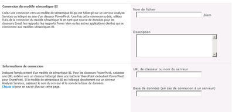

# Créer une connexion du modèle sémantique BI à un classeur PowerPivot
[!INCLUDE[ssas-appliesto-sqlas](../../includes/ssas-appliesto-sqlas.md)]
  Utilisez les informations de cette rubrique pour configurer une connexion du modèle sémantique BI qui redirige vers un classeur [!INCLUDE[ssGemini](../../includes/ssgemini-md.md)] dans la même batterie.  
  
 Après avoir créé une connexion de modèle sémantique BI et configuré les autorisations SharePoint, vous pouvez l'utiliser comme source de données pour les rapports Excel ou [!INCLUDE[ssCrescent](../../includes/sscrescent-md.md)] .  
  
 Cette rubrique comprend les sections suivantes. Effectuez chaque tâche dans l'ordre indiqué.  
  
 [Examiner la configuration requise](#bkmk_prereq)  
  
 [Créer une connexion](#bkmk_create)  
  
 [Configurer les autorisations SharePoint sur la connexion de modèle sémantique BI](#bkmk_permissions)  
  
 [Configurer les autorisations SharePoint sur le classeur](#bkmk_userdb)  
  
 [Étapes suivantes](#bkmk_next)  
  
##   Examiner la configuration requise  
 Vous devez disposer d'autorisations Collaboration ou supérieures pour créer un fichier de connexion de modèle sémantique BI.  
  
 Vous devez disposer d'une bibliothèque qui prend en charge le type de contenu Connexion de modèle sémantique BI. Pour plus d’informations, consultez [Ajouter un type de contenu de connexion du modèle sémantique BI à une bibliothèque &#40;Power Pivot pour SharePoint&#41;](../../analysis-services/power-pivot-sharepoint/add-bi-semantic-model-connection-content-type-to-library.md).  
  
 Vous devez connaître l’URL de la [!INCLUDE[ssGemini](../../includes/ssgemini-md.md)] classeur pour lequel vous configurez une connexion de modèle sémantique BI (par exemple, `http://adventure-works/shared documents/myworkbook.xlsx`). Le classeur doit figurer dans la même batterie de serveurs.  
  
 Tous les ordinateurs et utilisateurs qui participent à la séquence de connexion doivent être dans le même domaine ou dans un domaine approuvé (approbation bidirectionnelle).  
  
##   Créer une connexion  
  
1.  Dans la bibliothèque qui contiendra la connexion de modèle sémantique BI, cliquez sur **Documents** sur le ruban SharePoint. Cliquez sur la flèche de déroulement de Nouveau document, puis sélectionnez **Fichier de connexion BISM** pour ouvrir la page Nouvelle connexion de modèle sémantique BI.  
  
       
  
2.  Définissez la propriété **Server** sur l’URL SharePoint du classeur [!INCLUDE[ssGemini](../../includes/ssgemini-md.md)] (par exemple, `http://mysharepoint/shared documents/myWorkbook.xlsx`. Dans un déploiement [!INCLUDE[ssGemini](../../includes/ssgemini-md.md)] pour SharePoint, les données peuvent être chargées sur tout serveur de la batterie. Pour cette raison, les connexions de la source de données aux données [!INCLUDE[ssGemini](../../includes/ssgemini-md.md)] spécifient uniquement le chemin d’accès au classeur. Le service système [!INCLUDE[ssGemini](../../includes/ssgemini-md.md)] détermine quel serveur charge les données.  
  
     N’employez pas la propriété **Database** . Elle n’est pas utilisée lors de la spécification de l’emplacement d’un classeur [!INCLUDE[ssGemini](../../includes/ssgemini-md.md)] .  
  
     Votre page doit ressembler à l'illustration suivante.  
  
       
  
     Éventuellement, si vous disposez d'autorisations SharePoint sur le classeur, une étape supplémentaire de validation est effectuée pour s'assurer que l'emplacement est valide. Si vous n'êtes pas autorisé à accéder aux données, vous avez la possibilité d'enregistrer la connexion de modèle sémantique BI sans la réponse de validation.  
  
##   Configurer les autorisations SharePoint sur la connexion de modèle sémantique BI  
 La possibilité d'utiliser une connexion de modèle sémantique BI comme source de données pour un classeur Excel ou un rapport Reporting Services requiert des autorisations de **Lecture** sur l'élément de connexion de modèle sémantique BI dans une bibliothèque SharePoint. Le niveau d'autorisation Lecture inclut l'autorisation **Ouvrir les éléments** qui permet le téléchargement des informations de connexion de modèle sémantique BI vers une application bureautique Excel.  
  
 Il existe plusieurs manières d'accorder des autorisations dans SharePoint. L’instruction suivante explique comment créer un groupe appelé **Utilisateurs BISM** qui dispose du niveau d’autorisation **Read** .  
  
 Vous devez être le propriétaire du site pour modifier des autorisations.  
  
1.  Dans Actions du site, cliquez sur **Autorisations de site**.  
  
2.  Cliquez sur **Créer un groupe** et nommez le nouveau groupe **Utilisateurs BISM**.  
  
3.  Choisissez le niveau d'autorisation **Lecture** et cliquez sur **Créer**.  
  
4.  Sélectionnez **Utilisateurs BISM** dans Personnes et groupes.  
  
5.  Pointez sur Nouveau, cliquez sur **Ajouter des utilisateurs**, puis ajoutez des comptes d'utilisateur ou de groupe.  
  
     Ces utilisateurs et groupes bénéficient maintenant d'autorisations de lecture sur l'ensemble du site, notamment les bibliothèques et listes qui héritent des autorisations au niveau du site. Si ces autorisations sont trop élevées, vous pouvez sélectivement supprimer ce groupe de bibliothèques, de listes ou d'éléments spécifiques.  
  
 Pour supprimer sélectivement des autorisations au niveau de l'élément, procédez comme suit :  
  
1.  Dans une bibliothèque, sélectionnez un document. Cliquez sur la flèche vers le bas, puis sur **Gérer les autorisations**.  
  
2.  Par défaut, un élément hérite des autorisations. Pour modifier les autorisations de documents individuels dans cette bibliothèque, cliquez sur **Arrêter l’héritage des autorisations**.  
  
3.  Cochez la case en regard d’ **Utilisateurs BISM**.  
  
4.  Cliquez sur **Supprimer les autorisations des utilisateurs**.  
  
##   Configurer les autorisations SharePoint sur le classeur  
 Si vous utilisez une base de données [!INCLUDE[ssGemini](../../includes/ssgemini-md.md)] dans un classeur Excel, les autorisations SharePoint sur le classeur Excel déterminent l’accès aux données par l’intermédiaire de la connexion du modèle sémantique BI. Tous les utilisateurs qui accèdent au classeur doivent disposer d'autorisations de lecture sur le classeur pour pouvoir l'utiliser comme source de données externe.  
  
 Si vous avez créé un groupe **Utilisateurs BISM** à l’aide des instructions de la section précédente, les comptes d’utilisateur et de groupe qui sont membres d’ **Utilisateurs BISM** disposent des autorisations requises sur le classeur ainsi que sur le fichier de connexion du modèle sémantique BI, en supposant que le classeur utilise des autorisations héritées.  
  
##   Étapes suivantes  
 Après avoir créé et sécurisé une connexion de modèle sémantique BI, vous pouvez la spécifier en tant que source de données. Pour plus d’informations, consultez [Utiliser une connexion de modèle sémantique BI dans Excel ou Reporting Services](../../analysis-services/power-pivot-sharepoint/use-a-bi-semantic-model-connection-in-excel-or-reporting-services.md).  
  
## Voir aussi  
 [Connexion de modèle sémantique BI Power Pivot &#40;.bism&#41;](../../analysis-services/power-pivot-sharepoint/power-pivot-bi-semantic-model-connection-bism.md)   
 [Utiliser une connexion de modèle sémantique BI dans Excel ou Reporting Services](../../analysis-services/power-pivot-sharepoint/use-a-bi-semantic-model-connection-in-excel-or-reporting-services.md)   
 [Créer une connexion de modèle sémantique BI à une base de données model tabulaire](../../analysis-services/power-pivot-sharepoint/create-a-bi-semantic-model-connection-to-a-tabular-model-database.md)  
  
  
