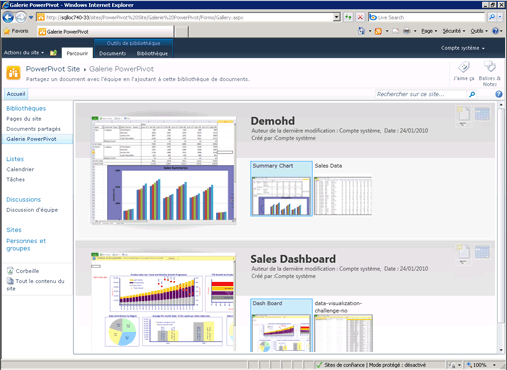

# Create and Customize Power Pivot Gallery
[!INCLUDE[ssas-appliesto-sqlas](../../includes/ssas-appliesto-sqlas.md)]
  [!INCLUDE[ssGemini](../../includes/ssgemini-md.md)] est un type de bibliothèque de documents SharePoint qui fournit des fonctions d’aperçu et de gestion des documents pour les classeurs Excel publiés et les rapports Reporting Services contenant des données [!INCLUDE[ssGemini](../../includes/ssgemini-md.md)] .  
  
##   Dans cette rubrique  
  
-   [Configuration requise](#prereq)  
  
-   [Vue d'ensemble](#overview)  
  
-   [Créer la Galerie PowerPivot](#createlib)  
  
-   [Personnaliser une bibliothèque Galerie PowerPivot](#customize)  
  
-   [Désactiver ou masquer le bouton Actualiser](#bkmk_hide_refresh_button)  
  
-   [Passer à la vue Galerie ou Théâtre](#switch)  
  
##   Configuration requise  
  
-   Vous devez disposer de Silverlight. Silverlight peut être téléchargé et installé via Microsoft Update. Si vous affichez une bibliothèque Galerie [!INCLUDE[ssGemini](../../includes/ssgemini-md.md)] à l'aide d'un navigateur qui ne dispose pas de Silverlight, cliquez sur le lien dans la page pour l'installer. Vous devez fermer le navigateur puis le rouvrir une fois que vous avez installé Silverlight.  
  
    > [!NOTE]  
    >  La Galerie PowerPivot requiert Microsoft Silverlight.  Le navigateur Microsoft Edge ne prend pas en charge Silverlight.   
    > Pour afficher le contenu de la bibliothèque dans Edge, cliquez sur l’onglet **Bibliothèque** dans la Galerie PowerPivot, puis définissez l’affichage de la bibliothèque de documents sur **Tous les documents**.    
    > Pour modifier l’affichage par défaut, cliquez sur l’onglet **Bibliothèque** , puis sur Modifier l’affichage. Cliquez sur Définir cet affichage comme affichage par défaut, puis sur OK pour enregistrer l’affichage par défaut.  
    >  Pour plus d’informations sur les composants pris en charge par Edge, consultez le billet du blog Windows intitulé [A break from the past, part 2: Saying goodbye to ActiveX, VBScript...](https://blogs.windows.com/msedgedev/2015/05/06/a-break-from-the-past-part-2-saying-goodbye-to-activex-vbscript-attachevent/)  
  
-   Vous devez être propriétaire de site pour créer une bibliothèque.  
  
-   Vous devez disposer d'autorisations Collaboration ou supérieures pour publier ou télécharger un fichier.  
  
-   [!INCLUDE[ssGemini](../../includes/ssgemini-md.md)] ne doit pas être située dans un site sensible. Le site parent qui contient la Galerie [!INCLUDE[ssGemini](../../includes/ssgemini-md.md)] doit être ajouté dans la zone sites de confiance ou Intranet local.  
  
-   La solution d’application web [!INCLUDE[ssGemini](../../includes/ssgemini-md.md)] doit être déployée pour votre application et la fonctionnalité [!INCLUDE[ssGemini](../../includes/ssgemini-md.md)] doit être activée pour la collection de sites. Pour plus d’informations, consultez [Deploy Power Pivot Solutions to SharePoint](../../analysis-services/power-pivot-sharepoint/deploy-power-pivot-solutions-to-sharepoint.md) et[Activate Power Pivot Feature Integration for Site Collections in Central Administration](../../analysis-services/power-pivot-sharepoint/activate-power-pivot-integration-for-site-collections-in-ca.md).  
  
-   Pour être en mesure d'afficher ou de créer un rapport Reporting Services basé sur un classeur [!INCLUDE[ssGemini](../../includes/ssgemini-md.md)] , vous devez installer le classeur et le rapport dans la même bibliothèque Galerie [!INCLUDE[ssGemini](../../includes/ssgemini-md.md)] . Le rapport doit utiliser un classeur [!INCLUDE[ssGemini](../../includes/ssgemini-md.md)] qui contient des données incorporées ou le classeur doit contenir au plus une source de données externe qui est un classeur [!INCLUDE[ssGemini](../../includes/ssgemini-md.md)] .  
  
##   Vue d'ensemble  
 [!INCLUDE[ssGemini](../../includes/ssgemini-md.md)] est un modèle de bibliothèque disponible lorsque vous installez [!INCLUDE[ssGeminiLong](../../includes/ssgeminilong-md.md)] sur un serveur SharePoint. La Galerie [!INCLUDE[ssGemini](../../includes/ssgemini-md.md)] combine un aperçu exact du contenu du fichier avec les informations relatives à l'origine du document. Vous pouvez voir immédiatement qui a créé le document et quand il a été modifié pour la dernière fois. Pour créer des images d’aperçu, la Galerie [!INCLUDE[ssGemini](../../includes/ssgemini-md.md)] utilise un service d’instantanés capable de lire les classeurs [!INCLUDE[ssGemini](../../includes/ssgemini-md.md)] et les rapports Reporting Services qui contiennent des données [!INCLUDE[ssGemini](../../includes/ssgemini-md.md)] . Si vous publiez un fichier que le service d'instantanés ne peut pas lire, aucune image d'aperçu n'est disponible pour ce fichier.  
  
 Les images d'aperçu reposent sur la façon dont le classeur est restitué par Excel Services. La représentation dans la Galerie [!INCLUDE[ssGemini](../../includes/ssgemini-md.md)] doit être identique à celle que vous voyez quand vous affichez un classeur [!INCLUDE[ssGemini](../../includes/ssgemini-md.md)] dans un navigateur. L'aperçu a cependant une surface d'exposition limitée. Les parties d'un classeur ou rapport peuvent être réduites de façon à s'ajuster à l'espace disponible. Vous devrez peut-être ouvrir un classeur ou un rapport pour visualiser le document dans son intégralité.  
  
 L'actualisation des données de classeurs [!INCLUDE[ssGemini](../../includes/ssgemini-md.md)] à partir de sources de données externes est pleinement prise en charge dans la Galerie [!INCLUDE[ssGemini](../../includes/ssgemini-md.md)] , mais requiert une configuration supplémentaire. Un administrateur de batterie ou de service doit ajouter la Galerie [!INCLUDE[ssGemini](../../includes/ssgemini-md.md)] en tant qu'emplacement approuvé Excel Services. Pour plus d’informations, voir [Créer un emplacement approuvé pour les sites Power Pivot dans l’Administration centrale](../../analysis-services/power-pivot-sharepoint/create-a-trusted-location-for-power-pivot-sites-in-central-administration.md).  
  
##   Créer la Galerie PowerPivot  
 [!INCLUDE[ssGemini](../../includes/ssgemini-md.md)] est créée automatiquement lorsque vous installez [!INCLUDE[ssGeminiLong](../../includes/ssgeminilong-md.md)] à l'aide de l'option d'installation Nouveau serveur. Si vous avez ajouté [!INCLUDE[ssGeminiShort](../../includes/ssgeminishort-md.md)] à une batterie de serveurs existante ou si vous voulez disposer d'une bibliothèque supplémentaire, vous pouvez en créer une pour votre application ou votre site.  
  
1.  1.  **SharePoint 2010**: cliquez sur **Actions du site** dans l'angle supérieur gauche de la page d'accueil de votre site.  
  
    2.  Cliquez sur **Autres options**.  
  
    3.  Sous Bibliothèques, cliquez sur **Galerie [!INCLUDE[ssGemini](../../includes/ssgemini-md.md)]**.  
  
    1.  **SharePoint 2013**: cliquez sur l’icône paramètres . Cliquez sur **Contenu du site**.  
  
    2.  Cliquez sur **Ajouter une application**.  
  
    3.  Cliquez sur **Galerie [!INCLUDE[ssGemini](../../includes/ssgemini-md.md)]**.  
  
2.  Tapez le nom de la bibliothèque. Veillez à inclure des informations descriptives qui permettent aux utilisateurs d’identifier cette bibliothèque en tant qu’aperçu complet pour les classeurs [!INCLUDE[ssGemini](../../includes/ssgemini-md.md)] et les rapports Reporting Services.  
  
3.  Cliquez sur **Créer**.  
  
4.  Demandez à un administrateur de service ou de batterie de serveurs d'ajouter la Galerie [!INCLUDE[ssGemini](../../includes/ssgemini-md.md)] comme emplacement approuvé pour Excel Services. Cette étape est nécessaire pour éviter des erreurs si un utilisateur configure un classeur pour l'actualisation des données [!INCLUDE[ssGemini](../../includes/ssgemini-md.md)] . Pour plus d’informations sur cette tâche, consultez [Créer un emplacement approuvé pour les sites Power Pivot dans l’Administration centrale](../../analysis-services/power-pivot-sharepoint/create-a-trusted-location-for-power-pivot-sites-in-central-administration.md).  
  
 Un lien vers la bibliothèque [!INCLUDE[ssGemini](../../includes/ssgemini-md.md)] s'affiche dans le volet de navigation Lancement rapide du site actuel.  
  
 Vous pouvez créer des bibliothèques [!INCLUDE[ssGemini](../../includes/ssgemini-md.md)] supplémentaires si vous appliquez des autorisations différentes pour des collections de sites ou des sites individuels.  
  
##   Personnaliser une bibliothèque Galerie PowerPivot  
 [!INCLUDE[ssGemini](../../includes/ssgemini-md.md)] est une bibliothèque de documents SharePoint. Par conséquent, vous pouvez utiliser les outils de bibliothèque standard de SharePoint pour modifier les paramètres de la bibliothèque ou pour manipuler les documents de la bibliothèque. Vous pouvez personnaliser indépendamment chaque bibliothèque que vous créez afin qu'elle utilise des paramètres de bibliothèque ou de vue spécifiques.  
  
 Il est possible de modifier l'ordre de tri et les filtres afin que les classeurs s'affichent différemment dans la liste. Par défaut, les documents apparaissent dans l'ordre dans lequel ils ont été ajoutés (le dernier document publié s'affiche au bas de la liste). Une fois qu'un document a été publié, son emplacement dans la liste ne change pas. Si un document est mis à jour ou publié de nouveau, son emplacement dans la liste est mis à jour.  
  
 Vous ne pouvez pas activer ou désactiver l'aperçu pour des documents spécifiques. Le service d’instantanés générera des images d’aperçu pour tous les classeurs [!INCLUDE[ssGemini](../../includes/ssgemini-md.md)] et pour les rapports Reporting Services basés sur les classeurs [!INCLUDE[ssGemini](../../includes/ssgemini-md.md)] stockés dans la même bibliothèque. Ces images peuvent être affichées par tous les utilisateurs qui disposent d'autorisations d'affichage sur le document.  
  
 Vous ne pouvez pas étendre la Galerie [!INCLUDE[ssGemini](../../includes/ssgemini-md.md)] de sorte qu'elle fournisse un aperçu pour d'autres types de document. L'aperçu est pris en charge uniquement pour les classeurs Excel 2010 ou les rapports SQL Server 2008 R2 Reporting Services contenant des données [!INCLUDE[ssGemini](../../includes/ssgemini-md.md)] .  
  
 Vous ne pouvez pas modifier les paramètres qui contrôlent les informations d'origine des documents. Les informations fournies sur les documents, telles que l'auteur de l'ajout ou de la dernière modification du classeur, sont déterminées par un ensemble fixe de colonnes qu'il est impossible de modifier.  
  
#### Modifier l'ordre de tri, ajouter des filtres ou limiter le nombre de documents  
 [!INCLUDE[ssGemini](../../includes/ssgemini-md.md)] affiche toujours les valeurs « Dernière modification » et « Créé par ». Vous ne pouvez pas désactiver ces colonnes. Vous ne pouvez pas activer d'autres colonnes pour la bibliothèque. Utilisez les instructions suivantes pour modifier l'ordre de tri, ajouter un filtre ou limiter le nombre de documents visibles.  
  
1.  Dans un site SharePoint, ouvrez la Galerie [!INCLUDE[ssGemini](../../includes/ssgemini-md.md)] .  
  
2.  Dans le ruban, cliquez sur **Bibliothèque**.  
  
3.  **SharePoint 2010 :** dans Affichages personnalisés, cliquez sur **Modifier cet affichage**.  
  
     **SharePoint 2013 :** dans **Gérer les affichages**, cliquez sur **Modifier cet affichage**.  
  
4.  Dans Tri, spécifiez les critères à utiliser pour déterminer le mode d'affichage des classeurs dans la liste. Par défaut, les documents apparaissent dans l'ordre dans lequel ils ont été ajoutés.  
  
5.  Dans Filtre, spécifiez les critères à utiliser pour afficher ou masquer les classeurs en fonction des valeurs conditionnelles définies sur les colonnes. Par exemple, vous pouvez masquer tous les classeurs créés avant une date donnée.  
  
6.  Dans Limitation des éléments, spécifiez des options utiles pour les bibliothèques de la bibliothèque [!INCLUDE[ssGemini](../../includes/ssgemini-md.md)] contenant un très grand nombre de documents. Vous pouvez limiter le nombre réel d'éléments qui apparaissent dans la liste, ou afficher les éléments par groupes.  
  
7.  Cliquez sur **OK** pour enregistrer vos modifications.  
  
####   Désactiver ou masquer le bouton Actualiser  
 Vous ne pouvez pas masquer le bouton **Gérer l'actualisation des données** . Toutefois, le bouton est désactivé si l'utilisateur ne dispose pas d'autorisations suffisantes.  
  
   
  
 Les propriétaires ou auteurs de classeurs doivent avoir l'autorisation **Collaboration** pour planifier des actualisation de données sur un classeur. Les utilisateurs disposant d'autorisations Collaboration peuvent ouvrir et modifier la page de configuration de l'actualisation des données pour spécifier les informations d'identification et de planification utilisées pour actualiser les données.  
  
 Ainsi, les utilisateurs qui disposent uniquement des niveaux d'autorisation **Affichage** ou **Lecture** ne pourront pas accéder au bouton Actualiser. Le bouton Actualiser est visible mais est désactivé. Pour plus d'informations, consultez [Autorisations utilisateur et niveaux d'autorisation dans SharePoint 2013](http://technet.microsoft.com/library/cc721640.aspx).  
  
##   Passer à la vue Galerie ou Théâtre  
 L'aperçu varie selon la façon dont vous configurez la vue pour la bibliothèque. Avec la vue Galerie, vous pouvez placer le pointeur de la souris sur une feuille de calcul spécifique dans le classeur pour placer le focus sur cette feuille dans la zone d'aperçu.  
  
   
  
 Le tableau suivant décrit les différentes mises en page pour la présentation des croquis miniatures de chaque page affichée en aperçu :  
  
|Affichage| Description|  
|----------|-----------------|  
|Vue Galerie (valeur par défaut)|Galerie constitue la vue par défaut pour une Galerie [!INCLUDE[ssGemini](../../includes/ssgemini-md.md)] . L'aperçu s'affiche à gauche. Des miniatures plus petites de chaque feuille de calcul s'affichent en regard de celui-ci, en ordre séquentiel de gauche à droite.|  
|Tous les documents|Il s'agit de la mise en page standard pour les bibliothèques de documents. Vous pouvez choisir cette vue pour gérer des documents individuels ou afficher le contenu de bibliothèques sous forme de liste.   Utilisez cette vue pour modifier des propriétés ou pour supprimer ou déplacer des documents.   Si vous avez activé le contrôle de version, vous devez utiliser cette vue pour archiver des documents dans la bibliothèque ou les en extraire.|  
|Vue Théâtre et vue Carrousel|Ces vues spécialisées sont idéales pour exposer un petit nombre de documents connexes. La rotation complète des miniatures inclut toutes les pages de tous les documents de la bibliothèque. Si vous avez un grand nombre de documents, ces vues peuvent être impraticables pour les utilisateurs qui souhaitent trouver ou ouvrir un classeur [!INCLUDE[ssGemini](../../includes/ssgemini-md.md)] spécifique.   Vue Théâtre : la zone d'aperçu est centrée. Des miniatures plus petites de chaque feuille de calcul s'affichent plus bas dans la page, des deux côtés.   Vue Carrousel : la zone d'aperçu est centrée. Les miniatures qui précèdent et suivent immédiatement la miniature actuelle sont adjacentes à la zone d'aperçu.|  
  
### Passer à une vue différente  
  
1.  Dans un site SharePoint, ouvrez la Galerie [!INCLUDE[ssGemini](../../includes/ssgemini-md.md)] .  
  
2.  Dans le ruban, cliquez sur **Bibliothèque**.  
  
3.  Dans Gérer les affichages, sous Affichage actuel, sélectionnez la vue que vous voulez utiliser dans la liste. Les vues prédéfinies sont les suivantes : Galerie, Théâtre et Carrousel. Vous pouvez également choisir Tous les documents si vous souhaitez déplacer, supprimer ou gérer des documents dans la bibliothèque.  
  
## Voir aussi  
 [Dépanner une installation Power Pivot pour SharePoint](../../analysis-services/troubleshoot-a-power-pivot-for-sharepoint-installation.md)   
 [Utilisez la galerie PowerPivot](../../analysis-services/power-pivot-sharepoint/use-power-pivot-gallery.md)   
 [Create a trusted location for Power Pivot sites in Central Administration](../../analysis-services/power-pivot-sharepoint/create-a-trusted-location-for-power-pivot-sites-in-central-administration.md)   
 [Supprimer la galerie PowerPivot](../../analysis-services/power-pivot-sharepoint/delete-power-pivot-gallery.md)  
  
  
