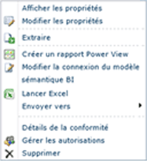
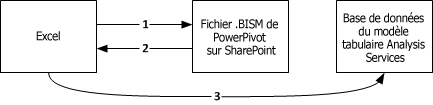
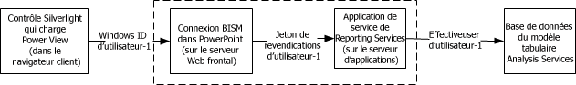

# Connexion de modèle sémantique BI Power Pivot (.bism)
[!INCLUDE[ssas-appliesto-sqlas](../../includes/ssas-appliesto-sqlas.md)]
  Une connexion de modèle sémantique BI (.bism) est une connexion portable qui connecte des rapports Excel ou Power View à une base de données de modèle tabulaire Analysis Services, ou une instance Analysis Services en mode multidimensionnel. Si vous connaissez les fichiers Office Data Connection (.odc), vous remarquerez des similitudes avec la définition et l'utilisation d'une connexion .bism.  
  
 Une connexion de modèle sémantique BI est créée et accessible via SharePoint. La création de connexions de modèles sémantiques BI active les commandes de lancement rapide sur une connexion de modèle sémantique BI dans une bibliothèque. Les commandes de lancement rapide ouvrent un nouveau classeur Excel ou les options de modification du fichier de connexion. Si Reporting Services est installé, vous verrez également une commande permettant de créer un rapport [!INCLUDE[ssCrescent](../../includes/sscrescent-md.md)] .  
  
   
  
##   Bases de données prises en charge  
 Une connexion de modèle sémantique BI pointe sur des données de modèle tabulaire. Il y a trois sources pour ces données :  
  
-   Base de données model tabulaire s'exécutant dans une instance d'Analysis Services autonome en mode serveur tabulaire. Déploiement d'une instance d'Analysis Services autonome extérieure à la batterie. L'accès aux sources de données de la batterie requiert des autorisations supplémentaires, abordées plus loin dans cette rubrique : [Créer une connexion de modèle sémantique BI à une base de données model tabulaire](../../analysis-services/power-pivot-sharepoint/create-a-bi-semantic-model-connection-to-a-tabular-model-database.md).  
  
-   [!INCLUDE[ssGemini](../../includes/ssgemini-md.md)] enregistrés sur SharePoint. Les bases de données [!INCLUDE[ssGemini](../../includes/ssgemini-md.md)] incorporées dans les classeurs Excel sont équivalentes aux bases de données de modèle tabulaire qui s’exécutent sur un serveur Analysis Services autonome en mode tabulaire. Si vous utilisez déjà [!INCLUDE[ssGemini](../../includes/ssgemini-md.md)] pour Excel et [!INCLUDE[ssGemini](../../includes/ssgemini-md.md)] pour SharePoint, vous pouvez définir une connexion de modèle sémantique BI qui pointe sur des classeurs [!INCLUDE[ssGemini](../../includes/ssgemini-md.md)] dans une bibliothèque SharePoint et créer des rapports [!INCLUDE[ssCrescent](../../includes/sscrescent-md.md)] à partir des données [!INCLUDE[ssGemini](../../includes/ssgemini-md.md)] existantes.  Vous pouvez utiliser les classeurs créés dans les versions SQL Server 2008 R2 ou [!INCLUDE[ssSQL11](../../includes/sssql11-md.md)] de [!INCLUDE[ssGemini](../../includes/ssgemini-md.md)] pour Excel.  
  
-   Un modèle de données multidimensionnel sur une instance Analysis Services.  
  
 Pour obtenir une comparaison des sources de données, consultez le contenu de la communauté [Understanding the SQL Server 2012 BI Semantic Model (BISM)](http://www.mssqltips.com/sqlservertip/2818/understanding-the-sql-server-2012-bi-semantic-model-bism/).  
  
## Présentation de la séquence de connexion des connexions sémantiques BI  
 Cette section décrit le comportement de connexion entre différentes applications clientes, telles que l'application bureautique Excel ou le client de création de rapports Power View sur SharePoint, et une base de données model tabulaire à l'intérieur ou à l'extérieur de la batterie de serveurs SharePoint.  
  
 Toutes les connexions à une base de données de modèle tabulaire sont établies à l'aide des informations d'identification de l'utilisateur qui demande les données. Toutefois, les mécanismes de cette connexion varient selon que la connexion est une connexion dans la batterie ou une connexion à simple ou double saut, et selon que Kerberos est activé ou désactivé. Pour plus d’informations sur les connexions authentifiées entre SharePoint et des sources de données principales, consultez [Double-hop authentication: Why NTLM fails and Kerberos works](http://go.microsoft.com/fwlink/?LinkId=237137).  
  
 **Se connecter depuis Excel aux données tabulaires sur un réseau**  
  
 Lorsqu'un utilisateur Excel spécifie une connexion de modèle sémantique BI comme source de données, les informations de connexion dans le fichier .bism sont téléchargées vers l'application cliente, qui émet alors sa propre requête directe à la base de données model tabulaire sur Analysis Services. Pour accéder à la connexion .bism, l'utilisateur Excel doit être un utilisateur SharePoint avec des autorisations de lecture sur le fichier de connexion .bism. Une fois les informations de connexion téléchargées, toutes les connexions ultérieures ignorent SharePoint et affluent directement d'Excel dans la base de données model tabulaire.  
  
 L'illustration suivante montre cette séquence de connexion. Elle commence par une demande de connexion .bism, suivie par le téléchargement des informations de connexion sur le client, puis par la connexion à simple saut à la base de données. La connexion est établie à l'aide des informations d'identification Windows de l'utilisateur Excel, qui a des autorisations de lecture sur la base de données Analysis Services. Il s'agit d'un seul saut, de sorte que même si Kerberos est activé, il n'est pas requis pour ce scénario.  
  
   
  
 **Se connecter depuis Power View aux données tabulaires sur un réseau**  
  
 Lorsqu'un utilisateur SharePoint clique sur une connexion sémantique BI dans une bibliothèque de documents, Power View (si installé) démarre immédiatement et ouvre une connexion avec la base de données model tabulaire.  
  
 Les connexions entre Power View et une base de données model tabulaire suivent une séquence d'authentification à double saut où l'identité de l'utilisateur afflue du client à SharePoint, puis de SharePoint à une base de données model tabulaire Analysis Services principale qui s'exécute à l'extérieur de la batterie. La bibliothèque cliente ADOMD.NET qui traite la demande de connexion tente toujours Kerberos en premier. Si Kerberos est configuré, l'identité de l'utilisateur est empruntée sur la connexion à la base de données model tabulaire, et la connexion réussit.  
  
 Si Kerberos n'est pas configuré et la requête échoue, Reporting Services effectue une deuxième tentative. Dans ce scénario, la bibliothèque cliente se connecte à Analysis Services à l'aide de l'identité du service Reporting Services et de l'authentification NTLM. L'identité de l'utilisateur Power View est passée à la chaîne de connexion à l'aide du paramètre **effectiveusername** .  
  
 Seul un membre du rôle d'administrateur système sur l'instance Analysis Services a l'autorisation d'établir une connexion à l'aide du paramètre **effectiveusername** et d'emprunter l'identité d'un autre utilisateur sur l'instance de serveur. Pour cette raison, le compte d'exécution du service partagé Reporting Services doit disposer de droits d'administration sur l'instance Analysis Services.  Les instructions permettant d’accorder des autorisations administratives au compte de service sont fournies dans cette rubrique, [Créer une connexion de modèle sémantique BI à une base de données model tabulaire](../../analysis-services/power-pivot-sharepoint/create-a-bi-semantic-model-connection-to-a-tabular-model-database.md).  
  
 L'illustration suivante montre une séquence de connexion qui utilise la même identité d'utilisateur Windows pour chaque connexion. Dans la dernière connexion à Analysis Services, la connexion est établie par l'identité de l'application de service Reporting Services, en passant l'identité d'utilisateur Windows à **effectiveusername**.  
  
   
  
 **Se connecter depuis Power View aux données [!INCLUDE[ssGemini](../../includes/ssgemini-md.md)] dans SharePoint**  
  
 Lorsqu’un utilisateur SharePoint clique sur une connexion sémantique BI qui est résolue en un classeur [!INCLUDE[ssGemini](../../includes/ssgemini-md.md)] dans la même batterie, les connexions se produisent dans le contexte de l’environnement SharePoint. Une application de service [!INCLUDE[ssGemini](../../includes/ssgemini-md.md)] gère la demande de connexion, qu’elle transfère à l’instance Analysis Services sur le même ordinateur. Cette instance extrait les données [!INCLUDE[ssGemini](../../includes/ssgemini-md.md)] du classeur et les charge. Toutes les connexions suivantes sont gérées par des applications de service [!INCLUDE[ssGemini](../../includes/ssgemini-md.md)] dans la batterie.  
  
 Dans ce scénario, toutes les connexions se produisent dans la même batterie, donc il n'y a aucune spécification pour Kerberos ou la délégation contrainte.  
  
##   Tâches associées  
 [Ajouter un type de contenu de connexion du modèle sémantique BI à une bibliothèque &#40;Power Pivot pour SharePoint&#41;](../../analysis-services/power-pivot-sharepoint/add-bi-semantic-model-connection-content-type-to-library.md)  
  
 [Créer une connexion du modèle sémantique BI à un classeur PowerPivot](../../analysis-services/power-pivot-sharepoint/create-a-bi-semantic-model-connection-to-a-power-pivot-workbook.md)  
  
 [Créer une connexion de modèle sémantique BI à une base de données model tabulaire](../../analysis-services/power-pivot-sharepoint/create-a-bi-semantic-model-connection-to-a-tabular-model-database.md)  
  
 [Utiliser une connexion de modèle sémantique BI dans Excel ou Reporting Services](../../analysis-services/power-pivot-sharepoint/use-a-bi-semantic-model-connection-in-excel-or-reporting-services.md)  
  
## Voir aussi  
 [Déterminer le mode serveur d'une instance Analysis Services](../../analysis-services/instances/determine-the-server-mode-of-an-analysis-services-instance.md)   
 [Se connecter à Analysis Services](../../analysis-services/instances/connect-to-analysis-services.md)  
  
  
