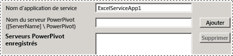
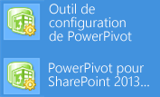
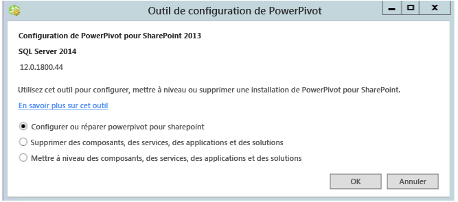

# Power Pivot Configuration Tools
[!INCLUDE[ssas-appliesto-sqlas](../../includes/ssas-appliesto-sqlas.md)]
  Configurez, réparez ou supprimez [!INCLUDE[ssCurrent](../../includes/sscurrent-md.md)] [!INCLUDE[ssGeminiShort](../../includes/ssgeminishort-md.md)] avec les outils de configuration de [!INCLUDE[ssGemini](../../includes/ssgemini-md.md)] .  
  
 L’Assistant d’installation de [!INCLUDE[ssCurrent](../../includes/sscurrent-md.md)] n’installe pas les outils de configuration de [!INCLUDE[ssGemini](../../includes/ssgemini-md.md)] pour SharePoint. Les outils de configuration seront disponibles en téléchargement dans une future version de [!INCLUDE[ssCurrent](../../includes/sscurrent-md.md)].  
  
 Cette rubrique décrit l’utilisation générale des outils de [!INCLUDE[ssGemini](../../includes/ssgemini-md.md)] et les différences entre eux.  
  
 **[!INCLUDE[applies](../../includes/applies-md.md)]**  SharePoint 2013  
  
 **Dans cette rubrique :**  
  
-   [Configuration requise pour utiliser les outils de configuration](#bkmk_requirements)  
  
-   [Deux versions de l'outil de configuration](#bkmk_twoversions)  
  
-   [Présentation de l’utilisation d’un outil de configuration de Power Pivot](#bkmk_overview)  
  
-   [Démarrer l’un des outils de configuration de Power Pivot](#bmkm_start_tool)  
  
##   Configuration requise pour utiliser les outils de configuration  
  
-   Vous devez être un administrateur de la batterie de serveurs.  
  
-   Vous devez être un administrateur de serveur sur l'instance Analysis Services (SharePoint 2010 uniquement).  
  
-   Vous devez être db_owner sur la base de données de configuration de la batterie de serveurs.  
  
-   Il n'y a aucune spécification de port TCP/IP à définir pour les outils de configuration, par conséquent vous n'avez pas besoin de configurer votre pare-feu pour les utiliser. L'outil de configuration suppose que les applications Web et les services partagés sont disponibles dans le cadre de la plateforme SharePoint. Vous devrez peut-être configurer votre pare-feu pour le serveur [!INCLUDE[ssASnoversion](../../includes/ssasnoversion-md.md)] . Pour plus d’informations, consultez [Configurer le pare-feu Windows pour autoriser l’accès à Analysis Services](../../analysis-services/instances/configure-the-windows-firewall-to-allow-analysis-services-access.md).  
  
##   Deux versions de l'outil de configuration  
 L'Assistant Installation de [!INCLUDE[ssCurrent](../../includes/sscurrent-md.md)] installe l'outil de configuration de [!INCLUDE[ssGemini](../../includes/ssgemini-md.md)] pour SharePoint 2010 et un outil de configuration de [!INCLUDE[ssGemini](../../includes/ssgemini-md.md)] pour SharePoint 2013.  
  
 Les outils ne peuvent être utilisés qu'avec une instance [!INCLUDE[ssCurrent](../../includes/sscurrent-md.md)] ou [!INCLUDE[ssSQL11SP1](../../includes/sssql11sp1-md.md)] de [!INCLUDE[ssGeminiShort](../../includes/ssgeminishort-md.md)]. Ne les utilisez pas avec des installations de [!INCLUDE[ssKilimanjaro](../../includes/sskilimanjaro-md.md)] .  
  
|Nom|Version prise en charge de SharePoint|Détails de la configuration|  
|----------|-------------------------------------|----------------------------|  
|[!INCLUDE[ssGemini](../../includes/ssgemini-md.md)] pour SharePoint 2013|SharePoint 2013|[Configurer ou réparer PowerPivot pour SharePoint 2013 &#40;outil de configuration de PowerPivot&#41;](../../analysis-services/power-pivot-sharepoint/configure-or-repair-power-pivot-for-sharepoint-2013.md)|  
|[!INCLUDE[ssGemini](../../includes/ssgemini-md.md)] Outil de configuration|SharePoint 2010 avec SharePoint 2010|[Configurer ou réparer Power Pivot pour SharePoint 2010 (outil de configuration de Power Pivot)](http://msdn.microsoft.com/en-us/d61f49c5-efaa-4455-98f2-8c293fa50046)|  
  
###   Différences entre les deux outils de configuration  
 Les deux versions de l'outil de configuration sont similaires mais il existe des différences dans les étapes de configuration qu'ils exécutent. Les différences sont dues aux changements entre SharePoint 2010 et SharePoint 2013 ainsi qu’aux différences d’architecture entre la version SQL Server 2012 SP1 de [!INCLUDE[ssGemini](../../includes/ssgemini-md.md)] pour SharePoint et la version précédente de [!INCLUDE[ssGemini](../../includes/ssgemini-md.md)] pour SharePoint.  
  
 Le tableau suivant décrit les nouvelles fonctionnalités et les fonctionnalités modifiées de l’outil de **[!INCLUDE[ssGemini](../../includes/ssgemini-md.md)] pour SharePoint 2013** . Il décrit également les fonctionnalités de l’outil de configuration de **[!INCLUDE[ssGemini](../../includes/ssgemini-md.md)]**  exclues de l’outil de configuration de [!INCLUDE[ssGemini](../../includes/ssgemini-md.md)] pour SharePoint 2013. Les lignes du tableau sont dans le même ordre que les onglets dans les outils de configuration.  
  
|[!INCLUDE[ssGemini](../../includes/ssgemini-md.md)] pour SharePoint 2013|[!INCLUDE[ssGemini](../../includes/ssgemini-md.md)] Outil de configuration|  
|--------------------------------------------------------------|-----------------------------------------------|  
|La page principale est une nouvelle option pour **[!INCLUDE[ssGemini](../../includes/ssgemini-md.md)] pour Excel Services**. L'option prend en charge la nouvelle architecture dans laquelle [!INCLUDE[ssASnoversion](../../includes/ssasnoversion-md.md)] s'exécute à l'extérieur de la batterie de serveurs SharePoint. Vous pouvez configurer Excel Services afin d'utiliser un ou plusieurs serveurs [!INCLUDE[ssASnoversion](../../includes/ssasnoversion-md.md)] qui s'exécutent en mode SharePoint.   ||  
||L’outil 2010 inclut la page **Inscrire SQL Server Analysis Services ([!INCLUDE[ssGemini](../../includes/ssgemini-md.md)]) sur le serveur local** pour configurer une instance locale de [!INCLUDE[ssASnoversion](../../includes/ssasnoversion-md.md)]. Cette page ne fait pas partie de l'outil 2013 car il n'existe aucune instance locale de [!INCLUDE[ssASnoversion](../../includes/ssasnoversion-md.md)].   |  
||La page **Créer une application de service [!INCLUDE[ssGemini](../../includes/ssgemini-md.md)]** comporte une option supplémentaire pour **Mettre les classeurs à niveau pour activer l’actualisation des données**. Cette option n'est pas disponible dans l'outil 2013.   |  
|L’outil 2013 comprend une nouvelle page **Configurer les serveurs [!INCLUDE[ssGemini](../../includes/ssgemini-md.md)]**. Cette page prend en charge la nouvelle architecture dans laquelle [!INCLUDE[ssASnoversion](../../includes/ssasnoversion-md.md)] s'exécute à l'extérieur de la batterie de serveurs SharePoint. Par défaut, le nom du serveur entré dans la page principale dans la zone de texte **Serveur [!INCLUDE[ssGemini](../../includes/ssgemini-md.md)] pour Excel Services**, est également répertorié dans **Configurer les serveurs [!INCLUDE[ssGemini](../../includes/ssgemini-md.md)]**.   ||  
|L’outil 2013 comprend une nouvelle page **Inscrire le complément [!INCLUDE[ssGemini](../../includes/ssgemini-md.md)] pour le suivi de l’utilisation d’Excel Services**. Excel Services dans SharePoint 2010 ne suit pas les données d’utilisation de [!INCLUDE[ssGemini](../../includes/ssgemini-md.md)].||  
||L’outil 2010 comprend la page **Ajouter MSOLAP.5 en tant que fournisseur approuvé** pour inscrire MSOLAP afin qu’Excel Services dans SharePoint 2010 puisse charger des modèles [!INCLUDE[ssGemini](../../includes/ssgemini-md.md)] . Cette page ne fait pas partie de l'outil 2013. Excel Services dans SharePoint 2013 n'utilise pas le fournisseur MSOLAP pour charger les modèles.|  
  
##   Présentation de l’utilisation d’un outil de configuration de Power Pivot  
 Lorsque vous démarrez l’un des outils de configuration de [!INCLUDE[ssGemini](../../includes/ssgemini-md.md)] , ce dernier analyse l’installation existante afin de déterminer les opérations applicables. Lors d'une nouvelle installation, seule la tâche de configuration est disponible. Une fois le serveur configuré, la tâche de suppression s'affiche. Si vous avez démarré avec une instance de [!INCLUDE[ssKilimanjaro](../../includes/sskilimanjaro-md.md)] , la mise à niveau est également activée dans la liste des tâches disponibles.  
  
 Si vous n'êtes pas familiarisé avec l'Administration centrale ou Windows PowerShell, exécutez l'outil de configuration à la place d'une installation de [!INCLUDE[ssGeminiShort](../../includes/ssgeminishort-md.md)] .  
  
 De plus, l'outil peut détecter si la batterie de serveurs est configurée ou si des fonctionnalités requises sont manquantes. Si les fichiers programme SharePoint sont installés, mais que la batterie de serveurs n'est pas configurée, l'outil fournit des actions pour configurer la batterie et l'installation de [!INCLUDE[ssGeminiShort](../../includes/ssgeminishort-md.md)] .  
  
 Vous pouvez examiner l’onglet **Script** pour apprendre et comprendre la configuration de [!INCLUDE[ssGemini](../../includes/ssgemini-md.md)] et SharePoint à l’aide de Windows PowerShell. Pour plus d'informations, consultez les documents suivants :  
  
-   [Configuration de Power Pivot à l’aide de Windows PowerShell](../../analysis-services/power-pivot-sharepoint/power-pivot-configuration-using-windows-powershell.md)  
  
-   [Référence PowerShell pour Power Pivot pour SharePoint](../../analysis-services/powershell/powershell-reference-for-power-pivot-for-sharepoint.md)  
  
> [!NOTE]  
>  L'outil ne configure pas Reporting Services. Si vous ajoutez Reporting Services à votre environnement SharePoint, vous devez l'installer et le configurer séparément. Pour plus d'informations, consultez les documents suivants :  
>   
>  -   [Installer le premier serveur de rapports en mode SharePoint](../../reporting-services/install-windows/install-the-first-report-server-in-sharepoint-mode.md).  
> -   [Installer le mode SharePoint de Reporting Services pour SharePoint 2010](http://msdn.microsoft.com/en-us/47efa72e-1735-4387-8485-f8994fb08c8c).  
  
##   Démarrer l’un des outils de configuration de Power Pivot  
  
1.  Dans l’écran **Démarrer** , tapez **powerpivot**  
  
     Dans l’écran **Démarrer** , tapez **powerpivot** ou, dans le menu **Démarrer** , cliquez sur **Tous les programmes**, sur [!INCLUDE[ssCurrentUI](../../includes/sscurrentui-md.md)], sur **Outils de configuration**, puis cliquez sur un des éléments suivants :  
  
    -   **[!INCLUDE[ssGemini](../../includes/ssgemini-md.md)] Outil de configuration**.  
  
    -   **OR**  
  
    -   **[!INCLUDE[ssGemini](../../includes/ssgemini-md.md)] pour SharePoint 2013**.  
  
       
  
     **Remarque :** les outils sont disponibles uniquement lorsque [!INCLUDE[ssGeminiShort](../../includes/ssgeminishort-md.md)] est installé sur le serveur local.  
  
2.  Au démarrage, les outils de configuration vérifient l'état de votre installation et fournissent les tâches qui sont valides pour votre installation.  
  
3.  Selon l'état actuel de votre installation, une ou plusieurs tâches peuvent être effectuées, dont :  
  
    1.  Cliquez sur **Configurer ou réparer [!INCLUDE[ssGemini](../../includes/ssgemini-md.md)] pour SharePoint** pour effectuer les tâches consécutives à l’installation ou pour réparer une installation.  
  
    2.  Cliquez sur **Supprimer des fonctionnalités, des services, des applications et des solutions** pour supprimer des fonctionnalités et des solutions de la batterie de serveurs.  
  
    3.  Cliquez sur **Mettre à niveau des fonctionnalités, des services, des applications et des solutions** pour mettre à niveau les fonctionnalités et les solutions qui ont été installées à l'aide d'une version antérieure de [!INCLUDE[ssGeminiShort](../../includes/ssgeminishort-md.md)].  
  
     Par exemple, l’illustration montre la page de démarrage de l’outil de configuration de [!INCLUDE[ssGemini](../../includes/ssgemini-md.md)] pour SharePoint 2013.  
  
       
  
 Chaque tâche est composée de différentes actions qui concernent un aspect particulier de la configuration du serveur. Par exemple, la tâche de configuration inclut des actions pour déployer des solutions, créer une application de service [!INCLUDE[ssGemini](../../includes/ssgemini-md.md)] , activer des fonctionnalités et configurer l’actualisation des données. La liste d'actions varie selon l'état actuel de votre installation. Si une action n'est pas nécessaire, l'outil l'exclut de la liste des tâches.  
  
 Lorsque vous cliquez sur Exécuter, l'outil traite toutes les actions par lots. Bien que chaque action s'affiche en tant qu'élément distinct dans la liste des tâches, toutes les actions incluses dans la tâche sont traitées ensemble. Seules les actions qui réussissent un contrôle de validation sont traitées. Vous devrez peut-être ajouter ou modifier une partie des valeurs d'entrée pour réussir le contrôle de validation.  
  
## Contenu connexe  
 [Upgrade Power Pivot for SharePoint](../../database-engine/install-windows/upgrade-power-pivot-for-sharepoint.md) Décrit le flux de travail qui met à niveau une installation existante dans une batterie de serveurs.  
  
 [Désinstaller PowerPivot for SharePoint](../../sql-server/install/uninstall-power-pivot-for-sharepoint.md) : décrit le flux de travail qui supprime [!INCLUDE[ssGemini](../../includes/ssgemini-md.md)] des services, des solutions et des pages d’application SharePoint dans une batterie de serveurs.  
  
 [Configuration de Power Pivot à l’aide de Windows PowerShell](../../analysis-services/power-pivot-sharepoint/power-pivot-configuration-using-windows-powershell.md)  
  
 [Administration et configuration d’un serveur Power Pivot dans l’Administration centrale](../../analysis-services/power-pivot-sharepoint/power-pivot-server-administration-and-configuration-in-central-administration.md)  
  
  
